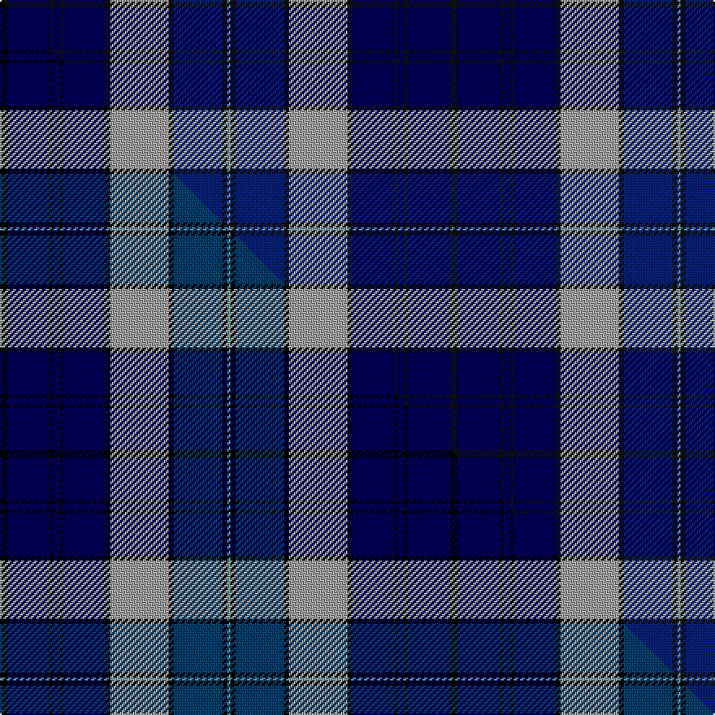

This is one **variant** — a specific cloth: this exact thread count and colourway, with its own
provenance below. It is one weaving of the [sett](/setts/k5dbi26k2dbi4k2dbi26k3lr36k3db30k3t2/) (the scale-free proportion — the
same cloth at any scale or shade), whose colour order is pattern [BKBKYKBKBKBK](/stripes/bkbkykbkbkbk/).

Part of the [Daniel](/tartans/daniel/) tartan — the named design grouping this sett with its other cloths.

Sourced from tartans-authority.  It is a [12 stripe tartan](/stripes/stripes12/).

Original link [https://www.tartanregister.gov.uk/tartanDetails.aspx?ref=8353](https://www.tartanregister.gov.uk/tartanDetails.aspx?ref=8353)

Dataset <small>— provenance for this record, inherited from the source manifest</small>

<dl class="dataset-prov">
<dt>source</dt><dd><a href="/sources/tartans-authority/">Scottish Tartans Authority</a></dd>
<dt>data captured from</dt><dd><a href="https://github.com/thetartan/tartan-database/blob/master/data/tartans-authority/data.csv">https://github.com/thetartan/tartan-database/blob/master/data/tartans-authority/data.csv</a></dd>
<dt>data date</dt><dd>11th Aug. 2009 <small>(this record)</small></dd>
<dt>licence</dt><dd><a href="https://creativecommons.org/licenses/by-nc-nd/4.0/">CC BY-NC-ND 4.0</a></dd>
</dl>

Capture chain <small>— the hands this data passed through, oldest first; each capture carries its own licence</small>

<ol class="capture-chain">
<li><a href="https://www.tartansauthority.com/">Scottish Tartans Authority</a> <small>the heritage body's archive — its tartan-ferret record browser is retired (links repaired to the SRT, above)</small></li>
<li><a href="https://github.com/thetartan/tartan-database">thetartan/tartan-database</a> <small>2016-2017</small> · <a href="https://creativecommons.org/licenses/by-nc-nd/4.0/">CC BY-NC-ND 4.0</a> <small>Levko Kravets's frozen compilation — the capture we vendored, and where its CC licence text came from</small></li>
<li>this dictionary <small>captured 2026-06-10 · commit 5bf86c7566</small> <small>each re-capture is a git commit to data/sources</small></li>
</ol>

## Register references

External register numbers recorded for this tartan.

- Scottish Register of Tartans: [8353](https://www.tartanregister.gov.uk/tartanDetails?ref=8353)
- Scottish Tartans Authority (ITI): 8353

## Thread count
K/5 DBi26 K2 DBi4 K2 DBi26 K3 LR36 K3 DB30 K3 T/2

One full sett is **277 threads**.

## Palette
<table><thead><tr><th>Colour</th><th>Shade</th><th>OKLCh</th></tr></thead><tbody><tr><td>T</td><td><code style="background-color:#5C8CA8;">#5C8CA8</code> <small style="color:#888">#5C8CA8</small></td><td><small style="color:#888">oklch(61.7% 0.067 235.0)</small></td></tr><tr><td>DB</td><td><code style="background-color:#000058;">#000058</code> <small style="color:#888">#000058</small></td><td><small style="color:#888">oklch(20.8% 0.144 264.1)</small></td></tr><tr><td>DB</td><td><code style="background-color:#082077;">#082077</code> <small style="color:#888">#082077</small></td><td><small style="color:#888">oklch(30.0% 0.149 265.1)</small></td></tr><tr><td>K</td><td><code style="background-color:#101010;">#101010</code> <small style="color:#888">#101010</small></td><td><small style="color:#888">oklch(17.3% 0.000 89.9)</small></td></tr><tr><td>LR</td><td><code style="background-color:#A0A0A0;">#A0A0A0</code> <small style="color:#888">#A0A0A0</small></td><td><small style="color:#888">oklch(70.6% 0.000 89.9)</small></td></tr></tbody></table>

# Sample pattern

## Compared to the master

This cloth is one sett of its design; the master sett (the exemplar the design is anchored on) is below for comparison.

Its **ΔTartan distance** from the master is **0.09** — the same measure the nearest-tartans table ranks by (0 is identical; a re-scale of the same cloth is near 0, a recolour or a different proportion further).

<figure class="master-compare" style="margin:0">

this sett
master sett ★

<figcaption style="color:#888;font-size:smaller">One weave of this sett against the <a href="/setts/k5db26k2db4k2db26k3lr36k3dbi30k3t2/">master sett ★</a>, split on the diagonal: a shared proportion runs seamlessly across it with only the shades shifting; a different proportion breaks on it.</figcaption>
</figure>

## Nearest tartan variants

The nearest existing variants by ΔTartan distance, with this cloth at the top so the swatches line up against it.

ΔTartan

Threads

Variant

Sett

—

277

<a href="/variants/s12/k5dbi26k2dbi4k2dbi26k3lr36k3db30k3t2~k0700000-dbi0806265-lr2800000-t2503227/">Daniel (Welsh Name)</a>

<a href="/ttd/edit/#slug=k5db26k2db4k2db26k3lr36k3dbi30k3t2~db0806265-lr2800000-dbi1404245-t2503227&amp;base=k5dbi26k2dbi4k2dbi26k3lr36k3db30k3t2~k0700000-dbi0806265-lr2800000-t2503227" title="compare in the TTD">0.08</a>

277

<a href="/variants/s12/k5db26k2db4k2db26k3lr36k3dbi30k3t2~db0806265-lr2800000-dbi1404245-t2503227/">Daniel Welsh Name Tartan</a>

<a href="/ttd/edit/#slug=r7db2b5db2k24db2b10db28b10w3~x2&amp;base=k5dbi26k2dbi4k2dbi26k3lr36k3db30k3t2~k0700000-dbi0806265-lr2800000-t2503227" title="compare in the TTD">2.30</a>

352

<a href="/variants/s10/r7db2b5db2k24db2b10db28b10w3~x2/">Colgan, USA, Robert James</a>

<a href="/ttd/edit/#slug=dr2db6lr2db2k9dbi30k9db5lr4db2dr2~x2~db1106275-dbi1406275&amp;base=k5dbi26k2dbi4k2dbi26k3lr36k3db30k3t2~k0700000-dbi0806265-lr2800000-t2503227" title="compare in the TTD">2.33</a>

284

<a href="/variants/s11/dr2db6lr2db2k9dbi30k9db5lr4db2dr2~x2~db1106275-dbi1406275/">Rangers Football Club Dress</a>

<a href="/ttd/edit/#slug=db4k2db20k13y1k2y2k2y1b23n4~x2&amp;base=k5dbi26k2dbi4k2dbi26k3lr36k3db30k3t2~k0700000-dbi0806265-lr2800000-t2503227" title="compare in the TTD">2.34</a>

280

<a href="/variants/s11/db4k2db20k13y1k2y2k2y1b23n4~x2/">Michigan State Police (Corporate)</a>

<a href="/ttd/edit/#slug=k3b6k4dr6b18db53b18k8b6k3lo2~x2~b2603265&amp;base=k5dbi26k2dbi4k2dbi26k3lr36k3db30k3t2~k0700000-dbi0806265-lr2800000-t2503227" title="compare in the TTD">2.39</a>

498

<a href="/variants/s11/k3b6k4dr6b18db53b18k8b6k3lo2~x2~b2603265/">Australia 2000</a>

<a href="/ttd/edit/#slug=dp4db2g2dp2g12dp2k2dp1k10db25w2~x2&amp;base=k5dbi26k2dbi4k2dbi26k3lr36k3db30k3t2~k0700000-dbi0806265-lr2800000-t2503227" title="compare in the TTD">2.47</a>

244

<a href="/variants/s11/dp4db2g2dp2g12dp2k2dp1k10db25w2~x2/">O'Reilly Irish Fashion Tartan</a>

<a href="/ttd/edit/#slug=r3b16k12db34k12b2k2b2k2b7r3~x2&amp;base=k5dbi26k2dbi4k2dbi26k3lr36k3db30k3t2~k0700000-dbi0806265-lr2800000-t2503227" title="compare in the TTD">2.51</a>

368

<a href="/variants/s11/r3b16k12db34k12b2k2b2k2b7r3~x2/">Rangers F.C.</a>

<a href="/ttd/edit/#slug=r3b14k12db40k12b2k2b2k2b7r3~x2&amp;base=k5dbi26k2dbi4k2dbi26k3lr36k3db30k3t2~k0700000-dbi0806265-lr2800000-t2503227" title="compare in the TTD">2.54</a>

384

<a href="/variants/s11/r3b14k12db40k12b2k2b2k2b7r3~x2/">Rangers F.C.</a>

<a href="/ttd/edit/#slug=dp4db40k15dg10dp2dg10dp2dg10w4~x2&amp;base=k5dbi26k2dbi4k2dbi26k3lr36k3db30k3t2~k0700000-dbi0806265-lr2800000-t2503227" title="compare in the TTD">2.57</a>

372

<a href="/variants/s9/dp4db40k15dg10dp2dg10dp2dg10w4~x2/">Ebdon-Muir (Personal)</a>

<a href="/ttd/edit/#slug=dr1db1dr8lb1k2db16k2lb1g8db1g1~x4&amp;base=k5dbi26k2dbi4k2dbi26k3lr36k3db30k3t2~k0700000-dbi0806265-lr2800000-t2503227" title="compare in the TTD">2.63</a>

328

<a href="/variants/s11/dr1db1dr8lb1k2db16k2lb1g8db1g1~x4/">MacMichael</a>

## Neighbour map

Every grey dot is one of 13621 variants placed by the first two principal components of the ΔTartan feature space (42% of its variance). Red is this tartan; blue dots are its nearest — click one to open its page.

<svg viewBox="0 0 640 380" role="img" style="max-width:100%;height:auto;border:1px solid #e0e0e0;border-radius:4px;display:block" xmlns="http://www.w3.org/2000/svg"><image href="/nn/cloud.v1.png" width="640" height="380"/><a href="/variants/s12/k5db26k2db4k2db26k3lr36k3dbi30k3t2~db0806265-lr2800000-dbi1404245-t2503227/"><circle cx="178.2" cy="120.9" r="4" fill="#3465a4"><title>Daniel Welsh Name Tartan</title></circle></a><a href="/variants/s10/r7db2b5db2k24db2b10db28b10w3~x2/"><circle cx="154.0" cy="142.8" r="4" fill="#3465a4"><title>Colgan, USA, Robert James</title></circle></a><a href="/variants/s11/dr2db6lr2db2k9dbi30k9db5lr4db2dr2~x2~db1106275-dbi1406275/"><circle cx="204.3" cy="125.4" r="4" fill="#3465a4"><title>Rangers Football Club Dress</title></circle></a><a href="/variants/s11/db4k2db20k13y1k2y2k2y1b23n4~x2/"><circle cx="171.4" cy="111.8" r="4" fill="#3465a4"><title>Michigan State Police (Corporate)</title></circle></a><a href="/variants/s11/k3b6k4dr6b18db53b18k8b6k3lo2~x2~b2603265/"><circle cx="229.2" cy="100.0" r="4" fill="#3465a4"><title>Australia 2000</title></circle></a><a href="/variants/s11/dp4db2g2dp2g12dp2k2dp1k10db25w2~x2/"><circle cx="204.7" cy="103.9" r="4" fill="#3465a4"><title>O'Reilly Irish Fashion Tartan</title></circle></a><a href="/variants/s11/r3b16k12db34k12b2k2b2k2b7r3~x2/"><circle cx="193.9" cy="138.4" r="4" fill="#3465a4"><title>Rangers F.C.</title></circle></a><a href="/variants/s11/r3b14k12db40k12b2k2b2k2b7r3~x2/"><circle cx="225.7" cy="125.3" r="4" fill="#3465a4"><title>Rangers F.C.</title></circle></a><a href="/variants/s9/dp4db40k15dg10dp2dg10dp2dg10w4~x2/"><circle cx="228.4" cy="140.9" r="4" fill="#3465a4"><title>Ebdon-Muir (Personal)</title></circle></a><a href="/variants/s11/dr1db1dr8lb1k2db16k2lb1g8db1g1~x4/"><circle cx="209.1" cy="123.3" r="4" fill="#3465a4"><title>MacMichael</title></circle></a><circle cx="194.5" cy="126.4" r="5" fill="#c00000"/><text x="320" y="376" text-anchor="middle" font-size="11" fill="#999">ground</text><text x="11" y="190" text-anchor="middle" font-size="11" fill="#999" transform="rotate(-90 11 190)">complexity</text></svg>

ID: /variants/s12/k5dbi26k2dbi4k2dbi26k3lr36k3db30k3t2~k0700000-dbi0806265-lr2800000-t2503227/
