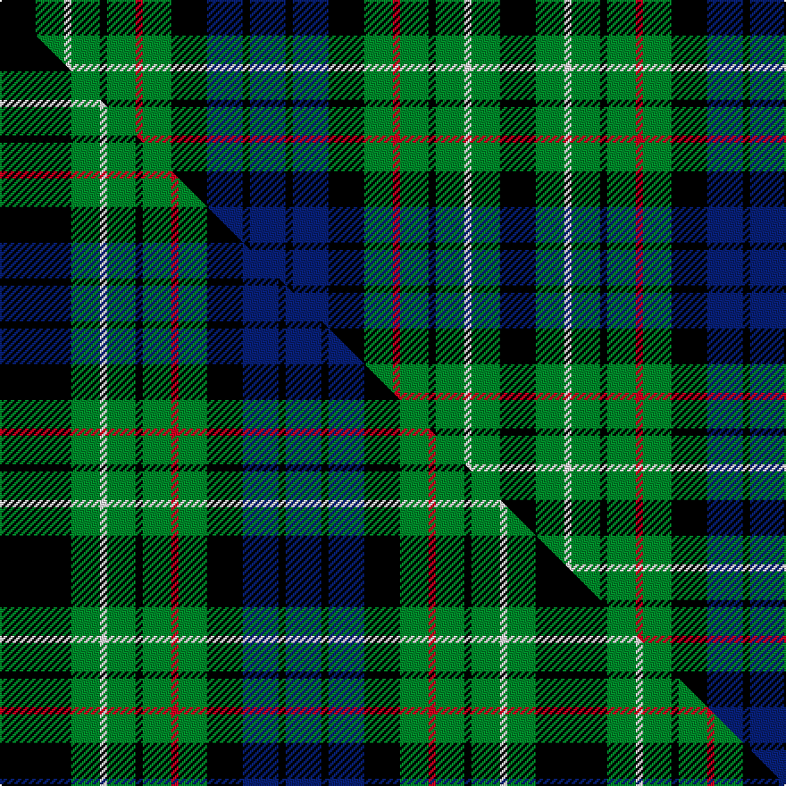

This page is one **sett** — a single exact thread-count. It belongs to the [tartan](/setts/k5g4w1g4k1g4r1g4k5db5k1db5/)
(the same proportion at any scale), whose colour order is pattern [BKBKGRGKGWGK](/stripes/bkbkgrgkgwgk/).

Part of the [Lloyd of Dolobran](/tartans/lloyd-of-dolobran/) tartan — the named design grouping this sett with its other cloths.

Sourced from house-of-tartan.  It is a [12 stripe tartan](/stripes/stripes12/).

Original link http://www.house-of-tartan.scotland.net/house/TartanViewjs.asp?colr=Def&tnam=1970

## Provenance

Earliest known date: 1930-50 This sample comes from the MacGregor-Hastie collection which forms the basis of the cloth archive of the Scottish Tartans Society. Some of the samples, including this one, were unmarked. One can assume that the sample dates between 1930 and 1950.

## Thread count
K/20 G16 W4 G16 K4 G16 R4 G16 K20 DB20 K4 DB/20

One full sett is **280 threads**.

## Palette
<table><thead><tr><th>Colour</th><th>Shade</th><th>OKLCh</th></tr></thead><tbody><tr><td>DB</td><td><code style="background-color:#082077;">#082077</code> <small style="color:#888">#082077</small></td><td><small style="color:#888">oklch(30.0% 0.149 265.1)</small></td></tr><tr><td>G</td><td><code style="background-color:#008B2A;">#008B2A</code> <small style="color:#888">#008B2A</small></td><td><small style="color:#888">oklch(55.4% 0.170 145.9)</small></td></tr><tr><td>K</td><td><code style="background-color:#000000;">#000000</code> <small style="color:#888">#000000</small></td><td><small style="color:#888">oklch(0.0% 0.000 0.0)</small></td></tr><tr><td>W</td><td><code style="background-color:#F7F7F7;">#F7F7F7</code> <small style="color:#888">#F7F7F7</small></td><td><small style="color:#888">oklch(97.6% 0.000 89.9)</small></td></tr><tr><td>R</td><td><code style="background-color:#D60020;">#D60020</code> <small style="color:#888">#D60020</small></td><td><small style="color:#888">oklch(55.2% 0.224 25.5)</small></td></tr></tbody></table>

# Sample pattern

## Compared to the master

This cloth is one sett of its design; the master sett (the exemplar the design is anchored on) is below for comparison.

Its **ΔTartan distance** from the master is **0.33** — the same measure the nearest-tartans table ranks by (0 is identical; a re-scale of the same cloth is near 0, a recolour or a different proportion further).

<figure class="master-compare" style="margin:0">

this sett
master sett ★

<figcaption style="color:#888;font-size:smaller">One weave of this sett against the <a href="/setts/k10g4w1g4k1g4r1g4k5db5k1db5/">master sett ★</a>, split on the diagonal: a shared proportion runs seamlessly across it with only the shades shifting; a different proportion breaks on it.</figcaption>
</figure>

## Nearest tartan variants

The nearest existing variants by ΔTartan distance, with this cloth at the top so the swatches line up against it.

ΔTartan

Threads

Variant

Sett

—

280

<a href="/variants/s12/k5g4w1g4k1g4r1g4k5db5k1db5~x4/">Lloyd of Dolobran Family Tartan</a>

<a href="/ttd/edit/#slug=db9k9g9w2g9k9g9w2g9k9db9k3~x2~db1406275-w4000000&amp;base=k5g4w1g4k1g4r1g4k5db5k1db5~x4" title="compare in the TTD">0.61</a>

328

<a href="/variants/s12/db9k9g9w2g9k9g9w2g9k9db9k3~x2~db1406275-w4000000/">Graham of Montrose #2</a>

<a href="/ttd/edit/#slug=k21g21r4g21k21g21y4g21k21db21k3db21~x2&amp;base=k5g4w1g4k1g4r1g4k5db5k1db5~x4" title="compare in the TTD">0.76</a>

716

<a href="/variants/s12/k21g21r4g21k21g21y4g21k21db21k3db21~x2/">Rollo</a>

<a href="/ttd/edit/#slug=k15g15y3g15k15g15r3g15k15db15k2db15~x2&amp;base=k5g4w1g4k1g4r1g4k5db5k1db5~x4" title="compare in the TTD">0.79</a>

512

<a href="/variants/s12/k15g15y3g15k15g15r3g15k15db15k2db15~x2/">Rollo Family Tartan</a>

<a href="/ttd/edit/#slug=lo3g15k15db15k2db15k15g15dp3g15k15g15lo3~x2&amp;base=k5g4w1g4k1g4r1g4k5db5k1db5~x4" title="compare in the TTD">1.39</a>

572

<a href="/variants/s13/lo3g15k15db15k2db15k15g15dp3g15k15g15lo3~x2/">MacBride</a>

<a href="/ttd/edit/#slug=y3g15k15db15k2db15k15g15o3g15k15g15y3~x2&amp;base=k5g4w1g4k1g4r1g4k5db5k1db5~x4" title="compare in the TTD">1.39</a>

572

<a href="/variants/s13/y3g15k15db15k2db15k15g15o3g15k15g15y3~x2/">MacBride Family Tartan</a>

<a href="/ttd/edit/#slug=y3g15k15db15k2db15k15g15b3g15k15g15y3~x2&amp;base=k5g4w1g4k1g4r1g4k5db5k1db5~x4" title="compare in the TTD">1.39</a>

572

<a href="/variants/s13/y3g15k15db15k2db15k15g15b3g15k15g15y3~x2/">MacBride</a>

<a href="/ttd/edit/#slug=k2t1g6t2g2k4g5ly1g5k4db4k2db2~x4&amp;base=k5g4w1g4k1g4r1g4k5db5k1db5~x4" title="compare in the TTD">1.39</a>

304

<a href="/variants/s13/k2t1g6t2g2k4g5ly1g5k4db4k2db2~x4/">Gordon Dress (US Fashion)</a>

<a href="/ttd/edit/#slug=k4g4w1g4k4db4k1db4k4g4w1~x2&amp;base=k5g4w1g4k1g4r1g4k5db5k1db5~x4" title="compare in the TTD">1.73</a>

130

<a href="/variants/s11/k4g4w1g4k4db4k1db4k4g4w1~x2/">Graham of Montrose #3</a>

<a href="/ttd/edit/#slug=k2g4k1g1k2db3k1w1k1db3k2g1k1g4k2r1~x6&amp;base=k5g4w1g4k1g4r1g4k5db5k1db5~x4" title="compare in the TTD">1.82</a>

342

<a href="/variants/s16/k2g4k1g1k2db3k1w1k1db3k2g1k1g4k2r1~x6/">MacKean dress Family/Clan Tartan</a>

<a href="/ttd/edit/#slug=k19g3db19lo5db19g3k19g19r7g19~x2&amp;base=k5g4w1g4k1g4r1g4k5db5k1db5~x4" title="compare in the TTD">1.89</a>

452

<a href="/variants/s10/k19g3db19lo5db19g3k19g19r7g19~x2/">Casely Family Tartan</a>

## Neighbour map

Every grey dot is one of 13620 variants placed by the first two principal components of the ΔTartan feature space (42% of its variance). Red is this tartan; blue dots are its nearest — click one to open its page.

<svg viewBox="0 0 640 380" role="img" style="max-width:100%;height:auto;border:1px solid #e0e0e0;border-radius:4px;display:block" xmlns="http://www.w3.org/2000/svg"><image href="/nn/cloud.v1.png" width="640" height="380"/><a href="/variants/s12/db9k9g9w2g9k9g9w2g9k9db9k3~x2~db1406275-w4000000/"><circle cx="91.1" cy="247.8" r="4" fill="#3465a4"><title>Graham of Montrose #2</title></circle></a><a href="/variants/s12/k21g21r4g21k21g21y4g21k21db21k3db21~x2/"><circle cx="104.8" cy="211.3" r="4" fill="#3465a4"><title>Rollo</title></circle></a><a href="/variants/s12/k15g15y3g15k15g15r3g15k15db15k2db15~x2/"><circle cx="106.2" cy="209.1" r="4" fill="#3465a4"><title>Rollo Family Tartan</title></circle></a><a href="/variants/s13/lo3g15k15db15k2db15k15g15dp3g15k15g15lo3~x2/"><circle cx="101.7" cy="198.5" r="4" fill="#3465a4"><title>MacBride</title></circle></a><a href="/variants/s13/y3g15k15db15k2db15k15g15o3g15k15g15y3~x2/"><circle cx="104.4" cy="199.4" r="4" fill="#3465a4"><title>MacBride Family Tartan</title></circle></a><a href="/variants/s13/y3g15k15db15k2db15k15g15b3g15k15g15y3~x2/"><circle cx="104.8" cy="200.0" r="4" fill="#3465a4"><title>MacBride</title></circle></a><a href="/variants/s13/k2t1g6t2g2k4g5ly1g5k4db4k2db2~x4/"><circle cx="109.1" cy="206.2" r="4" fill="#3465a4"><title>Gordon Dress (US Fashion)</title></circle></a><a href="/variants/s11/k4g4w1g4k4db4k1db4k4g4w1~x2/"><circle cx="74.6" cy="251.8" r="4" fill="#3465a4"><title>Graham of Montrose #3</title></circle></a><a href="/variants/s16/k2g4k1g1k2db3k1w1k1db3k2g1k1g4k2r1~x6/"><circle cx="69.9" cy="200.2" r="4" fill="#3465a4"><title>MacKean dress Family/Clan Tartan</title></circle></a><a href="/variants/s10/k19g3db19lo5db19g3k19g19r7g19~x2/"><circle cx="73.6" cy="209.9" r="4" fill="#3465a4"><title>Casely Family Tartan</title></circle></a><circle cx="85.8" cy="215.0" r="5" fill="#c00000"/><text x="320" y="376" text-anchor="middle" font-size="11" fill="#999">ground</text><text x="11" y="190" text-anchor="middle" font-size="11" fill="#999" transform="rotate(-90 11 190)">complexity</text></svg>

ID: /variants/s12/k5g4w1g4k1g4r1g4k5db5k1db5~x4/
