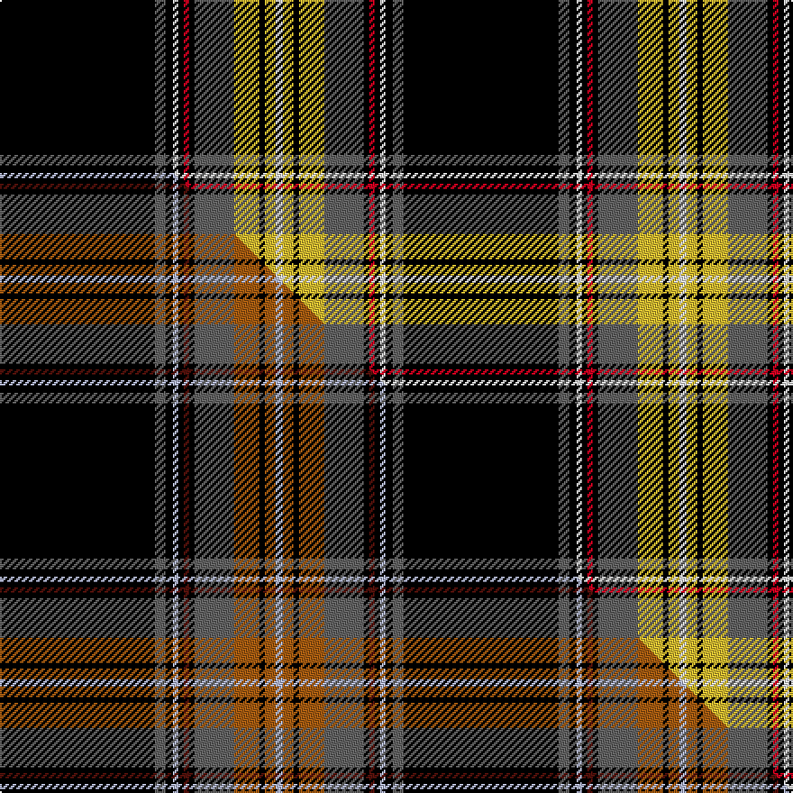

This is one **variant** — a specific cloth: this exact thread count and colourway, with its own
provenance below. It is one weaving of the [sett](/setts/k86n6k4w3k3r3k3n22ly14k3ly6w4/) (the scale-free proportion — the
same cloth at any scale or shade), whose colour order is pattern [KBKWKRKBYKYW](/stripes/kbkwkrkbykyw/).

Part of the [Langtree](/tartans/l/la/langtree/) tartan — the named design grouping this sett with its other cloths.

Sourced from house-of-tartan.  It is a [12 stripe tartan](/stripes/stripes12/).

Original link [http://www.house-of-tartan.scotland.net/house/TartanViewjs.asp?colr=Def&tnam=1131](http://www.house-of-tartan.scotland.net/house/TartanViewjs.asp?colr=Def&tnam=1131)

## Provenance

Earliest known date: pre 2003 A Stewart colour variation marketed by Selfridge's, London and apparently designed and woven by Pendleton Woolen Mills of Oregon.

Dataset <small>— provenance for this record, inherited from the source manifest</small>

<dl class="dataset-prov">
<dt>source</dt><dd><a href="/sources/house-of-tartan/">House of Tartan</a></dd>
<dt>data captured from</dt><dd><a href="https://github.com/thetartan/tartan-database/blob/master/data/house-of-tartan/data.csv">https://github.com/thetartan/tartan-database/blob/master/data/house-of-tartan/data.csv</a></dd>
<dt>data date</dt><dd>pre 2003 <small>(this record)</small></dd>
<dt>licence</dt><dd><a href="https://creativecommons.org/licenses/by-nc-nd/4.0/">CC BY-NC-ND 4.0</a></dd>
</dl>

Capture chain <small>— the hands this data passed through, oldest first; each capture carries its own licence</small>

<ol class="capture-chain">
<li><a href="http://www.house-of-tartan.scotland.net/">House of Tartan</a> <small>the weaver/retailer's database — the site is now offline; the URL is kept as the ultimate source's identity</small></li>
<li><a href="https://github.com/thetartan/tartan-database">thetartan/tartan-database</a> <small>2016-2017</small> · <a href="https://creativecommons.org/licenses/by-nc-nd/4.0/">CC BY-NC-ND 4.0</a> <small>Levko Kravets's frozen compilation — the capture we vendored, and where its CC licence text came from</small></li>
<li>this dictionary <small>captured 2026-06-10 · commit 5bf86c7566</small> <small>each re-capture is a git commit to data/sources</small></li>
</ol>

## Thread count
K/86 N6 K4 W3 K3 R3 K3 N22 LY14 K3 LY6 W/4

One full sett is **224 threads**.

## Palette
<table><thead><tr><th>Colour</th><th>Shade</th><th>OKLCh</th></tr></thead><tbody><tr><td>K</td><td><code style="background-color:#000000;">#000000</code> <small style="color:#888">#000000</small></td><td><small style="color:#888">oklch(0.0% 0.000 0.0)</small></td></tr><tr><td>W</td><td><code style="background-color:#F7F7F7;">#F7F7F7</code> <small style="color:#888">#F7F7F7</small></td><td><small style="color:#888">oklch(97.6% 0.000 89.9)</small></td></tr><tr><td>LY</td><td><code style="background-color:#DCBC32;">#DCBC32</code> <small style="color:#888">#DCBC32</small></td><td><small style="color:#888">oklch(80.0% 0.150 95.2)</small></td></tr><tr><td>N</td><td><code style="background-color:#636363;">#636363</code> <small style="color:#888">#636363</small></td><td><small style="color:#888">oklch(50.0% 0.000 89.9)</small></td></tr><tr><td>R</td><td><code style="background-color:#D60020;">#D60020</code> <small style="color:#888">#D60020</small></td><td><small style="color:#888">oklch(55.2% 0.224 25.5)</small></td></tr></tbody></table>

# Sample pattern

## Compared to the master

This cloth is one sett of its design; the master sett (the exemplar the design is anchored on) is below for comparison.

Its **ΔTartan distance** from the master is **1.20** — the same measure the nearest-tartans table ranks by (0 is identical; a re-scale of the same cloth is near 0, a recolour or a different proportion further).

<figure class="master-compare" style="margin:0">

this sett
master sett ★

<figcaption style="color:#888;font-size:smaller">One weave of this sett against the <a href="/setts/k86n6k4lb3k3dr3k3n22o14k3o6lb4/">master sett ★</a>, split on the diagonal: a shared proportion runs seamlessly across it with only the shades shifting; a different proportion breaks on it.</figcaption>
</figure>

## Nearest tartan variants

The nearest existing variants by ΔTartan distance, with this cloth at the top so the swatches line up against it.

ΔTartan

Threads

Variant

Sett

—

224

<a href="/variants/s12/k86n6k4w3k3r3k3n22ly14k3ly6w4/">Langtree Trade Tartan</a>

<a href="/ttd/edit/#slug=k86n6k4w3k3r3k3n22o14k3o6w4&amp;base=k86n6k4w3k3r3k3n22ly14k3ly6w4" title="compare in the TTD">0.60</a>

224

<a href="/variants/s12/k86n6k4w3k3r3k3n22o14k3o6w4/">Langtree</a>

<a href="/ttd/edit/#slug=k48n4k6lr2k2dr2k2n10ly6k2ly3dr2~x2&amp;base=k86n6k4w3k3r3k3n22ly14k3ly6w4" title="compare in the TTD">0.97</a>

256

<a href="/variants/s12/k48n4k6lr2k2dr2k2n10ly6k2ly3dr2~x2/">Glen Ross (WCWM - 2)</a>

<a href="/ttd/edit/#slug=k86n6k4lb3k3dr3k3n22o14k3o6lb4&amp;base=k86n6k4w3k3r3k3n22ly14k3ly6w4" title="compare in the TTD">1.20</a>

224

<a href="/variants/s12/k86n6k4lb3k3dr3k3n22o14k3o6lb4/">Langtree</a>

<a href="/ttd/edit/#slug=k48n4k6lb2k2dr2k2n10o6k2o3dr2~x2&amp;base=k86n6k4w3k3r3k3n22ly14k3ly6w4" title="compare in the TTD">1.55</a>

256

<a href="/variants/s12/k48n4k6lb2k2dr2k2n10o6k2o3dr2~x2/">Longmount</a>

<a href="/ttd/edit/#slug=r5k1w3k6n5k2ly3k45n4k2ly3~x2&amp;base=k86n6k4w3k3r3k3n22ly14k3ly6w4" title="compare in the TTD">1.64</a>

300

<a href="/variants/s11/r5k1w3k6n5k2ly3k45n4k2ly3~x2/">Williams Dress (Personal)</a>

<a href="/ttd/edit/#slug=r5k1w3k6n5k2y3k45n4k2y3~x2&amp;base=k86n6k4w3k3r3k3n22ly14k3ly6w4" title="compare in the TTD">1.64</a>

300

<a href="/variants/s11/r5k1w3k6n5k2y3k45n4k2y3~x2/">Williams Dress (Carolinas) (Personal)</a>

<a href="/ttd/edit/#slug=r4k2db8r2k44g8k1ly2k1g4~x2&amp;base=k86n6k4w3k3r3k3n22ly14k3ly6w4" title="compare in the TTD">2.19</a>

288

<a href="/variants/s10/r4k2db8r2k44g8k1ly2k1g4~x2/">Marsa Scout Group</a>

<a href="/ttd/edit/#slug=r4k1db8k1r2k44g8k1y2k1g4~x2&amp;base=k86n6k4w3k3r3k3n22ly14k3ly6w4" title="compare in the TTD">2.23</a>

288

<a href="/variants/s11/r4k1db8k1r2k44g8k1y2k1g4~x2/">Marsa Scout Group</a>

<a href="/ttd/edit/#slug=k48db4k8y2k3w3k3g12r6k3r3w3~x2&amp;base=k86n6k4w3k3r3k3n22ly14k3ly6w4" title="compare in the TTD">2.30</a>

290

<a href="/variants/s12/k48db4k8y2k3w3k3g12r6k3r3w3~x2/">Stewart Black Clan Tartan</a>

<a href="/ttd/edit/#slug=k36db4k6y1k1w1k1g8r4k1r2w1~x2&amp;base=k86n6k4w3k3r3k3n22ly14k3ly6w4" title="compare in the TTD">2.32</a>

190

<a href="/variants/s12/k36db4k6y1k1w1k1g8r4k1r2w1~x2/">Stewart, Black ground</a>

## Neighbour map

Every grey dot is one of 13621 variants placed by the first two principal components of the ΔTartan feature space (42% of its variance). Red is this tartan; blue dots are its nearest — click one to open its page. The map is a flat projection of a many-dimensional space — [how to read it](/posts/neighbourhood-maps/).

<svg viewBox="0 0 640 380" role="img" style="max-width:100%;height:auto;border:1px solid #e0e0e0;border-radius:4px;display:block" xmlns="http://www.w3.org/2000/svg"><image href="/nn/cloud.v1.png" width="640" height="380"/><a href="/variants/s12/k86n6k4w3k3r3k3n22o14k3o6w4/"><circle cx="319.4" cy="47.9" r="4" fill="#3465a4"><title>Langtree</title></circle></a><a href="/variants/s12/k48n4k6lr2k2dr2k2n10ly6k2ly3dr2~x2/"><circle cx="346.5" cy="60.3" r="4" fill="#3465a4"><title>Glen Ross (WCWM - 2)</title></circle></a><a href="/variants/s12/k86n6k4lb3k3dr3k3n22o14k3o6lb4/"><circle cx="327.4" cy="50.9" r="4" fill="#3465a4"><title>Langtree</title></circle></a><a href="/variants/s12/k48n4k6lb2k2dr2k2n10o6k2o3dr2~x2/"><circle cx="356.8" cy="60.7" r="4" fill="#3465a4"><title>Longmount</title></circle></a><a href="/variants/s11/r5k1w3k6n5k2ly3k45n4k2ly3~x2/"><circle cx="381.3" cy="34.9" r="4" fill="#3465a4"><title>Williams Dress (Personal)</title></circle></a><a href="/variants/s11/r5k1w3k6n5k2y3k45n4k2y3~x2/"><circle cx="387.7" cy="36.1" r="4" fill="#3465a4"><title>Williams Dress (Carolinas) (Personal)</title></circle></a><a href="/variants/s10/r4k2db8r2k44g8k1ly2k1g4~x2/"><circle cx="336.5" cy="47.3" r="4" fill="#3465a4"><title>Marsa Scout Group</title></circle></a><a href="/variants/s11/r4k1db8k1r2k44g8k1y2k1g4~x2/"><circle cx="340.9" cy="39.8" r="4" fill="#3465a4"><title>Marsa Scout Group</title></circle></a><a href="/variants/s12/k48db4k8y2k3w3k3g12r6k3r3w3~x2/"><circle cx="301.9" cy="49.7" r="4" fill="#3465a4"><title>Stewart Black Clan Tartan</title></circle></a><a href="/variants/s12/k36db4k6y1k1w1k1g8r4k1r2w1~x2/"><circle cx="342.2" cy="27.2" r="4" fill="#3465a4"><title>Stewart, Black ground</title></circle></a><circle cx="309.4" cy="46.4" r="5" fill="#c00000"/><text x="320" y="376" text-anchor="middle" font-size="11" fill="#999">ground</text><text x="11" y="190" text-anchor="middle" font-size="11" fill="#999" transform="rotate(-90 11 190)">complexity</text></svg>

ID: /variants/s12/k86n6k4w3k3r3k3n22ly14k3ly6w4/
