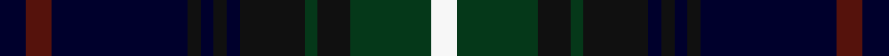

This page is one **sett** — a single exact thread-count. It belongs to the [tartan](/setts/k8dr8k42ki4k4ki4k4ki20dg4ki10dg25w8/)
(the same proportion at any scale), whose colour order is pattern [KBKKKKKKGKGW](/stripes/kbkkkkkkgkgw/).

Sourced from tartans-authority.  It is a [12 stripe tartan](/stripes/stripes12/).

Original link http://www.tartansauthority.com/tartan-ferret/display/7753/

## Register references

External register numbers recorded for this tartan.

- Scottish Tartans Authority (ITI): 7753

## Thread count
K/8 DR8 K42 Ki4 K4 Ki4 K4 Ki20 DG4 Ki10 DG25 W/8

One full sett is **266 threads**.

## Palette
<table><thead><tr><th>Colour</th><th>Shade</th><th>OKLCh</th></tr></thead><tbody><tr><td>DB</td><td><code style="background-color:#00002C;">#00002C</code> <small style="color:#888">#00002C</small></td><td><small style="color:#888">oklch(13.2% 0.092 264.1)</small></td></tr><tr><td>DG</td><td><code style="background-color:#053819;">#053819</code> <small style="color:#888">#053819</small></td><td><small style="color:#888">oklch(30.0% 0.075 151.3)</small></td></tr><tr><td>DR</td><td><code style="background-color:#55120C;">#55120C</code> <small style="color:#888">#55120C</small></td><td><small style="color:#888">oklch(30.0% 0.099 29.3)</small></td></tr><tr><td>K</td><td><code style="background-color:#101010;">#101010</code> <small style="color:#888">#101010</small></td><td><small style="color:#888">oklch(17.3% 0.000 89.9)</small></td></tr><tr><td>LN</td><td><code style="background-color:#F7F7F7;">#F7F7F7</code> <small style="color:#888">#F7F7F7</small></td><td><small style="color:#888">oklch(97.6% 0.000 89.9)</small></td></tr></tbody></table>

# Sample pattern

## Nearest variants

The nearest existing variants by ΔTartan distance, with this cloth at the top so the swatches line up against it.

ΔTartan

Threads

Variant

Sett

—

266

<a href="/variants/s12/k8dr8k42ki4k4ki4k4ki20dg4ki10dg25w8~k0504259-ki0700000/">Bannatyne (Corporate)</a>

<a href="/ttd/edit/#slug=db15k2db2k2db2k14dg18k1y2k1dg18k14db18r2~x2&amp;base=k8dr8k42ki4k4ki4k4ki20dg4ki10dg25w8~k0504259-ki0700000" title="compare in the TTD">3.00</a>

410

<a href="/variants/s14/db15k2db2k2db2k14dg18k1y2k1dg18k14db18r2~x2/">Bonner (Name)</a>

## Neighbour map

Every grey dot is one of 13620 variants placed by the first two principal components of the ΔTartan feature space (42% of its variance). Red is this tartan; blue dots are its nearest — click one to open its page.

<svg viewBox="0 0 640 380" role="img" style="max-width:100%;height:auto;border:1px solid #e0e0e0;border-radius:4px;display:block" xmlns="http://www.w3.org/2000/svg"><image href="/nn/cloud.v1.png" width="640" height="380"/><a href="/variants/s14/db15k2db2k2db2k14dg18k1y2k1dg18k14db18r2~x2/"><circle cx="203.0" cy="142.0" r="4" fill="#3465a4"><title>Bonner (Name)</title></circle></a><circle cx="199.1" cy="158.7" r="5" fill="#c00000"/><text x="320" y="376" text-anchor="middle" font-size="11" fill="#999">ground</text><text x="11" y="190" text-anchor="middle" font-size="11" fill="#999" transform="rotate(-90 11 190)">complexity</text></svg>

ID: /variants/s12/k8dr8k42ki4k4ki4k4ki20dg4ki10dg25w8~k0504259-ki0700000/
