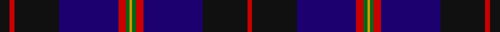

This page is one **sett** — a single exact thread-count. It belongs to the [tartan](/setts/k8r4k36db48r6g3lo2/)
(the same proportion at any scale), whose colour order is pattern [KRKBRGYGRBKR](/stripes/krkbrgygrbkr/).

Sourced from house-of-tartan.  It is a [12 stripe tartan](/stripes/stripes12/).

Original link http://www.house-of-tartan.scotland.net/house/TartanViewjs.asp?colr=Def&tnam=2330

## Provenance

Earliest known date: 1994 Designed by Jack Dalgety for Lt.Col. Wilsey of Royal Marines, Condor Depot. December 1994. Woven by D.C.Dalgleish of Selkirk. The design is basically the Angus tartan (#1179) which is the Scottish county in which Condor Depot is located with changes to the overcheck. Sample in STA Dalgety Collection.

## Also known as

This cloth is also recorded under:

- Royal Marines Condor

## Thread count
K/16 R8 K72 DB96 R12 G6 DY4 G6 R12 DB96 K72 R/8

One full sett is **792 threads**.

## Palette

Palette: <strong>Tartan Register</strong> <small style="color:#888">(5 of 6 colours)</small>
<table><thead><tr><th>Colour</th><th>Threads</th><th>Shade</th><th>Base</th><th>OKLCh</th></tr></thead><tbody><tr><td>K/</td><td style="text-align:right;font-variant-numeric:tabular-nums">16</td><td><code style="background-color:#101010;">#101010</code> <small style="color:#888">#101010</small></td><td>K <code style="background-color:#000000;">#000000</code></td><td><small style="color:#888">oklch(17.3% 0.000 89.9)</small></td></tr><tr><td>R</td><td style="text-align:right;font-variant-numeric:tabular-nums">8</td><td><code style="background-color:#C80000;">#C80000</code> <small style="color:#888">#C80000</small></td><td>R <code style="background-color:#CC0000;">#CC0000</code></td><td><small style="color:#888">oklch(52.3% 0.215 29.2)</small></td></tr><tr><td>K</td><td style="text-align:right;font-variant-numeric:tabular-nums">72</td><td><code style="background-color:#101010;">#101010</code> <small style="color:#888">#101010</small></td><td>K <code style="background-color:#000000;">#000000</code></td><td><small style="color:#888">oklch(17.3% 0.000 89.9)</small></td></tr><tr><td>DB</td><td style="text-align:right;font-variant-numeric:tabular-nums">96</td><td><code style="background-color:#1C0070;">#1C0070</code> <small style="color:#888">#1C0070</small></td><td>B <code style="background-color:#2A418A;">#2A418A</code></td><td><small style="color:#888">oklch(26.3% 0.162 277.1)</small></td></tr><tr><td>R</td><td style="text-align:right;font-variant-numeric:tabular-nums">12</td><td><code style="background-color:#C80000;">#C80000</code> <small style="color:#888">#C80000</small></td><td>R <code style="background-color:#CC0000;">#CC0000</code></td><td><small style="color:#888">oklch(52.3% 0.215 29.2)</small></td></tr><tr><td>G</td><td style="text-align:right;font-variant-numeric:tabular-nums">6</td><td><code style="background-color:#006818;">#006818</code> <small style="color:#888">#006818</small></td><td>G <code style="background-color:#006100;">#006100</code></td><td><small style="color:#888">oklch(45.0% 0.142 145.0)</small></td></tr><tr><td>DY</td><td style="text-align:right;font-variant-numeric:tabular-nums">4</td><td><code style="background-color:#D09800;">#D09800</code> <small style="color:#888">#D09800</small></td><td>Y <code style="background-color:#F2BF00;">#F2BF00</code></td><td><small style="color:#888">oklch(71.4% 0.147 82.1)</small></td></tr><tr><td>G</td><td style="text-align:right;font-variant-numeric:tabular-nums">6</td><td><code style="background-color:#006818;">#006818</code> <small style="color:#888">#006818</small></td><td>G <code style="background-color:#006100;">#006100</code></td><td><small style="color:#888">oklch(45.0% 0.142 145.0)</small></td></tr><tr><td>R</td><td style="text-align:right;font-variant-numeric:tabular-nums">12</td><td><code style="background-color:#C80000;">#C80000</code> <small style="color:#888">#C80000</small></td><td>R <code style="background-color:#CC0000;">#CC0000</code></td><td><small style="color:#888">oklch(52.3% 0.215 29.2)</small></td></tr><tr><td>DB</td><td style="text-align:right;font-variant-numeric:tabular-nums">96</td><td><code style="background-color:#1C0070;">#1C0070</code> <small style="color:#888">#1C0070</small></td><td>B <code style="background-color:#2A418A;">#2A418A</code></td><td><small style="color:#888">oklch(26.3% 0.162 277.1)</small></td></tr><tr><td>K</td><td style="text-align:right;font-variant-numeric:tabular-nums">72</td><td><code style="background-color:#101010;">#101010</code> <small style="color:#888">#101010</small></td><td>K <code style="background-color:#000000;">#000000</code></td><td><small style="color:#888">oklch(17.3% 0.000 89.9)</small></td></tr><tr><td>R/</td><td style="text-align:right;font-variant-numeric:tabular-nums">8</td><td><code style="background-color:#C80000;">#C80000</code> <small style="color:#888">#C80000</small></td><td>R <code style="background-color:#CC0000;">#CC0000</code></td><td><small style="color:#888">oklch(52.3% 0.215 29.2)</small></td></tr></tbody></table>

## Nearest tartans

The nearest existing variants by ΔTartan distance, with this tartan at the top so the swatches line up against it.

ΔTartan

Tartan

Sett

—

<a href="/ttd/edit/#slug=k8r4k36db48r6g3lo2~x2">Royal Marines Condor Regimental Tartan</a> <a class="nn-out" href="/variants/s12/k8r4k36db48r6g3lo2~x2/" title="open its dictionary page">↗</a>

1.13

<a href="/ttd/edit/#slug=k8r4k36db48r6g3lo2~x2">Royal Marines Condor</a> <a class="nn-out" href="/variants/s7/k8r4k36db48r6g3lo2~x2/" title="open its dictionary page">↗</a>

1.19

<a href="/ttd/edit/#slug=r3g10k12db3k2db2k2db30r4w1~x2&amp;base=k8r4k36db48r6g3lo2~x2">McClafferty</a> <a class="nn-out" href="/variants/s10/r3g10k12db3k2db2k2db30r4w1~x2/" title="open its dictionary page">↗</a>

1.19

<a href="/ttd/edit/#slug=db3dg3db24k34w1k34db24r3db3w3~x2&amp;base=k8r4k36db48r6g3lo2~x2">Al-Fadhli (Personal)</a> <a class="nn-out" href="/variants/s10/db3dg3db24k34w1k34db24r3db3w3~x2/" title="open its dictionary page">↗</a>

1.21

<a href="/ttd/edit/#slug=k17db24g3db3w3db3r3db24k17w1~x2&amp;base=k8r4k36db48r6g3lo2~x2">Al-Fadhli (Personal)</a> <a class="nn-out" href="/variants/s10/k17db24g3db3w3db3r3db24k17w1~x2/" title="open its dictionary page">↗</a>

1.27

<a href="/ttd/edit/#slug=w1db16k12t2dp3t2k12db2k2db2k2db7w1~x2&amp;base=k8r4k36db48r6g3lo2~x2">Edgar (2014)</a> <a class="nn-out" href="/variants/s13/w1db16k12t2dp3t2k12db2k2db2k2db7w1~x2/" title="open its dictionary page">↗</a>

1.27

<a href="/variants/s16/k4lo2k34db10lr4db4dp4db23w3~x2/">Heirloom Dark Alba</a>

1.28

<a href="/ttd/edit/#slug=dbi26db3dbi1m2dbi1db3dbi3db12g14dbi2w2~x2&amp;base=k8r4k36db48r6g3lo2~x2">Royal Highland Yacht Club (Corporate</a> <a class="nn-out" href="/variants/s11/dbi26db3dbi1m2dbi1db3dbi3db12g14dbi2w2~x2/" title="open its dictionary page">↗</a>

1.28

<a href="/ttd/edit/#slug=w1db16k12lb2dp3lb2k12db2k2db2k2db7w1~x2&amp;base=k8r4k36db48r6g3lo2~x2">Edgar (2014) (Name)</a> <a class="nn-out" href="/variants/s13/w1db16k12lb2dp3lb2k12db2k2db2k2db7w1~x2/" title="open its dictionary page">↗</a>

1.30

<a href="/ttd/edit/#slug=lo3db1dp1b8dp1db6b3db4k8b1db4dp1db2k4db16dp2~x2&amp;base=k8r4k36db48r6g3lo2~x2">Midnight Sunrise</a> <a class="nn-out" href="/variants/s16/lo3db1dp1b8dp1db6b3db4k8b1db4dp1db2k4db16dp2~x2/" title="open its dictionary page">↗</a>

1.34

<a href="/ttd/edit/#slug=db18dp2k2db2dp2k1db2k8g1ly1g6k8db14k2g2~x2&amp;base=k8r4k36db48r6g3lo2~x2">Angove, the Black Swan</a> <a class="nn-out" href="/variants/s15/db18dp2k2db2dp2k1db2k8g1ly1g6k8db14k2g2~x2/" title="open its dictionary page">↗</a>

## Neighbour map

Every grey dot is one of 14360 variants placed by the first two principal components of the ΔTartan feature space (44% of its variance). Red is this tartan; blue dots are its nearest — click one to open its page.

<svg viewBox="0 0 640 380" role="img" style="max-width:100%;height:auto;border:1px solid #e0e0e0;border-radius:4px;display:block" xmlns="http://www.w3.org/2000/svg"><image href="/nn/cloud.v1.png" width="640" height="380"/><a href="/variants/s7/k8r4k36db48r6g3lo2~x2/"><circle cx="320.6" cy="164.0" r="4" fill="#3465a4"><title>Royal Marines Condor</title></circle></a><a href="/variants/s10/r3g10k12db3k2db2k2db30r4w1~x2/"><circle cx="340.8" cy="140.4" r="4" fill="#3465a4"><title>McClafferty</title></circle></a><a href="/variants/s10/db3dg3db24k34w1k34db24r3db3w3~x2/"><circle cx="348.7" cy="142.9" r="4" fill="#3465a4"><title>Al-Fadhli (Personal)</title></circle></a><a href="/variants/s10/k17db24g3db3w3db3r3db24k17w1~x2/"><circle cx="334.8" cy="158.0" r="4" fill="#3465a4"><title>Al-Fadhli (Personal)</title></circle></a><a href="/variants/s13/w1db16k12t2dp3t2k12db2k2db2k2db7w1~x2/"><circle cx="283.6" cy="169.5" r="4" fill="#3465a4"><title>Edgar (2014)</title></circle></a><a href="/variants/s16/k4lo2k34db10lr4db4dp4db23w3~x2/"><circle cx="261.5" cy="132.7" r="4" fill="#3465a4"><title>Heirloom Dark Alba</title></circle></a><a href="/variants/s11/dbi26db3dbi1m2dbi1db3dbi3db12g14dbi2w2~x2/"><circle cx="315.6" cy="142.4" r="4" fill="#3465a4"><title>Royal Highland Yacht Club (Corporate</title></circle></a><a href="/variants/s13/w1db16k12lb2dp3lb2k12db2k2db2k2db7w1~x2/"><circle cx="251.8" cy="148.7" r="4" fill="#3465a4"><title>Edgar (2014) (Name)</title></circle></a><a href="/variants/s16/lo3db1dp1b8dp1db6b3db4k8b1db4dp1db2k4db16dp2~x2/"><circle cx="285.4" cy="160.9" r="4" fill="#3465a4"><title>Midnight Sunrise</title></circle></a><a href="/variants/s15/db18dp2k2db2dp2k1db2k8g1ly1g6k8db14k2g2~x2/"><circle cx="302.2" cy="145.7" r="4" fill="#3465a4"><title>Angove, the Black Swan</title></circle></a><circle cx="318.4" cy="148.1" r="5" fill="#c00000"/></svg>

ID: /variants/s12/k8r4k36db48r6g3lo2~x2/
