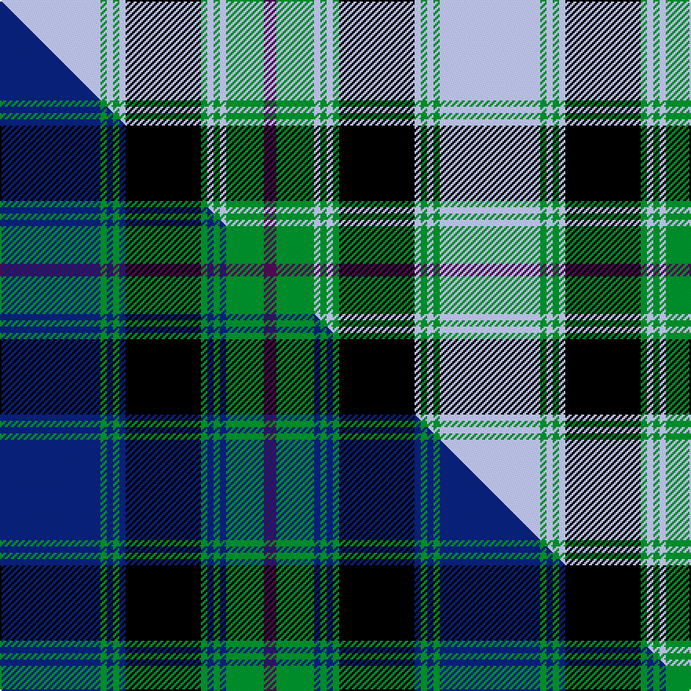

This is one **variant** — a specific cloth: this exact thread count and colourway, with its own
provenance below. It is one weaving of the [sett](/setts/lb16g1lb1g1lb1k12g1lb1g1lb1g6dp2/) (the scale-free proportion — the
same cloth at any scale or shade), whose colour order is pattern [BGWGWGKWGWGW](/stripes/bgwgwgkwgwgw/).

Part of the [Stephen-Mathieson](/tartans/s/st/stephen-mathieson/) tartan — the named design grouping this sett with its other cloths.

Sourced from tartans-authority.  It is a [12 stripe tartan](/stripes/stripes12/).

Original link [https://www.tartanregister.gov.uk/tartanDetails.aspx?ref=10108](https://www.tartanregister.gov.uk/tartanDetails.aspx?ref=10108)

Dataset <small>— provenance for this record, inherited from the source manifest</small>

<dl class="dataset-prov">
<dt>source</dt><dd><a href="/sources/tartans-authority/">Scottish Tartans Authority</a></dd>
<dt>data captured from</dt><dd><a href="https://github.com/thetartan/tartan-database/blob/master/data/tartans-authority/data.csv">https://github.com/thetartan/tartan-database/blob/master/data/tartans-authority/data.csv</a></dd>
<dt>data date</dt><dd>4th August 2009 <small>(this record)</small></dd>
<dt>licence</dt><dd><a href="https://creativecommons.org/licenses/by-nc-nd/4.0/">CC BY-NC-ND 4.0</a></dd>
</dl>

Capture chain <small>— the hands this data passed through, oldest first; each capture carries its own licence</small>

<ol class="capture-chain">
<li><a href="https://www.tartansauthority.com/">Scottish Tartans Authority</a> <small>the heritage body's archive — its tartan-ferret record browser is retired (links repaired to the SRT, above)</small></li>
<li><a href="https://github.com/thetartan/tartan-database">thetartan/tartan-database</a> <small>2016-2017</small> · <a href="https://creativecommons.org/licenses/by-nc-nd/4.0/">CC BY-NC-ND 4.0</a> <small>Levko Kravets's frozen compilation — the capture we vendored, and where its CC licence text came from</small></li>
<li>this dictionary <small>captured 2026-06-10 · commit 5bf86c7566</small> <small>each re-capture is a git commit to data/sources</small></li>
</ol>

## Register references

External register numbers recorded for this tartan.

- Scottish Register of Tartans: [10108](https://www.tartanregister.gov.uk/tartanDetails?ref=10108)
- Scottish Tartans Authority (ITI): 10108

## Thread count
LB/64 G4 LB4 G4 LB4 K48 G4 LB4 G4 LB4 G24 DP/8

One full sett is **280 threads**.

## Palette
<table><thead><tr><th>Colour</th><th>Shade</th><th>OKLCh</th></tr></thead><tbody><tr><td>G</td><td><code style="background-color:#008B2A;">#008B2A</code> <small style="color:#888">#008B2A</small></td><td><small style="color:#888">oklch(55.4% 0.170 145.9)</small></td></tr><tr><td>K</td><td><code style="background-color:#000000;">#000000</code> <small style="color:#888">#000000</small></td><td><small style="color:#888">oklch(0.0% 0.000 0.0)</small></td></tr><tr><td>LB</td><td><code style="background-color:#B5BBDE;">#B5BBDE</code> <small style="color:#888">#B5BBDE</small></td><td><small style="color:#888">oklch(79.9% 0.050 277.6)</small></td></tr><tr><td>DP</td><td><code style="background-color:#4B0B4F;">#4B0B4F</code> <small style="color:#888">#4B0B4F</small></td><td><small style="color:#888">oklch(30.1% 0.125 325.4)</small></td></tr></tbody></table>

# Sample pattern

## Compared to the master

This cloth is one sett of its design; the master sett (the exemplar the design is anchored on) is below for comparison.

Its **ΔTartan distance** from the master is **0.23** — the same measure the nearest-tartans table ranks by (0 is identical; a re-scale of the same cloth is near 0, a recolour or a different proportion further).

<figure class="master-compare" style="margin:0">

this sett
master sett ★

<figcaption style="color:#888;font-size:smaller">One weave of this sett against the <a href="/setts/db16g1db1g1db1k12g1db1g1db1g6dp2/">master sett ★</a>, split on the diagonal: a shared proportion runs seamlessly across it with only the shades shifting; a different proportion breaks on it.</figcaption>
</figure>

## Nearest tartan variants

The nearest existing variants by ΔTartan distance, with this cloth at the top so the swatches line up against it.

ΔTartan

Threads

Variant

Sett

—

280

<a href="/variants/s12/lb16g1lb1g1lb1k12g1lb1g1lb1g6dp2~x4/">Stephen-Mathieson (Name)</a>

<a href="/ttd/edit/#slug=y5lb36n5lb5n56k5n8k5n5k34y5&amp;base=lb16g1lb1g1lb1k12g1lb1g1lb1g6dp2~x4" title="compare in the TTD">2.32</a>

328

<a href="/variants/s11/y5lb36n5lb5n56k5n8k5n5k34y5/">Chartered Institute of Bankers in Scotland</a>

<a href="/ttd/edit/#slug=r2w6db2w16db3w1k16w1db2k4r2~x2&amp;base=lb16g1lb1g1lb1k12g1lb1g1lb1g6dp2~x4" title="compare in the TTD">2.36</a>

212

<a href="/variants/s11/r2w6db2w16db3w1k16w1db2k4r2~x2/">MacRae Dress Clan Tartan</a>

<a href="/ttd/edit/#slug=w16k4o1k2w1k6dg6k1dg6w1~x4&amp;base=lb16g1lb1g1lb1k12g1lb1g1lb1g6dp2~x4" title="compare in the TTD">2.37</a>

284

<a href="/variants/s10/w16k4o1k2w1k6dg6k1dg6w1~x4/">Unidentified #49</a>

<a href="/ttd/edit/#slug=lb7w3lb2w30k5w3g2w3g8w3g2w3k30dp2~x2&amp;base=lb16g1lb1g1lb1k12g1lb1g1lb1g6dp2~x4" title="compare in the TTD">2.40</a>

394

<a href="/variants/s14/lb7w3lb2w30k5w3g2w3g8w3g2w3k30dp2~x2/">Wiseman Dairies Corporate Tartan</a>

<a href="/ttd/edit/#slug=b5w2b2w4k27w2dg2w2dg6w2dg2w22dr2~x2&amp;base=lb16g1lb1g1lb1k12g1lb1g1lb1g6dp2~x4" title="compare in the TTD">2.46</a>

306

<a href="/variants/s13/b5w2b2w4k27w2dg2w2dg6w2dg2w22dr2~x2/">Robert Wiseman Dairies, Golden Jubilee</a>

<a href="/ttd/edit/#slug=w30n5k6n2k2w2k13n5k2n2w2~x2&amp;base=lb16g1lb1g1lb1k12g1lb1g1lb1g6dp2~x4" title="compare in the TTD">2.59</a>

220

<a href="/variants/s11/w30n5k6n2k2w2k13n5k2n2w2~x2/">Stewart Grey Dress Tartan</a>

<a href="/ttd/edit/#slug=dr2k9lb4w2k22w2lb4w22lb2w8dr2~x2&amp;base=lb16g1lb1g1lb1k12g1lb1g1lb1g6dp2~x4" title="compare in the TTD">2.62</a>

308

<a href="/variants/s11/dr2k9lb4w2k22w2lb4w22lb2w8dr2~x2/">MacRae, Dress</a>

<a href="/ttd/edit/#slug=y3k2y2k2y2k28lb32y2lb3y2lb3~x2&amp;base=lb16g1lb1g1lb1k12g1lb1g1lb1g6dp2~x4" title="compare in the TTD">2.72</a>

312

<a href="/variants/s11/y3k2y2k2y2k28lb32y2lb3y2lb3~x2/">General Choi</a>

<a href="/ttd/edit/#slug=lb39g3lb3g20k3g20k3g3k20r3~x2&amp;base=lb16g1lb1g1lb1k12g1lb1g1lb1g6dp2~x4" title="compare in the TTD">2.74</a>

384

<a href="/variants/s10/lb39g3lb3g20k3g20k3g3k20r3~x2/">Dunedin Chapter (Corporate)</a>

<a href="/ttd/edit/#slug=dg27w2dg3ly4dg3w2dg5k13lg2w26lg3~x2&amp;base=lb16g1lb1g1lb1k12g1lb1g1lb1g6dp2~x4" title="compare in the TTD">2.74</a>

300

<a href="/variants/s11/dg27w2dg3ly4dg3w2dg5k13lg2w26lg3~x2/">MacKellar Dress, Green (Dance)</a>

## Neighbour map

Every grey dot is one of 13621 variants placed by the first two principal components of the ΔTartan feature space (42% of its variance). Red is this tartan; blue dots are its nearest — click one to open its page.

<svg viewBox="0 0 640 380" role="img" style="max-width:100%;height:auto;border:1px solid #e0e0e0;border-radius:4px;display:block" xmlns="http://www.w3.org/2000/svg"><image href="/nn/cloud.v1.png" width="640" height="380"/><a href="/variants/s11/y5lb36n5lb5n56k5n8k5n5k34y5/"><circle cx="190.3" cy="142.7" r="4" fill="#3465a4"><title>Chartered Institute of Bankers in Scotland</title></circle></a><a href="/variants/s11/r2w6db2w16db3w1k16w1db2k4r2~x2/"><circle cx="181.2" cy="122.7" r="4" fill="#3465a4"><title>MacRae Dress Clan Tartan</title></circle></a><a href="/variants/s10/w16k4o1k2w1k6dg6k1dg6w1~x4/"><circle cx="164.6" cy="134.4" r="4" fill="#3465a4"><title>Unidentified #49</title></circle></a><a href="/variants/s14/lb7w3lb2w30k5w3g2w3g8w3g2w3k30dp2~x2/"><circle cx="168.6" cy="98.4" r="4" fill="#3465a4"><title>Wiseman Dairies Corporate Tartan</title></circle></a><a href="/variants/s13/b5w2b2w4k27w2dg2w2dg6w2dg2w22dr2~x2/"><circle cx="167.1" cy="106.7" r="4" fill="#3465a4"><title>Robert Wiseman Dairies, Golden Jubilee</title></circle></a><a href="/variants/s11/w30n5k6n2k2w2k13n5k2n2w2~x2/"><circle cx="232.9" cy="132.2" r="4" fill="#3465a4"><title>Stewart Grey Dress Tartan</title></circle></a><a href="/variants/s11/dr2k9lb4w2k22w2lb4w22lb2w8dr2~x2/"><circle cx="177.1" cy="146.0" r="4" fill="#3465a4"><title>MacRae, Dress</title></circle></a><a href="/variants/s11/y3k2y2k2y2k28lb32y2lb3y2lb3~x2/"><circle cx="249.6" cy="117.3" r="4" fill="#3465a4"><title>General Choi</title></circle></a><a href="/variants/s10/lb39g3lb3g20k3g20k3g3k20r3~x2/"><circle cx="169.4" cy="150.8" r="4" fill="#3465a4"><title>Dunedin Chapter (Corporate)</title></circle></a><a href="/variants/s11/dg27w2dg3ly4dg3w2dg5k13lg2w26lg3~x2/"><circle cx="154.4" cy="122.5" r="4" fill="#3465a4"><title>MacKellar Dress, Green (Dance)</title></circle></a><circle cx="205.3" cy="112.9" r="5" fill="#c00000"/><text x="320" y="376" text-anchor="middle" font-size="11" fill="#999">ground</text><text x="11" y="190" text-anchor="middle" font-size="11" fill="#999" transform="rotate(-90 11 190)">complexity</text></svg>

ID: /variants/s12/lb16g1lb1g1lb1k12g1lb1g1lb1g6dp2~x4/
