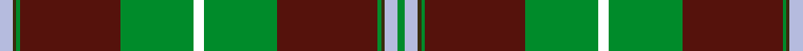

This is one **variant** — a specific cloth: this exact thread count and colourway, with its own
provenance below. It is one weaving of the [sett](/tartans/c/co/connemarra/) (the scale-free proportion — the
same cloth at any scale or shade), whose colour order is pattern [GWGGBGKGBGGW](/stripes/gwggbgkgbggw/).

Part of the [Connemarra](/tartans/c/co/connemarra/) tartan — the named design grouping this sett with its other cloths.

Sourced from house-of-tartan.  It is a [12 stripe tartan](/stripes/stripes12/).

Original link [http://www.house-of-tartan.scotland.net/house/TartanViewjs.asp?colr=Def&tnam=3897](http://www.house-of-tartan.scotland.net/house/TartanViewjs.asp?colr=Def&tnam=3897)

## Provenance

Earliest known date: pre 1997 The Connemara tartan has been created to represent the wild yet picturesque area situated in the north west of County Galway. Strictly speaking this should be a fashion tartan but it has been placed in the same class as the House of Edgar irish tartans.

Dataset <small>— provenance for this record, inherited from the source manifest</small>

<dl class="dataset-prov">
<dt>source</dt><dd><a href="/sources/house-of-tartan/">House of Tartan</a></dd>
<dt>data captured from</dt><dd><a href="https://github.com/thetartan/tartan-database/blob/master/data/house-of-tartan/data.csv">https://github.com/thetartan/tartan-database/blob/master/data/house-of-tartan/data.csv</a></dd>
<dt>data date</dt><dd>pre 1997 <small>(this record)</small></dd>
<dt>licence</dt><dd><a href="https://creativecommons.org/licenses/by-nc-nd/4.0/">CC BY-NC-ND 4.0</a></dd>
</dl>

Capture chain <small>— the hands this data passed through, oldest first; each capture carries its own licence</small>

<ol class="capture-chain">
<li><a href="http://www.house-of-tartan.scotland.net/">House of Tartan</a> <small>the weaver/retailer's database — the site is now offline; the URL is kept as the ultimate source's identity</small></li>
<li><a href="https://github.com/thetartan/tartan-database">thetartan/tartan-database</a> <small>2016-2017</small> · <a href="https://creativecommons.org/licenses/by-nc-nd/4.0/">CC BY-NC-ND 4.0</a> <small>Levko Kravets's frozen compilation — the capture we vendored, and where its CC licence text came from</small></li>
<li>this dictionary <small>captured 2026-06-10 · commit 5bf86c7566</small> <small>each re-capture is a git commit to data/sources</small></li>
</ol>

## Thread count
LB/8 DY2 G2 DR60 G44 K6 G44 DR60 G2 DY2 LB8 G/4

One full sett is **472 threads**.

## Palette
<table><thead><tr><th>Colour</th><th>Shade</th><th>OKLCh</th></tr></thead><tbody><tr><td>LB</td><td><code style="background-color:#B5BBDE;">#B5BBDE</code> <small style="color:#888">#B5BBDE</small></td><td><small style="color:#888">oklch(79.9% 0.050 277.6)</small></td></tr><tr><td>DB</td><td><code style="background-color:#082077;">#082077</code> <small style="color:#888">#082077</small></td><td><small style="color:#888">oklch(30.0% 0.149 265.1)</small></td></tr><tr><td>DG</td><td><code style="background-color:#003820;">#003820</code> <small style="color:#888">#003820</small></td><td><small style="color:#888">oklch(30.0% 0.070 158.3)</small></td></tr><tr><td>DR</td><td><code style="background-color:#55120C;">#55120C</code> <small style="color:#888">#55120C</small></td><td><small style="color:#888">oklch(30.0% 0.099 29.3)</small></td></tr><tr><td>G</td><td><code style="background-color:#008B2A;">#008B2A</code> <small style="color:#888">#008B2A</small></td><td><small style="color:#888">oklch(55.4% 0.170 145.9)</small></td></tr><tr><td>G</td><td><code style="background-color:#387858;">#387858</code> <small style="color:#888">#387858</small></td><td><small style="color:#888">oklch(52.1% 0.084 159.7)</small></td></tr><tr><td>Y</td><td><code style="background-color:#8B6E00;">#8B6E00</code> <small style="color:#888">#8B6E00</small></td><td><small style="color:#888">oklch(55.1% 0.113 90.4)</small></td></tr><tr><td>DY</td><td><code style="background-color:#3A2B0D;">#3A2B0D</code> <small style="color:#888">#3A2B0D</small></td><td><small style="color:#888">oklch(30.0% 0.049 82.0)</small></td></tr></tbody></table>

# Sample pattern

## Nearest tartan variants

The nearest existing variants by ΔTartan distance, with this cloth at the top so the swatches line up against it.

ΔTartan

Threads

Variant

Sett

—

472

<a href="/variants/s12/lb4dy1g1dr30g22k3g22dr30g1dy1lb4g2~x2/">Connemarra Irish District Tartan</a>

<a href="/ttd/edit/#slug=dr5r2k3dr4g43dr6k7lb2dr47g2dr3r2g4~x2&amp;base=lb4dy1g1dr30g22k3g22dr30g1dy1lb4g2~x2" title="compare in the TTD">2.03</a>

502

<a href="/variants/s13/dr5r2k3dr4g43dr6k7lb2dr47g2dr3r2g4~x2/">Glen Coe (District)</a>

<a href="/ttd/edit/#slug=k3w1g29n8m2n2m2n2m8g7k2~x2&amp;base=lb4dy1g1dr30g22k3g22dr30g1dy1lb4g2~x2" title="compare in the TTD">2.43</a>

254

<a href="/variants/s11/k3w1g29n8m2n2m2n2m8g7k2~x2/">Gray Htg (Name)</a>

<a href="/ttd/edit/#slug=k3w1g29n8r2n2r2n2r8g7k2~x2&amp;base=lb4dy1g1dr30g22k3g22dr30g1dy1lb4g2~x2" title="compare in the TTD">2.50</a>

254

<a href="/variants/s11/k3w1g29n8r2n2r2n2r8g7k2~x2/">Gray Hunting Family Tartan</a>

<a href="/ttd/edit/#slug=dy4n2k2n42k13g25n6k2r4k2~x2&amp;base=lb4dy1g1dr30g22k3g22dr30g1dy1lb4g2~x2" title="compare in the TTD">2.67</a>

396

<a href="/variants/s10/dy4n2k2n42k13g25n6k2r4k2~x2/">Dinwiddie Clan Tartan</a>

<a href="/ttd/edit/#slug=dr24lb1k3lb1g14dr8k3dp3lb2~x4&amp;base=lb4dy1g1dr30g22k3g22dr30g1dy1lb4g2~x2" title="compare in the TTD">2.69</a>

368

<a href="/variants/s9/dr24lb1k3lb1g14dr8k3dp3lb2~x4/">Leach (1995)</a>

<a href="/ttd/edit/#slug=dt8k3y1k1y39k3r3y2dt11k8y2k3w2~x2&amp;base=lb4dy1g1dr30g22k3g22dr30g1dy1lb4g2~x2" title="compare in the TTD">2.69</a>

324

<a href="/variants/s13/dt8k3y1k1y39k3r3y2dt11k8y2k3w2~x2/">Afghanistan Memorial</a>

<a href="/ttd/edit/#slug=y7n2k2n41k12g22n6k2r4k2~x2&amp;base=lb4dy1g1dr30g22k3g22dr30g1dy1lb4g2~x2" title="compare in the TTD">2.71</a>

382

<a href="/variants/s10/y7n2k2n41k12g22n6k2r4k2~x2/">Dinwiddie</a>

<a href="/ttd/edit/#slug=dr6k2dr2k4dr2k2dr6g18dr2lo1dr2k2dr10w1dr2~x4&amp;base=lb4dy1g1dr30g22k3g22dr30g1dy1lb4g2~x2" title="compare in the TTD">2.76</a>

464

<a href="/variants/s15/dr6k2dr2k4dr2k2dr6g18dr2lo1dr2k2dr10w1dr2~x4/">Ainslie #2</a>

<a href="/ttd/edit/#slug=dr6k4dr8g16dr6lb2dr2g2dr2lb2dr6g18dp6g2dp1~x2&amp;base=lb4dy1g1dr30g22k3g22dr30g1dy1lb4g2~x2" title="compare in the TTD">2.83</a>

318

<a href="/variants/s15/dr6k4dr8g16dr6lb2dr2g2dr2lb2dr6g18dp6g2dp1~x2/">MacCall Family Tartan</a>

<a href="/ttd/edit/#slug=dp6r1dp20g6dp6g24k1g2w4~x2&amp;base=lb4dy1g1dr30g22k3g22dr30g1dy1lb4g2~x2" title="compare in the TTD">2.99</a>

260

<a href="/variants/s9/dp6r1dp20g6dp6g24k1g2w4~x2/">MacNeill</a>

## Neighbour map

Every grey dot is one of 13656 variants placed by the first two principal components of the ΔTartan feature space (42% of its variance). Red is this tartan; blue dots are its nearest — click one to open its page. The map is a flat projection of a many-dimensional space — [how to read it](/posts/neighbourhood-maps/).

<svg viewBox="0 0 640 380" role="img" style="max-width:100%;height:auto;border:1px solid #e0e0e0;border-radius:4px;display:block" xmlns="http://www.w3.org/2000/svg"><image href="/nn/cloud.v1.png" width="640" height="380"/><a href="/variants/s13/dr5r2k3dr4g43dr6k7lb2dr47g2dr3r2g4~x2/"><circle cx="288.7" cy="82.1" r="4" fill="#3465a4"><title>Glen Coe (District)</title></circle></a><a href="/variants/s11/k3w1g29n8m2n2m2n2m8g7k2~x2/"><circle cx="284.9" cy="92.5" r="4" fill="#3465a4"><title>Gray Htg (Name)</title></circle></a><a href="/variants/s11/k3w1g29n8r2n2r2n2r8g7k2~x2/"><circle cx="290.0" cy="94.6" r="4" fill="#3465a4"><title>Gray Hunting Family Tartan</title></circle></a><a href="/variants/s10/dy4n2k2n42k13g25n6k2r4k2~x2/"><circle cx="248.0" cy="110.5" r="4" fill="#3465a4"><title>Dinwiddie Clan Tartan</title></circle></a><a href="/variants/s9/dr24lb1k3lb1g14dr8k3dp3lb2~x4/"><circle cx="284.7" cy="115.5" r="4" fill="#3465a4"><title>Leach (1995)</title></circle></a><a href="/variants/s13/dt8k3y1k1y39k3r3y2dt11k8y2k3w2~x2/"><circle cx="269.5" cy="56.8" r="4" fill="#3465a4"><title>Afghanistan Memorial</title></circle></a><a href="/variants/s10/y7n2k2n41k12g22n6k2r4k2~x2/"><circle cx="244.8" cy="115.3" r="4" fill="#3465a4"><title>Dinwiddie</title></circle></a><a href="/variants/s15/dr6k2dr2k4dr2k2dr6g18dr2lo1dr2k2dr10w1dr2~x4/"><circle cx="246.5" cy="108.1" r="4" fill="#3465a4"><title>Ainslie #2</title></circle></a><a href="/variants/s15/dr6k4dr8g16dr6lb2dr2g2dr2lb2dr6g18dp6g2dp1~x2/"><circle cx="222.2" cy="130.7" r="4" fill="#3465a4"><title>MacCall Family Tartan</title></circle></a><a href="/variants/s9/dp6r1dp20g6dp6g24k1g2w4~x2/"><circle cx="256.1" cy="123.2" r="4" fill="#3465a4"><title>MacNeill</title></circle></a><circle cx="290.0" cy="100.2" r="5" fill="#c00000"/><text x="320" y="376" text-anchor="middle" font-size="11" fill="#999">ground</text><text x="11" y="190" text-anchor="middle" font-size="11" fill="#999" transform="rotate(-90 11 190)">complexity</text></svg>

ID: /variants/s12/lb4dy1g1dr30g22k3g22dr30g1dy1lb4g2~x2/
