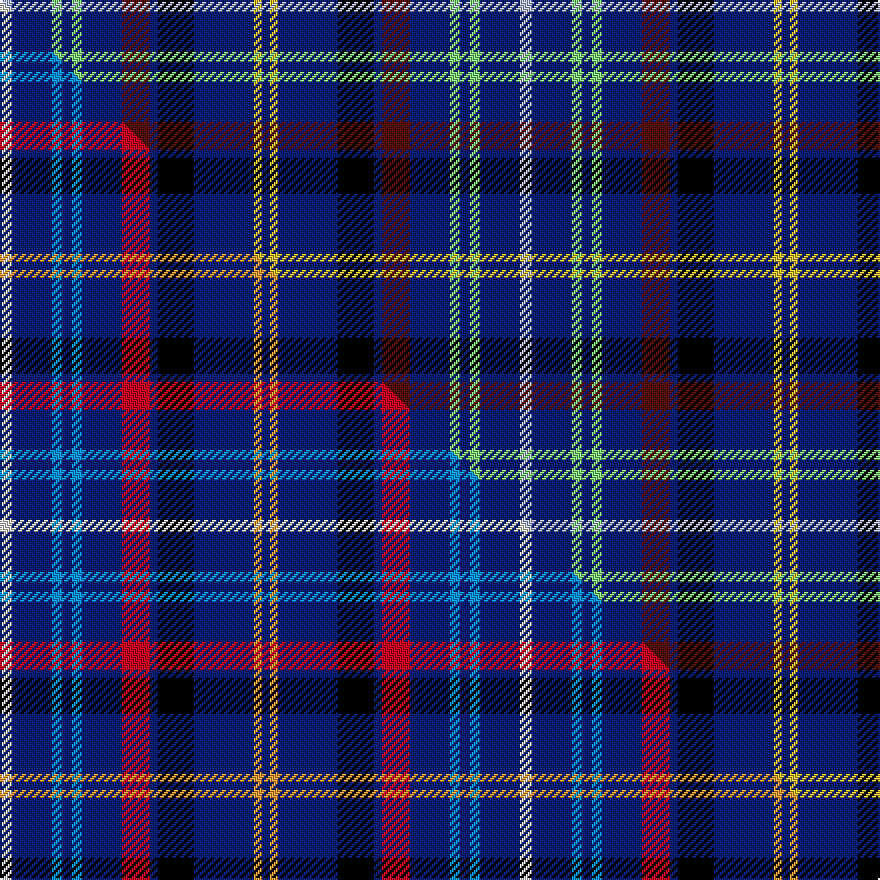

This page is one **sett** — a single exact thread-count. It belongs to the [tartan](/setts/lb6db20lg5db5lg5db20dr14db4k18db30ly4db4/)
(the same proportion at any scale), whose colour order is pattern [BYBKBBBYBYBW](/stripes/bybkbbbybybw/).

Part of the [Edinburgh Bus Tours](/tartans/edinburgh-bus-tours/) tartan — the named design grouping this sett with its other cloths.

Sourced from tartans-authority.  It is a [12 stripe tartan](/stripes/stripes12/).

Original link [https://www.tartanregister.gov.uk/tartanDetails.aspx?ref=11157](https://www.tartanregister.gov.uk/tartanDetails.aspx?ref=11157)

Dataset <small>— provenance for this record, inherited from the source manifest</small>

<dl class="dataset-prov">
<dt>source</dt><dd><a href="/sources/tartans-authority/">Scottish Tartans Authority</a></dd>
<dt>data captured from</dt><dd><a href="https://github.com/thetartan/tartan-database/blob/master/data/tartans-authority/data.csv">https://github.com/thetartan/tartan-database/blob/master/data/tartans-authority/data.csv</a></dd>
<dt>data date</dt><dd>2014 <small>(this record)</small></dd>
<dt>licence</dt><dd><a href="https://creativecommons.org/licenses/by-nc-nd/4.0/">CC BY-NC-ND 4.0</a></dd>
</dl>

Capture chain <small>— the hands this data passed through, oldest first; each capture carries its own licence</small>

<ol class="capture-chain">
<li><a href="https://www.tartansauthority.com/">Scottish Tartans Authority</a> <small>the heritage body's archive — its tartan-ferret record browser is retired (links repaired to the SRT, above)</small></li>
<li><a href="https://github.com/thetartan/tartan-database">thetartan/tartan-database</a> <small>2016-2017</small> · <a href="https://creativecommons.org/licenses/by-nc-nd/4.0/">CC BY-NC-ND 4.0</a> <small>Levko Kravets's frozen compilation — the capture we vendored, and where its CC licence text came from</small></li>
<li>this dictionary <small>captured 2026-06-10 · commit 5bf86c7566</small> <small>each re-capture is a git commit to data/sources</small></li>
</ol>

## Register references

External register numbers recorded for this tartan.

- Scottish Register of Tartans: [11157](https://www.tartanregister.gov.uk/tartanDetails?ref=11157)
- Scottish Tartans Authority (ITI): 11157

## Thread count
LB/6 DB20 LG5 DB5 LG5 DB20 DR14 DB4 K18 DB30 LY4 DB/4

One full sett is **260 threads**.

## Palette
<table><thead><tr><th>Colour</th><th>Shade</th><th>OKLCh</th></tr></thead><tbody><tr><td>LG</td><td><code style="background-color:#82D67A;">#82D67A</code> <small style="color:#888">#82D67A</small></td><td><small style="color:#888">oklch(80.1% 0.150 142.2)</small></td></tr><tr><td>DB</td><td><code style="background-color:#082077;">#082077</code> <small style="color:#888">#082077</small></td><td><small style="color:#888">oklch(30.0% 0.149 265.1)</small></td></tr><tr><td>DR</td><td><code style="background-color:#55120C;">#55120C</code> <small style="color:#888">#55120C</small></td><td><small style="color:#888">oklch(30.0% 0.099 29.3)</small></td></tr><tr><td>K</td><td><code style="background-color:#000000;">#000000</code> <small style="color:#888">#000000</small></td><td><small style="color:#888">oklch(0.0% 0.000 0.0)</small></td></tr><tr><td>LB</td><td><code style="background-color:#B5BBDE;">#B5BBDE</code> <small style="color:#888">#B5BBDE</small></td><td><small style="color:#888">oklch(79.9% 0.050 277.6)</small></td></tr><tr><td>LY</td><td><code style="background-color:#DCBC32;">#DCBC32</code> <small style="color:#888">#DCBC32</small></td><td><small style="color:#888">oklch(80.0% 0.150 95.2)</small></td></tr></tbody></table>

# Sample pattern

## Compared to the master

This cloth is one sett of its design; the master sett (the exemplar the design is anchored on) is below for comparison.

Its **ΔTartan distance** from the master is **1.20** — the same measure the nearest-tartans table ranks by (0 is identical; a re-scale of the same cloth is near 0, a recolour or a different proportion further).

<figure class="master-compare" style="margin:0">

this sett
master sett ★

<figcaption style="color:#888;font-size:smaller">One weave of this sett against the <a href="/setts/w6db20t5db5t5db20r14db4k18db30lo4db4/">master sett ★</a>, split on the diagonal: a shared proportion runs seamlessly across it with only the shades shifting; a different proportion breaks on it.</figcaption>
</figure>

## Nearest tartan variants

The nearest existing variants by ΔTartan distance, with this cloth at the top so the swatches line up against it.

ΔTartan

Threads

Variant

Sett

—

260

<a href="/variants/s12/lb6db20lg5db5lg5db20dr14db4k18db30ly4db4/">Edinburgh Bus Tours</a>

<a href="/ttd/edit/#slug=w6db20t5db5t5db20r14db4k18db30lo4db4~w3600000-t2607245&amp;base=lb6db20lg5db5lg5db20dr14db4k18db30ly4db4" title="compare in the TTD">1.20</a>

260

<a href="/variants/s12/w6db20t5db5t5db20r14db4k18db30lo4db4~w3600000-t2607245/">Edinburgh Bus Tours</a>

<a href="/ttd/edit/#slug=db15k3db19w3db5y5r3y5lb3y5k3~x2&amp;base=lb6db20lg5db5lg5db20dr14db4k18db30ly4db4" title="compare in the TTD">1.93</a>

240

<a href="/variants/s11/db15k3db19w3db5y5r3y5lb3y5k3~x2/">Gouranga</a>

<a href="/ttd/edit/#slug=db20g3dy3db3r7g6db3k12db3k3db24w3~x2&amp;base=lb6db20lg5db5lg5db20dr14db4k18db30ly4db4" title="compare in the TTD">2.21</a>

314

<a href="/variants/s12/db20g3dy3db3r7g6db3k12db3k3db24w3~x2/">Bhoyrub Clan/Family Tartan</a>

<a href="/ttd/edit/#slug=db3n1db10g3r1k3db5n2lb1~x4&amp;base=lb6db20lg5db5lg5db20dr14db4k18db30ly4db4" title="compare in the TTD">2.43</a>

216

<a href="/variants/s9/db3n1db10g3r1k3db5n2lb1~x4/">Lochranza</a>

<a href="/ttd/edit/#slug=dr4y4db9w3y2k9db21y2db2y2db8y3~x2&amp;base=lb6db20lg5db5lg5db20dr14db4k18db30ly4db4" title="compare in the TTD">2.65</a>

262

<a href="/variants/s12/dr4y4db9w3y2k9db21y2db2y2db8y3~x2/">Ruxton, dress</a>

<a href="/ttd/edit/#slug=dg4w1b4dr4k2b12k2b12k2dr4k4b4~x2&amp;base=lb6db20lg5db5lg5db20dr14db4k18db30ly4db4" title="compare in the TTD">2.69</a>

204

<a href="/variants/s12/dg4w1b4dr4k2b12k2b12k2dr4k4b4~x2/">Otago Peninsula</a>

<a href="/ttd/edit/#slug=db9r1db1w1db2k10db8dg2db8k10db10y1lb2~x4&amp;base=lb6db20lg5db5lg5db20dr14db4k18db30ly4db4" title="compare in the TTD">2.85</a>

476

<a href="/variants/s13/db9r1db1w1db2k10db8dg2db8k10db10y1lb2~x4/">Ontario Provincial Police</a>

<a href="/ttd/edit/#slug=r2db7k5r2db5k1db5w1db5k1db5r2g7y2~x2&amp;base=lb6db20lg5db5lg5db20dr14db4k18db30ly4db4" title="compare in the TTD">2.90</a>

192

<a href="/variants/s14/r2db7k5r2db5k1db5w1db5k1db5r2g7y2~x2/">MacLellan, McLellan hunting</a>

<a href="/ttd/edit/#slug=r4dy4db9w3dy2k9db21dy2db2dy2db8dy3~x2&amp;base=lb6db20lg5db5lg5db20dr14db4k18db30ly4db4" title="compare in the TTD">2.90</a>

262

<a href="/variants/s12/r4dy4db9w3dy2k9db21dy2db2dy2db8dy3~x2/">Ruxton Dress</a>

<a href="/ttd/edit/#slug=db10k1g2k2lb3k2g2k1db10w1~x8&amp;base=lb6db20lg5db5lg5db20dr14db4k18db30ly4db4" title="compare in the TTD">2.95</a>

456

<a href="/variants/s10/db10k1g2k2lb3k2g2k1db10w1~x8/">Isle of Harris</a>

## Neighbour map

Every grey dot is one of 13621 variants placed by the first two principal components of the ΔTartan feature space (42% of its variance). Red is this tartan; blue dots are its nearest — click one to open its page.

<svg viewBox="0 0 640 380" role="img" style="max-width:100%;height:auto;border:1px solid #e0e0e0;border-radius:4px;display:block" xmlns="http://www.w3.org/2000/svg"><image href="/nn/cloud.v1.png" width="640" height="380"/><a href="/variants/s12/w6db20t5db5t5db20r14db4k18db30lo4db4~w3600000-t2607245/"><circle cx="222.5" cy="156.1" r="4" fill="#3465a4"><title>Edinburgh Bus Tours</title></circle></a><a href="/variants/s11/db15k3db19w3db5y5r3y5lb3y5k3~x2/"><circle cx="197.7" cy="160.6" r="4" fill="#3465a4"><title>Gouranga</title></circle></a><a href="/variants/s12/db20g3dy3db3r7g6db3k12db3k3db24w3~x2/"><circle cx="226.1" cy="141.3" r="4" fill="#3465a4"><title>Bhoyrub Clan/Family Tartan</title></circle></a><a href="/variants/s9/db3n1db10g3r1k3db5n2lb1~x4/"><circle cx="267.1" cy="156.1" r="4" fill="#3465a4"><title>Lochranza</title></circle></a><a href="/variants/s12/dr4y4db9w3y2k9db21y2db2y2db8y3~x2/"><circle cx="250.3" cy="146.9" r="4" fill="#3465a4"><title>Ruxton, dress</title></circle></a><a href="/variants/s12/dg4w1b4dr4k2b12k2b12k2dr4k4b4~x2/"><circle cx="239.8" cy="154.7" r="4" fill="#3465a4"><title>Otago Peninsula</title></circle></a><a href="/variants/s13/db9r1db1w1db2k10db8dg2db8k10db10y1lb2~x4/"><circle cx="230.9" cy="133.0" r="4" fill="#3465a4"><title>Ontario Provincial Police</title></circle></a><a href="/variants/s14/r2db7k5r2db5k1db5w1db5k1db5r2g7y2~x2/"><circle cx="155.5" cy="169.2" r="4" fill="#3465a4"><title>MacLellan, McLellan hunting</title></circle></a><a href="/variants/s12/r4dy4db9w3dy2k9db21dy2db2dy2db8dy3~x2/"><circle cx="264.2" cy="150.5" r="4" fill="#3465a4"><title>Ruxton Dress</title></circle></a><a href="/variants/s10/db10k1g2k2lb3k2g2k1db10w1~x8/"><circle cx="244.0" cy="146.5" r="4" fill="#3465a4"><title>Isle of Harris</title></circle></a><circle cx="226.1" cy="159.7" r="5" fill="#c00000"/><text x="320" y="376" text-anchor="middle" font-size="11" fill="#999">ground</text><text x="11" y="190" text-anchor="middle" font-size="11" fill="#999" transform="rotate(-90 11 190)">complexity</text></svg>

ID: /variants/s12/lb6db20lg5db5lg5db20dr14db4k18db30ly4db4/
