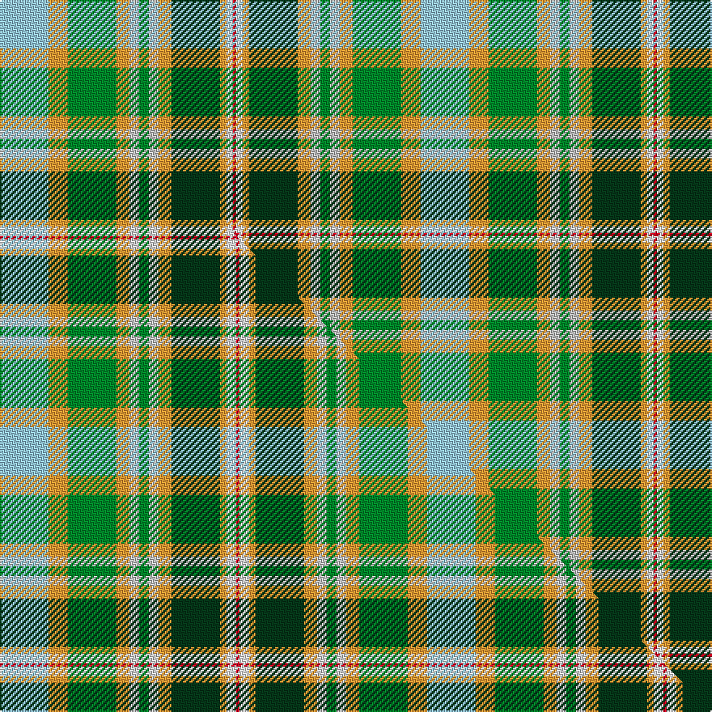

This is one **variant** — a specific cloth: this exact thread count and colourway, with its own
provenance below. It is one weaving of the [sett](/tartans/b/bo/bouguet-adrian-hunting/) (the scale-free proportion — the
same cloth at any scale or shade), whose colour order is pattern [RWYGYWGWYGYW](/stripes/rwygywgwygyw/).

Part of the [Bouguet, Adrian Hunting](/tartans/b/bo/bouguet-adrian-hunting/) tartan — the named design grouping this sett with its other cloths.

Sourced from tartans-authority.  It is a [12 stripe tartan](/stripes/stripes12/).

Original link <code>http://www.tartansauthority.com/tartan-ferret/display/11264/</code> — retired · [Internet Archive copy](https://web.archive.org/web/*/http://www.tartansauthority.com/tartan-ferret/display/11264/*)

Dataset <small>— provenance for this record, inherited from the source manifest</small>

<dl class="dataset-prov">
<dt>source</dt><dd><a href="/sources/tartans-authority/">Scottish Tartans Authority</a></dd>
<dt>data captured from</dt><dd><a href="https://github.com/thetartan/tartan-database/blob/master/data/tartans-authority/data.csv">https://github.com/thetartan/tartan-database/blob/master/data/tartans-authority/data.csv</a></dd>
<dt>data date</dt><dd>2015 <small>(this record)</small></dd>
<dt>licence</dt><dd><a href="https://creativecommons.org/licenses/by-nc-nd/4.0/">CC BY-NC-ND 4.0</a></dd>
</dl>

Capture chain <small>— the hands this data passed through, oldest first; each capture carries its own licence</small>

<ol class="capture-chain">
<li><a href="https://www.tartansauthority.com/">Scottish Tartans Authority</a> <small>the heritage body’s archive — its tartan-ferret record browser is retired; dead record links are shown unlinked, with an Internet Archive copy (ITI numbers are not SRT references)</small></li>
<li><a href="https://github.com/thetartan/tartan-database">thetartan/tartan-database</a> <small>2016-2017</small> · <a href="https://creativecommons.org/licenses/by-nc-nd/4.0/">CC BY-NC-ND 4.0</a> <small>Levko Kravets's frozen compilation — the capture we vendored, and where its CC licence text came from</small></li>
<li>this dictionary <small>captured 2026-06-10 · commit 5bf86c7566</small> <small>each re-capture is a git commit to data/sources</small></li>
</ol>

## Register references

External register numbers recorded for this tartan.

- Scottish Register of Tartans: [11264](https://www.tartanregister.gov.uk/tartanDetails?ref=11264)
- Scottish Tartans Authority (ITI): 11264

## Thread count
LBi/30 LO12 G30 LO8 LB6 G6 LB6 LO8 DG30 LO4 W4 R/2

One full sett is **260 threads**.

## Palette
<table><thead><tr><th>Colour</th><th>Shade</th><th>OKLCh</th></tr></thead><tbody><tr><td>DG</td><td><code style="background-color:#053819;">#053819</code> <small style="color:#888">#053819</small></td><td><small style="color:#888">oklch(30.0% 0.075 151.3)</small></td></tr><tr><td>G</td><td><code style="background-color:#008B2A;">#008B2A</code> <small style="color:#888">#008B2A</small></td><td><small style="color:#888">oklch(55.4% 0.170 145.9)</small></td></tr><tr><td>LB</td><td><code style="background-color:#98C8E8;">#98C8E8</code> <small style="color:#888">#98C8E8</small></td><td><small style="color:#888">oklch(81.0% 0.068 237.9)</small></td></tr><tr><td>LB</td><td><code style="background-color:#C0C0C0;">#C0C0C0</code> <small style="color:#888">#C0C0C0</small></td><td><small style="color:#888">oklch(80.8% 0.000 89.9)</small></td></tr><tr><td>LO</td><td><code style="background-color:#FF9C34;">#FF9C34</code> <small style="color:#888">#FF9C34</small></td><td><small style="color:#888">oklch(77.9% 0.161 61.8)</small></td></tr><tr><td>R</td><td><code style="background-color:#D60020;">#D60020</code> <small style="color:#888">#D60020</small></td><td><small style="color:#888">oklch(55.2% 0.224 25.5)</small></td></tr><tr><td>W</td><td><code style="background-color:#F7F7F7;">#F7F7F7</code> <small style="color:#888">#F7F7F7</small></td><td><small style="color:#888">oklch(97.6% 0.000 89.9)</small></td></tr></tbody></table>

# Sample pattern

## Compared to the master

This cloth is one sett of its design; the master sett (the exemplar the design is anchored on) is below for comparison.

Its **ΔTartan distance** from the master is **0.03** — the same measure the nearest-tartans table ranks by (0 is identical; a re-scale of the same cloth is near 0, a recolour or a different proportion further).

<figure class="master-compare" style="margin:0">

this sett
master sett ★

<figcaption style="color:#888;font-size:smaller">One weave of this sett against the <a href="/setts/lb15lo6g15lo4lbi3g3lbi3lo4dg15lo2w3r1/">master sett ★</a>, split on the diagonal: a shared proportion runs seamlessly across it with only the shades shifting; a different proportion breaks on it.</figcaption>
</figure>

## Nearest tartan variants

The nearest existing variants by ΔTartan distance, with this cloth at the top so the swatches line up against it.

ΔTartan

Threads

Variant

Sett

—

260

<a href="/variants/s12/lbi15lo6g15lo4lb3g3lb3lo4dg15lo2w2r1~x2~lbi8007237-lb80/">Bouguet, Adrian Hunting (Personal)</a>

<a href="/ttd/edit/#slug=lb15lo6g15lo4lbi3g3lbi3lo4dg15lo2w3r1~x2~lb8007237-lbi82&amp;base=lbi15lo6g15lo4lb3g3lb3lo4dg15lo2w2r1~x2~lbi8007237-lb80" title="compare in the TTD">0.03</a>

264

<a href="/variants/s12/lb15lo6g15lo4lbi3g3lbi3lo4dg15lo2w3r1~x2~lb8007237-lbi82/">Bouguet, Adrian Hunting (Personal)</a>

<a href="/ttd/edit/#slug=lb17r2w2db9ly2g16w1r6w1dg5ly1y8ly2~x2~ly8117093-g4808117-dg4514144-y5508084&amp;base=lbi15lo6g15lo4lb3g3lb3lo4dg15lo2w2r1~x2~lbi8007237-lb80" title="compare in the TTD">3.18</a>

250

<a href="/variants/s13/lb17r2w2db9ly2g16w1r6w1dg5ly1y8ly2~x2~ly8117093-g4808117-dg4514144-y5508084/">Okanagan(District)</a>

<a href="/ttd/edit/#slug=r2lb22ly4w3g7lyi2g4w2g9o6lyi2o4w2~x2~ly6307084-lyi8517093&amp;base=lbi15lo6g15lo4lb3g3lb3lo4dg15lo2w2r1~x2~lbi8007237-lb80" title="compare in the TTD">3.21</a>

268

<a href="/variants/s13/r2lb22ly4w3g7lyi2g4w2g9o6lyi2o4w2~x2~ly6307084-lyi8517093/">Isle of Man (District)</a>

<a href="/ttd/edit/#slug=dp3lb1w9r6g5lb2w2lb2w2lb2g12y2~x2&amp;base=lbi15lo6g15lo4lb3g3lb3lo4dg15lo2w2r1~x2~lbi8007237-lb80" title="compare in the TTD">3.34</a>

182

<a href="/variants/s12/dp3lb1w9r6g5lb2w2lb2w2lb2g12y2~x2/">Fredericton District Tartan</a>

<a href="/ttd/edit/#slug=lb16dg5lo20lbi3dg3lbi3lo4g14lo2lbi2r1~x2~lb8007237-lbi82&amp;base=lbi15lo6g15lo4lb3g3lb3lo4dg15lo2w2r1~x2~lbi8007237-lb80" title="compare in the TTD">3.42</a>

258

<a href="/variants/s11/lb16dg5lo20lbi3dg3lbi3lo4g14lo2lbi2r1~x2~lb8007237-lbi82/">Bouguet, Adrian Dress (Personal)</a>

<a href="/ttd/edit/#slug=n2w11lb3g2y1g1r2g10db4ly2~x4&amp;base=lbi15lo6g15lo4lb3g3lb3lo4dg15lo2w2r1~x2~lbi8007237-lb80" title="compare in the TTD">3.46</a>

288

<a href="/variants/s10/n2w11lb3g2y1g1r2g10db4ly2~x4/">Lanark Highlands</a>

<a href="/ttd/edit/#slug=lb12lg12db7w1do5o5lo2ly2~x2&amp;base=lbi15lo6g15lo4lb3g3lb3lo4dg15lo2w2r1~x2~lbi8007237-lb80" title="compare in the TTD">3.50</a>

156

<a href="/variants/s8/lb12lg12db7w1do5o5lo2ly2~x2/">Isle of Jura</a>

<a href="/ttd/edit/#slug=w3r10o6y8lb8g32b8r10b6w3~x4&amp;base=lbi15lo6g15lo4lb3g3lb3lo4dg15lo2w2r1~x2~lbi8007237-lb80" title="compare in the TTD">3.54</a>

728

<a href="/variants/s10/w3r10o6y8lb8g32b8r10b6w3~x4/">Unidentified, Silk scarf</a>

<a href="/ttd/edit/#slug=lb16dg5lo20n3dg3n3lo4g14lo2n2r1~x2&amp;base=lbi15lo6g15lo4lb3g3lb3lo4dg15lo2w2r1~x2~lbi8007237-lb80" title="compare in the TTD">3.56</a>

258

<a href="/variants/s11/lb16dg5lo20n3dg3n3lo4g14lo2n2r1~x2/">Bouguet, Adrian Dress (Personal)</a>

<a href="/ttd/edit/#slug=dy4dg3dy30y12dg5lg4dg3lg14lgi2lg2lgi10ly3~x2~dg4411156-y5410114-lgi7912129&amp;base=lbi15lo6g15lo4lb3g3lb3lo4dg15lo2w2r1~x2~lbi8007237-lb80" title="compare in the TTD">3.66</a>

354

<a href="/variants/s12/dy4dg3dy30y12dg5lg4dg3lg14lgi2lg2lgi10ly3~x2~dg4411156-y5410114-lgi7912129/">Shrek</a>

## Neighbour map

Every grey dot is one of 13662 variants placed by the first two principal components of the ΔTartan feature space (42% of its variance). Red is this tartan; blue dots are its nearest — click one to open its page. The map is a flat projection of a many-dimensional space — [how to read it](/posts/neighbourhood-maps/).

<svg viewBox="0 0 640 380" role="img" style="max-width:100%;height:auto;border:1px solid #e0e0e0;border-radius:4px;display:block" xmlns="http://www.w3.org/2000/svg"><image href="/nn/cloud.v1.png" width="640" height="380"/><a href="/variants/s12/lb15lo6g15lo4lbi3g3lbi3lo4dg15lo2w3r1~x2~lb8007237-lbi82/"><circle cx="86.5" cy="148.2" r="4" fill="#3465a4"><title>Bouguet, Adrian Hunting (Personal)</title></circle></a><a href="/variants/s13/lb17r2w2db9ly2g16w1r6w1dg5ly1y8ly2~x2~ly8117093-g4808117-dg4514144-y5508084/"><circle cx="73.9" cy="115.7" r="4" fill="#3465a4"><title>Okanagan(District)</title></circle></a><a href="/variants/s13/r2lb22ly4w3g7lyi2g4w2g9o6lyi2o4w2~x2~ly6307084-lyi8517093/"><circle cx="142.9" cy="148.4" r="4" fill="#3465a4"><title>Isle of Man (District)</title></circle></a><a href="/variants/s12/dp3lb1w9r6g5lb2w2lb2w2lb2g12y2~x2/"><circle cx="125.8" cy="159.0" r="4" fill="#3465a4"><title>Fredericton District Tartan</title></circle></a><a href="/variants/s11/lb16dg5lo20lbi3dg3lbi3lo4g14lo2lbi2r1~x2~lb8007237-lbi82/"><circle cx="189.4" cy="147.5" r="4" fill="#3465a4"><title>Bouguet, Adrian Dress (Personal)</title></circle></a><a href="/variants/s10/n2w11lb3g2y1g1r2g10db4ly2~x4/"><circle cx="83.8" cy="134.2" r="4" fill="#3465a4"><title>Lanark Highlands</title></circle></a><a href="/variants/s8/lb12lg12db7w1do5o5lo2ly2~x2/"><circle cx="52.0" cy="163.2" r="4" fill="#3465a4"><title>Isle of Jura</title></circle></a><a href="/variants/s10/w3r10o6y8lb8g32b8r10b6w3~x4/"><circle cx="127.6" cy="162.2" r="4" fill="#3465a4"><title>Unidentified, Silk scarf</title></circle></a><a href="/variants/s11/lb16dg5lo20n3dg3n3lo4g14lo2n2r1~x2/"><circle cx="184.0" cy="141.9" r="4" fill="#3465a4"><title>Bouguet, Adrian Dress (Personal)</title></circle></a><a href="/variants/s12/dy4dg3dy30y12dg5lg4dg3lg14lgi2lg2lgi10ly3~x2~dg4411156-y5410114-lgi7912129/"><circle cx="176.2" cy="153.5" r="4" fill="#3465a4"><title>Shrek</title></circle></a><circle cx="92.4" cy="147.0" r="5" fill="#c00000"/><text x="320" y="376" text-anchor="middle" font-size="11" fill="#999">ground</text><text x="11" y="190" text-anchor="middle" font-size="11" fill="#999" transform="rotate(-90 11 190)">complexity</text></svg>

ID: /variants/s12/lbi15lo6g15lo4lb3g3lb3lo4dg15lo2w2r1~x2~lbi8007237-lb80/
