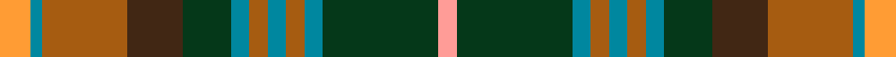

This page is one **sett** — a single exact thread-count. It belongs to the [tartan](/setts/lo5t2o14do9dg8t3o3t3o3t3dg19lr3/)
(the same proportion at any scale), whose colour order is pattern [YBRBGBRBRBGY](/stripes/ybrbgbrbrbgy/).

Sourced from house-of-tartan.  It is a [12 stripe tartan](/stripes/stripes12/).

Original link http://www.house-of-tartan.scotland.net/house/TartanViewjs.asp?colr=Def&tnam=2269

## Provenance

Earliest known date: 1996 One of a series of Irish District tartans designed by Polly Wittering of the House of Edgar, with colours reminiscent of the Country with soft warm colours dominating.

Dataset <small>— provenance for this record, inherited from the source manifest</small>

<dl class="dataset-prov">
<dt>source</dt><dd><a href="/sources/house-of-tartan/">House of Tartan</a></dd>
<dt>data captured from</dt><dd><a href="https://github.com/thetartan/tartan-database/blob/master/data/house-of-tartan/data.csv">https://github.com/thetartan/tartan-database/blob/master/data/house-of-tartan/data.csv</a></dd>
<dt>data date</dt><dd>2017-01-10 <small>(dataset default)</small></dd>
<dt>licence</dt><dd><a href="https://creativecommons.org/licenses/by-nc-nd/4.0/">CC BY-NC-ND 4.0</a></dd>
</dl>

Capture chain <small>— the hands this data passed through, oldest first; each capture carries its own licence</small>

<ol class="capture-chain">
<li><a href="http://www.house-of-tartan.scotland.net/">House of Tartan</a> <small>the weaver/retailer's database — the site is now offline; the URL is kept as the ultimate source's identity</small></li>
<li><a href="https://github.com/thetartan/tartan-database">thetartan/tartan-database</a> <small>2016-2017</small> · <a href="https://creativecommons.org/licenses/by-nc-nd/4.0/">CC BY-NC-ND 4.0</a> <small>Levko Kravets's frozen compilation — the capture we vendored, and where its CC licence text came from</small></li>
<li>this dictionary <small>captured 2026-06-10 · commit 5bf86c7566</small> <small>each re-capture is a git commit to data/sources</small></li>
</ol>

## Thread count
LO/10 T4 O28 DO18 DG16 T6 O6 T6 O6 T6 DG38 LR/6

One full sett is **284 threads**.

## Palette
<table><thead><tr><th>Colour</th><th>Shade</th><th>OKLCh</th></tr></thead><tbody><tr><td>T</td><td><code style="background-color:#00879F;">#00879F</code> <small style="color:#888">#00879F</small></td><td><small style="color:#888">oklch(57.4% 0.102 216.1)</small></td></tr><tr><td>LO</td><td><code style="background-color:#FF9C34;">#FF9C34</code> <small style="color:#888">#FF9C34</small></td><td><small style="color:#888">oklch(77.9% 0.161 61.8)</small></td></tr><tr><td>O</td><td><code style="background-color:#A65C11;">#A65C11</code> <small style="color:#888">#A65C11</small></td><td><small style="color:#888">oklch(55.0% 0.125 58.3)</small></td></tr><tr><td>DG</td><td><code style="background-color:#053819;">#053819</code> <small style="color:#888">#053819</small></td><td><small style="color:#888">oklch(30.0% 0.075 151.3)</small></td></tr><tr><td>DO</td><td><code style="background-color:#412714;">#412714</code> <small style="color:#888">#412714</small></td><td><small style="color:#888">oklch(30.1% 0.050 55.7)</small></td></tr><tr><td>LR</td><td><code style="background-color:#FF9C97;">#FF9C97</code> <small style="color:#888">#FF9C97</small></td><td><small style="color:#888">oklch(79.3% 0.119 23.2)</small></td></tr></tbody></table>

# Sample pattern

## Nearest tartan variants

The nearest existing variants by ΔTartan distance, with this cloth at the top so the swatches line up against it.

ΔTartan

Threads

Variant

Sett

—

284

<a href="/variants/s12/lo5t2o14do9dg8t3o3t3o3t3dg19lr3~x2/">Meath Irish County Tartan</a>

<a href="/ttd/edit/#slug=y3g15r2db8lb2r8g8r2dg15r2dg2lb2~x2&amp;base=lo5t2o14do9dg8t3o3t3o3t3dg19lr3~x2" title="compare in the TTD">1.83</a>

266

<a href="/variants/s12/y3g15r2db8lb2r8g8r2dg15r2dg2lb2~x2/">Gordonstoun</a>

<a href="/ttd/edit/#slug=dt16r2dt3r4dt2dy12g18w2g18dy12dt12y2r2y2~x2~w4000000&amp;base=lo5t2o14do9dg8t3o3t3o3t3dg19lr3~x2" title="compare in the TTD">2.15</a>

392

<a href="/variants/s14/dt16r2dt3r4dt2dy12g18w2g18dy12dt12y2r2y2~x2~w4000000/">Allen - Northumbrian (Personal)</a>

<a href="/ttd/edit/#slug=dbi3g4r2g3r3g16db16dr16dbi3dr3dbi2dr4y3~x2~dbi1406275-db1404245&amp;base=lo5t2o14do9dg8t3o3t3o3t3dg19lr3~x2" title="compare in the TTD">2.15</a>

300

<a href="/variants/s13/dbi3g4r2g3r3g16db16dr16dbi3dr3dbi2dr4y3~x2~dbi1406275-db1404245/">Cuthill (Personal)</a>

<a href="/ttd/edit/#slug=dt16r2dt3r4dt2dy12g18w2g18dy12dt12y2r2y2~x2&amp;base=lo5t2o14do9dg8t3o3t3o3t3dg19lr3~x2" title="compare in the TTD">2.16</a>

392

<a href="/variants/s14/dt16r2dt3r4dt2dy12g18w2g18dy12dt12y2r2y2~x2/">Allen - 2001 (Personal)</a>

<a href="/ttd/edit/#slug=ly5db2r14do9dg8db3r3db3r3db3dg18lyi3~x2~ly2705081-lyi3103095&amp;base=lo5t2o14do9dg8t3o3t3o3t3dg19lr3~x2" title="compare in the TTD">2.19</a>

280

<a href="/variants/s12/ly5db2r14do9dg8db3r3db3r3db3dg18lyi3~x2~ly2705081-lyi3103095/">Meath, County</a>

<a href="/ttd/edit/#slug=t30r6dy16lp6g10lp14g24y4dy10lp3dy28&amp;base=lo5t2o14do9dg8t3o3t3o3t3dg19lr3~x2" title="compare in the TTD">2.25</a>

244

<a href="/variants/s11/t30r6dy16lp6g10lp14g24y4dy10lp3dy28/">Greyfriars (District)</a>

<a href="/ttd/edit/#slug=do6y4do3db2do5db2do3db2g15r3db2~x2&amp;base=lo5t2o14do9dg8t3o3t3o3t3dg19lr3~x2" title="compare in the TTD">2.44</a>

172

<a href="/variants/s11/do6y4do3db2do5db2do3db2g15r3db2~x2/">Limerick</a>

<a href="/ttd/edit/#slug=y3dg14g9db4g8w2g12r12g2r5w2~x2~dg1806142-g2203152&amp;base=lo5t2o14do9dg8t3o3t3o3t3dg19lr3~x2" title="compare in the TTD">2.57</a>

282

<a href="/variants/s11/y3dg14g9db4g8w2g12r12g2r5w2~x2~dg1806142-g2203152/">Muirhead (Clan)</a>

<a href="/ttd/edit/#slug=t12dg4r2dy3g4dg4r20w4r14dg4g4dy3r2dg4t12dy2t8dy2~x2~dg1806142-g2408144&amp;base=lo5t2o14do9dg8t3o3t3o3t3dg19lr3~x2" title="compare in the TTD">2.61</a>

404

<a href="/variants/s18/t12dg4r2dy3g4dg4r20w4r14dg4g4dy3r2dg4t12dy2t8dy2~x2~dg1806142-g2408144/">Beguinot, (Personal)</a>

<a href="/ttd/edit/#slug=dg12g24t48r23w8r23t24y4g12dg12&amp;base=lo5t2o14do9dg8t3o3t3o3t3dg19lr3~x2" title="compare in the TTD">2.72</a>

356

<a href="/variants/s10/dg12g24t48r23w8r23t24y4g12dg12/">Swiss Highlander (Corporate)</a>

## Neighbour map

Every grey dot is one of 13620 variants placed by the first two principal components of the ΔTartan feature space (42% of its variance). Red is this tartan; blue dots are its nearest — click one to open its page.

<svg viewBox="0 0 640 380" role="img" style="max-width:100%;height:auto;border:1px solid #e0e0e0;border-radius:4px;display:block" xmlns="http://www.w3.org/2000/svg"><image href="/nn/cloud.v1.png" width="640" height="380"/><a href="/variants/s12/y3g15r2db8lb2r8g8r2dg15r2dg2lb2~x2/"><circle cx="125.5" cy="180.1" r="4" fill="#3465a4"><title>Gordonstoun</title></circle></a><a href="/variants/s14/dt16r2dt3r4dt2dy12g18w2g18dy12dt12y2r2y2~x2~w4000000/"><circle cx="168.3" cy="180.7" r="4" fill="#3465a4"><title>Allen - Northumbrian (Personal)</title></circle></a><a href="/variants/s13/dbi3g4r2g3r3g16db16dr16dbi3dr3dbi2dr4y3~x2~dbi1406275-db1404245/"><circle cx="152.8" cy="178.5" r="4" fill="#3465a4"><title>Cuthill (Personal)</title></circle></a><a href="/variants/s14/dt16r2dt3r4dt2dy12g18w2g18dy12dt12y2r2y2~x2/"><circle cx="169.2" cy="181.0" r="4" fill="#3465a4"><title>Allen - 2001 (Personal)</title></circle></a><a href="/variants/s12/ly5db2r14do9dg8db3r3db3r3db3dg18lyi3~x2~ly2705081-lyi3103095/"><circle cx="150.3" cy="174.8" r="4" fill="#3465a4"><title>Meath, County</title></circle></a><a href="/variants/s11/t30r6dy16lp6g10lp14g24y4dy10lp3dy28/"><circle cx="139.3" cy="190.6" r="4" fill="#3465a4"><title>Greyfriars (District)</title></circle></a><a href="/variants/s11/do6y4do3db2do5db2do3db2g15r3db2~x2/"><circle cx="193.4" cy="204.3" r="4" fill="#3465a4"><title>Limerick</title></circle></a><a href="/variants/s11/y3dg14g9db4g8w2g12r12g2r5w2~x2~dg1806142-g2203152/"><circle cx="182.2" cy="210.3" r="4" fill="#3465a4"><title>Muirhead (Clan)</title></circle></a><a href="/variants/s18/t12dg4r2dy3g4dg4r20w4r14dg4g4dy3r2dg4t12dy2t8dy2~x2~dg1806142-g2408144/"><circle cx="147.7" cy="154.0" r="4" fill="#3465a4"><title>Beguinot, (Personal)</title></circle></a><a href="/variants/s10/dg12g24t48r23w8r23t24y4g12dg12/"><circle cx="166.4" cy="196.5" r="4" fill="#3465a4"><title>Swiss Highlander (Corporate)</title></circle></a><circle cx="167.8" cy="179.7" r="5" fill="#c00000"/><text x="320" y="376" text-anchor="middle" font-size="11" fill="#999">ground</text><text x="11" y="190" text-anchor="middle" font-size="11" fill="#999" transform="rotate(-90 11 190)">complexity</text></svg>

ID: /variants/s12/lo5t2o14do9dg8t3o3t3o3t3dg19lr3~x2/
