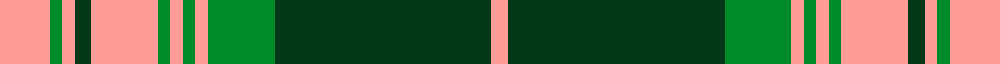

This is one **variant** — a specific cloth: this exact thread count and colourway, with its own
provenance below. It is one weaving of the [sett](/tartans/k/ke/kelso/) (the scale-free proportion — the
same cloth at any scale or shade), whose colour order is pattern [YGGYGYGYGYGY](/stripes/yggygygygygy/).

Part of the [Kelso](/tartans/k/ke/kelso/) tartan — the named design grouping this sett with its other cloths.

Sourced from tartans-authority.  It is a [12 stripe tartan](/stripes/stripes12/).

Original link <code>http://www.tartansauthority.com/tartan-ferret/display/5325/</code> — retired · [Internet Archive copy](https://web.archive.org/web/*/http://www.tartansauthority.com/tartan-ferret/display/5325/*)

Dataset <small>— provenance for this record, inherited from the source manifest</small>

<dl class="dataset-prov">
<dt>source</dt><dd><a href="/sources/tartans-authority/">Scottish Tartans Authority</a></dd>
<dt>data captured from</dt><dd><a href="https://github.com/thetartan/tartan-database/blob/master/data/tartans-authority/data.csv">https://github.com/thetartan/tartan-database/blob/master/data/tartans-authority/data.csv</a></dd>
<dt>data date</dt><dd>1984 <small>(this record)</small></dd>
<dt>licence</dt><dd><a href="https://creativecommons.org/licenses/by-nc-nd/4.0/">CC BY-NC-ND 4.0</a></dd>
</dl>

Capture chain <small>— the hands this data passed through, oldest first; each capture carries its own licence</small>

<ol class="capture-chain">
<li><a href="https://www.tartansauthority.com/">Scottish Tartans Authority</a> <small>the heritage body’s archive — its tartan-ferret record browser is retired; dead record links are shown unlinked, with an Internet Archive copy (ITI numbers are not SRT references)</small></li>
<li><a href="https://github.com/thetartan/tartan-database">thetartan/tartan-database</a> <small>2016-2017</small> · <a href="https://creativecommons.org/licenses/by-nc-nd/4.0/">CC BY-NC-ND 4.0</a> <small>Levko Kravets's frozen compilation — the capture we vendored, and where its CC licence text came from</small></li>
<li>this dictionary <small>captured 2026-06-10 · commit 5bf86c7566</small> <small>each re-capture is a git commit to data/sources</small></li>
</ol>

## Register references

External register numbers recorded for this tartan.

- Scottish Tartans Authority (ITI): 5325

## Thread count
LR/12 G3 LR3 DG4 LR16 G3 LR3 G3 LR3 G16 DG52 LR/4

One full sett is **228 threads**.

## Palette
<table><thead><tr><th>Colour</th><th>Shade</th><th>OKLCh</th></tr></thead><tbody><tr><td>DG</td><td><code style="background-color:#053819;">#053819</code> <small style="color:#888">#053819</small></td><td><small style="color:#888">oklch(30.0% 0.075 151.3)</small></td></tr><tr><td>G</td><td><code style="background-color:#008B2A;">#008B2A</code> <small style="color:#888">#008B2A</small></td><td><small style="color:#888">oklch(55.4% 0.170 145.9)</small></td></tr><tr><td>LR</td><td><code style="background-color:#FF9C97;">#FF9C97</code> <small style="color:#888">#FF9C97</small></td><td><small style="color:#888">oklch(79.3% 0.119 23.2)</small></td></tr></tbody></table>

# Sample pattern

## Nearest tartan variants

The nearest existing variants by ΔTartan distance, with this cloth at the top so the swatches line up against it.

ΔTartan

Threads

Variant

Sett

—

228

<a href="/variants/s12/lr12g3lr3dg4lr16g3lr3g3lr3g16dg52lr4/">Kelso (Fashion)</a>

<a href="/ttd/edit/#slug=lr12g3lr3dg4lr16g3lr3g3lr3g16dg52lr4~g4808117&amp;base=lr12g3lr3dg4lr16g3lr3g3lr3g16dg52lr4" title="compare in the TTD">0.06</a>

228

<a href="/variants/s12/lr12g3lr3dg4lr16g3lr3g3lr3g16dg52lr4~g4808117/">Kelso</a>

<a href="/ttd/edit/#slug=w1dr1g1dr11lb6dr1g14dr1g1w1~x4&amp;base=lr12g3lr3dg4lr16g3lr3g3lr3g16dg52lr4" title="compare in the TTD">2.33</a>

296

<a href="/variants/s10/w1dr1g1dr11lb6dr1g14dr1g1w1~x4/">Glen Tilt #2</a>

<a href="/ttd/edit/#slug=dr56w2t6w2g32dr11t6w5~x2~t5912243&amp;base=lr12g3lr3dg4lr16g3lr3g3lr3g16dg52lr4" title="compare in the TTD">2.81</a>

358

<a href="/variants/s8/dr56w2t6w2g32dr11t6w5~x2~t5912243/">Spens/Spence</a>

<a href="/ttd/edit/#slug=dg5dr2dg2lr34dg18dr4dg4lr4dg4dr4~x2&amp;base=lr12g3lr3dg4lr16g3lr3g3lr3g16dg52lr4" title="compare in the TTD">2.91</a>

306

<a href="/variants/s10/dg5dr2dg2lr34dg18dr4dg4lr4dg4dr4~x2/">Buccleuch Dress (Fashion)</a>

<a href="/ttd/edit/#slug=g24w1g2w2dg2w1dg12w1dg2w2dg2w1dg12~x2&amp;base=lr12g3lr3dg4lr16g3lr3g3lr3g16dg52lr4" title="compare in the TTD">3.22</a>

184

<a href="/variants/s13/g24w1g2w2dg2w1dg12w1dg2w2dg2w1dg12~x2/">MacDonald, Lord of the Isles Hunting</a>

<a href="/ttd/edit/#slug=lb1dr1g1dr11db6dr1g14dr1g1lb1~x4&amp;base=lr12g3lr3dg4lr16g3lr3g3lr3g16dg52lr4" title="compare in the TTD">3.24</a>

296

<a href="/variants/s10/lb1dr1g1dr11db6dr1g14dr1g1lb1~x4/">Glen Tilt #1</a>

<a href="/ttd/edit/#slug=g24w1g2w2do2w1do12w1do2w2do2w1dg12~x2&amp;base=lr12g3lr3dg4lr16g3lr3g3lr3g16dg52lr4" title="compare in the TTD">3.32</a>

184

<a href="/variants/s13/g24w1g2w2do2w1do12w1do2w2do2w1dg12~x2/">MacDonald Hunting</a>

<a href="/ttd/edit/#slug=dr32lo1g8lo1~x2&amp;base=lr12g3lr3dg4lr16g3lr3g3lr3g16dg52lr4" title="compare in the TTD">3.50</a>

138

<a href="/variants/s6/dr32lo1g8lo1g8lo1~x2/">Unidentified #62</a>

<a href="/ttd/edit/#slug=db4r17db4g4db2g4db4g27db4ly4~x2&amp;base=lr12g3lr3dg4lr16g3lr3g3lr3g16dg52lr4" title="compare in the TTD">3.63</a>

280

<a href="/variants/s10/db4r17db4g4db2g4db4g27db4ly4~x2/">Cape Breton University</a>

<a href="/ttd/edit/#slug=lb16db2lb2db2lb3db6y52db6lb3db2lb2db2lb16dr3~x2&amp;base=lr12g3lr3dg4lr16g3lr3g3lr3g16dg52lr4" title="compare in the TTD">3.74</a>

430

<a href="/variants/s14/lb16db2lb2db2lb3db6y52db6lb3db2lb2db2lb16dr3~x2/">Scotch House (Corporate)</a>

## Neighbour map

Every grey dot is one of 13662 variants placed by the first two principal components of the ΔTartan feature space (42% of its variance). Red is this tartan; blue dots are its nearest — click one to open its page. The map is a flat projection of a many-dimensional space — [how to read it](/posts/neighbourhood-maps/).

<svg viewBox="0 0 640 380" role="img" style="max-width:100%;height:auto;border:1px solid #e0e0e0;border-radius:4px;display:block" xmlns="http://www.w3.org/2000/svg"><image href="/nn/cloud.v1.png" width="640" height="380"/><a href="/variants/s12/lr12g3lr3dg4lr16g3lr3g3lr3g16dg52lr4~g4808117/"><circle cx="317.4" cy="135.3" r="4" fill="#3465a4"><title>Kelso</title></circle></a><a href="/variants/s10/w1dr1g1dr11lb6dr1g14dr1g1w1~x4/"><circle cx="269.5" cy="170.8" r="4" fill="#3465a4"><title>Glen Tilt #2</title></circle></a><a href="/variants/s8/dr56w2t6w2g32dr11t6w5~x2~t5912243/"><circle cx="293.4" cy="134.7" r="4" fill="#3465a4"><title>Spens/Spence</title></circle></a><a href="/variants/s10/dg5dr2dg2lr34dg18dr4dg4lr4dg4dr4~x2/"><circle cx="318.2" cy="167.4" r="4" fill="#3465a4"><title>Buccleuch Dress (Fashion)</title></circle></a><a href="/variants/s13/g24w1g2w2dg2w1dg12w1dg2w2dg2w1dg12~x2/"><circle cx="333.5" cy="151.7" r="4" fill="#3465a4"><title>MacDonald, Lord of the Isles Hunting</title></circle></a><a href="/variants/s10/lb1dr1g1dr11db6dr1g14dr1g1lb1~x4/"><circle cx="291.9" cy="177.9" r="4" fill="#3465a4"><title>Glen Tilt #1</title></circle></a><a href="/variants/s13/g24w1g2w2do2w1do12w1do2w2do2w1dg12~x2/"><circle cx="265.2" cy="138.0" r="4" fill="#3465a4"><title>MacDonald Hunting</title></circle></a><a href="/variants/s6/dr32lo1g8lo1g8lo1~x2/"><circle cx="389.9" cy="157.2" r="4" fill="#3465a4"><title>Unidentified #62</title></circle></a><a href="/variants/s10/db4r17db4g4db2g4db4g27db4ly4~x2/"><circle cx="263.8" cy="172.4" r="4" fill="#3465a4"><title>Cape Breton University</title></circle></a><a href="/variants/s14/lb16db2lb2db2lb3db6y52db6lb3db2lb2db2lb16dr3~x2/"><circle cx="326.5" cy="122.5" r="4" fill="#3465a4"><title>Scotch House (Corporate)</title></circle></a><circle cx="307.0" cy="158.8" r="5" fill="#c00000"/><text x="320" y="376" text-anchor="middle" font-size="11" fill="#999">ground</text><text x="11" y="190" text-anchor="middle" font-size="11" fill="#999" transform="rotate(-90 11 190)">complexity</text></svg>

ID: /variants/s12/lr12g3lr3dg4lr16g3lr3g3lr3g16dg52lr4/
