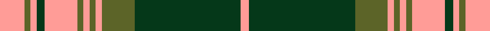

This page is one **sett** — a single exact thread-count. It belongs to the [tartan](/setts/lr12g3lr3dg4lr16g3lr3g3lr3g16dg52lr4/)
(the same proportion at any scale), whose colour order is pattern [GYGYGYGYGGYGGYGYGYGYGY](/stripes/gygygygyggyggygygygygy/).

Sourced from register-of-tartans.  It is a [22 stripe tartan](/stripes/stripes22/).

Original link https://www.tartanregister.gov.uk/tartanDetails.aspx?ref=1938

Dataset <small>— provenance for this record, inherited from the source manifest</small>

<dl class="dataset-prov">
<dt>source</dt><dd><a href="/sources/register-of-tartans/">Scottish Register of Tartans</a></dd>
<dt>data captured from</dt><dd><a href="https://github.com/thetartan/tartan-database/blob/master/data/register-of-tartans/data.csv">https://github.com/thetartan/tartan-database/blob/master/data/register-of-tartans/data.csv</a></dd>
<dt>data date</dt><dd>1984 <small>(this record)</small></dd>
<dt>licence</dt><dd><a href="https://www.tartanregister.gov.uk/copyright">Crown copyright</a></dd>
</dl>

Capture chain <small>— the hands this data passed through, oldest first; each capture carries its own licence</small>

<ol class="capture-chain">
<li><a href="https://www.tartanregister.gov.uk/">Scottish Register of Tartans</a> · <a href="https://www.tartanregister.gov.uk/copyright">Crown copyright</a> <small>the living register — still published by National Records of Scotland</small></li>
<li><a href="https://github.com/thetartan/tartan-database">thetartan/tartan-database</a> <small>2016-2017</small> · <a href="https://creativecommons.org/licenses/by-nc-nd/4.0/">CC BY-NC-ND 4.0</a> <small>Levko Kravets's frozen compilation — the capture we vendored, and where its CC licence text came from</small></li>
<li>this dictionary <small>captured 2026-06-10 · commit 5bf86c7566</small> <small>each re-capture is a git commit to data/sources</small></li>
</ol>

## Register references

External register numbers recorded for this tartan.

- Scottish Register of Tartans: [1938](https://www.tartanregister.gov.uk/tartanDetails.aspx?ref=1938)
- Scottish Tartans Authority (ITI): 5325

## Thread count
LR/12 G3 LR3 DG4 LR16 G3 LR3 G3 LR3 G16 DG52 LR4 DG52 G16 LR3 G3 LR3 G3 LR16 DG4 LR3 G/3

One full sett is **441 threads**.

## Palette
<table><thead><tr><th>Colour</th><th>Shade</th><th>OKLCh</th></tr></thead><tbody><tr><td>DG</td><td><code style="background-color:#053819;">#053819</code> <small style="color:#888">#053819</small></td><td><small style="color:#888">oklch(30.0% 0.075 151.3)</small></td></tr><tr><td>DG</td><td><code style="background-color:#006818;">#006818</code> <small style="color:#888">#006818</small></td><td><small style="color:#888">oklch(45.0% 0.142 145.0)</small></td></tr><tr><td>G</td><td><code style="background-color:#5C6428;">#5C6428</code> <small style="color:#888">#5C6428</small></td><td><small style="color:#888">oklch(48.3% 0.084 116.0)</small></td></tr><tr><td>W</td><td><code style="background-color:#F7F7F7;">#F7F7F7</code> <small style="color:#888">#F7F7F7</small></td><td><small style="color:#888">oklch(97.6% 0.000 89.9)</small></td></tr><tr><td>LR</td><td><code style="background-color:#FF9C97;">#FF9C97</code> <small style="color:#888">#FF9C97</small></td><td><small style="color:#888">oklch(79.3% 0.119 23.2)</small></td></tr></tbody></table>

# Sample pattern

## Nearest tartan variants

The nearest existing variants by ΔTartan distance, with this cloth at the top so the swatches line up against it.

ΔTartan

Threads

Variant

Sett

—

441

<a href="/variants/s12/lr12g3lr3dg4lr16g3lr3g3lr3g16dg52lr4~g1903114/">Kelso</a>

<a href="/ttd/edit/#slug=lr12g3lr3dg4lr16g3lr3g3lr3g16dg52lr4&amp;base=lr12g3lr3dg4lr16g3lr3g3lr3g16dg52lr4~g1903114" title="compare in the TTD">0.06</a>

228

<a href="/variants/s12/lr12g3lr3dg4lr16g3lr3g3lr3g16dg52lr4/">Kelso (Fashion)</a>

<a href="/ttd/edit/#slug=r8g3r1g1r1g22db8g3r1g1r1g3r6g1r1g1r2db6g5r3g4~x2&amp;base=lr12g3lr3dg4lr16g3lr3g3lr3g16dg52lr4~g1903114" title="compare in the TTD">3.27</a>

304

<a href="/variants/s21/r8g3r1g1r1g22db8g3r1g1r1g3r6g1r1g1r2db6g5r3g4~x2/">Matheson Hunting (STS incomplete sett)</a>

<a href="/ttd/edit/#slug=dr56w2t6w2g32dr11t6w5~x2~t2405244&amp;base=lr12g3lr3dg4lr16g3lr3g3lr3g16dg52lr4~g1903114" title="compare in the TTD">3.42</a>

358

<a href="/variants/s8/dr56w2t6w2g32dr11t6w5~x2~t2405244/">Spens/Spence</a>

<a href="/ttd/edit/#slug=g7dr2g2dr2g2dr27db9g2dr2g2dr2g2dr6g2dr2g2dr2db10g6dr2db5~x2&amp;base=lr12g3lr3dg4lr16g3lr3g3lr3g16dg52lr4~g1903114" title="compare in the TTD">3.54</a>

368

<a href="/variants/s21/g7dr2g2dr2g2dr27db9g2dr2g2dr2g2dr6g2dr2g2dr2db10g6dr2db5~x2/">Matheson (Lochcarron)</a>

<a href="/ttd/edit/#slug=g8r4g1r1g1r24db8g4r1g1r1g4r8g1r1g1r1db8g8r2g4&amp;base=lr12g3lr3dg4lr16g3lr3g3lr3g16dg52lr4~g1903114" title="compare in the TTD">3.84</a>

172

<a href="/variants/s21/g8r4g1r1g1r24db8g4r1g1r1g4r8g1r1g1r1db8g8r2g4/">Matheson</a>

<a href="/ttd/edit/#slug=g8r4g1r1g1r24db8g4r1g1r1g4r8g1r1g1r1db8g8r2g4~x2&amp;base=lr12g3lr3dg4lr16g3lr3g3lr3g16dg52lr4~g1903114" title="compare in the TTD">3.84</a>

344

<a href="/variants/s21/g8r4g1r1g1r24db8g4r1g1r1g4r8g1r1g1r1db8g8r2g4~x2/">Matheson</a>

<a href="/ttd/edit/#slug=db4g2db1g2db1g22db6g2r2g2r2g2r4g2r2g2r2db6g4r2g4~x4&amp;base=lr12g3lr3dg4lr16g3lr3g3lr3g16dg52lr4~g1903114" title="compare in the TTD">3.94</a>

576

<a href="/variants/s21/db4g2db1g2db1g22db6g2r2g2r2g2r4g2r2g2r2db6g4r2g4~x4/">Matheson Hunting (Highland Society of London)</a>

## Neighbour map

Every grey dot is one of 13620 variants placed by the first two principal components of the ΔTartan feature space (42% of its variance). Red is this tartan; blue dots are its nearest — click one to open its page.

<svg viewBox="0 0 640 380" role="img" style="max-width:100%;height:auto;border:1px solid #e0e0e0;border-radius:4px;display:block" xmlns="http://www.w3.org/2000/svg"><image href="/nn/cloud.v1.png" width="640" height="380"/><a href="/variants/s12/lr12g3lr3dg4lr16g3lr3g3lr3g16dg52lr4/"><circle cx="306.9" cy="159.0" r="4" fill="#3465a4"><title>Kelso (Fashion)</title></circle></a><a href="/variants/s21/r8g3r1g1r1g22db8g3r1g1r1g3r6g1r1g1r2db6g5r3g4~x2/"><circle cx="332.2" cy="127.4" r="4" fill="#3465a4"><title>Matheson Hunting (STS incomplete sett)</title></circle></a><a href="/variants/s8/dr56w2t6w2g32dr11t6w5~x2~t2405244/"><circle cx="293.3" cy="134.8" r="4" fill="#3465a4"><title>Spens/Spence</title></circle></a><a href="/variants/s21/g7dr2g2dr2g2dr27db9g2dr2g2dr2g2dr6g2dr2g2dr2db10g6dr2db5~x2/"><circle cx="340.1" cy="168.7" r="4" fill="#3465a4"><title>Matheson (Lochcarron)</title></circle></a><a href="/variants/s21/g8r4g1r1g1r24db8g4r1g1r1g4r8g1r1g1r1db8g8r2g4/"><circle cx="307.4" cy="119.3" r="4" fill="#3465a4"><title>Matheson</title></circle></a><a href="/variants/s21/g8r4g1r1g1r24db8g4r1g1r1g4r8g1r1g1r1db8g8r2g4~x2/"><circle cx="307.4" cy="119.3" r="4" fill="#3465a4"><title>Matheson</title></circle></a><a href="/variants/s21/db4g2db1g2db1g22db6g2r2g2r2g2r4g2r2g2r2db6g4r2g4~x4/"><circle cx="350.8" cy="128.5" r="4" fill="#3465a4"><title>Matheson Hunting (Highland Society of London)</title></circle></a><circle cx="317.3" cy="135.4" r="5" fill="#c00000"/><text x="320" y="376" text-anchor="middle" font-size="11" fill="#999">ground</text><text x="11" y="190" text-anchor="middle" font-size="11" fill="#999" transform="rotate(-90 11 190)">complexity</text></svg>

ID: /variants/s12/lr12g3lr3dg4lr16g3lr3g3lr3g16dg52lr4~g1903114/
