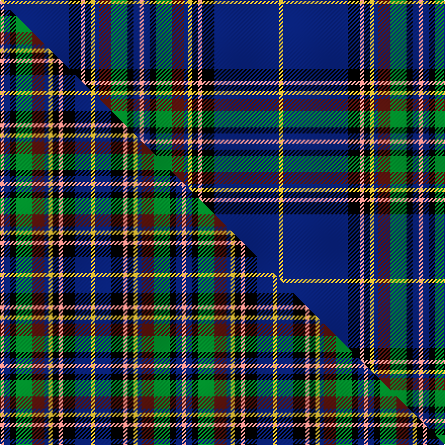

This is one **variant** — a specific cloth: this exact thread count and colourway, with its own
provenance below. It is one weaving of the [sett](/setts/lr2db3k3g8dr6db2ly2k3lr2k6db32ly2/) (the scale-free proportion — the
same cloth at any scale or shade), whose colour order is pattern [YBKGBBYKYKBY](/stripes/ybkgbbykykby/).

Part of the [Talisman](/tartans/talisman/) tartan — the named design grouping this sett with its other cloths.

Sourced from tartans-authority.  It is a [12 stripe tartan](/stripes/stripes12/).

Original link [https://www.tartanregister.gov.uk/tartanDetails.aspx?ref=5146](https://www.tartanregister.gov.uk/tartanDetails.aspx?ref=5146)

Dataset <small>— provenance for this record, inherited from the source manifest</small>

<dl class="dataset-prov">
<dt>source</dt><dd><a href="/sources/tartans-authority/">Scottish Tartans Authority</a></dd>
<dt>data captured from</dt><dd><a href="https://github.com/thetartan/tartan-database/blob/master/data/tartans-authority/data.csv">https://github.com/thetartan/tartan-database/blob/master/data/tartans-authority/data.csv</a></dd>
<dt>data date</dt><dd>1981 <small>(this record)</small></dd>
<dt>licence</dt><dd><a href="https://creativecommons.org/licenses/by-nc-nd/4.0/">CC BY-NC-ND 4.0</a></dd>
</dl>

Capture chain <small>— the hands this data passed through, oldest first; each capture carries its own licence</small>

<ol class="capture-chain">
<li><a href="https://www.tartansauthority.com/">Scottish Tartans Authority</a> <small>the heritage body's archive — its tartan-ferret record browser is retired (links repaired to the SRT, above)</small></li>
<li><a href="https://github.com/thetartan/tartan-database">thetartan/tartan-database</a> <small>2016-2017</small> · <a href="https://creativecommons.org/licenses/by-nc-nd/4.0/">CC BY-NC-ND 4.0</a> <small>Levko Kravets's frozen compilation — the capture we vendored, and where its CC licence text came from</small></li>
<li>this dictionary <small>captured 2026-06-10 · commit 5bf86c7566</small> <small>each re-capture is a git commit to data/sources</small></li>
</ol>

## Register references

External register numbers recorded for this tartan.

- Scottish Tartans Authority (ITI): 5146

## Thread count
LY/4 DB64 K12 LR4 K6 LY4 DB4 DR12 G16 K6 DB6 LR/4

One full sett is **276 threads**.

## Palette
<table><thead><tr><th>Colour</th><th>Shade</th><th>OKLCh</th></tr></thead><tbody><tr><td>DB</td><td><code style="background-color:#082077;">#082077</code> <small style="color:#888">#082077</small></td><td><small style="color:#888">oklch(30.0% 0.149 265.1)</small></td></tr><tr><td>DR</td><td><code style="background-color:#55120C;">#55120C</code> <small style="color:#888">#55120C</small></td><td><small style="color:#888">oklch(30.0% 0.099 29.3)</small></td></tr><tr><td>LY</td><td><code style="background-color:#DCBC32;">#DCBC32</code> <small style="color:#888">#DCBC32</small></td><td><small style="color:#888">oklch(80.0% 0.150 95.2)</small></td></tr><tr><td>G</td><td><code style="background-color:#008B2A;">#008B2A</code> <small style="color:#888">#008B2A</small></td><td><small style="color:#888">oklch(55.4% 0.170 145.9)</small></td></tr><tr><td>K</td><td><code style="background-color:#000000;">#000000</code> <small style="color:#888">#000000</small></td><td><small style="color:#888">oklch(0.0% 0.000 0.0)</small></td></tr><tr><td>LR</td><td><code style="background-color:#FF9C97;">#FF9C97</code> <small style="color:#888">#FF9C97</small></td><td><small style="color:#888">oklch(79.3% 0.119 23.2)</small></td></tr></tbody></table>

# Sample pattern

## Compared to the master

This cloth is one sett of its design; the master sett (the exemplar the design is anchored on) is below for comparison.

Its **ΔTartan distance** from the master is **0.77** — the same measure the nearest-tartans table ranks by (0 is identical; a re-scale of the same cloth is near 0, a recolour or a different proportion further).

<figure class="master-compare" style="margin:0">

this sett
master sett ★

<figcaption style="color:#888;font-size:smaller">One weave of this sett against the <a href="/setts/lr2db3k3g8dr6db2ly2k3lr2k6db8ly2/">master sett ★</a>, split on the diagonal: a shared proportion runs seamlessly across it with only the shades shifting; a different proportion breaks on it.</figcaption>
</figure>

## Nearest tartan variants

The nearest existing variants by ΔTartan distance, with this cloth at the top so the swatches line up against it.

ΔTartan

Threads

Variant

Sett

—

276

<a href="/variants/s12/lr2db3k3g8dr6db2ly2k3lr2k6db32ly2~x2/">Talisman (Fashion)</a>

<a href="/ttd/edit/#slug=db40y4k3w2k3w2k3g10r6k2r4w2~x2&amp;base=lr2db3k3g8dr6db2ly2k3lr2k6db32ly2~x2" title="compare in the TTD">1.70</a>

240

<a href="/variants/s12/db40y4k3w2k3w2k3g10r6k2r4w2~x2/">MacBeth Clan Tartan</a>

<a href="/ttd/edit/#slug=db18w1db1w1db4r4k1g12dy1g1dy1g1dy1~x4&amp;base=lr2db3k3g8dr6db2ly2k3lr2k6db32ly2~x2" title="compare in the TTD">2.10</a>

300

<a href="/variants/s13/db18w1db1w1db4r4k1g12dy1g1dy1g1dy1~x4/">Roach (2015)</a>

<a href="/ttd/edit/#slug=y3db2k1db24k2db2k2db2k2g8dp2g8k1w2~x2&amp;base=lr2db3k3g8dr6db2ly2k3lr2k6db32ly2~x2" title="compare in the TTD">2.11</a>

234

<a href="/variants/s14/y3db2k1db24k2db2k2db2k2g8dp2g8k1w2~x2/">Alexander-Johnstone (Personal)</a>

<a href="/ttd/edit/#slug=r2g4k2db25g4db4y2db2w2db5g3r7k2r3w2~x2&amp;base=lr2db3k3g8dr6db2ly2k3lr2k6db32ly2~x2" title="compare in the TTD">2.11</a>

268

<a href="/variants/s15/r2g4k2db25g4db4y2db2w2db5g3r7k2r3w2~x2/">Hueg (Bavaria) Scottish Blue Thistle (Personal)</a>

<a href="/ttd/edit/#slug=dr1db15k2ly1k1t1k5dr4k1dr2w1~x4&amp;base=lr2db3k3g8dr6db2ly2k3lr2k6db32ly2~x2" title="compare in the TTD">2.16</a>

264

<a href="/variants/s11/dr1db15k2ly1k1t1k5dr4k1dr2w1~x4/">Glen Stewart</a>

<a href="/ttd/edit/#slug=db33r8k12dy2k4w4k4g12db8k4db4w2~x2&amp;base=lr2db3k3g8dr6db2ly2k3lr2k6db32ly2~x2" title="compare in the TTD">2.24</a>

318

<a href="/variants/s12/db33r8k12dy2k4w4k4g12db8k4db4w2~x2/">MacLulich</a>

<a href="/ttd/edit/#slug=db33r8k12y2k4w4k4g12db8k4db4w2~x2&amp;base=lr2db3k3g8dr6db2ly2k3lr2k6db32ly2~x2" title="compare in the TTD">2.25</a>

318

<a href="/variants/s12/db33r8k12y2k4w4k4g12db8k4db4w2~x2/">MacLulich Clan Tartan</a>

<a href="/ttd/edit/#slug=lb3k1y2k1db10k17db2lb1dy1r1~x2&amp;base=lr2db3k3g8dr6db2ly2k3lr2k6db32ly2~x2" title="compare in the TTD">2.28</a>

148

<a href="/variants/s10/lb3k1y2k1db10k17db2lb1dy1r1~x2/">Six Frigates (US)</a>

<a href="/ttd/edit/#slug=db20k3y1w1g3r3k1r2w1~x2&amp;base=lr2db3k3g8dr6db2ly2k3lr2k6db32ly2~x2" title="compare in the TTD">2.28</a>

98

<a href="/variants/s9/db20k3y1w1g3r3k1r2w1~x2/">Stewart Blue MINI Tartan</a>

<a href="/ttd/edit/#slug=db38w2db2k10g2y2g22k3r3k3r3~x2&amp;base=lr2db3k3g8dr6db2ly2k3lr2k6db32ly2~x2" title="compare in the TTD">2.31</a>

278

<a href="/variants/s11/db38w2db2k10g2y2g22k3r3k3r3~x2/">Hunnisett /Edinchip Corporate Tartan</a>

## Neighbour map

Every grey dot is one of 13621 variants placed by the first two principal components of the ΔTartan feature space (42% of its variance). Red is this tartan; blue dots are its nearest — click one to open its page.

<svg viewBox="0 0 640 380" role="img" style="max-width:100%;height:auto;border:1px solid #e0e0e0;border-radius:4px;display:block" xmlns="http://www.w3.org/2000/svg"><image href="/nn/cloud.v1.png" width="640" height="380"/><a href="/variants/s12/db40y4k3w2k3w2k3g10r6k2r4w2~x2/"><circle cx="200.1" cy="65.8" r="4" fill="#3465a4"><title>MacBeth Clan Tartan</title></circle></a><a href="/variants/s13/db18w1db1w1db4r4k1g12dy1g1dy1g1dy1~x4/"><circle cx="221.8" cy="82.3" r="4" fill="#3465a4"><title>Roach (2015)</title></circle></a><a href="/variants/s14/y3db2k1db24k2db2k2db2k2g8dp2g8k1w2~x2/"><circle cx="220.7" cy="72.9" r="4" fill="#3465a4"><title>Alexander-Johnstone (Personal)</title></circle></a><a href="/variants/s15/r2g4k2db25g4db4y2db2w2db5g3r7k2r3w2~x2/"><circle cx="196.9" cy="91.6" r="4" fill="#3465a4"><title>Hueg (Bavaria) Scottish Blue Thistle (Personal)</title></circle></a><a href="/variants/s11/dr1db15k2ly1k1t1k5dr4k1dr2w1~x4/"><circle cx="199.9" cy="101.9" r="4" fill="#3465a4"><title>Glen Stewart</title></circle></a><a href="/variants/s12/db33r8k12dy2k4w4k4g12db8k4db4w2~x2/"><circle cx="163.1" cy="103.1" r="4" fill="#3465a4"><title>MacLulich</title></circle></a><a href="/variants/s12/db33r8k12y2k4w4k4g12db8k4db4w2~x2/"><circle cx="162.1" cy="102.9" r="4" fill="#3465a4"><title>MacLulich Clan Tartan</title></circle></a><a href="/variants/s10/lb3k1y2k1db10k17db2lb1dy1r1~x2/"><circle cx="208.7" cy="90.2" r="4" fill="#3465a4"><title>Six Frigates (US)</title></circle></a><a href="/variants/s9/db20k3y1w1g3r3k1r2w1~x2/"><circle cx="260.4" cy="78.3" r="4" fill="#3465a4"><title>Stewart Blue MINI Tartan</title></circle></a><a href="/variants/s11/db38w2db2k10g2y2g22k3r3k3r3~x2/"><circle cx="185.5" cy="85.0" r="4" fill="#3465a4"><title>Hunnisett /Edinchip Corporate Tartan</title></circle></a><circle cx="217.6" cy="87.3" r="5" fill="#c00000"/><text x="320" y="376" text-anchor="middle" font-size="11" fill="#999">ground</text><text x="11" y="190" text-anchor="middle" font-size="11" fill="#999" transform="rotate(-90 11 190)">complexity</text></svg>

ID: /variants/s12/lr2db3k3g8dr6db2ly2k3lr2k6db32ly2~x2/
