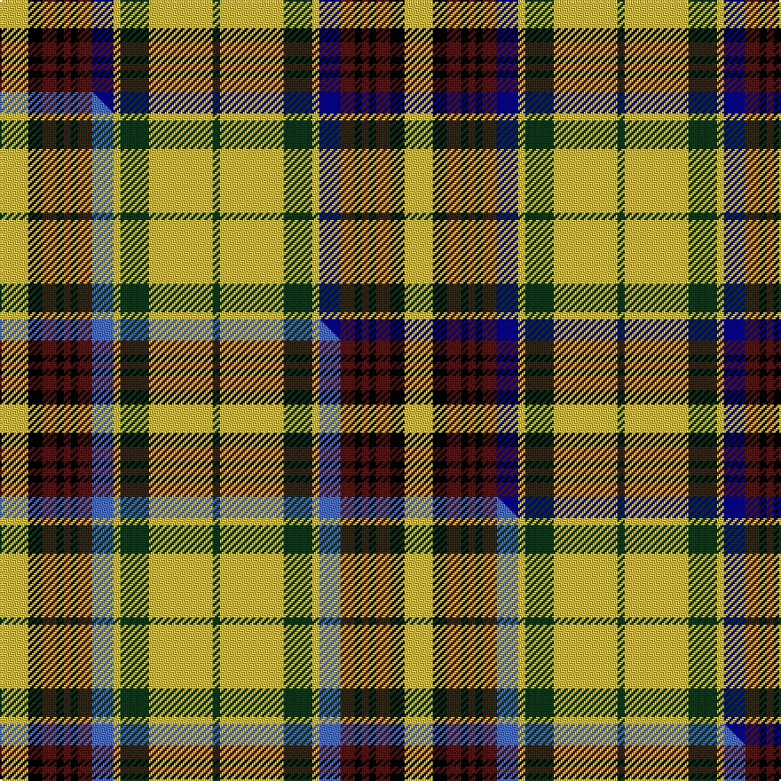

This is one **variant** — a specific cloth: this exact thread count and colourway, with its own
provenance below. It is one weaving of the [sett](/setts/ly4k2dr2k1dr1k1dr2db3ly1dg4ly9dg1/) (the scale-free proportion — the
same cloth at any scale or shade), whose colour order is pattern [GYGYBBKBKBKY](/stripes/gygybbkbkbky/).

Part of the [California Firefighters](/tartans/california-firefighters/) tartan — the named design grouping this sett with its other cloths.

Sourced from tartans-authority.  It is a [12 stripe tartan](/stripes/stripes12/).

Original link [https://www.tartanregister.gov.uk/tartanDetails.aspx?ref=3787](https://www.tartanregister.gov.uk/tartanDetails.aspx?ref=3787)

Dataset <small>— provenance for this record, inherited from the source manifest</small>

<dl class="dataset-prov">
<dt>source</dt><dd><a href="/sources/tartans-authority/">Scottish Tartans Authority</a></dd>
<dt>data captured from</dt><dd><a href="https://github.com/thetartan/tartan-database/blob/master/data/tartans-authority/data.csv">https://github.com/thetartan/tartan-database/blob/master/data/tartans-authority/data.csv</a></dd>
<dt>data date</dt><dd>1995 <small>(this record)</small></dd>
<dt>licence</dt><dd><a href="https://creativecommons.org/licenses/by-nc-nd/4.0/">CC BY-NC-ND 4.0</a></dd>
</dl>

Capture chain <small>— the hands this data passed through, oldest first; each capture carries its own licence</small>

<ol class="capture-chain">
<li><a href="https://www.tartansauthority.com/">Scottish Tartans Authority</a> <small>the heritage body's archive — its tartan-ferret record browser is retired (links repaired to the SRT, above)</small></li>
<li><a href="https://github.com/thetartan/tartan-database">thetartan/tartan-database</a> <small>2016-2017</small> · <a href="https://creativecommons.org/licenses/by-nc-nd/4.0/">CC BY-NC-ND 4.0</a> <small>Levko Kravets's frozen compilation — the capture we vendored, and where its CC licence text came from</small></li>
<li>this dictionary <small>captured 2026-06-10 · commit 5bf86c7566</small> <small>each re-capture is a git commit to data/sources</small></li>
</ol>

## Register references

External register numbers recorded for this tartan.

- Scottish Tartans Authority (ITI): 3787

## Thread count
LY/16 K8 DR8 K4 DR4 K4 DR8 DB12 LY4 DG16 LY36 DG/4

One full sett is **228 threads**.

## Palette
<table><thead><tr><th>Colour</th><th>Shade</th><th>OKLCh</th></tr></thead><tbody><tr><td>DB</td><td><code style="background-color:#00008C;">#00008C</code> <small style="color:#888">#00008C</small></td><td><small style="color:#888">oklch(28.9% 0.200 264.1)</small></td></tr><tr><td>DR</td><td><code style="background-color:#55120C;">#55120C</code> <small style="color:#888">#55120C</small></td><td><small style="color:#888">oklch(30.0% 0.099 29.3)</small></td></tr><tr><td>DG</td><td><code style="background-color:#053819;">#053819</code> <small style="color:#888">#053819</small></td><td><small style="color:#888">oklch(30.0% 0.075 151.3)</small></td></tr><tr><td>K</td><td><code style="background-color:#000000;">#000000</code> <small style="color:#888">#000000</small></td><td><small style="color:#888">oklch(0.0% 0.000 0.0)</small></td></tr><tr><td>LY</td><td><code style="background-color:#DCBC32;">#DCBC32</code> <small style="color:#888">#DCBC32</small></td><td><small style="color:#888">oklch(80.0% 0.150 95.2)</small></td></tr></tbody></table>

# Sample pattern

## Compared to the master

This cloth is one sett of its design; the master sett (the exemplar the design is anchored on) is below for comparison.

Its **ΔTartan distance** from the master is **0.06** — the same measure the nearest-tartans table ranks by (0 is identical; a re-scale of the same cloth is near 0, a recolour or a different proportion further).

<figure class="master-compare" style="margin:0">

this sett
master sett ★

<figcaption style="color:#888;font-size:smaller">One weave of this sett against the <a href="/setts/ly4k2dr2k1dr1k1dr2b3ly1dg4ly9dg1/">master sett ★</a>, split on the diagonal: a shared proportion runs seamlessly across it with only the shades shifting; a different proportion breaks on it.</figcaption>
</figure>

## Nearest tartan variants

The nearest existing variants by ΔTartan distance, with this cloth at the top so the swatches line up against it.

ΔTartan

Threads

Variant

Sett

—

228

<a href="/variants/s12/ly4k2dr2k1dr1k1dr2db3ly1dg4ly9dg1~x4~db1208266/">California Firefighters (Corporate)</a>

<a href="/ttd/edit/#slug=ly4k2dr2k1dr1k1dr2b3ly1dg4ly9dg1~x4&amp;base=ly4k2dr2k1dr1k1dr2db3ly1dg4ly9dg1~x4~db1208266" title="compare in the TTD">0.06</a>

228

<a href="/variants/s12/ly4k2dr2k1dr1k1dr2b3ly1dg4ly9dg1~x4/">California Firefighters (Corporate)</a>

<a href="/ttd/edit/#slug=o4w2o2w3o18k6g3k2g2k2g14b3~x2&amp;base=ly4k2dr2k1dr1k1dr2db3ly1dg4ly9dg1~x4~db1208266" title="compare in the TTD">1.83</a>

230

<a href="/variants/s12/o4w2o2w3o18k6g3k2g2k2g14b3~x2/">Dorcas, Check</a>

<a href="/ttd/edit/#slug=r18g4k4w4g16db4g16w4k4r5g4w4g3r5k4~x2&amp;base=ly4k2dr2k1dr1k1dr2db3ly1dg4ly9dg1~x4~db1208266" title="compare in the TTD">2.09</a>

352

<a href="/variants/s15/r18g4k4w4g16db4g16w4k4r5g4w4g3r5k4~x2/">Gayre Bodyguard (Clan)</a>

<a href="/ttd/edit/#slug=g18r18k3r3db3r3db4r3k9r4g18w6k3~x2&amp;base=ly4k2dr2k1dr1k1dr2db3ly1dg4ly9dg1~x4~db1208266" title="compare in the TTD">2.15</a>

338

<a href="/variants/s13/g18r18k3r3db3r3db4r3k9r4g18w6k3~x2/">Maguire</a>

<a href="/ttd/edit/#slug=k3lb7ly26k26w5k26ly26lb7k3r3~x2&amp;base=ly4k2dr2k1dr1k1dr2db3ly1dg4ly9dg1~x4~db1208266" title="compare in the TTD">2.24</a>

516

<a href="/variants/s10/k3lb7ly26k26w5k26ly26lb7k3r3~x2/">Cornish National</a>

<a href="/ttd/edit/#slug=g22r4g2r2g2r4g12k12r2db10r4db4y3~x2&amp;base=ly4k2dr2k1dr1k1dr2db3ly1dg4ly9dg1~x4~db1208266" title="compare in the TTD">2.29</a>

282

<a href="/variants/s13/g22r4g2r2g2r4g12k12r2db10r4db4y3~x2/">Cochrane (1974)</a>

<a href="/ttd/edit/#slug=g22r4g2r2g2r4g12k12r2db10r4db4y3&amp;base=ly4k2dr2k1dr1k1dr2db3ly1dg4ly9dg1~x4~db1208266" title="compare in the TTD">2.29</a>

141

<a href="/variants/s13/g22r4g2r2g2r4g12k12r2db10r4db4y3/">Cochrane LC</a>

<a href="/ttd/edit/#slug=o4k12b2k2b2k2b2ly16dr3ly2lr2ly4~x2&amp;base=ly4k2dr2k1dr1k1dr2db3ly1dg4ly9dg1~x4~db1208266" title="compare in the TTD">2.32</a>

196

<a href="/variants/s12/o4k12b2k2b2k2b2ly16dr3ly2lr2ly4~x2/">Cailean #2 (Fashion)</a>

<a href="/ttd/edit/#slug=dy4k12db2k2db2k2db2ly16dr3ly2w2ly4~x2&amp;base=ly4k2dr2k1dr1k1dr2db3ly1dg4ly9dg1~x4~db1208266" title="compare in the TTD">2.36</a>

196

<a href="/variants/s12/dy4k12db2k2db2k2db2ly16dr3ly2w2ly4~x2/">Cailean (Pendleton)</a>

<a href="/ttd/edit/#slug=ri20g4k4lr4g16ri4g16lr4k4r6g4lr4g3ri6k4~x2~ri2109032-lr3200000&amp;base=ly4k2dr2k1dr1k1dr2db3ly1dg4ly9dg1~x4~db1208266" title="compare in the TTD">2.38</a>

364

<a href="/variants/s15/ri20g4k4lb4g16ri4g16lb4k4r6g4lb4g3ri6k4~x2~ri2109032-lb3200000/">Gayre (Clan)</a>

## Neighbour map

Every grey dot is one of 13621 variants placed by the first two principal components of the ΔTartan feature space (42% of its variance). Red is this tartan; blue dots are its nearest — click one to open its page.

<svg viewBox="0 0 640 380" role="img" style="max-width:100%;height:auto;border:1px solid #e0e0e0;border-radius:4px;display:block" xmlns="http://www.w3.org/2000/svg"><image href="/nn/cloud.v1.png" width="640" height="380"/><a href="/variants/s12/ly4k2dr2k1dr1k1dr2b3ly1dg4ly9dg1~x4/"><circle cx="135.8" cy="152.8" r="4" fill="#3465a4"><title>California Firefighters (Corporate)</title></circle></a><a href="/variants/s12/o4w2o2w3o18k6g3k2g2k2g14b3~x2/"><circle cx="137.6" cy="146.4" r="4" fill="#3465a4"><title>Dorcas, Check</title></circle></a><a href="/variants/s15/r18g4k4w4g16db4g16w4k4r5g4w4g3r5k4~x2/"><circle cx="112.0" cy="165.4" r="4" fill="#3465a4"><title>Gayre Bodyguard (Clan)</title></circle></a><a href="/variants/s13/g18r18k3r3db3r3db4r3k9r4g18w6k3~x2/"><circle cx="100.5" cy="164.8" r="4" fill="#3465a4"><title>Maguire</title></circle></a><a href="/variants/s10/k3lb7ly26k26w5k26ly26lb7k3r3~x2/"><circle cx="139.0" cy="157.4" r="4" fill="#3465a4"><title>Cornish National</title></circle></a><a href="/variants/s13/g22r4g2r2g2r4g12k12r2db10r4db4y3~x2/"><circle cx="161.4" cy="142.5" r="4" fill="#3465a4"><title>Cochrane (1974)</title></circle></a><a href="/variants/s13/g22r4g2r2g2r4g12k12r2db10r4db4y3/"><circle cx="161.4" cy="142.5" r="4" fill="#3465a4"><title>Cochrane LC</title></circle></a><a href="/variants/s12/o4k12b2k2b2k2b2ly16dr3ly2lr2ly4~x2/"><circle cx="103.3" cy="126.4" r="4" fill="#3465a4"><title>Cailean #2 (Fashion)</title></circle></a><a href="/variants/s12/dy4k12db2k2db2k2db2ly16dr3ly2w2ly4~x2/"><circle cx="104.6" cy="128.6" r="4" fill="#3465a4"><title>Cailean (Pendleton)</title></circle></a><a href="/variants/s15/ri20g4k4lb4g16ri4g16lb4k4r6g4lb4g3ri6k4~x2~ri2109032-lb3200000/"><circle cx="123.6" cy="164.5" r="4" fill="#3465a4"><title>Gayre (Clan)</title></circle></a><circle cx="133.5" cy="151.9" r="5" fill="#c00000"/><text x="320" y="376" text-anchor="middle" font-size="11" fill="#999">ground</text><text x="11" y="190" text-anchor="middle" font-size="11" fill="#999" transform="rotate(-90 11 190)">complexity</text></svg>

ID: /variants/s12/ly4k2dr2k1dr1k1dr2db3ly1dg4ly9dg1~x4~db1208266/
