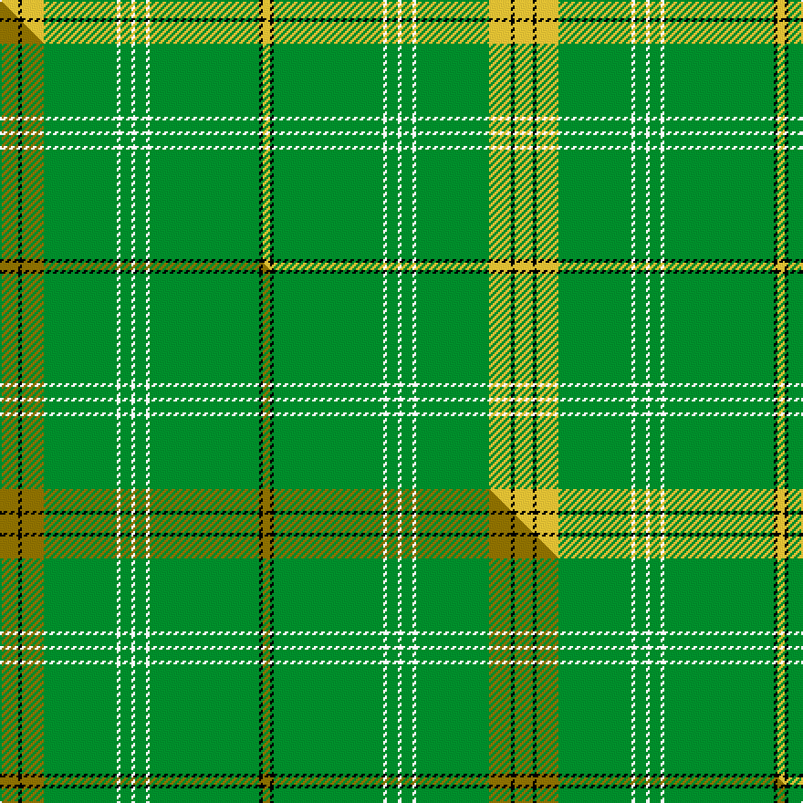

This page is one **sett** — a single exact thread-count. It belongs to the [tartan](/setts/ly5k1ly6g20w1g3w1g3w1g30k1ly2/)
(the same proportion at any scale), whose colour order is pattern [YKGWGWGWGYKY](/stripes/ykgwgwgwgyky/).

Part of the [Delta Lambda Phi](/tartans/delta-lambda-phi/) tartan — the named design grouping this sett with its other cloths.

Sourced from tartans-authority.  It is a [12 stripe tartan](/stripes/stripes12/).

Original link http://www.tartansauthority.com/tartan-ferret/display/10511/

## Register references

External register numbers recorded for this tartan.

- Scottish Register of Tartans: [10511](https://www.tartanregister.gov.uk/tartanDetails?ref=10511)
- Scottish Tartans Authority (ITI): 10511

## Thread count
LY/10 K2 LY12 G40 W2 G6 W2 G6 W2 G60 K2 LY/4

One full sett is **282 threads**.

## Palette
<table><thead><tr><th>Colour</th><th>Shade</th><th>OKLCh</th></tr></thead><tbody><tr><td>LY</td><td><code style="background-color:#DCBC32;">#DCBC32</code> <small style="color:#888">#DCBC32</small></td><td><small style="color:#888">oklch(80.0% 0.150 95.2)</small></td></tr><tr><td>G</td><td><code style="background-color:#008B2A;">#008B2A</code> <small style="color:#888">#008B2A</small></td><td><small style="color:#888">oklch(55.4% 0.170 145.9)</small></td></tr><tr><td>K</td><td><code style="background-color:#000000;">#000000</code> <small style="color:#888">#000000</small></td><td><small style="color:#888">oklch(0.0% 0.000 0.0)</small></td></tr><tr><td>W</td><td><code style="background-color:#F7F7F7;">#F7F7F7</code> <small style="color:#888">#F7F7F7</small></td><td><small style="color:#888">oklch(97.6% 0.000 89.9)</small></td></tr></tbody></table>

# Sample pattern

## Compared to the master

This cloth is one sett of its design; the master sett (the exemplar the design is anchored on) is below for comparison.

Its **ΔTartan distance** from the master is **0.09** — the same measure the nearest-tartans table ranks by (0 is identical; a re-scale of the same cloth is near 0, a recolour or a different proportion further).

<figure class="master-compare" style="margin:0">

this sett
master sett ★

<figcaption style="color:#888;font-size:smaller">One weave of this sett against the <a href="/setts/y5k1y6g20w1g3w1g3w1g30k1y2/">master sett ★</a>, split on the diagonal: a shared proportion runs seamlessly across it with only the shades shifting; a different proportion breaks on it.</figcaption>
</figure>

## Nearest tartan variants

The nearest existing variants by ΔTartan distance, with this cloth at the top so the swatches line up against it.

ΔTartan

Threads

Variant

Sett

—

282

<a href="/variants/s12/ly5k1ly6g20w1g3w1g3w1g30k1ly2~x2/">Delta Lambda Phi (Corporate)</a>

<a href="/ttd/edit/#slug=y5k1y6g20w1g3w1g3w1g30k1y2~x2&amp;base=ly5k1ly6g20w1g3w1g3w1g30k1ly2~x2" title="compare in the TTD">0.09</a>

282

<a href="/variants/s12/y5k1y6g20w1g3w1g3w1g30k1y2~x2/">Delta Lambda Phi</a>

<a href="/ttd/edit/#slug=g11dg6g6w1dg2w1g6dg6g36k1lo3k1g5dg5~x2&amp;base=ly5k1ly6g20w1g3w1g3w1g30k1ly2~x2" title="compare in the TTD">2.99</a>

328

<a href="/variants/s14/g11dg6g6w1dg2w1g6dg6g36k1lo3k1g5dg5~x2/">Wexford Irish County Tartan</a>

<a href="/ttd/edit/#slug=g11dg6g6w1k2w1g6dg6g36k1ly3k1g5dg5~x2&amp;base=ly5k1ly6g20w1g3w1g3w1g30k1ly2~x2" title="compare in the TTD">3.10</a>

328

<a href="/variants/s14/g11dg6g6w1k2w1g6dg6g36k1ly3k1g5dg5~x2/">Wexford, County</a>

<a href="/ttd/edit/#slug=g25w1dg2w1g6k2w2dg3~x2&amp;base=ly5k1ly6g20w1g3w1g3w1g30k1ly2~x2" title="compare in the TTD">3.11</a>

112

<a href="/variants/s8/g25w1dg2w1g6k2w2dg3~x2/">Marshall University</a>

<a href="/ttd/edit/#slug=r2g24k2g12y6k1r2~x2&amp;base=ly5k1ly6g20w1g3w1g3w1g30k1ly2~x2" title="compare in the TTD">3.56</a>

188

<a href="/variants/s7/r2g24k2g12y6k1r2~x2/">Inman (2016)</a>

<a href="/ttd/edit/#slug=g3db1g2dt1g3r3g2r2g18db2~x2~dt1003246-r2109032&amp;base=ly5k1ly6g20w1g3w1g3w1g30k1ly2~x2" title="compare in the TTD">3.61</a>

138

<a href="/variants/s10/g3db1g2dbi1g3r3g2r2g18db2~x2~dbi1003246-r2109032/">Owen (Welsh Name)</a>

<a href="/ttd/edit/#slug=g72k8g4dy16g7n2~x2&amp;base=ly5k1ly6g20w1g3w1g3w1g30k1ly2~x2" title="compare in the TTD">3.76</a>

288

<a href="/variants/s6/g72k8g4dy16g7n2~x2/">MacAndrew Hunting (Name)</a>

<a href="/ttd/edit/#slug=b4g44dg5w2dg2g2dg2r2g3b3~x2~g2508144-dg1304144&amp;base=ly5k1ly6g20w1g3w1g3w1g30k1ly2~x2" title="compare in the TTD">3.90</a>

262

<a href="/variants/s10/b4g44dg5w2dg2g2dg2r2g3b3~x2~g2508144-dg1304144/">Oxford University dress</a>

<a href="/ttd/edit/#slug=y2k1g36k1r2k1r2k1g36k1lb2~x2&amp;base=ly5k1ly6g20w1g3w1g3w1g30k1ly2~x2" title="compare in the TTD">3.92</a>

332

<a href="/variants/s11/y2k1g36k1r2k1r2k1g36k1lb2~x2/">Unidentified #12</a>

## Neighbour map

Every grey dot is one of 13620 variants placed by the first two principal components of the ΔTartan feature space (42% of its variance). Red is this tartan; blue dots are its nearest — click one to open its page.

<svg viewBox="0 0 640 380" role="img" style="max-width:100%;height:auto;border:1px solid #e0e0e0;border-radius:4px;display:block" xmlns="http://www.w3.org/2000/svg"><image href="/nn/cloud.v1.png" width="640" height="380"/><a href="/variants/s12/y5k1y6g20w1g3w1g3w1g30k1y2~x2/"><circle cx="525.9" cy="125.4" r="4" fill="#3465a4"><title>Delta Lambda Phi</title></circle></a><a href="/variants/s14/g11dg6g6w1dg2w1g6dg6g36k1lo3k1g5dg5~x2/"><circle cx="434.7" cy="89.7" r="4" fill="#3465a4"><title>Wexford Irish County Tartan</title></circle></a><a href="/variants/s14/g11dg6g6w1k2w1g6dg6g36k1ly3k1g5dg5~x2/"><circle cx="418.9" cy="85.5" r="4" fill="#3465a4"><title>Wexford, County</title></circle></a><a href="/variants/s8/g25w1dg2w1g6k2w2dg3~x2/"><circle cx="435.9" cy="121.4" r="4" fill="#3465a4"><title>Marshall University</title></circle></a><a href="/variants/s7/r2g24k2g12y6k1r2~x2/"><circle cx="454.7" cy="153.8" r="4" fill="#3465a4"><title>Inman (2016)</title></circle></a><a href="/variants/s10/g3db1g2dbi1g3r3g2r2g18db2~x2~dbi1003246-r2109032/"><circle cx="491.4" cy="154.0" r="4" fill="#3465a4"><title>Owen (Welsh Name)</title></circle></a><a href="/variants/s6/g72k8g4dy16g7n2~x2/"><circle cx="493.2" cy="129.5" r="4" fill="#3465a4"><title>MacAndrew Hunting (Name)</title></circle></a><a href="/variants/s10/b4g44dg5w2dg2g2dg2r2g3b3~x2~g2508144-dg1304144/"><circle cx="457.4" cy="115.2" r="4" fill="#3465a4"><title>Oxford University dress</title></circle></a><a href="/variants/s11/y2k1g36k1r2k1r2k1g36k1lb2~x2/"><circle cx="543.2" cy="72.5" r="4" fill="#3465a4"><title>Unidentified #12</title></circle></a><circle cx="480.2" cy="110.0" r="5" fill="#c00000"/><text x="320" y="376" text-anchor="middle" font-size="11" fill="#999">ground</text><text x="11" y="190" text-anchor="middle" font-size="11" fill="#999" transform="rotate(-90 11 190)">complexity</text></svg>

ID: /variants/s12/ly5k1ly6g20w1g3w1g3w1g30k1ly2~x2/
