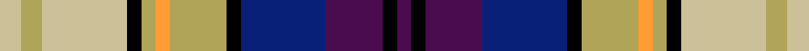

This page is one **sett** — a single exact thread-count. It belongs to the [tartan](/setts/lyi3ly3lyi12k2ly2lo2ly8k2db12dp8k2dp2/)
(the same proportion at any scale), whose colour order is pattern [BKBBKYYYKYYY](/stripes/bkbbkyyykyyy/).

Sourced from tartans-authority.  It is a [12 stripe tartan](/stripes/stripes12/).

Original link http://www.tartansauthority.com/tartan-ferret/display/7743/

2 attestations — the source records this cloth was collapsed from (oldest owns this page)

<ul>
<li>Sept. 2008 — Merise and Lars (Personal) (tartans-authority, <a href="http://www.tartansauthority.com/tartan-ferret/display/7743/">record</a>)  <em>For the wedding of Merise and Lars, based on the colours of winter.</em></li>
<li>undated — Merise and Lars (Personal) (register-of-tartans, <a href="https://www.tartanregister.gov.uk/tartanDetails.aspx?ref=5724">record</a>)  <em>For the wedding of Merise and Lars, based on the colours of winter.</em></li>
</ul>

## Register references

External register numbers recorded for this tartan.

- Scottish Register of Tartans: [5724](https://www.tartanregister.gov.uk/tartanDetails.aspx?ref=5724)
- Scottish Tartans Authority (ITI): 7743

## Thread count
LYi/6 LY6 LYi24 K4 LY4 LO4 LY16 K4 DB24 DP16 K4 DP/4

One full sett is **222 threads**.

## Palette
<table><thead><tr><th>Colour</th><th>Shade</th><th>OKLCh</th></tr></thead><tbody><tr><td>DB</td><td><code style="background-color:#082077;">#082077</code> <small style="color:#888">#082077</small></td><td><small style="color:#888">oklch(30.0% 0.149 265.1)</small></td></tr><tr><td>DBa</td><td><code style="background-color:#000000;">#000000</code> <small style="color:#888">#000000</small></td><td><small style="color:#888">oklch(0.0% 0.000 0.0)</small></td></tr><tr><td>LT</td><td><code style="background-color:#B0A458;">#B0A458</code> <small style="color:#888">#B0A458</small></td><td><small style="color:#888">oklch(71.2% 0.098 100.5)</small></td></tr><tr><td>N</td><td><code style="background-color:#CCC098;">#CCC098</code> <small style="color:#888">#CCC098</small></td><td><small style="color:#888">oklch(80.8% 0.055 93.3)</small></td></tr><tr><td>O</td><td><code style="background-color:#FF9C34;">#FF9C34</code> <small style="color:#888">#FF9C34</small></td><td><small style="color:#888">oklch(77.9% 0.161 61.8)</small></td></tr><tr><td>P</td><td><code style="background-color:#4B0B4F;">#4B0B4F</code> <small style="color:#888">#4B0B4F</small></td><td><small style="color:#888">oklch(30.1% 0.125 325.4)</small></td></tr></tbody></table>

# Sample pattern

ID: /variants/s12/lyi3ly3lyi12k2ly2lo2ly8k2db12dp8k2dp2~x2~lyi3202083-ly2804101/
