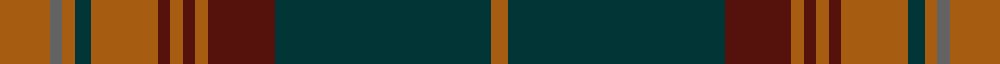

This is one **variant** — a specific cloth: this exact thread count and colourway, with its own
provenance below. It is one weaving of the [sett](/tartans/d/dr/drumbeg/) (the scale-free proportion — the
same cloth at any scale or shade), whose colour order is pattern [RBBRBRBRBRBR](/stripes/rbbrbrbrbrbr/).

Part of the [Drumbeg](/tartans/d/dr/drumbeg/) tartan — the named design grouping this sett with its other cloths.

Sourced from register-of-tartans.  It is a [12 stripe tartan](/stripes/stripes12/).

Original link [https://www.tartanregister.gov.uk/tartanDetails.aspx?ref=978](https://www.tartanregister.gov.uk/tartanDetails.aspx?ref=978)

Dataset <small>— provenance for this record, inherited from the source manifest</small>

<dl class="dataset-prov">
<dt>source</dt><dd><a href="/sources/register-of-tartans/">Scottish Register of Tartans</a></dd>
<dt>data captured from</dt><dd><a href="https://github.com/thetartan/tartan-database/blob/master/data/register-of-tartans/data.csv">https://github.com/thetartan/tartan-database/blob/master/data/register-of-tartans/data.csv</a></dd>
<dt>data date</dt><dd>1984 <small>(this record)</small></dd>
<dt>licence</dt><dd><a href="https://www.tartanregister.gov.uk/copyright">Crown copyright</a></dd>
</dl>

Capture chain <small>— the hands this data passed through, oldest first; each capture carries its own licence</small>

<ol class="capture-chain">
<li><a href="https://www.tartanregister.gov.uk/">Scottish Register of Tartans</a> · <a href="https://www.tartanregister.gov.uk/copyright">Crown copyright</a> <small>the living register — still published by National Records of Scotland</small></li>
<li><a href="https://github.com/thetartan/tartan-database">thetartan/tartan-database</a> <small>2016-2017</small> · <a href="https://creativecommons.org/licenses/by-nc-nd/4.0/">CC BY-NC-ND 4.0</a> <small>Levko Kravets's frozen compilation — the capture we vendored, and where its CC licence text came from</small></li>
<li>this dictionary <small>captured 2026-06-10 · commit 5bf86c7566</small> <small>each re-capture is a git commit to data/sources</small></li>
</ol>

## Register references

External register numbers recorded for this tartan.

- Scottish Register of Tartans: [978](https://www.tartanregister.gov.uk/tartanDetails.aspx?ref=978)
- Scottish Tartans Authority (ITI): 4712

## Thread count
O/12 N3 O3 DT4 O16 DR3 O3 DR3 O3 DR16 DT52 O/4

One full sett is **228 threads**.

## Palette
<table><thead><tr><th>Colour</th><th>Shade</th><th>OKLCh</th></tr></thead><tbody><tr><td>DT</td><td><code style="background-color:#023535;">#023535</code> <small style="color:#888">#023535</small></td><td><small style="color:#888">oklch(29.8% 0.050 194.8)</small></td></tr><tr><td>DR</td><td><code style="background-color:#55120C;">#55120C</code> <small style="color:#888">#55120C</small></td><td><small style="color:#888">oklch(30.0% 0.099 29.3)</small></td></tr><tr><td>O</td><td><code style="background-color:#A65C11;">#A65C11</code> <small style="color:#888">#A65C11</small></td><td><small style="color:#888">oklch(55.0% 0.125 58.3)</small></td></tr><tr><td>N</td><td><code style="background-color:#636363;">#636363</code> <small style="color:#888">#636363</small></td><td><small style="color:#888">oklch(50.0% 0.000 89.9)</small></td></tr></tbody></table>

# Sample pattern

## Nearest tartan variants

The nearest existing variants by ΔTartan distance, with this cloth at the top so the swatches line up against it.

ΔTartan

Threads

Variant

Sett

—

228

<a href="/variants/s12/o12n3o3dt4o16dr3o3dr3o3dr16dt52o4/">Drumbeg</a>

<a href="/ttd/edit/#slug=do12r1do2r1do2lb2do3n9r1n2r1n3~x4&amp;base=o12n3o3dt4o16dr3o3dr3o3dr16dt52o4" title="compare in the TTD">2.54</a>

252

<a href="/variants/s12/do12r1do2r1do2lb2do3n9r1n2r1n3~x4/">Shieldhall (Fashion)</a>

<a href="/ttd/edit/#slug=dr3o22do6n4do6n6do2dr1o2do3~x4~o2500000-n1900000&amp;base=o12n3o3dt4o16dr3o3dr3o3dr16dt52o4" title="compare in the TTD">2.75</a>

416

<a href="/variants/s10/dr3o22do6n4do6n6do2dr1o2do3~x4~o2500000-n1900000/">Southdown Grey</a>

<a href="/ttd/edit/#slug=g8ly2dy4dp4g3dp4dy42g4r3g4dy4dp5r3~ly3307090-dy1603076&amp;base=o12n3o3dt4o16dr3o3dr3o3dr16dt52o4" title="compare in the TTD">3.07</a>

169

<a href="/variants/s13/g8ly2dy4dp4g3dp4dy42g4r3g4dy4dp5r3~ly3307090-dy1603076/">Sarna (District)</a>

<a href="/ttd/edit/#slug=r4n4dt2n24lb1dt14n2r18n4dt3~x4&amp;base=o12n3o3dt4o16dr3o3dr3o3dr16dt52o4" title="compare in the TTD">3.17</a>

580

<a href="/variants/s10/r4n4dt2n24lb1dt14n2r18n4dt3~x4/">Marshall</a>

<a href="/ttd/edit/#slug=n66m3g3m3g16dr8g3dr3r4~x2&amp;base=o12n3o3dt4o16dr3o3dr3o3dr16dt52o4" title="compare in the TTD">3.35</a>

296

<a href="/variants/s9/n66m3g3m3g16dr8g3dr3r4~x2/">Scottish National Hunting</a>

<a href="/ttd/edit/#slug=dr3r1db1dr1dg13dr3db4lb1dr16dg2dr2r1dg3~x2&amp;base=o12n3o3dt4o16dr3o3dr3o3dr16dt52o4" title="compare in the TTD">3.42</a>

192

<a href="/variants/s13/dr3r1db1dr1dg13dr3db4lb1dr16dg2dr2r1dg3~x2/">MacDonald of Glencoe</a>

<a href="/ttd/edit/#slug=dr4y34do20y4do8y6r2y5do2y3dr4&amp;base=o12n3o3dt4o16dr3o3dr3o3dr16dt52o4" title="compare in the TTD">3.47</a>

176

<a href="/variants/s11/dr4y34do20y4do8y6r2y5do2y3dr4/">Morgan of Wales</a>

<a href="/ttd/edit/#slug=n19do2r1dr3w1dr1w1dr1do6n3dr1do3w1~x4&amp;base=o12n3o3dt4o16dr3o3dr3o3dr16dt52o4" title="compare in the TTD">3.52</a>

264

<a href="/variants/s13/n19do2r1dr3w1dr1w1dr1do6n3dr1do3w1~x4/">Leando Hunting (Personal)</a>

<a href="/ttd/edit/#slug=o8db3o3dg20o3dg3o3db6o3b3o20db3o3db2o6~x2~o1305035-dg1806142&amp;base=o12n3o3dt4o16dr3o3dr3o3dr16dt52o4" title="compare in the TTD">3.54</a>

328

<a href="/variants/s15/o8db3o3dg20o3dg3o3db6o3b3o20db3o3db2o6~x2~o1305035-dg1806142/">Glenfarclas Distillery</a>

<a href="/ttd/edit/#slug=o2dg3dy18o2dy2o21g2dg2g2dg24lo2~x2&amp;base=o12n3o3dt4o16dr3o3dr3o3dr16dt52o4" title="compare in the TTD">3.57</a>

312

<a href="/variants/s11/o2dg3dy18o2dy2o21g2dg2g2dg24lo2~x2/">Methven</a>

## Neighbour map

Every grey dot is one of 13656 variants placed by the first two principal components of the ΔTartan feature space (42% of its variance). Red is this tartan; blue dots are its nearest — click one to open its page. The map is a flat projection of a many-dimensional space — [how to read it](/posts/neighbourhood-maps/).

<svg viewBox="0 0 640 380" role="img" style="max-width:100%;height:auto;border:1px solid #e0e0e0;border-radius:4px;display:block" xmlns="http://www.w3.org/2000/svg"><image href="/nn/cloud.v1.png" width="640" height="380"/><a href="/variants/s12/do12r1do2r1do2lb2do3n9r1n2r1n3~x4/"><circle cx="348.6" cy="187.0" r="4" fill="#3465a4"><title>Shieldhall (Fashion)</title></circle></a><a href="/variants/s10/dr3o22do6n4do6n6do2dr1o2do3~x4~o2500000-n1900000/"><circle cx="344.1" cy="178.5" r="4" fill="#3465a4"><title>Southdown Grey</title></circle></a><a href="/variants/s13/g8ly2dy4dp4g3dp4dy42g4r3g4dy4dp5r3~ly3307090-dy1603076/"><circle cx="383.2" cy="123.7" r="4" fill="#3465a4"><title>Sarna (District)</title></circle></a><a href="/variants/s10/r4n4dt2n24lb1dt14n2r18n4dt3~x4/"><circle cx="348.4" cy="170.9" r="4" fill="#3465a4"><title>Marshall</title></circle></a><a href="/variants/s9/n66m3g3m3g16dr8g3dr3r4~x2/"><circle cx="341.2" cy="115.2" r="4" fill="#3465a4"><title>Scottish National Hunting</title></circle></a><a href="/variants/s13/dr3r1db1dr1dg13dr3db4lb1dr16dg2dr2r1dg3~x2/"><circle cx="388.6" cy="165.5" r="4" fill="#3465a4"><title>MacDonald of Glencoe</title></circle></a><a href="/variants/s11/dr4y34do20y4do8y6r2y5do2y3dr4/"><circle cx="428.3" cy="177.3" r="4" fill="#3465a4"><title>Morgan of Wales</title></circle></a><a href="/variants/s13/n19do2r1dr3w1dr1w1dr1do6n3dr1do3w1~x4/"><circle cx="335.1" cy="124.1" r="4" fill="#3465a4"><title>Leando Hunting (Personal)</title></circle></a><a href="/variants/s15/o8db3o3dg20o3dg3o3db6o3b3o20db3o3db2o6~x2~o1305035-dg1806142/"><circle cx="353.2" cy="184.2" r="4" fill="#3465a4"><title>Glenfarclas Distillery</title></circle></a><a href="/variants/s11/o2dg3dy18o2dy2o21g2dg2g2dg24lo2~x2/"><circle cx="277.2" cy="176.9" r="4" fill="#3465a4"><title>Methven</title></circle></a><circle cx="362.6" cy="158.0" r="5" fill="#c00000"/><text x="320" y="376" text-anchor="middle" font-size="11" fill="#999">ground</text><text x="11" y="190" text-anchor="middle" font-size="11" fill="#999" transform="rotate(-90 11 190)">complexity</text></svg>

ID: /variants/s12/o12n3o3dt4o16dr3o3dr3o3dr16dt52o4/
