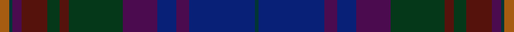

This is one **variant** — a specific cloth: this exact thread count and colourway, with its own
provenance below. It is one weaving of the [sett](/setts/o3dt1dp3dr8dg4dr3dg17dp11db6dp4db21dt1/) (the scale-free proportion — the
same cloth at any scale or shade), whose colour order is pattern [BBBBBGBGBBBR](/stripes/bbbbbgbgbbbr/).

Sourced from register-of-tartans.  It is a [12 stripe tartan](/stripes/stripes12/).

Original link [https://www.tartanregister.gov.uk/tartanDetails.aspx?ref=940](https://www.tartanregister.gov.uk/tartanDetails.aspx?ref=940)

2 attestations — the source records this cloth was collapsed from (oldest owns this page)

<ul>
<li>01/09/2006 — Doane (register-of-tartans, <a href="https://www.tartanregister.gov.uk/tartanDetails.aspx?ref=940">record</a>)  <em>A personal tartan designed by Jeffery Doane as a commemorative tartan for Frank Louis Doane and for a wedding. Can be worn by anyone of the name. No restrictions on weaver.</em></li>
<li>2006 September — Doane (Name) (tartans-authority, <a href="https://www.tartanregister.gov.uk/tartanDetails.aspx?ref=7011">record</a>)  <em>A personal tartan designed by Jeffery Doane as a commemorative tartan for Frank Louis Doane and for a wedding. Can be worn by anyone of the name. No restrictions on weaver.</em></li>
</ul>

Dataset <small>— provenance for this record, inherited from the source manifest</small>

<dl class="dataset-prov">
<dt>source</dt><dd><a href="/sources/register-of-tartans/">Scottish Register of Tartans</a></dd>
<dt>data captured from</dt><dd><a href="https://github.com/thetartan/tartan-database/blob/master/data/register-of-tartans/data.csv">https://github.com/thetartan/tartan-database/blob/master/data/register-of-tartans/data.csv</a></dd>
<dt>data date</dt><dd>01/09/2006 <small>(this record)</small></dd>
<dt>licence</dt><dd><a href="https://www.tartanregister.gov.uk/copyright">Crown copyright</a></dd>
</dl>

Capture chain <small>— the hands this data passed through, oldest first; each capture carries its own licence</small>

<ol class="capture-chain">
<li><a href="https://www.tartanregister.gov.uk/">Scottish Register of Tartans</a> · <a href="https://www.tartanregister.gov.uk/copyright">Crown copyright</a> <small>the living register — still published by National Records of Scotland</small></li>
<li><a href="https://github.com/thetartan/tartan-database">thetartan/tartan-database</a> <small>2016-2017</small> · <a href="https://creativecommons.org/licenses/by-nc-nd/4.0/">CC BY-NC-ND 4.0</a> <small>Levko Kravets's frozen compilation — the capture we vendored, and where its CC licence text came from</small></li>
<li>this dictionary <small>captured 2026-06-10 · commit 5bf86c7566</small> <small>each re-capture is a git commit to data/sources</small></li>
</ol>

## Register references

External register numbers recorded for this tartan.

- Scottish Register of Tartans: [940](https://www.tartanregister.gov.uk/tartanDetails.aspx?ref=940)
- Scottish Tartans Authority (ITI): 7011

## Thread count
O/6 DT2 DP6 DR16 DG8 DR6 DG34 DP22 DB12 DP8 DB42 DT/2

One full sett is **320 threads**.

## Palette
<table><thead><tr><th>Colour</th><th>Shade</th><th>OKLCh</th></tr></thead><tbody><tr><td>DB</td><td><code style="background-color:#082077;">#082077</code> <small style="color:#888">#082077</small></td><td><small style="color:#888">oklch(30.0% 0.149 265.1)</small></td></tr><tr><td>DG</td><td><code style="background-color:#053819;">#053819</code> <small style="color:#888">#053819</small></td><td><small style="color:#888">oklch(30.0% 0.075 151.3)</small></td></tr><tr><td>DR</td><td><code style="background-color:#55120C;">#55120C</code> <small style="color:#888">#55120C</small></td><td><small style="color:#888">oklch(30.0% 0.099 29.3)</small></td></tr><tr><td>DT</td><td><code style="background-color:#023535;">#023535</code> <small style="color:#888">#023535</small></td><td><small style="color:#888">oklch(29.8% 0.050 194.8)</small></td></tr><tr><td>DP</td><td><code style="background-color:#4B0B4F;">#4B0B4F</code> <small style="color:#888">#4B0B4F</small></td><td><small style="color:#888">oklch(30.1% 0.125 325.4)</small></td></tr><tr><td>O</td><td><code style="background-color:#A65C11;">#A65C11</code> <small style="color:#888">#A65C11</small></td><td><small style="color:#888">oklch(55.0% 0.125 58.3)</small></td></tr></tbody></table>

# Sample pattern

## Nearest tartan variants

The nearest existing variants by ΔTartan distance, with this cloth at the top so the swatches line up against it.

ΔTartan

Threads

Variant

Sett

—

320

<a href="/variants/s12/o3dt1dp3dr8dg4dr3dg17dp11db6dp4db21dt1~x2/">Doane</a>

<a href="/ttd/edit/#slug=dy1dr5dp1dg2dr1dg12dp1dg2dp6db5b1~x4&amp;base=o3dt1dp3dr8dg4dr3dg17dp11db6dp4db21dt1~x2" title="compare in the TTD">3.94</a>

288

<a href="/variants/s11/dy1dr5dp1dg2dr1dg12dp1dg2dp6db5b1~x4/">Telfer, Jamie of the Fair Dodhead</a>

## Neighbour map

Every grey dot is one of 13621 variants placed by the first two principal components of the ΔTartan feature space (42% of its variance). Red is this tartan; blue dots are its nearest — click one to open its page.

<svg viewBox="0 0 640 380" role="img" style="max-width:100%;height:auto;border:1px solid #e0e0e0;border-radius:4px;display:block" xmlns="http://www.w3.org/2000/svg"><image href="/nn/cloud.v1.png" width="640" height="380"/><a href="/variants/s11/dy1dr5dp1dg2dr1dg12dp1dg2dp6db5b1~x4/"><circle cx="370.6" cy="217.3" r="4" fill="#3465a4"><title>Telfer, Jamie of the Fair Dodhead</title></circle></a><circle cx="305.1" cy="183.8" r="5" fill="#c00000"/><text x="320" y="376" text-anchor="middle" font-size="11" fill="#999">ground</text><text x="11" y="190" text-anchor="middle" font-size="11" fill="#999" transform="rotate(-90 11 190)">complexity</text></svg>

ID: /variants/s12/o3dt1dp3dr8dg4dr3dg17dp11db6dp4db21dt1~x2/
