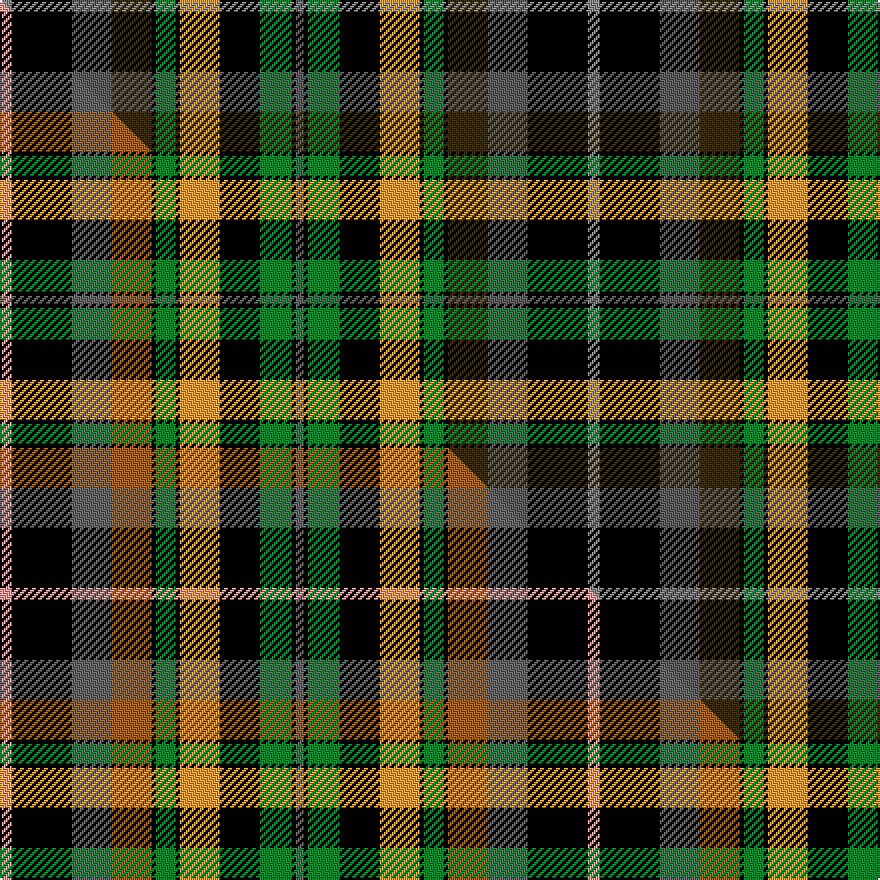

This is one **variant** — a specific cloth: this exact thread count and colourway, with its own
provenance below. It is one weaving of the [sett](/setts/o3k15n10dy10k1g5k1lo10k10g8k1n2/) (the scale-free proportion — the
same cloth at any scale or shade), whose colour order is pattern [BKGKYKGKGBKR](/stripes/bkgkykgkgbkr/).

Part of the [Castlefield](/tartans/c/ca/castlefield/) tartan — the named design grouping this sett with its other cloths.

Sourced from tartans-authority.  It is a [12 stripe tartan](/stripes/stripes12/).

Original link [https://www.tartanregister.gov.uk/tartanDetails.aspx?ref=10154](https://www.tartanregister.gov.uk/tartanDetails.aspx?ref=10154)

Dataset <small>— provenance for this record, inherited from the source manifest</small>

<dl class="dataset-prov">
<dt>source</dt><dd><a href="/sources/tartans-authority/">Scottish Tartans Authority</a></dd>
<dt>data captured from</dt><dd><a href="https://github.com/thetartan/tartan-database/blob/master/data/tartans-authority/data.csv">https://github.com/thetartan/tartan-database/blob/master/data/tartans-authority/data.csv</a></dd>
<dt>data date</dt><dd>26th Jan. 2010 <small>(this record)</small></dd>
<dt>licence</dt><dd><a href="https://creativecommons.org/licenses/by-nc-nd/4.0/">CC BY-NC-ND 4.0</a></dd>
</dl>

Capture chain <small>— the hands this data passed through, oldest first; each capture carries its own licence</small>

<ol class="capture-chain">
<li><a href="https://www.tartansauthority.com/">Scottish Tartans Authority</a> <small>the heritage body's archive — its tartan-ferret record browser is retired (links repaired to the SRT, above)</small></li>
<li><a href="https://github.com/thetartan/tartan-database">thetartan/tartan-database</a> <small>2016-2017</small> · <a href="https://creativecommons.org/licenses/by-nc-nd/4.0/">CC BY-NC-ND 4.0</a> <small>Levko Kravets's frozen compilation — the capture we vendored, and where its CC licence text came from</small></li>
<li>this dictionary <small>captured 2026-06-10 · commit 5bf86c7566</small> <small>each re-capture is a git commit to data/sources</small></li>
</ol>

## Register references

External register numbers recorded for this tartan.

- Scottish Register of Tartans: [10154](https://www.tartanregister.gov.uk/tartanDetails?ref=10154)
- Scottish Tartans Authority (ITI): 10154

## Thread count
O/6 K30 N20 DY20 K2 G10 K2 LO20 K20 G16 K2 N/4

One full sett is **294 threads**.

## Palette
<table><thead><tr><th>Colour</th><th>Shade</th><th>OKLCh</th></tr></thead><tbody><tr><td>G</td><td><code style="background-color:#008B2A;">#008B2A</code> <small style="color:#888">#008B2A</small></td><td><small style="color:#888">oklch(55.4% 0.170 145.9)</small></td></tr><tr><td>K</td><td><code style="background-color:#000000;">#000000</code> <small style="color:#888">#000000</small></td><td><small style="color:#888">oklch(0.0% 0.000 0.0)</small></td></tr><tr><td>N</td><td><code style="background-color:#5C5C5C;">#5C5C5C</code> <small style="color:#888">#5C5C5C</small></td><td><small style="color:#888">oklch(47.5% 0.000 89.9)</small></td></tr><tr><td>O</td><td><code style="background-color:#888888;">#888888</code> <small style="color:#888">#888888</small></td><td><small style="color:#888">oklch(62.7% 0.000 89.9)</small></td></tr><tr><td>LO</td><td><code style="background-color:#FF9C34;">#FF9C34</code> <small style="color:#888">#FF9C34</small></td><td><small style="color:#888">oklch(77.9% 0.161 61.8)</small></td></tr><tr><td>DY</td><td><code style="background-color:#3A2B0D;">#3A2B0D</code> <small style="color:#888">#3A2B0D</small></td><td><small style="color:#888">oklch(30.0% 0.049 82.0)</small></td></tr></tbody></table>

# Sample pattern

## Compared to the master

This cloth is one sett of its design; the master sett (the exemplar the design is anchored on) is below for comparison.

Its **ΔTartan distance** from the master is **0.90** — the same measure the nearest-tartans table ranks by (0 is identical; a re-scale of the same cloth is near 0, a recolour or a different proportion further).

<figure class="master-compare" style="margin:0">

this sett
master sett ★

<figcaption style="color:#888;font-size:smaller">One weave of this sett against the <a href="/setts/lr3k15n10o10k1g5k1lo10k10g8k1n2/">master sett ★</a>, split on the diagonal: a shared proportion runs seamlessly across it with only the shades shifting; a different proportion breaks on it.</figcaption>
</figure>

## Nearest tartan variants

The nearest existing variants by ΔTartan distance, with this cloth at the top so the swatches line up against it.

ΔTartan

Threads

Variant

Sett

—

294

<a href="/variants/s12/o3k15n10dy10k1g5k1lo10k10g8k1n2~x2~o2500000-n1900000/">Castlefield (Personal)</a>

<a href="/ttd/edit/#slug=lr3k15n10o10k1g5k1lo10k10g8k1n2~x2&amp;base=o3k15n10dy10k1g5k1lo10k10g8k1n2~x2~o2500000-n1900000" title="compare in the TTD">0.90</a>

294

<a href="/variants/s12/lr3k15n10o10k1g5k1lo10k10g8k1n2~x2/">Castlefield (Personal)</a>

<a href="/ttd/edit/#slug=dy5k2t6w1t6k2dy7k16g7k2dr4g2dr4k2g4~x2&amp;base=o3k15n10dy10k1g5k1lo10k10g8k1n2~x2~o2500000-n1900000" title="compare in the TTD">1.88</a>

262

<a href="/variants/s15/dy5k2t6w1t6k2dy7k16g7k2dr4g2dr4k2g4~x2/">Redgate Hunting #2 (Name)</a>

<a href="/ttd/edit/#slug=dy5k2db6w1db6k2dy7k16g7k2r4g2r4k2g4~x2&amp;base=o3k15n10dy10k1g5k1lo10k10g8k1n2~x2~o2500000-n1900000" title="compare in the TTD">2.06</a>

262

<a href="/variants/s15/dy5k2db6w1db6k2dy7k16g7k2r4g2r4k2g4~x2/">Redgate (Connecticut) Hunting #2</a>

<a href="/ttd/edit/#slug=lr3k15db10o10k1g5k1y10k10g8k1db2~x2&amp;base=o3k15n10dy10k1g5k1lo10k10g8k1n2~x2~o2500000-n1900000" title="compare in the TTD">2.09</a>

294

<a href="/variants/s12/lr3k15db10o10k1g5k1y10k10g8k1db2~x2/">Blue Castlefield</a>

<a href="/ttd/edit/#slug=r2k2o6k10w2k14db8g15w2g7r5g1lo2~x2&amp;base=o3k15n10dy10k1g5k1lo10k10g8k1n2~x2~o2500000-n1900000" title="compare in the TTD">2.10</a>

296

<a href="/variants/s13/r2k2o6k10w2k14db8g15w2g7r5g1lo2~x2/">Nashotah House</a>

<a href="/ttd/edit/#slug=ly4dy3dg2k6g4w1dg12k10g2dg3~x2&amp;base=o3k15n10dy10k1g5k1lo10k10g8k1n2~x2~o2500000-n1900000" title="compare in the TTD">2.18</a>

174

<a href="/variants/s10/ly4dy3dg2k6g4w1dg12k10g2dg3~x2/">Noble (South Africa) (Personal)</a>

<a href="/ttd/edit/#slug=db2k2db8k8g12k1w2k1g12k8r3lb3r14lb2r2~x2&amp;base=o3k15n10dy10k1g5k1lo10k10g8k1n2~x2~o2500000-n1900000" title="compare in the TTD">2.27</a>

312

<a href="/variants/s15/db2k2db8k8g12k1w2k1g12k8r3lb3r14lb2r2~x2/">Unidentified - C20th</a>

<a href="/ttd/edit/#slug=g10dr2g2dr3g11lr2k10dr2db12k1lo2dr2lo2dr2~x2&amp;base=o3k15n10dy10k1g5k1lo10k10g8k1n2~x2~o2500000-n1900000" title="compare in the TTD">2.30</a>

228

<a href="/variants/s14/g10dr2g2dr3g11lr2k10dr2db12k1lo2dr2lo2dr2~x2/">Esteba-Quer (Personal)</a>

<a href="/ttd/edit/#slug=lb3ki15k10dy10ki1dg5ki1lo10ki10dg8ki1k2~x2~ki0700000-k0504259&amp;base=o3k15n10dy10k1g5k1lo10k10g8k1n2~x2~o2500000-n1900000" title="compare in the TTD">2.33</a>

294

<a href="/variants/s12/lb3ki15k10dy10ki1dg5ki1lo10ki10dg8ki1k2~x2~ki0700000-k0504259/">Blue Castlefield (Fashion)</a>

<a href="/ttd/edit/#slug=r2k1o5k7w2k14db8g15w2g7r5g1lo2~x2&amp;base=o3k15n10dy10k1g5k1lo10k10g8k1n2~x2~o2500000-n1900000" title="compare in the TTD">2.33</a>

276

<a href="/variants/s13/r2k1o5k7w2k14db8g15w2g7r5g1lo2~x2/">Nashotah House (Commemorative)</a>

## Neighbour map

Every grey dot is one of 13656 variants placed by the first two principal components of the ΔTartan feature space (42% of its variance). Red is this tartan; blue dots are its nearest — click one to open its page. The map is a flat projection of a many-dimensional space — [how to read it](/posts/neighbourhood-maps/).

<svg viewBox="0 0 640 380" role="img" style="max-width:100%;height:auto;border:1px solid #e0e0e0;border-radius:4px;display:block" xmlns="http://www.w3.org/2000/svg"><image href="/nn/cloud.v1.png" width="640" height="380"/><a href="/variants/s12/lr3k15n10o10k1g5k1lo10k10g8k1n2~x2/"><circle cx="76.0" cy="129.7" r="4" fill="#3465a4"><title>Castlefield (Personal)</title></circle></a><a href="/variants/s15/dy5k2t6w1t6k2dy7k16g7k2dr4g2dr4k2g4~x2/"><circle cx="85.4" cy="123.9" r="4" fill="#3465a4"><title>Redgate Hunting #2 (Name)</title></circle></a><a href="/variants/s15/dy5k2db6w1db6k2dy7k16g7k2r4g2r4k2g4~x2/"><circle cx="82.9" cy="118.9" r="4" fill="#3465a4"><title>Redgate (Connecticut) Hunting #2</title></circle></a><a href="/variants/s12/lr3k15db10o10k1g5k1y10k10g8k1db2~x2/"><circle cx="83.5" cy="133.2" r="4" fill="#3465a4"><title>Blue Castlefield</title></circle></a><a href="/variants/s13/r2k2o6k10w2k14db8g15w2g7r5g1lo2~x2/"><circle cx="54.2" cy="107.9" r="4" fill="#3465a4"><title>Nashotah House</title></circle></a><a href="/variants/s10/ly4dy3dg2k6g4w1dg12k10g2dg3~x2/"><circle cx="103.1" cy="153.9" r="4" fill="#3465a4"><title>Noble (South Africa) (Personal)</title></circle></a><a href="/variants/s15/db2k2db8k8g12k1w2k1g12k8r3lb3r14lb2r2~x2/"><circle cx="60.4" cy="116.8" r="4" fill="#3465a4"><title>Unidentified - C20th</title></circle></a><a href="/variants/s14/g10dr2g2dr3g11lr2k10dr2db12k1lo2dr2lo2dr2~x2/"><circle cx="98.9" cy="129.3" r="4" fill="#3465a4"><title>Esteba-Quer (Personal)</title></circle></a><a href="/variants/s12/lb3ki15k10dy10ki1dg5ki1lo10ki10dg8ki1k2~x2~ki0700000-k0504259/"><circle cx="111.8" cy="141.3" r="4" fill="#3465a4"><title>Blue Castlefield (Fashion)</title></circle></a><a href="/variants/s13/r2k1o5k7w2k14db8g15w2g7r5g1lo2~x2/"><circle cx="50.1" cy="105.2" r="4" fill="#3465a4"><title>Nashotah House (Commemorative)</title></circle></a><circle cx="79.9" cy="132.1" r="5" fill="#c00000"/><text x="320" y="376" text-anchor="middle" font-size="11" fill="#999">ground</text><text x="11" y="190" text-anchor="middle" font-size="11" fill="#999" transform="rotate(-90 11 190)">complexity</text></svg>

ID: /variants/s12/o3k15n10dy10k1g5k1lo10k10g8k1n2~x2~o2500000-n1900000/
