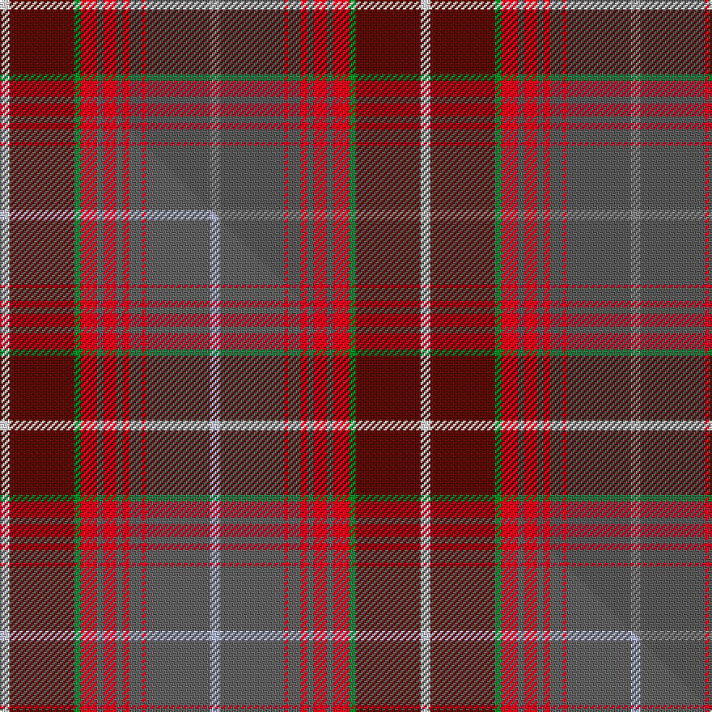

This is one **variant** — a specific cloth: this exact thread count and colourway, with its own
provenance below. It is one weaving of the [sett](/setts/o3n20r1n4r2n2r4n2r5g2dr20w3/) (the scale-free proportion — the
same cloth at any scale or shade), whose colour order is pattern [RBRBRBRBRGBW](/stripes/rbrbrbrbrgbw/).

Part of the [Ryutokukan High School](/tartans/ryutokukan-high-school/) tartan — the named design grouping this sett with its other cloths.

Sourced from tartans-authority.  It is a [12 stripe tartan](/stripes/stripes12/).

Original link [https://www.tartanregister.gov.uk/tartanDetails.aspx?ref=10646](https://www.tartanregister.gov.uk/tartanDetails.aspx?ref=10646)

Dataset <small>— provenance for this record, inherited from the source manifest</small>

<dl class="dataset-prov">
<dt>source</dt><dd><a href="/sources/tartans-authority/">Scottish Tartans Authority</a></dd>
<dt>data captured from</dt><dd><a href="https://github.com/thetartan/tartan-database/blob/master/data/tartans-authority/data.csv">https://github.com/thetartan/tartan-database/blob/master/data/tartans-authority/data.csv</a></dd>
<dt>data date</dt><dd>20/04/2012 <small>(this record)</small></dd>
<dt>licence</dt><dd><a href="https://creativecommons.org/licenses/by-nc-nd/4.0/">CC BY-NC-ND 4.0</a></dd>
</dl>

Capture chain <small>— the hands this data passed through, oldest first; each capture carries its own licence</small>

<ol class="capture-chain">
<li><a href="https://www.tartansauthority.com/">Scottish Tartans Authority</a> <small>the heritage body's archive — its tartan-ferret record browser is retired (links repaired to the SRT, above)</small></li>
<li><a href="https://github.com/thetartan/tartan-database">thetartan/tartan-database</a> <small>2016-2017</small> · <a href="https://creativecommons.org/licenses/by-nc-nd/4.0/">CC BY-NC-ND 4.0</a> <small>Levko Kravets's frozen compilation — the capture we vendored, and where its CC licence text came from</small></li>
<li>this dictionary <small>captured 2026-06-10 · commit 5bf86c7566</small> <small>each re-capture is a git commit to data/sources</small></li>
</ol>

## Register references

External register numbers recorded for this tartan.

- Scottish Register of Tartans: [10646](https://www.tartanregister.gov.uk/tartanDetails?ref=10646)
- Scottish Tartans Authority (ITI): 10646

## Thread count
W/6 DR40 G4 R10 N4 R8 N4 R4 N8 R2 N40 O/6

One full sett is **260 threads**.

## Palette
<table><thead><tr><th>Colour</th><th>Shade</th><th>OKLCh</th></tr></thead><tbody><tr><td>DR</td><td><code style="background-color:#55120C;">#55120C</code> <small style="color:#888">#55120C</small></td><td><small style="color:#888">oklch(30.0% 0.099 29.3)</small></td></tr><tr><td>G</td><td><code style="background-color:#008B2A;">#008B2A</code> <small style="color:#888">#008B2A</small></td><td><small style="color:#888">oklch(55.4% 0.170 145.9)</small></td></tr><tr><td>N</td><td><code style="background-color:#5C5C5C;">#5C5C5C</code> <small style="color:#888">#5C5C5C</small></td><td><small style="color:#888">oklch(47.5% 0.000 89.9)</small></td></tr><tr><td>O</td><td><code style="background-color:#888888;">#888888</code> <small style="color:#888">#888888</small></td><td><small style="color:#888">oklch(62.7% 0.000 89.9)</small></td></tr><tr><td>R</td><td><code style="background-color:#D60020;">#D60020</code> <small style="color:#888">#D60020</small></td><td><small style="color:#888">oklch(55.2% 0.224 25.5)</small></td></tr><tr><td>W</td><td><code style="background-color:#F7F7F7;">#F7F7F7</code> <small style="color:#888">#F7F7F7</small></td><td><small style="color:#888">oklch(97.6% 0.000 89.9)</small></td></tr></tbody></table>

# Sample pattern

## Compared to the master

This cloth is one sett of its design; the master sett (the exemplar the design is anchored on) is below for comparison.

Its **ΔTartan distance** from the master is **0.61** — the same measure the nearest-tartans table ranks by (0 is identical; a re-scale of the same cloth is near 0, a recolour or a different proportion further).

<figure class="master-compare" style="margin:0">

this sett
master sett ★

<figcaption style="color:#888;font-size:smaller">One weave of this sett against the <a href="/setts/w3dr20g2r5n2r4n2r2n4r1n20lb3/">master sett ★</a>, split on the diagonal: a shared proportion runs seamlessly across it with only the shades shifting; a different proportion breaks on it.</figcaption>
</figure>

## Nearest tartan variants

The nearest existing variants by ΔTartan distance, with this cloth at the top so the swatches line up against it.

ΔTartan

Threads

Variant

Sett

—

260

<a href="/variants/s12/o3n20r1n4r2n2r4n2r5g2dr20w3~x2~o2500000-n1900000/">Ryutokukan High School (Corporate)</a>

<a href="/ttd/edit/#slug=w3dr20g2r5n2r4n2r2n4r1n20lb3~x2&amp;base=o3n20r1n4r2n2r4n2r5g2dr20w3~x2~o2500000-n1900000" title="compare in the TTD">0.61</a>

260

<a href="/variants/s12/w3dr20g2r5n2r4n2r2n4r1n20lb3~x2/">Ryutokukan High School</a>

<a href="/ttd/edit/#slug=p1dr1p1dr6dg26mi14dr20lb1dr1lb1dr2m1~x2~p2312307-mi2506332&amp;base=o3n20r1n4r2n2r4n2r5g2dr20w3~x2~o2500000-n1900000" title="compare in the TTD">2.33</a>

296

<a href="/variants/s12/p1dr1p1dr6dg26mi14dr20lb1dr1lb1dr2m1~x2~p2312307-mi2506332/">Scobie (Blackford)</a>

<a href="/ttd/edit/#slug=o20dp2o2dp2o3dp8dg9g8r8dg1b2~x2~dp0904331-dg1104144&amp;base=o3n20r1n4r2n2r4n2r5g2dr20w3~x2~o2500000-n1900000" title="compare in the TTD">2.66</a>

216

<a href="/variants/s11/o20dp2o2dp2o3dp8dg9g8r8dg1b2~x2~dp0904331-dg1104144/">Isle of Skye</a>

<a href="/ttd/edit/#slug=ri3y1dp1ri20r2dp9r2g20dp1y1g3~x2~ri2108022-r1807033&amp;base=o3n20r1n4r2n2r4n2r5g2dr20w3~x2~o2500000-n1900000" title="compare in the TTD">2.77</a>

240

<a href="/variants/s11/ri3y1dp1ri20r2dp9r2g20dp1y1g3~x2~ri2108022-r1807033/">Scotland (Personal)</a>

<a href="/ttd/edit/#slug=r40dg2r2dp2r2g2r2dr5dg20y2dp20~x2&amp;base=o3n20r1n4r2n2r4n2r5g2dr20w3~x2~o2500000-n1900000" title="compare in the TTD">2.80</a>

276

<a href="/variants/s11/r40dg2r2dp2r2g2r2dr5dg20y2dp20~x2/">Cadden-Phillips (Personal)</a>

<a href="/ttd/edit/#slug=w2y1r3g20r1y1r3y2dy14ly2r2ly2~x2~g1903114-ly2706114&amp;base=o3n20r1n4r2n2r4n2r5g2dr20w3~x2~o2500000-n1900000" title="compare in the TTD">2.84</a>

204

<a href="/variants/s12/w2y1r3g20r1y1r3y2dy14ly2r2ly2~x2~g1903114-ly2706114/">Flodden</a>

<a href="/ttd/edit/#slug=ri6r4b2ri3g34r3b2ri4b2r3dp8lb2ri40r4b2ri6~x2~ri2008029-r1506028&amp;base=o3n20r1n4r2n2r4n2r5g2dr20w3~x2~o2500000-n1900000" title="compare in the TTD">2.85</a>

476

<a href="/variants/s16/ri6r4b2ri3g34r3b2ri4b2r3dp8lb2ri40r4b2ri6~x2~ri2008029-r1506028/">MacDougall 4</a>

<a href="/ttd/edit/#slug=lb6dg2lb2dg5dr20o2dr2o25r2o2r4g10dr2~x2&amp;base=o3n20r1n4r2n2r4n2r5g2dr20w3~x2~o2500000-n1900000" title="compare in the TTD">2.89</a>

320

<a href="/variants/s13/lb6dg2lb2dg5dr20o2dr2o25r2o2r4g10dr2~x2/">Strathtay</a>

<a href="/ttd/edit/#slug=db1g2db1g3dg6db1g6db2lo5r13dy23lo1dy1lo1dy2lo1~x2~g1903114-dg1806142&amp;base=o3n20r1n4r2n2r4n2r5g2dr20w3~x2~o2500000-n1900000" title="compare in the TTD">2.94</a>

272

<a href="/variants/s16/db1g2db1g3dg6db1g6db2lo5r13dy23lo1dy1lo1dy2lo1~x2~g1903114-dg1806142/">Langermann (Name)</a>

<a href="/ttd/edit/#slug=g9y2g6r35db6lb1dr20db5lb2~x2~r2109032-db1004274&amp;base=o3n20r1n4r2n2r4n2r5g2dr20w3~x2~o2500000-n1900000" title="compare in the TTD">3.02</a>

322

<a href="/variants/s9/g9y2g6r35db6lb1dr20db5lb2~x2~r2109032-db1004274/">Telfer Name Tartan</a>

## Neighbour map

Every grey dot is one of 13621 variants placed by the first two principal components of the ΔTartan feature space (42% of its variance). Red is this tartan; blue dots are its nearest — click one to open its page.

<svg viewBox="0 0 640 380" role="img" style="max-width:100%;height:auto;border:1px solid #e0e0e0;border-radius:4px;display:block" xmlns="http://www.w3.org/2000/svg"><image href="/nn/cloud.v1.png" width="640" height="380"/><a href="/variants/s12/w3dr20g2r5n2r4n2r2n4r1n20lb3~x2/"><circle cx="246.5" cy="120.5" r="4" fill="#3465a4"><title>Ryutokukan High School</title></circle></a><a href="/variants/s12/p1dr1p1dr6dg26mi14dr20lb1dr1lb1dr2m1~x2~p2312307-mi2506332/"><circle cx="271.3" cy="101.2" r="4" fill="#3465a4"><title>Scobie (Blackford)</title></circle></a><a href="/variants/s11/o20dp2o2dp2o3dp8dg9g8r8dg1b2~x2~dp0904331-dg1104144/"><circle cx="199.8" cy="140.4" r="4" fill="#3465a4"><title>Isle of Skye</title></circle></a><a href="/variants/s11/ri3y1dp1ri20r2dp9r2g20dp1y1g3~x2~ri2108022-r1807033/"><circle cx="250.5" cy="129.7" r="4" fill="#3465a4"><title>Scotland (Personal)</title></circle></a><a href="/variants/s11/r40dg2r2dp2r2g2r2dr5dg20y2dp20~x2/"><circle cx="285.4" cy="106.3" r="4" fill="#3465a4"><title>Cadden-Phillips (Personal)</title></circle></a><a href="/variants/s12/w2y1r3g20r1y1r3y2dy14ly2r2ly2~x2~g1903114-ly2706114/"><circle cx="244.0" cy="120.7" r="4" fill="#3465a4"><title>Flodden</title></circle></a><a href="/variants/s16/ri6r4b2ri3g34r3b2ri4b2r3dp8lb2ri40r4b2ri6~x2~ri2008029-r1506028/"><circle cx="281.5" cy="89.3" r="4" fill="#3465a4"><title>MacDougall 4</title></circle></a><a href="/variants/s13/lb6dg2lb2dg5dr20o2dr2o25r2o2r4g10dr2~x2/"><circle cx="185.4" cy="136.3" r="4" fill="#3465a4"><title>Strathtay</title></circle></a><a href="/variants/s16/db1g2db1g3dg6db1g6db2lo5r13dy23lo1dy1lo1dy2lo1~x2~g1903114-dg1806142/"><circle cx="211.4" cy="93.9" r="4" fill="#3465a4"><title>Langermann (Name)</title></circle></a><a href="/variants/s9/g9y2g6r35db6lb1dr20db5lb2~x2~r2109032-db1004274/"><circle cx="250.4" cy="108.5" r="4" fill="#3465a4"><title>Telfer Name Tartan</title></circle></a><circle cx="260.4" cy="125.3" r="5" fill="#c00000"/><text x="320" y="376" text-anchor="middle" font-size="11" fill="#999">ground</text><text x="11" y="190" text-anchor="middle" font-size="11" fill="#999" transform="rotate(-90 11 190)">complexity</text></svg>

ID: /variants/s12/o3n20r1n4r2n2r4n2r5g2dr20w3~x2~o2500000-n1900000/
