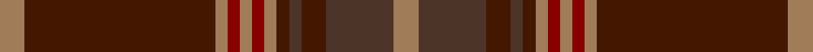

This page is one **sett** — a single exact thread-count. It belongs to the [tartan](/setts/o4do31o2r2o2r2o2do2doi2do4doi11o4/)
(the same proportion at any scale), whose colour order is pattern [RBBBBRRRRRBR](/stripes/rbbbbrrrrrbr/).

Sourced from register-of-tartans.  It is a [12 stripe tartan](/stripes/stripes12/).

Original link https://www.tartanregister.gov.uk/tartanDetails.aspx?ref=234

## Register references

External register numbers recorded for this tartan.

- Scottish Register of Tartans: [234](https://www.tartanregister.gov.uk/tartanDetails.aspx?ref=234)
- Scottish Tartans Authority (ITI): 4098

## Thread count
LT/4 DR31 LT2 DRa2 LT2 DRa2 LT2 DR2 T2 DR4 T11 LT/4

One full sett is **128 threads**.

## Palette

Palette: <strong>Tartan Register</strong>
<table><thead><tr><th>Colour</th><th>Threads</th><th>Shade</th><th>Base</th><th>OKLCh</th></tr></thead><tbody><tr><td>LT/</td><td style="text-align:right;font-variant-numeric:tabular-nums">4</td><td><code style="background-color:#A07C58;">#A07C58</code> <small style="color:#888">#A07C58</small></td><td>R <code style="background-color:#CC0000;">#CC0000</code></td><td><small style="color:#888">oklch(61.2% 0.067 66.0)</small></td></tr><tr><td>DR</td><td style="text-align:right;font-variant-numeric:tabular-nums">31</td><td><code style="background-color:#441800;">#441800</code> <small style="color:#888">#441800</small></td><td>B <code style="background-color:#2A418A;">#2A418A</code></td><td><small style="color:#888">oklch(27.3% 0.076 46.3)</small></td></tr><tr><td>LT</td><td style="text-align:right;font-variant-numeric:tabular-nums">2</td><td><code style="background-color:#A07C58;">#A07C58</code> <small style="color:#888">#A07C58</small></td><td>R <code style="background-color:#CC0000;">#CC0000</code></td><td><small style="color:#888">oklch(61.2% 0.067 66.0)</small></td></tr><tr><td>DRa</td><td style="text-align:right;font-variant-numeric:tabular-nums">2</td><td><code style="background-color:#880000;">#880000</code> <small style="color:#888">#880000</small></td><td>R <code style="background-color:#CC0000;">#CC0000</code></td><td><small style="color:#888">oklch(39.4% 0.162 29.2)</small></td></tr><tr><td>LT</td><td style="text-align:right;font-variant-numeric:tabular-nums">2</td><td><code style="background-color:#A07C58;">#A07C58</code> <small style="color:#888">#A07C58</small></td><td>R <code style="background-color:#CC0000;">#CC0000</code></td><td><small style="color:#888">oklch(61.2% 0.067 66.0)</small></td></tr><tr><td>DRa</td><td style="text-align:right;font-variant-numeric:tabular-nums">2</td><td><code style="background-color:#880000;">#880000</code> <small style="color:#888">#880000</small></td><td>R <code style="background-color:#CC0000;">#CC0000</code></td><td><small style="color:#888">oklch(39.4% 0.162 29.2)</small></td></tr><tr><td>LT</td><td style="text-align:right;font-variant-numeric:tabular-nums">2</td><td><code style="background-color:#A07C58;">#A07C58</code> <small style="color:#888">#A07C58</small></td><td>R <code style="background-color:#CC0000;">#CC0000</code></td><td><small style="color:#888">oklch(61.2% 0.067 66.0)</small></td></tr><tr><td>DR</td><td style="text-align:right;font-variant-numeric:tabular-nums">2</td><td><code style="background-color:#441800;">#441800</code> <small style="color:#888">#441800</small></td><td>B <code style="background-color:#2A418A;">#2A418A</code></td><td><small style="color:#888">oklch(27.3% 0.076 46.3)</small></td></tr><tr><td>T</td><td style="text-align:right;font-variant-numeric:tabular-nums">2</td><td><code style="background-color:#4C3428;">#4C3428</code> <small style="color:#888">#4C3428</small></td><td>B <code style="background-color:#2A418A;">#2A418A</code></td><td><small style="color:#888">oklch(34.9% 0.040 47.5)</small></td></tr><tr><td>DR</td><td style="text-align:right;font-variant-numeric:tabular-nums">4</td><td><code style="background-color:#441800;">#441800</code> <small style="color:#888">#441800</small></td><td>B <code style="background-color:#2A418A;">#2A418A</code></td><td><small style="color:#888">oklch(27.3% 0.076 46.3)</small></td></tr><tr><td>T</td><td style="text-align:right;font-variant-numeric:tabular-nums">11</td><td><code style="background-color:#4C3428;">#4C3428</code> <small style="color:#888">#4C3428</small></td><td>B <code style="background-color:#2A418A;">#2A418A</code></td><td><small style="color:#888">oklch(34.9% 0.040 47.5)</small></td></tr><tr><td>LT/</td><td style="text-align:right;font-variant-numeric:tabular-nums">4</td><td><code style="background-color:#A07C58;">#A07C58</code> <small style="color:#888">#A07C58</small></td><td>R <code style="background-color:#CC0000;">#CC0000</code></td><td><small style="color:#888">oklch(61.2% 0.067 66.0)</small></td></tr></tbody></table>

## Nearest tartans

The nearest existing variants by ΔTartan distance, with this tartan at the top so the swatches line up against it.

ΔTartan

Tartan

Sett

—

<a href="/ttd/edit/#slug=o4do31o2r2o2r2o2do2doi2do4doi11o4">Beanpole Brown Trial</a> <a class="nn-out" href="/variants/s12/o4do31o2r2o2r2o2do2doi2do4doi11o4/" title="open its dictionary page">↗</a>

1.04

<a href="/ttd/edit/#slug=ri7r2db2ri2dg32ri6db12ri41dg2ri5r2dg5~x2&amp;base=o4do31o2r2o2r2o2do2doi2do4doi11o4">MacDougall #5</a> <a class="nn-out" href="/variants/s12/ri7r2db2ri2dg32ri6db12ri41dg2ri5r2dg5~x2/" title="open its dictionary page">↗</a>

1.12

<a href="/ttd/edit/#slug=dr44o5oii8o2oii2o2oii2o14oi9oii2oi4o2~x2&amp;base=o4do31o2r2o2r2o2do2doi2do4doi11o4">Waverly, Check</a> <a class="nn-out" href="/variants/s12/dr44o5oii8o2oii2o2oii2o14oi9oii2oi4o2~x2/" title="open its dictionary page">↗</a>

1.18

<a href="/ttd/edit/#slug=do17doi3do2doi1do1doi1do1doi1ri3lo2do1lo2r1~x4&amp;base=o4do31o2r2o2r2o2do2doi2do4doi11o4">Kinnaird (1984)</a> <a class="nn-out" href="/variants/s13/do17doi3do2doi1do1doi1do1doi1ri3lo2do1lo2r1~x4/" title="open its dictionary page">↗</a>

1.28

<a href="/ttd/edit/#slug=g8ly2dy4dp4g3dp4dy42g4r3g4dy4dp5r3&amp;base=o4do31o2r2o2r2o2do2doi2do4doi11o4">Sarna (District)</a> <a class="nn-out" href="/variants/s13/g8ly2dy4dp4g3dp4dy42g4r3g4dy4dp5r3/" title="open its dictionary page">↗</a>

1.29

<a href="/ttd/edit/#slug=dg12o4k1ly1o2k1ly1o4dg16o20dg2o8~x2&amp;base=o4do31o2r2o2r2o2do2doi2do4doi11o4">Livingstone (Australia) NSW</a> <a class="nn-out" href="/variants/s12/dg12o4k1ly1o2k1ly1o4dg16o20dg2o8~x2/" title="open its dictionary page">↗</a>

1.35

<a href="/ttd/edit/#slug=r6lr1r24n6dg2n1dg2n1dg12r1~x2&amp;base=o4do31o2r2o2r2o2do2doi2do4doi11o4">Chisholm D</a> <a class="nn-out" href="/variants/s10/r6lr1r24n6dg2n1dg2n1dg12r1~x2/" title="open its dictionary page">↗</a>

1.35

<a href="/ttd/edit/#slug=r6lr1r24n6dg2n1dg2n1dg12r1&amp;base=o4do31o2r2o2r2o2do2doi2do4doi11o4">Chisholm D</a> <a class="nn-out" href="/variants/s10/r6lr1r24n6dg2n1dg2n1dg12r1/" title="open its dictionary page">↗</a>

1.36

<a href="/ttd/edit/#slug=do44lo5dr8lo2dr2lo2dr2lo14dy9dr2dy4lo2~x2&amp;base=o4do31o2r2o2r2o2do2doi2do4doi11o4">Waverly Check Corporate Tartan</a> <a class="nn-out" href="/variants/s12/do44lo5dr8lo2dr2lo2dr2lo14dy9dr2dy4lo2~x2/" title="open its dictionary page">↗</a>

1.37

<a href="/ttd/edit/#slug=dg4do14r1do1dg1do1r1do14r14do1r1dg1~x4&amp;base=o4do31o2r2o2r2o2do2doi2do4doi11o4">Frame (Ferniegair) (Personal)</a> <a class="nn-out" href="/variants/s12/dg4do14r1do1dg1do1r1do14r14do1r1dg1~x4/" title="open its dictionary page">↗</a>

1.48

<a href="/ttd/edit/#slug=dg4dy14r1dy1dg1dy1r1dy14r14dy1r1dg1~x4&amp;base=o4do31o2r2o2r2o2do2doi2do4doi11o4">Frame - Ferniegair (Personal)</a> <a class="nn-out" href="/variants/s12/dg4dy14r1dy1dg1dy1r1dy14r14dy1r1dg1~x4/" title="open its dictionary page">↗</a>

## Neighbour map

Every grey dot is one of 14360 variants placed by the first two principal components of the ΔTartan feature space (44% of its variance). Red is this tartan; blue dots are its nearest — click one to open its page.

<svg viewBox="0 0 640 380" role="img" style="max-width:100%;height:auto;border:1px solid #e0e0e0;border-radius:4px;display:block" xmlns="http://www.w3.org/2000/svg"><image href="/nn/cloud.v1.png" width="640" height="380"/><a href="/variants/s12/ri7r2db2ri2dg32ri6db12ri41dg2ri5r2dg5~x2/"><circle cx="385.4" cy="153.1" r="4" fill="#3465a4"><title>MacDougall #5</title></circle></a><a href="/variants/s12/dr44o5oii8o2oii2o2oii2o14oi9oii2oi4o2~x2/"><circle cx="368.7" cy="152.3" r="4" fill="#3465a4"><title>Waverly, Check</title></circle></a><a href="/variants/s13/do17doi3do2doi1do1doi1do1doi1ri3lo2do1lo2r1~x4/"><circle cx="413.8" cy="134.3" r="4" fill="#3465a4"><title>Kinnaird (1984)</title></circle></a><a href="/variants/s13/g8ly2dy4dp4g3dp4dy42g4r3g4dy4dp5r3/"><circle cx="387.7" cy="129.7" r="4" fill="#3465a4"><title>Sarna (District)</title></circle></a><a href="/variants/s12/dg12o4k1ly1o2k1ly1o4dg16o20dg2o8~x2/"><circle cx="408.7" cy="180.2" r="4" fill="#3465a4"><title>Livingstone (Australia) NSW</title></circle></a><a href="/variants/s10/r6lr1r24n6dg2n1dg2n1dg12r1~x2/"><circle cx="418.1" cy="153.7" r="4" fill="#3465a4"><title>Chisholm D</title></circle></a><a href="/variants/s10/r6lr1r24n6dg2n1dg2n1dg12r1/"><circle cx="418.1" cy="153.7" r="4" fill="#3465a4"><title>Chisholm D</title></circle></a><a href="/variants/s12/do44lo5dr8lo2dr2lo2dr2lo14dy9dr2dy4lo2~x2/"><circle cx="332.2" cy="135.4" r="4" fill="#3465a4"><title>Waverly Check Corporate Tartan</title></circle></a><a href="/variants/s12/dg4do14r1do1dg1do1r1do14r14do1r1dg1~x4/"><circle cx="440.3" cy="193.6" r="4" fill="#3465a4"><title>Frame (Ferniegair) (Personal)</title></circle></a><a href="/variants/s12/dg4dy14r1dy1dg1dy1r1dy14r14dy1r1dg1~x4/"><circle cx="445.6" cy="193.0" r="4" fill="#3465a4"><title>Frame - Ferniegair (Personal)</title></circle></a><circle cx="395.3" cy="164.0" r="5" fill="#c00000"/></svg>

ID: /variants/s12/o4do31o2r2o2r2o2do2doi2do4doi11o4/
