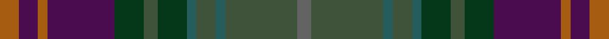

This is one **variant** — a specific cloth: this exact thread count and colourway, with its own
provenance below. It is one weaving of the [sett](/setts/o4dp4o2dp14dg6dgi3dg6dgii2dgi4dgii2dgi15n3/) (the scale-free proportion — the
same cloth at any scale or shade), whose colour order is pattern [BGGGGGGGBRBR](/stripes/bgggggggbrbr/).

Part of the [Kinloch Anderson Heather](/tartans/k/ki/kinloch-anderson-heather/) tartan — the named design grouping this sett with its other cloths.

Sourced from register-of-tartans.  It is a [12 stripe tartan](/stripes/stripes12/).

Original link [https://www.tartanregister.gov.uk/tartanDetails.aspx?ref=10836](https://www.tartanregister.gov.uk/tartanDetails.aspx?ref=10836)

Dataset <small>— provenance for this record, inherited from the source manifest</small>

<dl class="dataset-prov">
<dt>source</dt><dd><a href="/sources/register-of-tartans/">Scottish Register of Tartans</a></dd>
<dt>data captured from</dt><dd><a href="https://github.com/thetartan/tartan-database/blob/master/data/register-of-tartans/data.csv">https://github.com/thetartan/tartan-database/blob/master/data/register-of-tartans/data.csv</a></dd>
<dt>data date</dt><dd>15/04/2013 <small>(this record)</small></dd>
<dt>licence</dt><dd><a href="https://www.tartanregister.gov.uk/copyright">Crown copyright</a></dd>
</dl>

Capture chain <small>— the hands this data passed through, oldest first; each capture carries its own licence</small>

<ol class="capture-chain">
<li><a href="https://www.tartanregister.gov.uk/">Scottish Register of Tartans</a> · <a href="https://www.tartanregister.gov.uk/copyright">Crown copyright</a> <small>the living register — still published by National Records of Scotland</small></li>
<li><a href="https://github.com/thetartan/tartan-database">thetartan/tartan-database</a> <small>2016-2017</small> · <a href="https://creativecommons.org/licenses/by-nc-nd/4.0/">CC BY-NC-ND 4.0</a> <small>Levko Kravets's frozen compilation — the capture we vendored, and where its CC licence text came from</small></li>
<li>this dictionary <small>captured 2026-06-10 · commit 5bf86c7566</small> <small>each re-capture is a git commit to data/sources</small></li>
</ol>

## Register references

External register numbers recorded for this tartan.

- Scottish Register of Tartans: [10836](https://www.tartanregister.gov.uk/tartanDetails.aspx?ref=10836)

## Thread count
O/8 DP8 O4 DP28 DG12 DGi6 DG12 DGii4 DGi8 DGii4 DGi30 N/6

One full sett is **246 threads**.

## Palette
<table><thead><tr><th>Colour</th><th>Shade</th><th>OKLCh</th></tr></thead><tbody><tr><td>DG</td><td><code style="background-color:#053819;">#053819</code> <small style="color:#888">#053819</small></td><td><small style="color:#888">oklch(30.0% 0.075 151.3)</small></td></tr><tr><td>DP</td><td><code style="background-color:#4B0B4F;">#4B0B4F</code> <small style="color:#888">#4B0B4F</small></td><td><small style="color:#888">oklch(30.1% 0.125 325.4)</small></td></tr><tr><td>DG</td><td><code style="background-color:#255D5C;">#255D5C</code> <small style="color:#888">#255D5C</small></td><td><small style="color:#888">oklch(44.1% 0.058 193.6)</small></td></tr><tr><td>N</td><td><code style="background-color:#636363;">#636363</code> <small style="color:#888">#636363</small></td><td><small style="color:#888">oklch(50.0% 0.000 89.9)</small></td></tr><tr><td>DG</td><td><code style="background-color:#3F533A;">#3F533A</code> <small style="color:#888">#3F533A</small></td><td><small style="color:#888">oklch(41.8% 0.048 139.4)</small></td></tr><tr><td>O</td><td><code style="background-color:#A65C11;">#A65C11</code> <small style="color:#888">#A65C11</small></td><td><small style="color:#888">oklch(55.0% 0.125 58.3)</small></td></tr></tbody></table>

# Sample pattern

## Nearest tartan variants

The nearest existing variants by ΔTartan distance, with this cloth at the top so the swatches line up against it.

ΔTartan

Threads

Variant

Sett

—

246

<a href="/variants/s12/o4dp4o2dp14dg6dgi3dg6dgii2dgi4dgii2dgi15n3~x2~dgi1702138-dgii1802194/">Kinloch Anderson Heather</a>

<a href="/ttd/edit/#slug=do16dr2do3dr4do2n12dy18lb2dy18n12do12ly2dr2ly2~x2&amp;base=o4dp4o2dp14dg6dgi3dg6dgii2dgi4dgii2dgi15n3~x2~dgi1702138-dgii1802194" title="compare in the TTD">3.65</a>

392

<a href="/variants/s14/do16dr2do3dr4do2n12dy18lb2dy18n12do12ly2dr2ly2~x2/">Allen - 2012 (Personal)</a>

<a href="/ttd/edit/#slug=r2do15dg12do2db12do2dg12do15ly2~x4&amp;base=o4dp4o2dp14dg6dgi3dg6dgii2dgi4dgii2dgi15n3~x2~dgi1702138-dgii1802194" title="compare in the TTD">3.91</a>

576

<a href="/variants/s9/r2do15dg12do2db12do2dg12do15ly2~x4/">Amazing Union (Personal)</a>

<a href="/ttd/edit/#slug=dgi3dg12o6dgii3dp15oi2dp2~x2~dgi1302166-dgii1602166-oi2402083&amp;base=o4dp4o2dp14dg6dgi3dg6dgii2dgi4dgii2dgi15n3~x2~dgi1702138-dgii1802194" title="compare in the TTD">3.91</a>

162

<a href="/variants/s7/dgi3dg12o6dgii3dp15oi2dp2~x2~dgi1302166-dgii1602166-oi2402083/">Myres Castle</a>

## Neighbour map

Every grey dot is one of 13621 variants placed by the first two principal components of the ΔTartan feature space (42% of its variance). Red is this tartan; blue dots are its nearest — click one to open its page.

<svg viewBox="0 0 640 380" role="img" style="max-width:100%;height:auto;border:1px solid #e0e0e0;border-radius:4px;display:block" xmlns="http://www.w3.org/2000/svg"><image href="/nn/cloud.v1.png" width="640" height="380"/><a href="/variants/s14/do16dr2do3dr4do2n12dy18lb2dy18n12do12ly2dr2ly2~x2/"><circle cx="288.7" cy="225.6" r="4" fill="#3465a4"><title>Allen - 2012 (Personal)</title></circle></a><a href="/variants/s9/r2do15dg12do2db12do2dg12do15ly2~x4/"><circle cx="341.4" cy="259.9" r="4" fill="#3465a4"><title>Amazing Union (Personal)</title></circle></a><a href="/variants/s7/dgi3dg12o6dgii3dp15oi2dp2~x2~dgi1302166-dgii1602166-oi2402083/"><circle cx="260.1" cy="230.2" r="4" fill="#3465a4"><title>Myres Castle</title></circle></a><circle cx="262.0" cy="229.9" r="5" fill="#c00000"/><text x="320" y="376" text-anchor="middle" font-size="11" fill="#999">ground</text><text x="11" y="190" text-anchor="middle" font-size="11" fill="#999" transform="rotate(-90 11 190)">complexity</text></svg>

ID: /variants/s12/o4dp4o2dp14dg6dgi3dg6dgii2dgi4dgii2dgi15n3~x2~dgi1702138-dgii1802194/
