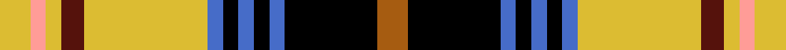

This page is one **sett** — a single exact thread-count. It belongs to the [tartan](/setts/o4k12b2k2b2k2b2ly16dr3ly2lr2ly4/)
(the same proportion at any scale), whose colour order is pattern [RKBKBKBYBYYY](/stripes/rkbkbkbybyyy/).

Sourced from tartans-authority.  It is a [12 stripe tartan](/stripes/stripes12/).

Original link http://www.tartansauthority.com/tartan-ferret/display/3777/

## Register references

External register numbers recorded for this tartan.

- Scottish Tartans Authority (ITI): 3777

## Thread count
LY/8 LR4 LY4 DR6 LY32 B4 K4 B4 K4 B4 K24 O/8

One full sett is **196 threads**.

## Palette
<table><thead><tr><th>Colour</th><th>Shade</th><th>OKLCh</th></tr></thead><tbody><tr><td>B</td><td><code style="background-color:#466CC8;">#466CC8</code> <small style="color:#888">#466CC8</small></td><td><small style="color:#888">oklch(55.1% 0.149 265.0)</small></td></tr><tr><td>DR</td><td><code style="background-color:#55120C;">#55120C</code> <small style="color:#888">#55120C</small></td><td><small style="color:#888">oklch(30.0% 0.099 29.3)</small></td></tr><tr><td>K</td><td><code style="background-color:#000000;">#000000</code> <small style="color:#888">#000000</small></td><td><small style="color:#888">oklch(0.0% 0.000 0.0)</small></td></tr><tr><td>LY</td><td><code style="background-color:#DCBC32;">#DCBC32</code> <small style="color:#888">#DCBC32</small></td><td><small style="color:#888">oklch(80.0% 0.150 95.2)</small></td></tr><tr><td>O</td><td><code style="background-color:#A65C11;">#A65C11</code> <small style="color:#888">#A65C11</small></td><td><small style="color:#888">oklch(55.0% 0.125 58.3)</small></td></tr><tr><td>LR</td><td><code style="background-color:#FF9C97;">#FF9C97</code> <small style="color:#888">#FF9C97</small></td><td><small style="color:#888">oklch(79.3% 0.119 23.2)</small></td></tr></tbody></table>

# Sample pattern

## Nearest variants

The nearest existing variants by ΔTartan distance, with this cloth at the top so the swatches line up against it.

ΔTartan

Threads

Variant

Sett

—

196

<a href="/variants/s12/o4k12b2k2b2k2b2ly16dr3ly2lr2ly4~x2/">Cailean #2 (Fashion)</a>

<a href="/ttd/edit/#slug=y8g2k4lo1k1lb1k1do8y3k1y1lb1~x4&amp;base=o4k12b2k2b2k2b2ly16dr3ly2lr2ly4~x2" title="compare in the TTD">2.51</a>

220

<a href="/variants/s12/y8g2k4lo1k1lb1k1do8y3k1y1lb1~x4/">Wcwm 9275-1258</a>

## Neighbour map

Every grey dot is one of 13620 variants placed by the first two principal components of the ΔTartan feature space (42% of its variance). Red is this tartan; blue dots are its nearest — click one to open its page.

<svg viewBox="0 0 640 380" role="img" style="max-width:100%;height:auto;border:1px solid #e0e0e0;border-radius:4px;display:block" xmlns="http://www.w3.org/2000/svg"><image href="/nn/cloud.v1.png" width="640" height="380"/><a href="/variants/s12/y8g2k4lo1k1lb1k1do8y3k1y1lb1~x4/"><circle cx="110.0" cy="140.7" r="4" fill="#3465a4"><title>Wcwm 9275-1258</title></circle></a><circle cx="103.3" cy="126.1" r="5" fill="#c00000"/><text x="320" y="376" text-anchor="middle" font-size="11" fill="#999">ground</text><text x="11" y="190" text-anchor="middle" font-size="11" fill="#999" transform="rotate(-90 11 190)">complexity</text></svg>

ID: /variants/s12/o4k12b2k2b2k2b2ly16dr3ly2lr2ly4~x2/
