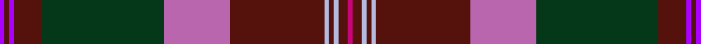

This page is one **sett** — a single exact thread-count. It belongs to the [tartan](/setts/p1dr1p1dr6dg26mi14dr20lb1dr1lb1dr2m1/)
(the same proportion at any scale), whose colour order is pattern [BBBBGRBWBWBR](/stripes/bbbbgrbwbwbr/).

Part of the [Scobie](/tartans/scobie/) tartan — the named design grouping this sett with its other cloths.

Sourced from register-of-tartans.  It is a [12 stripe tartan](/stripes/stripes12/).

Original link https://www.tartanregister.gov.uk/tartanDetails.aspx?ref=10247

## Register references

External register numbers recorded for this tartan.

- Scottish Register of Tartans: [10247](https://www.tartanregister.gov.uk/tartanDetails.aspx?ref=10247)

## Thread count
P/2 DR2 P2 DR12 DG52 Mi28 DR40 LB2 DR2 LB2 DR4 M/2

One full sett is **296 threads**.

## Palette
<table><thead><tr><th>Colour</th><th>Shade</th><th>OKLCh</th></tr></thead><tbody><tr><td>G</td><td><code style="background-color:#053819;">#053819</code> <small style="color:#888">#053819</small></td><td><small style="color:#888">oklch(30.0% 0.075 151.3)</small></td></tr><tr><td>LB</td><td><code style="background-color:#B5BBDE;">#B5BBDE</code> <small style="color:#888">#B5BBDE</small></td><td><small style="color:#888">oklch(79.9% 0.050 277.6)</small></td></tr><tr><td>P</td><td><code style="background-color:#AA00FF;">#AA00FF</code> <small style="color:#888">#AA00FF</small></td><td><small style="color:#888">oklch(58.1% 0.299 307.0)</small></td></tr><tr><td>Pa</td><td><code style="background-color:#B966AE;">#B966AE</code> <small style="color:#888">#B966AE</small></td><td><small style="color:#888">oklch(62.9% 0.140 332.2)</small></td></tr><tr><td>R</td><td><code style="background-color:#55120C;">#55120C</code> <small style="color:#888">#55120C</small></td><td><small style="color:#888">oklch(30.0% 0.099 29.3)</small></td></tr><tr><td>Ra</td><td><code style="background-color:#CA047B;">#CA047B</code> <small style="color:#888">#CA047B</small></td><td><small style="color:#888">oklch(55.0% 0.225 353.8)</small></td></tr></tbody></table>

# Sample pattern

## Nearest variants

The nearest existing variants by ΔTartan distance, with this cloth at the top so the swatches line up against it.

ΔTartan

Threads

Variant

Sett

—

296

<a href="/variants/s12/p1dr1p1dr6dg26mi14dr20lb1dr1lb1dr2m1~x2~p2312307-mi2506332/">Scobie (Blackford)</a>

<a href="/ttd/edit/#slug=dp1r1dp1r6g26dp14r20lb1r1lb1r2lr1~x2~r2109032-lr3303019&amp;base=p1dr1p1dr6dg26mi14dr20lb1dr1lb1dr2m1~x2~p2312307-mi2506332" title="compare in the TTD">1.00</a>

296

<a href="/variants/s12/dp1r1dp1r6g26dp14r20lb1r1lb1r2lr1~x2~r2109032-lr3303019/">Scobie (Name)</a>

## Neighbour map

Every grey dot is one of 13620 variants placed by the first two principal components of the ΔTartan feature space (42% of its variance). Red is this tartan; blue dots are its nearest — click one to open its page.

<svg viewBox="0 0 640 380" role="img" style="max-width:100%;height:auto;border:1px solid #e0e0e0;border-radius:4px;display:block" xmlns="http://www.w3.org/2000/svg"><image href="/nn/cloud.v1.png" width="640" height="380"/><a href="/variants/s12/dp1r1dp1r6g26dp14r20lb1r1lb1r2lr1~x2~r2109032-lr3303019/"><circle cx="269.1" cy="106.6" r="4" fill="#3465a4"><title>Scobie (Name)</title></circle></a><circle cx="271.3" cy="101.4" r="5" fill="#c00000"/><text x="320" y="376" text-anchor="middle" font-size="11" fill="#999">ground</text><text x="11" y="190" text-anchor="middle" font-size="11" fill="#999" transform="rotate(-90 11 190)">complexity</text></svg>

ID: /variants/s12/p1dr1p1dr6dg26mi14dr20lb1dr1lb1dr2m1~x2~p2312307-mi2506332/
