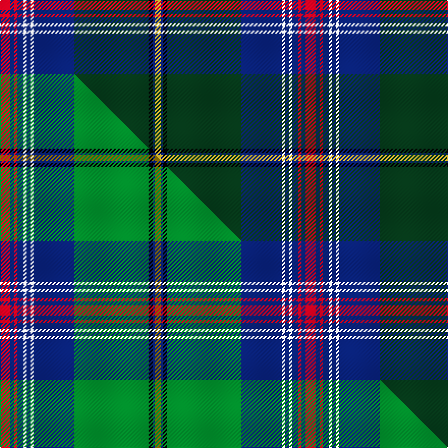

This is one **variant** — a specific cloth: this exact thread count and colourway, with its own
provenance below. It is one weaving of the [sett](/tartans/j/jo/johnston-diana-dress/) (the scale-free proportion — the
same cloth at any scale or shade), whose colour order is pattern [RBRBWBWBGKBY](/stripes/rbrbwbwbgkby/).

Part of the [Johnston, Diana Dress](/tartans/j/jo/johnston-diana-dress/) tartan — the named design grouping this sett with its other cloths.

Sourced from tartans-authority.  It is a [12 stripe tartan](/stripes/stripes12/).

Original link <code>http://www.tartansauthority.com/tartan-ferret/display/11203/</code> — retired · [Internet Archive copy](https://web.archive.org/web/*/http://www.tartansauthority.com/tartan-ferret/display/11203/*)

Dataset <small>— provenance for this record, inherited from the source manifest</small>

<dl class="dataset-prov">
<dt>source</dt><dd><a href="/sources/tartans-authority/">Scottish Tartans Authority</a></dd>
<dt>data captured from</dt><dd><a href="https://github.com/thetartan/tartan-database/blob/master/data/tartans-authority/data.csv">https://github.com/thetartan/tartan-database/blob/master/data/tartans-authority/data.csv</a></dd>
<dt>data date</dt><dd>2015 <small>(this record)</small></dd>
<dt>licence</dt><dd><a href="https://creativecommons.org/licenses/by-nc-nd/4.0/">CC BY-NC-ND 4.0</a></dd>
</dl>

Capture chain <small>— the hands this data passed through, oldest first; each capture carries its own licence</small>

<ol class="capture-chain">
<li><a href="https://www.tartansauthority.com/">Scottish Tartans Authority</a> <small>the heritage body’s archive — its tartan-ferret record browser is retired; dead record links are shown unlinked, with an Internet Archive copy (ITI numbers are not SRT references)</small></li>
<li><a href="https://github.com/thetartan/tartan-database">thetartan/tartan-database</a> <small>2016-2017</small> · <a href="https://creativecommons.org/licenses/by-nc-nd/4.0/">CC BY-NC-ND 4.0</a> <small>Levko Kravets's frozen compilation — the capture we vendored, and where its CC licence text came from</small></li>
<li>this dictionary <small>captured 2026-06-10 · commit 5bf86c7566</small> <small>each re-capture is a git commit to data/sources</small></li>
</ol>

## Register references

External register numbers recorded for this tartan.

- Scottish Register of Tartans: [11203](https://www.tartanregister.gov.uk/tartanDetails?ref=11203)
- Scottish Tartans Authority (ITI): 11203

## Thread count
R/10 DB4 R3 DB6 W3 DB4 W3 DB40 DG73 K4 DB2 LY/6

One full sett is **300 threads**.

## Palette
<table><thead><tr><th>Colour</th><th>Shade</th><th>OKLCh</th></tr></thead><tbody><tr><td>DB</td><td><code style="background-color:#082077;">#082077</code> <small style="color:#888">#082077</small></td><td><small style="color:#888">oklch(30.0% 0.149 265.1)</small></td></tr><tr><td>DG</td><td><code style="background-color:#053819;">#053819</code> <small style="color:#888">#053819</small></td><td><small style="color:#888">oklch(30.0% 0.075 151.3)</small></td></tr><tr><td>K</td><td><code style="background-color:#000000;">#000000</code> <small style="color:#888">#000000</small></td><td><small style="color:#888">oklch(0.0% 0.000 0.0)</small></td></tr><tr><td>R</td><td><code style="background-color:#D60020;">#D60020</code> <small style="color:#888">#D60020</small></td><td><small style="color:#888">oklch(55.2% 0.224 25.5)</small></td></tr><tr><td>W</td><td><code style="background-color:#F7F7F7;">#F7F7F7</code> <small style="color:#888">#F7F7F7</small></td><td><small style="color:#888">oklch(97.6% 0.000 89.9)</small></td></tr><tr><td>LY</td><td><code style="background-color:#DCBC32;">#DCBC32</code> <small style="color:#888">#DCBC32</small></td><td><small style="color:#888">oklch(80.0% 0.150 95.2)</small></td></tr></tbody></table>

# Sample pattern

## Compared to the master

This cloth is one sett of its design; the master sett (the exemplar the design is anchored on) is below for comparison.

Its **ΔTartan distance** from the master is **0.19** — the same measure the nearest-tartans table ranks by (0 is identical; a re-scale of the same cloth is near 0, a recolour or a different proportion further).

<figure class="master-compare" style="margin:0">

this sett
master sett ★

<figcaption style="color:#888;font-size:smaller">One weave of this sett against the <a href="/setts/r10db4r3db6w3db4w3db40g73k4db2y6/">master sett ★</a>, split on the diagonal: a shared proportion runs seamlessly across it with only the shades shifting; a different proportion breaks on it.</figcaption>
</figure>

## Nearest tartan variants

The nearest existing variants by ΔTartan distance, with this cloth at the top so the swatches line up against it.

ΔTartan

Threads

Variant

Sett

—

300

<a href="/variants/s12/r10db4r3db6w3db4w3db40dg73k4db2ly6/">Johnston, Diana Dress (Personal)</a>

<a href="/ttd/edit/#slug=r10db4r3db6w3db4w3db40g73k4db2y6&amp;base=r10db4r3db6w3db4w3db40dg73k4db2ly6" title="compare in the TTD">0.19</a>

300

<a href="/variants/s12/r10db4r3db6w3db4w3db40g73k4db2y6/">Johnston, Diana Dress (Personal)</a>

<a href="/ttd/edit/#slug=k4lr3dt49lr4k2lb5k6o10n15k1dt2~x2~o2500000-n1900000&amp;base=r10db4r3db6w3db4w3db40dg73k4db2ly6" title="compare in the TTD">1.89</a>

392

<a href="/variants/s11/k4lr3dt49lr4k2lb5k6o10n15k1dt2~x2~o2500000-n1900000/">Misty Isle (Fashion)</a>

<a href="/ttd/edit/#slug=b64dr3k3w2b3dr28dg26b3dr3k3ly2b3dg16~x2&amp;base=r10db4r3db6w3db4w3db40dg73k4db2ly6" title="compare in the TTD">1.92</a>

476

<a href="/variants/s13/b64dr3k3w2b3dr28dg26b3dr3k3ly2b3dg16~x2/">Wcwm 1571</a>

<a href="/ttd/edit/#slug=dy9lb2r1lb2dy3k9dg3dy1n35k3n2~x2&amp;base=r10db4r3db6w3db4w3db40dg73k4db2ly6" title="compare in the TTD">2.09</a>

258

<a href="/variants/s11/dy9lb2r1lb2dy3k9dg3dy1n35k3n2~x2/">Donohoe Grey, Peter</a>

<a href="/ttd/edit/#slug=do9lb2r1lb2do3k9dg3do1n35k3n2~x2&amp;base=r10db4r3db6w3db4w3db40dg73k4db2ly6" title="compare in the TTD">2.13</a>

258

<a href="/variants/s11/do9lb2r1lb2do3k9dg3do1n35k3n2~x2/">Donohoe Grey, Peter (Commemorative)</a>

<a href="/ttd/edit/#slug=r2k34w2k2n27g1n2k3n2y1n2r2~x2~k0504259&amp;base=r10db4r3db6w3db4w3db40dg73k4db2ly6" title="compare in the TTD">2.18</a>

312

<a href="/variants/s12/r2k34w2k2n27g1n2k3n2y1n2r2~x2~k0504259/">Hudson's Bay Company</a>

<a href="/ttd/edit/#slug=r2k1db30k6g12y1db2y1g12k3w1~x2&amp;base=r10db4r3db6w3db4w3db40dg73k4db2ly6" title="compare in the TTD">2.32</a>

278

<a href="/variants/s11/r2k1db30k6g12y1db2y1g12k3w1~x2/">Hororata</a>

<a href="/ttd/edit/#slug=db3k3w1dr3k8db2dg36db2k8w1k3db3y2~x2&amp;base=r10db4r3db6w3db4w3db40dg73k4db2ly6" title="compare in the TTD">2.35</a>

290

<a href="/variants/s13/db3k3w1dr3k8db2dg36db2k8w1k3db3y2~x2/">U.S. Special Forces</a>

<a href="/ttd/edit/#slug=g10db9dp4dr2dp4g6k10w4g24db60k4&amp;base=r10db4r3db6w3db4w3db40dg73k4db2ly6" title="compare in the TTD">2.39</a>

260

<a href="/variants/s11/g10db9dp4dr2dp4g6k10w4g24db60k4/">Huaumé, Patrick Antoine (Personal)</a>

<a href="/ttd/edit/#slug=db36y4k6y1k1w1k1g8r6k1r3w1~x2&amp;base=r10db4r3db6w3db4w3db40dg73k4db2ly6" title="compare in the TTD">2.42</a>

202

<a href="/variants/s12/db36y4k6y1k1w1k1g8r6k1r3w1~x2/">MacBeth, MacLulich</a>

## Neighbour map

Every grey dot is one of 13656 variants placed by the first two principal components of the ΔTartan feature space (42% of its variance). Red is this tartan; blue dots are its nearest — click one to open its page. The map is a flat projection of a many-dimensional space — [how to read it](/posts/neighbourhood-maps/).

<svg viewBox="0 0 640 380" role="img" style="max-width:100%;height:auto;border:1px solid #e0e0e0;border-radius:4px;display:block" xmlns="http://www.w3.org/2000/svg"><image href="/nn/cloud.v1.png" width="640" height="380"/><a href="/variants/s12/r10db4r3db6w3db4w3db40g73k4db2y6/"><circle cx="247.5" cy="57.9" r="4" fill="#3465a4"><title>Johnston, Diana Dress (Personal)</title></circle></a><a href="/variants/s11/k4lr3dt49lr4k2lb5k6o10n15k1dt2~x2~o2500000-n1900000/"><circle cx="257.6" cy="50.7" r="4" fill="#3465a4"><title>Misty Isle (Fashion)</title></circle></a><a href="/variants/s13/b64dr3k3w2b3dr28dg26b3dr3k3ly2b3dg16~x2/"><circle cx="260.9" cy="72.7" r="4" fill="#3465a4"><title>Wcwm 1571</title></circle></a><a href="/variants/s11/dy9lb2r1lb2dy3k9dg3dy1n35k3n2~x2/"><circle cx="282.2" cy="63.1" r="4" fill="#3465a4"><title>Donohoe Grey, Peter</title></circle></a><a href="/variants/s11/do9lb2r1lb2do3k9dg3do1n35k3n2~x2/"><circle cx="283.2" cy="63.1" r="4" fill="#3465a4"><title>Donohoe Grey, Peter (Commemorative)</title></circle></a><a href="/variants/s12/r2k34w2k2n27g1n2k3n2y1n2r2~x2~k0504259/"><circle cx="278.4" cy="48.9" r="4" fill="#3465a4"><title>Hudson's Bay Company</title></circle></a><a href="/variants/s11/r2k1db30k6g12y1db2y1g12k3w1~x2/"><circle cx="218.3" cy="76.0" r="4" fill="#3465a4"><title>Hororata</title></circle></a><a href="/variants/s13/db3k3w1dr3k8db2dg36db2k8w1k3db3y2~x2/"><circle cx="272.9" cy="60.4" r="4" fill="#3465a4"><title>U.S. Special Forces</title></circle></a><a href="/variants/s11/g10db9dp4dr2dp4g6k10w4g24db60k4/"><circle cx="247.3" cy="78.8" r="4" fill="#3465a4"><title>Huaumé, Patrick Antoine (Personal)</title></circle></a><a href="/variants/s12/db36y4k6y1k1w1k1g8r6k1r3w1~x2/"><circle cx="250.6" cy="41.8" r="4" fill="#3465a4"><title>MacBeth, MacLulich</title></circle></a><circle cx="265.7" cy="59.5" r="5" fill="#c00000"/><text x="320" y="376" text-anchor="middle" font-size="11" fill="#999">ground</text><text x="11" y="190" text-anchor="middle" font-size="11" fill="#999" transform="rotate(-90 11 190)">complexity</text></svg>

ID: /variants/s12/r10db4r3db6w3db4w3db40dg73k4db2ly6/
