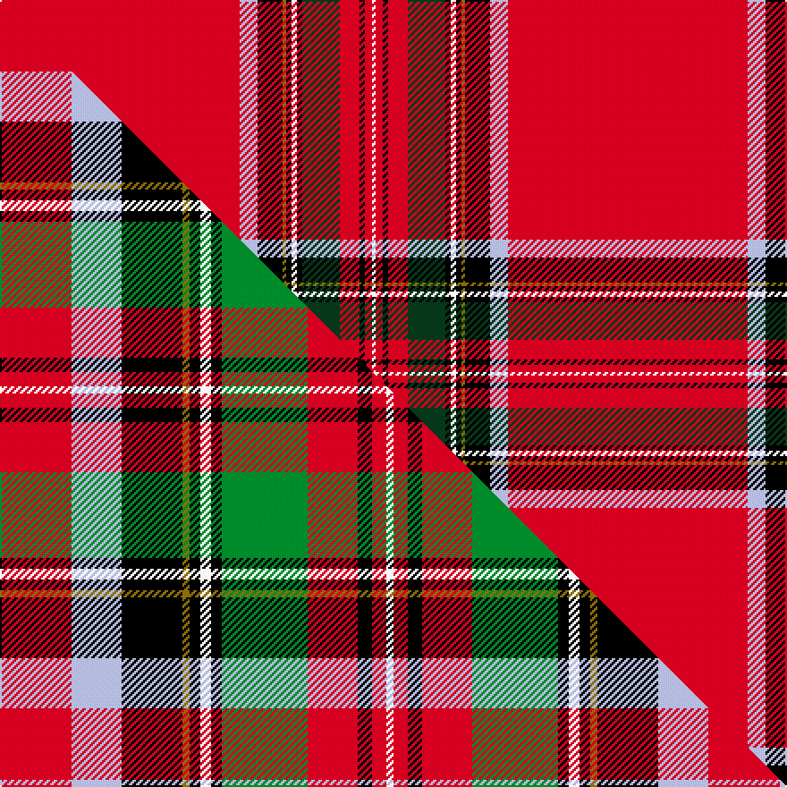

This is one **variant** — a specific cloth: this exact thread count and colourway, with its own
provenance below. It is one weaving of the [sett](/setts/r134lb10k14y2k3w3k3dg21r11k3r4w2/) (the scale-free proportion — the
same cloth at any scale or shade), whose colour order is pattern [RWKGKWKGRKRW](/stripes/rwkgkwkgrkrw/).

Part of the [Royal Stewart](/tartans/r/ro/royal-stewart-2/) tartan — the named design grouping this sett with its other cloths.

Sourced from tartans-authority.  It is a [12 stripe tartan](/stripes/stripes12/).

Original link [https://www.tartanregister.gov.uk/tartanDetails.aspx?ref=1375](https://www.tartanregister.gov.uk/tartanDetails.aspx?ref=1375)

Dataset <small>— provenance for this record, inherited from the source manifest</small>

<dl class="dataset-prov">
<dt>source</dt><dd><a href="/sources/tartans-authority/">Scottish Tartans Authority</a></dd>
<dt>data captured from</dt><dd><a href="https://github.com/thetartan/tartan-database/blob/master/data/tartans-authority/data.csv">https://github.com/thetartan/tartan-database/blob/master/data/tartans-authority/data.csv</a></dd>
<dt>data date</dt><dd>1819 <small>(this record)</small></dd>
<dt>licence</dt><dd><a href="https://creativecommons.org/licenses/by-nc-nd/4.0/">CC BY-NC-ND 4.0</a></dd>
</dl>

Capture chain <small>— the hands this data passed through, oldest first; each capture carries its own licence</small>

<ol class="capture-chain">
<li><a href="https://www.tartansauthority.com/">Scottish Tartans Authority</a> <small>the heritage body's archive — its tartan-ferret record browser is retired (links repaired to the SRT, above)</small></li>
<li><a href="https://github.com/thetartan/tartan-database">thetartan/tartan-database</a> <small>2016-2017</small> · <a href="https://creativecommons.org/licenses/by-nc-nd/4.0/">CC BY-NC-ND 4.0</a> <small>Levko Kravets's frozen compilation — the capture we vendored, and where its CC licence text came from</small></li>
<li>this dictionary <small>captured 2026-06-10 · commit 5bf86c7566</small> <small>each re-capture is a git commit to data/sources</small></li>
</ol>

## Register references

External register numbers recorded for this tartan.

- Scottish Tartans Authority (ITI): 1375

## Thread count
R/134 LB10 K14 Y2 K3 W3 K3 DG21 R11 K3 R4 W/2

One full sett is **284 threads**.

## Palette
<table><thead><tr><th>Colour</th><th>Shade</th><th>OKLCh</th></tr></thead><tbody><tr><td>LB</td><td><code style="background-color:#B5BBDE;">#B5BBDE</code> <small style="color:#888">#B5BBDE</small></td><td><small style="color:#888">oklch(79.9% 0.050 277.6)</small></td></tr><tr><td>DG</td><td><code style="background-color:#053819;">#053819</code> <small style="color:#888">#053819</small></td><td><small style="color:#888">oklch(30.0% 0.075 151.3)</small></td></tr><tr><td>K</td><td><code style="background-color:#000000;">#000000</code> <small style="color:#888">#000000</small></td><td><small style="color:#888">oklch(0.0% 0.000 0.0)</small></td></tr><tr><td>W</td><td><code style="background-color:#F7F7F7;">#F7F7F7</code> <small style="color:#888">#F7F7F7</small></td><td><small style="color:#888">oklch(97.6% 0.000 89.9)</small></td></tr><tr><td>R</td><td><code style="background-color:#D60020;">#D60020</code> <small style="color:#888">#D60020</small></td><td><small style="color:#888">oklch(55.2% 0.224 25.5)</small></td></tr><tr><td>Y</td><td><code style="background-color:#8B6E00;">#8B6E00</code> <small style="color:#888">#8B6E00</small></td><td><small style="color:#888">oklch(55.1% 0.113 90.4)</small></td></tr></tbody></table>

# Sample pattern

## Compared to the master

This cloth is one sett of its design; the master sett (the exemplar the design is anchored on) is below for comparison.

Its **ΔTartan distance** from the master is **0.72** — the same measure the nearest-tartans table ranks by (0 is identical; a re-scale of the same cloth is near 0, a recolour or a different proportion further).

<figure class="master-compare" style="margin:0">

this sett
master sett ★

<figcaption style="color:#888;font-size:smaller">One weave of this sett against the <a href="/setts/r20lb14k17y2k3w3k3g24r14k4r4w2/">master sett ★</a>, split on the diagonal: a shared proportion runs seamlessly across it with only the shades shifting; a different proportion breaks on it.</figcaption>
</figure>

## Nearest tartan variants

The nearest existing variants by ΔTartan distance, with this cloth at the top so the swatches line up against it.

ΔTartan

Threads

Variant

Sett

—

284

<a href="/variants/s12/r134lb10k14y2k3w3k3dg21r11k3r4w2/">Royal Stewart - 1819</a>

<a href="/ttd/edit/#slug=r87db8k11y2k3w2k3g13r11k2r5w3&amp;base=r134lb10k14y2k3w3k3dg21r11k3r4w2" title="compare in the TTD">0.42</a>

210

<a href="/variants/s12/r87db8k11y2k3w2k3g13r11k2r5w3/">Stewart/Stuart, Royal</a>

<a href="/ttd/edit/#slug=r36db4k6y1k1w1k1g8r4k1r2w1&amp;base=r134lb10k14y2k3w3k3dg21r11k3r4w2" title="compare in the TTD">0.48</a>

95

<a href="/variants/s12/r36db4k6y1k1w1k1g8r4k1r2w1/">Stewart Royal</a>

<a href="/ttd/edit/#slug=r36db4k6y1k1w1k1g8r4k1r2w1~x2&amp;base=r134lb10k14y2k3w3k3dg21r11k3r4w2" title="compare in the TTD">0.48</a>

190

<a href="/variants/s12/r36db4k6y1k1w1k1g8r4k1r2w1~x2/">Stewart Royal</a>

<a href="/ttd/edit/#slug=r66db2k11y4k2w4k11g2r8k2r8w2&amp;base=r134lb10k14y2k3w3k3dg21r11k3r4w2" title="compare in the TTD">0.72</a>

176

<a href="/variants/s12/r66db2k11y4k2w4k11g2r8k2r8w2/">TIlted Kilt</a>

<a href="/ttd/edit/#slug=r66db2k11ly4k2w4k11g2r8k2r8w2&amp;base=r134lb10k14y2k3w3k3dg21r11k3r4w2" title="compare in the TTD">0.72</a>

176

<a href="/variants/s12/r66db2k11ly4k2w4k11g2r8k2r8w2/">Tilted Kilt (Corporate)</a>

<a href="/ttd/edit/#slug=r44db3k6ly2k2ly2k10r5k2r3w2~x2&amp;base=r134lb10k14y2k3w3k3dg21r11k3r4w2" title="compare in the TTD">1.35</a>

232

<a href="/variants/s11/r44db3k6ly2k2ly2k10r5k2r3w2~x2/">Heritage Plaid</a>

<a href="/ttd/edit/#slug=r68n5k9y3k3lb3k3dg20r9k3r5lb4&amp;base=r134lb10k14y2k3w3k3dg21r11k3r4w2" title="compare in the TTD">1.43</a>

198

<a href="/variants/s12/r68n5k9y3k3lb3k3dg20r9k3r5lb4/">British Caledonian Airways #4</a>

<a href="/ttd/edit/#slug=r44db3k6o2k2o2k10r5k2r3w2~x2&amp;base=r134lb10k14y2k3w3k3dg21r11k3r4w2" title="compare in the TTD">1.65</a>

232

<a href="/variants/s11/r44db3k6o2k2o2k10r5k2r3w2~x2/">Hilton Plaid</a>

<a href="/ttd/edit/#slug=r44lb3k22r5k2r3w2~x2&amp;base=r134lb10k14y2k3w3k3dg21r11k3r4w2" title="compare in the TTD">1.65</a>

232

<a href="/variants/s7/r44lb3k22r5k2r3w2~x2/">Hilton Champion Corporate Golf Tartan</a>

<a href="/ttd/edit/#slug=r90k1r2db8r2k12w1k2y1k3g13r11k1g2k1r5w2~x2&amp;base=r134lb10k14y2k3w3k3dg21r11k3r4w2" title="compare in the TTD">1.67</a>

444

<a href="/variants/s17/r90k1r2db8r2k12w1k2y1k3g13r11k1g2k1r5w2~x2/">Scotia Village (Corporate)</a>

## Neighbour map

Every grey dot is one of 13621 variants placed by the first two principal components of the ΔTartan feature space (42% of its variance). Red is this tartan; blue dots are its nearest — click one to open its page.

<svg viewBox="0 0 640 380" role="img" style="max-width:100%;height:auto;border:1px solid #e0e0e0;border-radius:4px;display:block" xmlns="http://www.w3.org/2000/svg"><image href="/nn/cloud.v1.png" width="640" height="380"/><a href="/variants/s12/r87db8k11y2k3w2k3g13r11k2r5w3/"><circle cx="378.9" cy="14.0" r="4" fill="#3465a4"><title>Stewart/Stuart, Royal</title></circle></a><a href="/variants/s12/r36db4k6y1k1w1k1g8r4k1r2w1/"><circle cx="331.6" cy="24.4" r="4" fill="#3465a4"><title>Stewart Royal</title></circle></a><a href="/variants/s12/r36db4k6y1k1w1k1g8r4k1r2w1~x2/"><circle cx="331.6" cy="24.4" r="4" fill="#3465a4"><title>Stewart Royal</title></circle></a><a href="/variants/s12/r66db2k11y4k2w4k11g2r8k2r8w2/"><circle cx="352.4" cy="23.1" r="4" fill="#3465a4"><title>TIlted Kilt</title></circle></a><a href="/variants/s12/r66db2k11ly4k2w4k11g2r8k2r8w2/"><circle cx="350.3" cy="22.6" r="4" fill="#3465a4"><title>Tilted Kilt (Corporate)</title></circle></a><a href="/variants/s11/r44db3k6ly2k2ly2k10r5k2r3w2~x2/"><circle cx="334.2" cy="57.6" r="4" fill="#3465a4"><title>Heritage Plaid</title></circle></a><a href="/variants/s12/r68n5k9y3k3lb3k3dg20r9k3r5lb4/"><circle cx="301.5" cy="50.0" r="4" fill="#3465a4"><title>British Caledonian Airways #4</title></circle></a><a href="/variants/s11/r44db3k6o2k2o2k10r5k2r3w2~x2/"><circle cx="338.6" cy="58.4" r="4" fill="#3465a4"><title>Hilton Plaid</title></circle></a><a href="/variants/s7/r44lb3k22r5k2r3w2~x2/"><circle cx="329.0" cy="54.4" r="4" fill="#3465a4"><title>Hilton Champion Corporate Golf Tartan</title></circle></a><a href="/variants/s17/r90k1r2db8r2k12w1k2y1k3g13r11k1g2k1r5w2~x2/"><circle cx="398.8" cy="14.0" r="4" fill="#3465a4"><title>Scotia Village (Corporate)</title></circle></a><circle cx="411.5" cy="14.0" r="5" fill="#c00000"/><text x="320" y="376" text-anchor="middle" font-size="11" fill="#999">ground</text><text x="11" y="190" text-anchor="middle" font-size="11" fill="#999" transform="rotate(-90 11 190)">complexity</text></svg>

ID: /variants/s12/r134lb10k14y2k3w3k3dg21r11k3r4w2/
