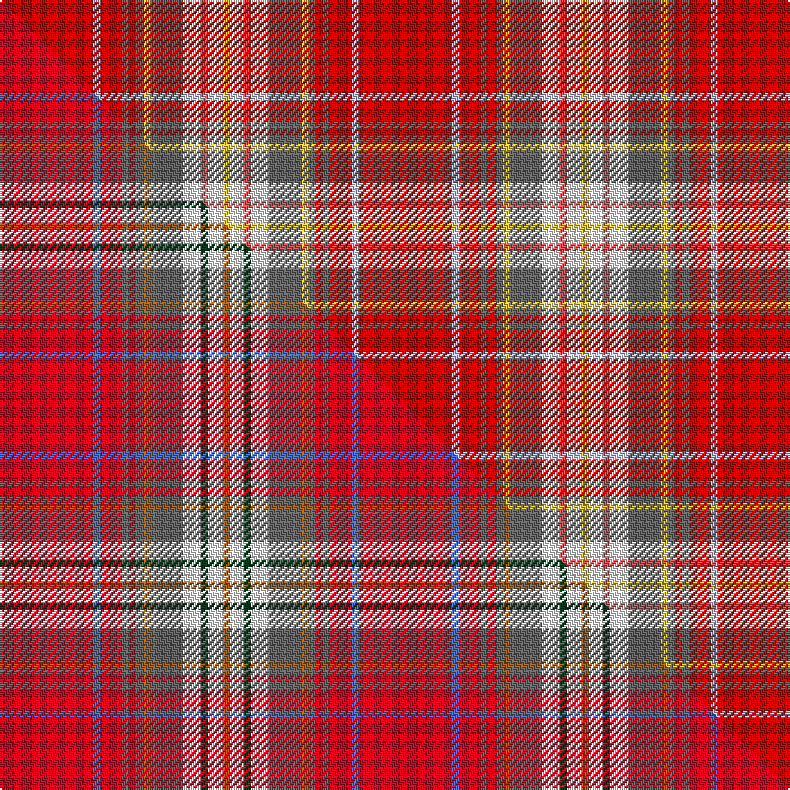

This page is one **sett** — a single exact thread-count. It belongs to the [tartan](/setts/r26lb2r6n2r2n2ly2n9w5ri2w4ly2/)
(the same proportion at any scale), whose colour order is pattern [RWRBRBYBWRWY](/stripes/rwrbrbybwrwy/).

Part of the [Rathmore](/tartans/rathmore/) tartan — the named design grouping this sett with its other cloths.

Sourced from house-of-tartan.  It is a [12 stripe tartan](/stripes/stripes12/).

Original link [http://www.house-of-tartan.scotland.net/house/TartanViewjs.asp?colr=Def&tnam=1518](http://www.house-of-tartan.scotland.net/house/TartanViewjs.asp?colr=Def&tnam=1518)

## Provenance

Earliest known date: 1987 Sett recorded in 1822

Dataset <small>— provenance for this record, inherited from the source manifest</small>

<dl class="dataset-prov">
<dt>source</dt><dd><a href="/sources/house-of-tartan/">House of Tartan</a></dd>
<dt>data captured from</dt><dd><a href="https://github.com/thetartan/tartan-database/blob/master/data/house-of-tartan/data.csv">https://github.com/thetartan/tartan-database/blob/master/data/house-of-tartan/data.csv</a></dd>
<dt>data date</dt><dd>2017-01-10 <small>(dataset default)</small></dd>
<dt>licence</dt><dd><a href="https://creativecommons.org/licenses/by-nc-nd/4.0/">CC BY-NC-ND 4.0</a></dd>
</dl>

Capture chain <small>— the hands this data passed through, oldest first; each capture carries its own licence</small>

<ol class="capture-chain">
<li><a href="http://www.house-of-tartan.scotland.net/">House of Tartan</a> <small>the weaver/retailer's database — the site is now offline; the URL is kept as the ultimate source's identity</small></li>
<li><a href="https://github.com/thetartan/tartan-database">thetartan/tartan-database</a> <small>2016-2017</small> · <a href="https://creativecommons.org/licenses/by-nc-nd/4.0/">CC BY-NC-ND 4.0</a> <small>Levko Kravets's frozen compilation — the capture we vendored, and where its CC licence text came from</small></li>
<li>this dictionary <small>captured 2026-06-10 · commit 5bf86c7566</small> <small>each re-capture is a git commit to data/sources</small></li>
</ol>

## Thread count
R/52 LB4 R12 N4 R4 N4 LY4 N18 W10 Ri4 W8 LY/4

One full sett is **200 threads**.

## Palette
<table><thead><tr><th>Colour</th><th>Shade</th><th>OKLCh</th></tr></thead><tbody><tr><td>LB</td><td><code style="background-color:#B5BBDE;">#B5BBDE</code> <small style="color:#888">#B5BBDE</small></td><td><small style="color:#888">oklch(79.9% 0.050 277.6)</small></td></tr><tr><td>R</td><td><code style="background-color:#D05054;">#D05054</code> <small style="color:#888">#D05054</small></td><td><small style="color:#888">oklch(60.2% 0.162 21.5)</small></td></tr><tr><td>W</td><td><code style="background-color:#F7F7F7;">#F7F7F7</code> <small style="color:#888">#F7F7F7</small></td><td><small style="color:#888">oklch(97.6% 0.000 89.9)</small></td></tr><tr><td>LY</td><td><code style="background-color:#DCBC32;">#DCBC32</code> <small style="color:#888">#DCBC32</small></td><td><small style="color:#888">oklch(80.0% 0.150 95.2)</small></td></tr><tr><td>N</td><td><code style="background-color:#636363;">#636363</code> <small style="color:#888">#636363</small></td><td><small style="color:#888">oklch(50.0% 0.000 89.9)</small></td></tr><tr><td>R</td><td><code style="background-color:#C80000;">#C80000</code> <small style="color:#888">#C80000</small></td><td><small style="color:#888">oklch(52.3% 0.215 29.2)</small></td></tr></tbody></table>

# Sample pattern

## Compared to the master

This cloth is one sett of its design; the master sett (the exemplar the design is anchored on) is below for comparison.

Its **ΔTartan distance** from the master is **0.91** — the same measure the nearest-tartans table ranks by (0 is identical; a re-scale of the same cloth is near 0, a recolour or a different proportion further).

<figure class="master-compare" style="margin:0">

this sett
master sett ★

<figcaption style="color:#888;font-size:smaller">One weave of this sett against the <a href="/setts/r26b2r6n2r2n2o2n9w5dg2w4o2/">master sett ★</a>, split on the diagonal: a shared proportion runs seamlessly across it with only the shades shifting; a different proportion breaks on it.</figcaption>
</figure>

## Nearest tartan variants

The nearest existing variants by ΔTartan distance, with this cloth at the top so the swatches line up against it.

ΔTartan

Threads

Variant

Sett

—

200

<a href="/variants/s12/r26lb2r6n2r2n2ly2n9w5ri2w4ly2~x2~r2109032-ri2406019/">Rathmore Family Tartan</a>

<a href="/ttd/edit/#slug=r26b2r6n2r2n2o2n9w5dg2w4o2~x2&amp;base=r26lb2r6n2r2n2ly2n9w5ri2w4ly2~x2~r2109032-ri2406019" title="compare in the TTD">0.91</a>

200

<a href="/variants/s12/r26b2r6n2r2n2o2n9w5dg2w4o2~x2/">Rathmore</a>

<a href="/ttd/edit/#slug=dr10lb1dr2n1dr1n1lo1n4lr2r1lr2lo1~x8~lb3103284-lr3200000&amp;base=r26lb2r6n2r2n2ly2n9w5ri2w4ly2~x2~r2109032-ri2406019" title="compare in the TTD">0.93</a>

344

<a href="/variants/s12/dr10lb1dr2n1dr1n1lo1n4lbi2r1lbi2lo1~x8~lb3103284-lbi3200000/">Rathmore</a>

<a href="/ttd/edit/#slug=do2ri3r3ri21y3ri2r6db6r4w2~x2~ri2906019-r2510029&amp;base=r26lb2r6n2r2n2ly2n9w5ri2w4ly2~x2~r2109032-ri2406019" title="compare in the TTD">2.01</a>

200

<a href="/variants/s10/do2lr3r3lr21y3lr2r6db6r4w2~x2~lr2906019-r2510029/">Hello Kitty</a>

<a href="/ttd/edit/#slug=r24y2n3o2w10r4n3o3w2~x2&amp;base=r26lb2r6n2r2n2ly2n9w5ri2w4ly2~x2~r2109032-ri2406019" title="compare in the TTD">2.38</a>

160

<a href="/variants/s9/r24y2n3o2w10r4n3o3w2~x2/">Manx Laxey, Red</a>

<a href="/ttd/edit/#slug=r41w2dp5y2g21r9dp5db3w2~x2&amp;base=r26lb2r6n2r2n2ly2n9w5ri2w4ly2~x2~r2109032-ri2406019" title="compare in the TTD">2.52</a>

274

<a href="/variants/s9/r41w2dp5y2g21r9dp5db3w2~x2/">Perthshire, or Drummond</a>

<a href="/ttd/edit/#slug=r52db12n9y2n2g2n2dg11r7n2r3db2~x2~g2408144-dg1806142&amp;base=r26lb2r6n2r2n2ly2n9w5ri2w4ly2~x2~r2109032-ri2406019" title="compare in the TTD">2.57</a>

316

<a href="/variants/s12/r52db12n9y2n2g2n2dg11r7n2r3db2~x2~g2408144-dg1806142/">McPrato</a>

<a href="/ttd/edit/#slug=r24ly2n3dy2w10r4n3dy3w2~x2~ly3307090-dy1603076&amp;base=r26lb2r6n2r2n2ly2n9w5ri2w4ly2~x2~r2109032-ri2406019" title="compare in the TTD">2.58</a>

160

<a href="/variants/s9/r24ly2n3dy2w10r4n3dy3w2~x2~ly3307090-dy1603076/">Manx Laxey (Red)</a>

<a href="/ttd/edit/#slug=r41w2dp5dy2g21r9dp5db3w2~x2&amp;base=r26lb2r6n2r2n2ly2n9w5ri2w4ly2~x2~r2109032-ri2406019" title="compare in the TTD">2.59</a>

274

<a href="/variants/s9/r41w2dp5dy2g21r9dp5db3w2~x2/">Perthshire or Drummond District Tartan</a>

<a href="/ttd/edit/#slug=ly1g1db2r2g2r12lb2g1r2g1ly1~x4&amp;base=r26lb2r6n2r2n2ly2n9w5ri2w4ly2~x2~r2109032-ri2406019" title="compare in the TTD">2.60</a>

208

<a href="/variants/s11/ly1g1db2r2g2r12lb2g1r2g1ly1~x4/">West Virginia Old Shawl</a>

<a href="/ttd/edit/#slug=r39dr3w2g14w2y4r4dr2r4y4w2lb12dr6r6y7w2~x2&amp;base=r26lb2r6n2r2n2ly2n9w5ri2w4ly2~x2~r2109032-ri2406019" title="compare in the TTD">2.67</a>

370

<a href="/variants/s16/r39dr3w2g14w2y4r4dr2r4y4w2lb12dr6r6y7w2~x2/">North West Mounted Police Corporate Tartan</a>

## Neighbour map

Every grey dot is one of 13621 variants placed by the first two principal components of the ΔTartan feature space (42% of its variance). Red is this tartan; blue dots are its nearest — click one to open its page.

<svg viewBox="0 0 640 380" role="img" style="max-width:100%;height:auto;border:1px solid #e0e0e0;border-radius:4px;display:block" xmlns="http://www.w3.org/2000/svg"><image href="/nn/cloud.v1.png" width="640" height="380"/><a href="/variants/s12/r26b2r6n2r2n2o2n9w5dg2w4o2~x2/"><circle cx="277.5" cy="116.3" r="4" fill="#3465a4"><title>Rathmore</title></circle></a><a href="/variants/s12/dr10lb1dr2n1dr1n1lo1n4lbi2r1lbi2lo1~x8~lb3103284-lbi3200000/"><circle cx="233.3" cy="144.2" r="4" fill="#3465a4"><title>Rathmore</title></circle></a><a href="/variants/s10/do2lr3r3lr21y3lr2r6db6r4w2~x2~lr2906019-r2510029/"><circle cx="262.1" cy="148.9" r="4" fill="#3465a4"><title>Hello Kitty</title></circle></a><a href="/variants/s9/r24y2n3o2w10r4n3o3w2~x2/"><circle cx="289.8" cy="147.7" r="4" fill="#3465a4"><title>Manx Laxey, Red</title></circle></a><a href="/variants/s9/r41w2dp5y2g21r9dp5db3w2~x2/"><circle cx="309.0" cy="109.8" r="4" fill="#3465a4"><title>Perthshire, or Drummond</title></circle></a><a href="/variants/s12/r52db12n9y2n2g2n2dg11r7n2r3db2~x2~g2408144-dg1806142/"><circle cx="366.2" cy="83.4" r="4" fill="#3465a4"><title>McPrato</title></circle></a><a href="/variants/s9/r24ly2n3dy2w10r4n3dy3w2~x2~ly3307090-dy1603076/"><circle cx="280.5" cy="145.9" r="4" fill="#3465a4"><title>Manx Laxey (Red)</title></circle></a><a href="/variants/s9/r41w2dp5dy2g21r9dp5db3w2~x2/"><circle cx="306.7" cy="108.9" r="4" fill="#3465a4"><title>Perthshire or Drummond District Tartan</title></circle></a><a href="/variants/s11/ly1g1db2r2g2r12lb2g1r2g1ly1~x4/"><circle cx="327.9" cy="134.9" r="4" fill="#3465a4"><title>West Virginia Old Shawl</title></circle></a><a href="/variants/s16/r39dr3w2g14w2y4r4dr2r4y4w2lb12dr6r6y7w2~x2/"><circle cx="240.5" cy="93.6" r="4" fill="#3465a4"><title>North West Mounted Police Corporate Tartan</title></circle></a><circle cx="280.6" cy="119.9" r="5" fill="#c00000"/><text x="320" y="376" text-anchor="middle" font-size="11" fill="#999">ground</text><text x="11" y="190" text-anchor="middle" font-size="11" fill="#999" transform="rotate(-90 11 190)">complexity</text></svg>

ID: /variants/s12/r26lb2r6n2r2n2ly2n9w5ri2w4ly2~x2~r2109032-ri2406019/
