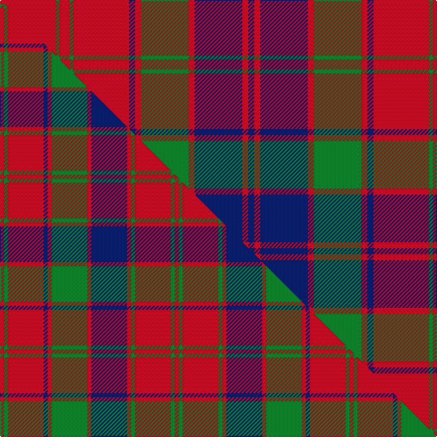

This page is one **sett** — a single exact thread-count. It belongs to the [tartan](/setts/r28g2r5g2r28db3r3g24r3db24r3db3/)
(the same proportion at any scale), whose colour order is pattern [BRBRGRBRGRGR](/stripes/brbrgrbrgrgr/).

Part of the [Robertson](/tartans/robertson/) tartan — the named design grouping this sett with its other cloths.

Sourced from register-of-tartans.  It is a [12 stripe tartan](/stripes/stripes12/).

Original link [https://www.tartanregister.gov.uk/tartanDetails.aspx?ref=3526](https://www.tartanregister.gov.uk/tartanDetails.aspx?ref=3526)

Dataset <small>— provenance for this record, inherited from the source manifest</small>

<dl class="dataset-prov">
<dt>source</dt><dd><a href="/sources/register-of-tartans/">Scottish Register of Tartans</a></dd>
<dt>data captured from</dt><dd><a href="https://github.com/thetartan/tartan-database/blob/master/data/register-of-tartans/data.csv">https://github.com/thetartan/tartan-database/blob/master/data/register-of-tartans/data.csv</a></dd>
<dt>data date</dt><dd>2017-01-06 <small>(dataset default)</small></dd>
<dt>licence</dt><dd><a href="https://www.tartanregister.gov.uk/copyright">Crown copyright</a></dd>
</dl>

Capture chain <small>— the hands this data passed through, oldest first; each capture carries its own licence</small>

<ol class="capture-chain">
<li><a href="https://www.tartanregister.gov.uk/">Scottish Register of Tartans</a> · <a href="https://www.tartanregister.gov.uk/copyright">Crown copyright</a> <small>the living register — still published by National Records of Scotland</small></li>
<li><a href="https://github.com/thetartan/tartan-database">thetartan/tartan-database</a> <small>2016-2017</small> · <a href="https://creativecommons.org/licenses/by-nc-nd/4.0/">CC BY-NC-ND 4.0</a> <small>Levko Kravets's frozen compilation — the capture we vendored, and where its CC licence text came from</small></li>
<li>this dictionary <small>captured 2026-06-10 · commit 5bf86c7566</small> <small>each re-capture is a git commit to data/sources</small></li>
</ol>

## Register references

External register numbers recorded for this tartan.

- Scottish Register of Tartans: [3526](https://www.tartanregister.gov.uk/tartanDetails.aspx?ref=3526)
- Scottish Tartans World Register: 2003

## Thread count
R/56 G4 R10 G4 R56 DB6 R6 G48 R6 DB48 R6 DB/6

One full sett is **450 threads**.

## Palette
<table><thead><tr><th>Colour</th><th>Shade</th><th>OKLCh</th></tr></thead><tbody><tr><td>DB</td><td><code style="background-color:#082077;">#082077</code> <small style="color:#888">#082077</small></td><td><small style="color:#888">oklch(30.0% 0.149 265.1)</small></td></tr><tr><td>G</td><td><code style="background-color:#008B2A;">#008B2A</code> <small style="color:#888">#008B2A</small></td><td><small style="color:#888">oklch(55.4% 0.170 145.9)</small></td></tr><tr><td>R</td><td><code style="background-color:#D60020;">#D60020</code> <small style="color:#888">#D60020</small></td><td><small style="color:#888">oklch(55.2% 0.224 25.5)</small></td></tr></tbody></table>

# Sample pattern

## Compared to the master

This cloth is one sett of its design; the master sett (the exemplar the design is anchored on) is below for comparison.

Its **ΔTartan distance** from the master is **2.36** — the same measure the nearest-tartans table ranks by (0 is identical; a re-scale of the same cloth is near 0, a recolour or a different proportion further).

<figure class="master-compare" style="margin:0">

this sett
master sett ★

<figcaption style="color:#888;font-size:smaller">One weave of this sett against the <a href="/setts/r1g1r9db1r1g9r1db9r1g1r9g1r1/">master sett ★</a>, split on the diagonal: a shared proportion runs seamlessly across it with only the shades shifting; a different proportion breaks on it.</figcaption>
</figure>

## Nearest tartan variants

The nearest existing variants by ΔTartan distance, with this cloth at the top so the swatches line up against it.

ΔTartan

Threads

Variant

Sett

—

450

<a href="/variants/s12/r28g2r5g2r28db3r3g24r3db24r3db3~x2/">Robertson #5</a>

<a href="/ttd/edit/#slug=db80r56dg3r56dg88r64db3r4dg3r4db3r64&amp;base=r28g2r5g2r28db3r3g24r3db24r3db3~x2" title="compare in the TTD">0.69</a>

712

<a href="/variants/s12/db80r56dg3r56dg88r64db3r4dg3r4db3r64/">Unidentified Cant #14</a>

<a href="/ttd/edit/#slug=r5g2r30db3r3db30r3g30r3db3r30g2r5~x2&amp;base=r28g2r5g2r28db3r3g24r3db24r3db3~x2" title="compare in the TTD">1.18</a>

576

<a href="/variants/s13/r5g2r30db3r3db30r3g30r3db3r30g2r5~x2/">Robertson D</a>

<a href="/ttd/edit/#slug=r5g2r30db3r3db30r3g30r3db3r30g2r5&amp;base=r28g2r5g2r28db3r3g24r3db24r3db3~x2" title="compare in the TTD">1.18</a>

288

<a href="/variants/s13/r5g2r30db3r3db30r3g30r3db3r30g2r5/">Robertson D</a>

<a href="/ttd/edit/#slug=r3g1r15db2r2db15r2g15r2db2r15g1r3~x2&amp;base=r28g2r5g2r28db3r3g24r3db24r3db3~x2" title="compare in the TTD">1.22</a>

300

<a href="/variants/s13/r3g1r15db2r2db15r2g15r2db2r15g1r3~x2/">Robertson D</a>

<a href="/ttd/edit/#slug=r3g3r35db3r3db35r3g35r3db3r35g3r3~x2&amp;base=r28g2r5g2r28db3r3g24r3db24r3db3~x2" title="compare in the TTD">1.27</a>

656

<a href="/variants/s13/r3g3r35db3r3db35r3g35r3db3r35g3r3~x2/">Robertson 1819</a>

<a href="/ttd/edit/#slug=r3g2r19db2r3db20r3g20r3db2r19g2r3~x4&amp;base=r28g2r5g2r28db3r3g24r3db24r3db3~x2" title="compare in the TTD">1.34</a>

784

<a href="/variants/s13/r3g2r19db2r3db20r3g20r3db2r19g2r3~x4/">Robertson Curtain</a>

<a href="/ttd/edit/#slug=r4g4r35b4r4g35r4b35r4b4r35g4r4&amp;base=r28g2r5g2r28db3r3g24r3db24r3db3~x2" title="compare in the TTD">1.45</a>

344

<a href="/variants/s13/r4g4r35b4r4g35r4b35r4b4r35g4r4/">Robertson 1</a>

<a href="/ttd/edit/#slug=g2r3db2r48db60r21g2r21g60r48db2r3g2~x2&amp;base=r28g2r5g2r28db3r3g24r3db24r3db3~x2" title="compare in the TTD">1.63</a>

1088

<a href="/variants/s13/g2r3db2r48db60r21g2r21g60r48db2r3g2~x2/">Fraser, Wedding dress</a>

<a href="/ttd/edit/#slug=dg2r3db2r48dg60r21dg2r21db60r48db2r3dg2&amp;base=r28g2r5g2r28db3r3g24r3db24r3db3~x2" title="compare in the TTD">1.63</a>

544

<a href="/variants/s13/dg2r3db2r48dg60r21dg2r21db60r48db2r3dg2/">Fraser, Isabella (Artefact)</a>

<a href="/ttd/edit/#slug=w1g2r18db2r2db18r2g18r2db2r18g2w1~x2&amp;base=r28g2r5g2r28db3r3g24r3db24r3db3~x2" title="compare in the TTD">1.76</a>

348

<a href="/variants/s13/w1g2r18db2r2db18r2g18r2db2r18g2w1~x2/">Robertson 1820 - White line</a>

## Neighbour map

Every grey dot is one of 13621 variants placed by the first two principal components of the ΔTartan feature space (42% of its variance). Red is this tartan; blue dots are its nearest — click one to open its page.

<svg viewBox="0 0 640 380" role="img" style="max-width:100%;height:auto;border:1px solid #e0e0e0;border-radius:4px;display:block" xmlns="http://www.w3.org/2000/svg"><image href="/nn/cloud.v1.png" width="640" height="380"/><a href="/variants/s12/db80r56dg3r56dg88r64db3r4dg3r4db3r64/"><circle cx="373.4" cy="144.4" r="4" fill="#3465a4"><title>Unidentified Cant #14</title></circle></a><a href="/variants/s13/r5g2r30db3r3db30r3g30r3db3r30g2r5~x2/"><circle cx="319.3" cy="155.0" r="4" fill="#3465a4"><title>Robertson D</title></circle></a><a href="/variants/s13/r5g2r30db3r3db30r3g30r3db3r30g2r5/"><circle cx="319.3" cy="155.0" r="4" fill="#3465a4"><title>Robertson D</title></circle></a><a href="/variants/s13/r3g1r15db2r2db15r2g15r2db2r15g1r3~x2/"><circle cx="319.8" cy="159.9" r="4" fill="#3465a4"><title>Robertson D</title></circle></a><a href="/variants/s13/r3g3r35db3r3db35r3g35r3db3r35g3r3~x2/"><circle cx="303.3" cy="160.7" r="4" fill="#3465a4"><title>Robertson 1819</title></circle></a><a href="/variants/s13/r3g2r19db2r3db20r3g20r3db2r19g2r3~x4/"><circle cx="299.9" cy="175.3" r="4" fill="#3465a4"><title>Robertson Curtain</title></circle></a><a href="/variants/s13/r4g4r35b4r4g35r4b35r4b4r35g4r4/"><circle cx="316.6" cy="186.6" r="4" fill="#3465a4"><title>Robertson 1</title></circle></a><a href="/variants/s13/g2r3db2r48db60r21g2r21g60r48db2r3g2~x2/"><circle cx="341.9" cy="130.9" r="4" fill="#3465a4"><title>Fraser, Wedding dress</title></circle></a><a href="/variants/s13/dg2r3db2r48dg60r21dg2r21db60r48db2r3dg2/"><circle cx="350.5" cy="131.1" r="4" fill="#3465a4"><title>Fraser, Isabella (Artefact)</title></circle></a><a href="/variants/s13/w1g2r18db2r2db18r2g18r2db2r18g2w1~x2/"><circle cx="275.1" cy="135.4" r="4" fill="#3465a4"><title>Robertson 1820 - White line</title></circle></a><circle cx="328.6" cy="165.9" r="5" fill="#c00000"/><text x="320" y="376" text-anchor="middle" font-size="11" fill="#999">ground</text><text x="11" y="190" text-anchor="middle" font-size="11" fill="#999" transform="rotate(-90 11 190)">complexity</text></svg>

ID: /variants/s12/r28g2r5g2r28db3r3g24r3db24r3db3~x2/
