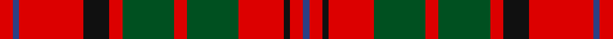

This page is one **sett** — a single exact thread-count. It belongs to the [tartan](/setts/r2db1r10k4r2dg8r2dg8r7k1r2db1/)
(the same proportion at any scale), whose colour order is pattern [BRKRGRGRKRBR](/stripes/brkrgrgrkrbr/).

Part of the [MacQuarrie](/tartans/macquarrie/) tartan — the named design grouping this sett with its other cloths.

Sourced from register-of-tartans.  It is a [12 stripe tartan](/stripes/stripes12/).

Original link https://www.tartanregister.gov.uk/tartanDetails.aspx?ref=2735

## Also known as

This cloth is also recorded under:

- MacQuarrie #4
- MacQuarrie #7
- MacQuarrie Ancient
- MacQuarrie, Ancient

## Register references

External register numbers recorded for this tartan.

- Scottish Register of Tartans: [2735](https://www.tartanregister.gov.uk/tartanDetails.aspx?ref=2735)
- Scottish Tartans World Register: 553

## Thread count
R/4 B2 R20 K8 R4 G16 R4 G16 R14 K2 R4 B/2

One full sett is **186 threads**.

## Palette

Palette: <strong>Tartan Register</strong>
<table><thead><tr><th>Colour</th><th>Threads</th><th>Shade</th><th>Base</th><th>OKLCh</th></tr></thead><tbody><tr><td>R/</td><td style="text-align:right;font-variant-numeric:tabular-nums">4</td><td><code style="background-color:#DC0000;">#DC0000</code> <small style="color:#888">#DC0000</small></td><td>R <code style="background-color:#CC0000;">#CC0000</code></td><td><small style="color:#888">oklch(56.2% 0.230 29.2)</small></td></tr><tr><td>B</td><td style="text-align:right;font-variant-numeric:tabular-nums">2</td><td><code style="background-color:#2C4084;">#2C4084</code> <small style="color:#888">#2C4084</small></td><td>B <code style="background-color:#2A418A;">#2A418A</code></td><td><small style="color:#888">oklch(39.4% 0.117 268.3)</small></td></tr><tr><td>R</td><td style="text-align:right;font-variant-numeric:tabular-nums">20</td><td><code style="background-color:#DC0000;">#DC0000</code> <small style="color:#888">#DC0000</small></td><td>R <code style="background-color:#CC0000;">#CC0000</code></td><td><small style="color:#888">oklch(56.2% 0.230 29.2)</small></td></tr><tr><td>K</td><td style="text-align:right;font-variant-numeric:tabular-nums">8</td><td><code style="background-color:#101010;">#101010</code> <small style="color:#888">#101010</small></td><td>K <code style="background-color:#000000;">#000000</code></td><td><small style="color:#888">oklch(17.3% 0.000 89.9)</small></td></tr><tr><td>R</td><td style="text-align:right;font-variant-numeric:tabular-nums">4</td><td><code style="background-color:#DC0000;">#DC0000</code> <small style="color:#888">#DC0000</small></td><td>R <code style="background-color:#CC0000;">#CC0000</code></td><td><small style="color:#888">oklch(56.2% 0.230 29.2)</small></td></tr><tr><td>G</td><td style="text-align:right;font-variant-numeric:tabular-nums">16</td><td><code style="background-color:#005020;">#005020</code> <small style="color:#888">#005020</small></td><td>G <code style="background-color:#006100;">#006100</code></td><td><small style="color:#888">oklch(37.7% 0.105 149.6)</small></td></tr><tr><td>R</td><td style="text-align:right;font-variant-numeric:tabular-nums">4</td><td><code style="background-color:#DC0000;">#DC0000</code> <small style="color:#888">#DC0000</small></td><td>R <code style="background-color:#CC0000;">#CC0000</code></td><td><small style="color:#888">oklch(56.2% 0.230 29.2)</small></td></tr><tr><td>G</td><td style="text-align:right;font-variant-numeric:tabular-nums">16</td><td><code style="background-color:#005020;">#005020</code> <small style="color:#888">#005020</small></td><td>G <code style="background-color:#006100;">#006100</code></td><td><small style="color:#888">oklch(37.7% 0.105 149.6)</small></td></tr><tr><td>R</td><td style="text-align:right;font-variant-numeric:tabular-nums">14</td><td><code style="background-color:#DC0000;">#DC0000</code> <small style="color:#888">#DC0000</small></td><td>R <code style="background-color:#CC0000;">#CC0000</code></td><td><small style="color:#888">oklch(56.2% 0.230 29.2)</small></td></tr><tr><td>K</td><td style="text-align:right;font-variant-numeric:tabular-nums">2</td><td><code style="background-color:#101010;">#101010</code> <small style="color:#888">#101010</small></td><td>K <code style="background-color:#000000;">#000000</code></td><td><small style="color:#888">oklch(17.3% 0.000 89.9)</small></td></tr><tr><td>R</td><td style="text-align:right;font-variant-numeric:tabular-nums">4</td><td><code style="background-color:#DC0000;">#DC0000</code> <small style="color:#888">#DC0000</small></td><td>R <code style="background-color:#CC0000;">#CC0000</code></td><td><small style="color:#888">oklch(56.2% 0.230 29.2)</small></td></tr><tr><td>B/</td><td style="text-align:right;font-variant-numeric:tabular-nums">2</td><td><code style="background-color:#2C4084;">#2C4084</code> <small style="color:#888">#2C4084</small></td><td>B <code style="background-color:#2A418A;">#2A418A</code></td><td><small style="color:#888">oklch(39.4% 0.117 268.3)</small></td></tr></tbody></table>

## Compared to the master

This cloth is one sett of its design; the master sett (the exemplar the design is anchored on) is below for comparison.

<figure style="margin:0"><figcaption style="color:#888;font-size:smaller">this sett</figcaption></figure>
<figure style="margin:0"><figcaption style="color:#888;font-size:smaller"><a href="/setts/k1r1dg1r21dg1r1k10r1dg14r1dg1r1dg1/">master sett →</a></figcaption></figure>

## Nearest tartans

The nearest existing variants by ΔTartan distance, with this tartan at the top so the swatches line up against it.

ΔTartan

Tartan

Sett

—

<a href="/ttd/edit/#slug=r2db1r10k4r2dg8r2dg8r7k1r2db1~x2">MacQuarrie Ancient</a> <a class="nn-out" href="/variants/s12/r2db1r10k4r2dg8r2dg8r7k1r2db1~x2/" title="open its dictionary page">↗</a>

0.56

<a href="/ttd/edit/#slug=k10r12dg3r12k2r12dg3r12dg20r2k8t2&amp;base=r2db1r10k4r2dg8r2dg8r7k1r2db1~x2">Nicolson MacNicol</a> <a class="nn-out" href="/variants/s12/k10r12dg3r12k2r12dg3r12dg20r2k8t2/" title="open its dictionary page">↗</a>

0.79

<a href="/ttd/edit/#slug=g5w2g8r9k3r4k3r17g3~x2&amp;base=r2db1r10k4r2dg8r2dg8r7k1r2db1~x2">Morrison</a> <a class="nn-out" href="/variants/s9/g5w2g8r9k3r4k3r17g3~x2/" title="open its dictionary page">↗</a>

0.79

<a href="/ttd/edit/#slug=r2db1r10k4r2g8r2g8r7k1r2db1~x2&amp;base=r2db1r10k4r2dg8r2dg8r7k1r2db1~x2">MacQuarrie, Ancient</a> <a class="nn-out" href="/variants/s12/r2db1r10k4r2g8r2g8r7k1r2db1~x2/" title="open its dictionary page">↗</a>

0.81

<a href="/ttd/edit/#slug=r8g2r8k8db1k3r2g15r8k2r6~x4&amp;base=r2db1r10k4r2dg8r2dg8r7k1r2db1~x2">MacNicol/Nicolson (Inverness Tweed Mill Co Ltd)</a> <a class="nn-out" href="/variants/s11/r8g2r8k8db1k3r2g15r8k2r6~x4/" title="open its dictionary page">↗</a>

0.83

<a href="/ttd/edit/#slug=w2r4dg8r16t2r3dg16r4t2r4w2~x2&amp;base=r2db1r10k4r2dg8r2dg8r7k1r2db1~x2">MacKinnon #10</a> <a class="nn-out" href="/variants/s11/w2r4dg8r16t2r3dg16r4t2r4w2~x2/" title="open its dictionary page">↗</a>

0.87

<a href="/ttd/edit/#slug=k2r8g2r8g13r1k7lb1k7r8g2r8k2~x4&amp;base=r2db1r10k4r2dg8r2dg8r7k1r2db1~x2">Nicolson (Lochcarron)</a> <a class="nn-out" href="/variants/s13/k2r8g2r8g13r1k7lb1k7r8g2r8k2~x4/" title="open its dictionary page">↗</a>

0.94

<a href="/ttd/edit/#slug=dg9lr4dg15r17k5r7k5r32dg5~x2&amp;base=r2db1r10k4r2dg8r2dg8r7k1r2db1~x2">Morrison LC</a> <a class="nn-out" href="/variants/s9/dg9lr4dg15r17k5r7k5r32dg5~x2/" title="open its dictionary page">↗</a>

0.94

<a href="/ttd/edit/#slug=dg9lr4dg15r17k5r7k5r32dg5&amp;base=r2db1r10k4r2dg8r2dg8r7k1r2db1~x2">Morrison LC</a> <a class="nn-out" href="/variants/s9/dg9lr4dg15r17k5r7k5r32dg5/" title="open its dictionary page">↗</a>

0.95

<a href="/ttd/edit/#slug=r5b3r24g7db6r3g3r3g11r6db3r3b3~x2&amp;base=r2db1r10k4r2dg8r2dg8r7k1r2db1~x2">Dabney Red (Personal)</a> <a class="nn-out" href="/variants/s13/r5b3r24g7db6r3g3r3g11r6db3r3b3~x2/" title="open its dictionary page">↗</a>

0.96

<a href="/ttd/edit/#slug=r12g2r4g4k15t4r4t2r12~x2&amp;base=r2db1r10k4r2dg8r2dg8r7k1r2db1~x2">Alexander - 1985 (Name)</a> <a class="nn-out" href="/variants/s9/r12g2r4g4k15t4r4t2r12~x2/" title="open its dictionary page">↗</a>

## Neighbour map

Every grey dot is one of 14360 variants placed by the first two principal components of the ΔTartan feature space (44% of its variance). Red is this tartan; blue dots are its nearest — click one to open its page.

<svg viewBox="0 0 640 380" role="img" style="max-width:100%;height:auto;border:1px solid #e0e0e0;border-radius:4px;display:block" xmlns="http://www.w3.org/2000/svg"><image href="/nn/cloud.v1.png" width="640" height="380"/><a href="/variants/s12/k10r12dg3r12k2r12dg3r12dg20r2k8t2/"><circle cx="247.4" cy="183.2" r="4" fill="#3465a4"><title>Nicolson MacNicol</title></circle></a><a href="/variants/s9/g5w2g8r9k3r4k3r17g3~x2/"><circle cx="285.1" cy="195.8" r="4" fill="#3465a4"><title>Morrison</title></circle></a><a href="/variants/s12/r2db1r10k4r2g8r2g8r7k1r2db1~x2/"><circle cx="258.0" cy="171.9" r="4" fill="#3465a4"><title>MacQuarrie, Ancient</title></circle></a><a href="/variants/s11/r8g2r8k8db1k3r2g15r8k2r6~x4/"><circle cx="270.5" cy="175.3" r="4" fill="#3465a4"><title>MacNicol/Nicolson (Inverness Tweed Mill Co Ltd)</title></circle></a><a href="/variants/s11/w2r4dg8r16t2r3dg16r4t2r4w2~x2/"><circle cx="259.0" cy="174.2" r="4" fill="#3465a4"><title>MacKinnon #10</title></circle></a><a href="/variants/s13/k2r8g2r8g13r1k7lb1k7r8g2r8k2~x4/"><circle cx="241.1" cy="173.1" r="4" fill="#3465a4"><title>Nicolson (Lochcarron)</title></circle></a><a href="/variants/s9/dg9lr4dg15r17k5r7k5r32dg5~x2/"><circle cx="297.6" cy="202.0" r="4" fill="#3465a4"><title>Morrison LC</title></circle></a><a href="/variants/s9/dg9lr4dg15r17k5r7k5r32dg5/"><circle cx="297.6" cy="202.0" r="4" fill="#3465a4"><title>Morrison LC</title></circle></a><a href="/variants/s13/r5b3r24g7db6r3g3r3g11r6db3r3b3~x2/"><circle cx="297.6" cy="177.8" r="4" fill="#3465a4"><title>Dabney Red (Personal)</title></circle></a><a href="/variants/s9/r12g2r4g4k15t4r4t2r12~x2/"><circle cx="258.2" cy="201.2" r="4" fill="#3465a4"><title>Alexander - 1985 (Name)</title></circle></a><circle cx="275.2" cy="176.1" r="5" fill="#c00000"/></svg>

ID: /variants/s12/r2db1r10k4r2dg8r2dg8r7k1r2db1~x2/
