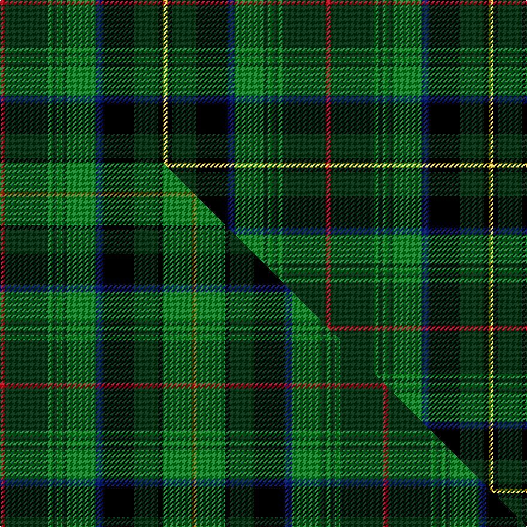

This page is one **sett** — a single exact thread-count. It belongs to the [tartan](/setts/r2dg18g2dg2g2dg2g12db3k13dg10k2ly2/)
(the same proportion at any scale), whose colour order is pattern [RGGGGGGBKGKY](/stripes/rggggggbkgky/).

Part of the [McHeadley Society](/tartans/mcheadley-society/) tartan — the named design grouping this sett with its other cloths.

Sourced from tartans-authority.  It is a [12 stripe tartan](/stripes/stripes12/).

Original link http://www.tartansauthority.com/tartan-ferret/display/10450/

## Register references

External register numbers recorded for this tartan.

- Scottish Register of Tartans: [10450](https://www.tartanregister.gov.uk/tartanDetails?ref=10450)
- Scottish Tartans Authority (ITI): 10450

## Thread count
R/4 DG36 G4 DG4 G4 DG4 G24 DB6 K26 DG20 K4 LY/4

One full sett is **272 threads**.

## Palette
<table><thead><tr><th>Colour</th><th>Shade</th><th>OKLCh</th></tr></thead><tbody><tr><td>DB</td><td><code style="background-color:#082077;">#082077</code> <small style="color:#888">#082077</small></td><td><small style="color:#888">oklch(30.0% 0.149 265.1)</small></td></tr><tr><td>DG</td><td><code style="background-color:#053819;">#053819</code> <small style="color:#888">#053819</small></td><td><small style="color:#888">oklch(30.0% 0.075 151.3)</small></td></tr><tr><td>G</td><td><code style="background-color:#008B2A;">#008B2A</code> <small style="color:#888">#008B2A</small></td><td><small style="color:#888">oklch(55.4% 0.170 145.9)</small></td></tr><tr><td>K</td><td><code style="background-color:#000000;">#000000</code> <small style="color:#888">#000000</small></td><td><small style="color:#888">oklch(0.0% 0.000 0.0)</small></td></tr><tr><td>R</td><td><code style="background-color:#D60020;">#D60020</code> <small style="color:#888">#D60020</small></td><td><small style="color:#888">oklch(55.2% 0.224 25.5)</small></td></tr><tr><td>LY</td><td><code style="background-color:#DCBC32;">#DCBC32</code> <small style="color:#888">#DCBC32</small></td><td><small style="color:#888">oklch(80.0% 0.150 95.2)</small></td></tr></tbody></table>

# Sample pattern

## Compared to the master

This cloth is one sett of its design; the master sett (the exemplar the design is anchored on) is below for comparison.

Its **ΔTartan distance** from the master is **1.28** — the same measure the nearest-tartans table ranks by (0 is identical; a re-scale of the same cloth is near 0, a recolour or a different proportion further).

<figure class="master-compare" style="margin:0">

this sett
master sett ★

<figcaption style="color:#888;font-size:smaller">One weave of this sett against the <a href="/setts/r2dg18g2dg2g2dg2g12db3k13dg10k2g12y2/">master sett ★</a>, split on the diagonal: a shared proportion runs seamlessly across it with only the shades shifting; a different proportion breaks on it.</figcaption>
</figure>

## Nearest tartan variants

The nearest existing variants by ΔTartan distance, with this cloth at the top so the swatches line up against it.

ΔTartan

Threads

Variant

Sett

—

272

<a href="/variants/s12/r2dg18g2dg2g2dg2g12db3k13dg10k2ly2~x2/">McHeadley Society (Corporate)</a>

<a href="/ttd/edit/#slug=k4dg10k13db3dgi12dg2dgi2dg2dgi2dg18r2~x2~dgi1806142&amp;base=r2dg18g2dg2g2dg2g12db3k13dg10k2ly2~x2" title="compare in the TTD">0.34</a>

268

<a href="/variants/s11/k4dg10k13db3dgi12dg2dgi2dg2dgi2dg18r2~x2~dgi1806142/">McHeadley Society Corporate Tartan</a>

<a href="/ttd/edit/#slug=r2dg18g2dg2g2dg2g12db3k13dg10k2g12y2~x2&amp;base=r2dg18g2dg2g2dg2g12db3k13dg10k2ly2~x2" title="compare in the TTD">1.28</a>

320

<a href="/variants/s13/r2dg18g2dg2g2dg2g12db3k13dg10k2g12y2~x2/">McHeadley Society</a>

<a href="/ttd/edit/#slug=dg6g3dg24k2dg4k16o5dg2w4dg2g21dg2k2y3~x2&amp;base=r2dg18g2dg2g2dg2g12db3k13dg10k2ly2~x2" title="compare in the TTD">1.89</a>

366

<a href="/variants/s14/dg6g3dg24k2dg4k16o5dg2w4dg2g21dg2k2y3~x2/">Celtic F.C.</a>

<a href="/ttd/edit/#slug=dg19g5k2t3dg5g3t5k2dt3g5w2~x2~t2304245-dt1204274&amp;base=r2dg18g2dg2g2dg2g12db3k13dg10k2ly2~x2" title="compare in the TTD">1.93</a>

174

<a href="/variants/s11/dg19g5k2t3dg5g3t5k2db3g5w2~x2~t2304245-db1204274/">MacLean, Kenneth, baron of Denboig (Personal)</a>

<a href="/ttd/edit/#slug=g12r2g2r5g16db3n2k2n3db6k20y3~x2&amp;base=r2dg18g2dg2g2dg2g12db3k13dg10k2ly2~x2" title="compare in the TTD">2.32</a>

274

<a href="/variants/s12/g12r2g2r5g16db3n2k2n3db6k20y3~x2/">Kelsey, William (Personal)</a>

<a href="/ttd/edit/#slug=k3gi2k12db4g19dr3g19db4k12gi2dy3~x2~gi2504202-g2203152&amp;base=r2dg18g2dg2g2dg2g12db3k13dg10k2ly2~x2" title="compare in the TTD">2.37</a>

320

<a href="/variants/s11/k3gi2k12db4g19dr3g19db4k12gi2dy3~x2~gi2504202-g2203152/">Loch Lomond Millenium Comemmorative Tartan</a>

<a href="/ttd/edit/#slug=dg5g3dg16k2dg4k12g4dg2lb5dg2g16dg2k2y3~x2&amp;base=r2dg18g2dg2g2dg2g12db3k13dg10k2ly2~x2" title="compare in the TTD">2.44</a>

296

<a href="/variants/s14/dg5g3dg16k2dg4k12g4dg2lb5dg2g16dg2k2y3~x2/">Celtic Football Club (1996)</a>

<a href="/ttd/edit/#slug=r2g6db12k3lb3k3g16k2g2k2g2k12y2~x2&amp;base=r2dg18g2dg2g2dg2g12db3k13dg10k2ly2~x2" title="compare in the TTD">2.52</a>

260

<a href="/variants/s13/r2g6db12k3lb3k3g16k2g2k2g2k12y2~x2/">MacInnes</a>

<a href="/ttd/edit/#slug=r2g6db12k3lb3k3g16k2g2k2g2k12y2&amp;base=r2dg18g2dg2g2dg2g12db3k13dg10k2ly2~x2" title="compare in the TTD">2.52</a>

130

<a href="/variants/s13/r2g6db12k3lb3k3g16k2g2k2g2k12y2/">MacInnes</a>

<a href="/ttd/edit/#slug=g12r2g2r5g16db3n2k2n3db6k20ly3~x2&amp;base=r2dg18g2dg2g2dg2g12db3k13dg10k2ly2~x2" title="compare in the TTD">2.58</a>

274

<a href="/variants/s12/g12r2g2r5g16db3n2k2n3db6k20ly3~x2/">Kelsey, William (Personal)</a>

## Neighbour map

Every grey dot is one of 13620 variants placed by the first two principal components of the ΔTartan feature space (42% of its variance). Red is this tartan; blue dots are its nearest — click one to open its page.

<svg viewBox="0 0 640 380" role="img" style="max-width:100%;height:auto;border:1px solid #e0e0e0;border-radius:4px;display:block" xmlns="http://www.w3.org/2000/svg"><image href="/nn/cloud.v1.png" width="640" height="380"/><a href="/variants/s11/k4dg10k13db3dgi12dg2dgi2dg2dgi2dg18r2~x2~dgi1806142/"><circle cx="195.0" cy="152.1" r="4" fill="#3465a4"><title>McHeadley Society Corporate Tartan</title></circle></a><a href="/variants/s13/r2dg18g2dg2g2dg2g12db3k13dg10k2g12y2~x2/"><circle cx="140.8" cy="151.5" r="4" fill="#3465a4"><title>McHeadley Society</title></circle></a><a href="/variants/s14/dg6g3dg24k2dg4k16o5dg2w4dg2g21dg2k2y3~x2/"><circle cx="141.3" cy="115.8" r="4" fill="#3465a4"><title>Celtic F.C.</title></circle></a><a href="/variants/s11/dg19g5k2t3dg5g3t5k2db3g5w2~x2~t2304245-db1204274/"><circle cx="164.8" cy="152.8" r="4" fill="#3465a4"><title>MacLean, Kenneth, baron of Denboig (Personal)</title></circle></a><a href="/variants/s12/g12r2g2r5g16db3n2k2n3db6k20y3~x2/"><circle cx="112.1" cy="134.1" r="4" fill="#3465a4"><title>Kelsey, William (Personal)</title></circle></a><a href="/variants/s11/k3gi2k12db4g19dr3g19db4k12gi2dy3~x2~gi2504202-g2203152/"><circle cx="152.5" cy="146.4" r="4" fill="#3465a4"><title>Loch Lomond Millenium Comemmorative Tartan</title></circle></a><a href="/variants/s14/dg5g3dg16k2dg4k12g4dg2lb5dg2g16dg2k2y3~x2/"><circle cx="136.3" cy="160.9" r="4" fill="#3465a4"><title>Celtic Football Club (1996)</title></circle></a><a href="/variants/s13/r2g6db12k3lb3k3g16k2g2k2g2k12y2~x2/"><circle cx="102.1" cy="140.2" r="4" fill="#3465a4"><title>MacInnes</title></circle></a><a href="/variants/s13/r2g6db12k3lb3k3g16k2g2k2g2k12y2/"><circle cx="102.1" cy="140.2" r="4" fill="#3465a4"><title>MacInnes</title></circle></a><a href="/variants/s12/g12r2g2r5g16db3n2k2n3db6k20ly3~x2/"><circle cx="111.9" cy="135.4" r="4" fill="#3465a4"><title>Kelsey, William (Personal)</title></circle></a><circle cx="164.8" cy="144.6" r="5" fill="#c00000"/><text x="320" y="376" text-anchor="middle" font-size="11" fill="#999">ground</text><text x="11" y="190" text-anchor="middle" font-size="11" fill="#999" transform="rotate(-90 11 190)">complexity</text></svg>

ID: /variants/s12/r2dg18g2dg2g2dg2g12db3k13dg10k2ly2~x2/
