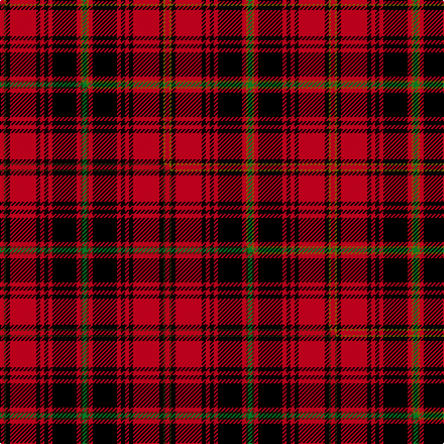

This is one **variant** — a specific cloth: this exact thread count and colourway, with its own
provenance below. It is one weaving of the [sett](/tartans/h/ha/hallingdal/) (the scale-free proportion — the
same cloth at any scale or shade), whose colour order is pattern [GGRKRKRKRKGR](/stripes/ggrkrkrkrkgr/).

Part of the [Hallingdal](/tartans/h/ha/hallingdal/) tartan — the named design grouping this sett with its other cloths.

Sourced from house-of-tartan.  It is a [12 stripe tartan](/stripes/stripes12/).

Original link [http://www.house-of-tartan.scotland.net/house/TartanViewjs.asp?colr=Def&tnam=1021](http://www.house-of-tartan.scotland.net/house/TartanViewjs.asp?colr=Def&tnam=1021)

## Provenance

Earliest known date: 1970 Hallingdal is a secluded valley in central Norway. This pattern was produced around 1970 and is similar but not identical to much older specimens. Erik Paulsen (MSTS) says that in Hallingdal there is a living tradition of tartan, but he can find no concrete evidence of Scottish influence in this area. Plain weave.

2 attestations — the source records this cloth was collapsed from (oldest owns this page)

<ul>
<li>1970 — Hallingdal District Tartan (house-of-tartan, <a href="http://www.house-of-tartan.scotland.net/house/TartanViewjs.asp?colr=Def&tnam=1021">record</a>) </li>
<li>undated — Hallingdal (weddslist, <a href="http://www.weddslist.com/cgi-bin/tartans/pg.pl?source=sts">record</a>) </li>
</ul>

Dataset <small>— provenance for this record, inherited from the source manifest</small>

<dl class="dataset-prov">
<dt>source</dt><dd><a href="/sources/house-of-tartan/">House of Tartan</a></dd>
<dt>data captured from</dt><dd><a href="https://github.com/thetartan/tartan-database/blob/master/data/house-of-tartan/data.csv">https://github.com/thetartan/tartan-database/blob/master/data/house-of-tartan/data.csv</a></dd>
<dt>data date</dt><dd>1970 <small>(this record)</small></dd>
<dt>licence</dt><dd><a href="https://creativecommons.org/licenses/by-nc-nd/4.0/">CC BY-NC-ND 4.0</a></dd>
</dl>

Capture chain <small>— the hands this data passed through, oldest first; each capture carries its own licence</small>

<ol class="capture-chain">
<li><a href="http://www.house-of-tartan.scotland.net/">House of Tartan</a> <small>the weaver/retailer's database — the site is now offline; the URL is kept as the ultimate source's identity</small></li>
<li><a href="https://github.com/thetartan/tartan-database">thetartan/tartan-database</a> <small>2016-2017</small> · <a href="https://creativecommons.org/licenses/by-nc-nd/4.0/">CC BY-NC-ND 4.0</a> <small>Levko Kravets's frozen compilation — the capture we vendored, and where its CC licence text came from</small></li>
<li>this dictionary <small>captured 2026-06-10 · commit 5bf86c7566</small> <small>each re-capture is a git commit to data/sources</small></li>
</ol>

## Thread count
R/4 Y2 K4 R26 K4 R4 K4 R4 K24 R4 Y2 G/4

One full sett is **164 threads**.

## Palette
<table><thead><tr><th>Colour</th><th>Shade</th><th>OKLCh</th></tr></thead><tbody><tr><td>G</td><td><code style="background-color:#008B2A;">#008B2A</code> <small style="color:#888">#008B2A</small></td><td><small style="color:#888">oklch(55.4% 0.170 145.9)</small></td></tr><tr><td>K</td><td><code style="background-color:#000000;">#000000</code> <small style="color:#888">#000000</small></td><td><small style="color:#888">oklch(0.0% 0.000 0.0)</small></td></tr><tr><td>R</td><td><code style="background-color:#D60020;">#D60020</code> <small style="color:#888">#D60020</small></td><td><small style="color:#888">oklch(55.2% 0.224 25.5)</small></td></tr><tr><td>Y</td><td><code style="background-color:#8B6E00;">#8B6E00</code> <small style="color:#888">#8B6E00</small></td><td><small style="color:#888">oklch(55.1% 0.113 90.4)</small></td></tr></tbody></table>

# Sample pattern

## Compared to the master

This cloth is one sett of its design; the master sett (the exemplar the design is anchored on) is below for comparison.

Its **ΔTartan distance** from the master is **0.03** — the same measure the nearest-tartans table ranks by (0 is identical; a re-scale of the same cloth is near 0, a recolour or a different proportion further).

<figure class="master-compare" style="margin:0">

this sett
master sett ★

<figcaption style="color:#888;font-size:smaller">One weave of this sett against the <a href="/setts/r2dy1k2r13k2r2k2r2k12r2dy1g2/">master sett ★</a>, split on the diagonal: a shared proportion runs seamlessly across it with only the shades shifting; a different proportion breaks on it.</figcaption>
</figure>

## Nearest tartan variants

The nearest existing variants by ΔTartan distance, with this cloth at the top so the swatches line up against it.

ΔTartan

Threads

Variant

Sett

—

164

<a href="/variants/s12/r2y1k2r13k2r2k2r2k12r2y1g2~x2/">Hallingdal District Tartan</a>

<a href="/ttd/edit/#slug=r2dy1k2r13k2r2k2r2k12r2dy1g2~x2&amp;base=r2y1k2r13k2r2k2r2k12r2y1g2~x2" title="compare in the TTD">0.03</a>

164

<a href="/variants/s12/r2dy1k2r13k2r2k2r2k12r2dy1g2~x2/">Hallingdal</a>

<a href="/ttd/edit/#slug=y4k2r7k15r3k3r3k7r28dg7r6dg2&amp;base=r2y1k2r13k2r2k2r2k12r2y1g2~x2" title="compare in the TTD">1.36</a>

168

<a href="/variants/s12/y4k2r7k15r3k3r3k7r28dg7r6dg2/">Walker</a>

<a href="/ttd/edit/#slug=dp3r4k5r12k24r3k10r26k12dp3r6w3~x2&amp;base=r2y1k2r13k2r2k2r2k12r2y1g2~x2" title="compare in the TTD">1.51</a>

432

<a href="/variants/s12/dp3r4k5r12k24r3k10r26k12dp3r6w3~x2/">MacKinnon Black (Personal)</a>

<a href="/ttd/edit/#slug=n3k14r3k14lb3r32k2r6k2~x2&amp;base=r2y1k2r13k2r2k2r2k12r2y1g2~x2" title="compare in the TTD">1.99</a>

306

<a href="/variants/s9/n3k14r3k14lb3r32k2r6k2~x2/">Gallmore (Fashion)</a>

<a href="/ttd/edit/#slug=k9r4k2r4k2r29k9r4lg14y2~x2&amp;base=r2y1k2r13k2r2k2r2k12r2y1g2~x2" title="compare in the TTD">2.11</a>

294

<a href="/variants/s10/k9r4k2r4k2r29k9r4lg14y2~x2/">Hannay Dress (Dance)</a>

<a href="/ttd/edit/#slug=r8k14r6y6r34k10r6w6r6k64r44db9r6&amp;base=r2y1k2r13k2r2k2r2k12r2y1g2~x2" title="compare in the TTD">2.12</a>

424

<a href="/variants/s13/r8k14r6y6r34k10r6w6r6k64r44db9r6/">First Special Service Force</a>

<a href="/ttd/edit/#slug=r8k14r6ly6r34k10r6w6r6k64r44db9r6&amp;base=r2y1k2r13k2r2k2r2k12r2y1g2~x2" title="compare in the TTD">2.13</a>

424

<a href="/variants/s13/r8k14r6ly6r34k10r6w6r6k64r44db9r6/">First Special Service Force</a>

<a href="/ttd/edit/#slug=r4k9r3y3r18k4r2w2r2k36r24db4r3~x2&amp;base=r2y1k2r13k2r2k2r2k12r2y1g2~x2" title="compare in the TTD">2.26</a>

442

<a href="/variants/s13/r4k9r3y3r18k4r2w2r2k36r24db4r3~x2/">First Special Services Forces (Mil)</a>

<a href="/ttd/edit/#slug=k2r2k12r2k2r18k2r2k12r2w1~x2&amp;base=r2y1k2r13k2r2k2r2k12r2y1g2~x2" title="compare in the TTD">2.39</a>

222

<a href="/variants/s11/k2r2k12r2k2r18k2r2k12r2w1~x2/">Hebrides #12</a>

<a href="/ttd/edit/#slug=r60ly4k22g5k25lb8k4r4k4~x2&amp;base=r2y1k2r13k2r2k2r2k12r2y1g2~x2" title="compare in the TTD">2.41</a>

416

<a href="/variants/s9/r60ly4k22g5k25lb8k4r4k4~x2/">State Seal of Alabama (Fashion)</a>

## Neighbour map

Every grey dot is one of 13662 variants placed by the first two principal components of the ΔTartan feature space (42% of its variance). Red is this tartan; blue dots are its nearest — click one to open its page. The map is a flat projection of a many-dimensional space — [how to read it](/posts/neighbourhood-maps/).

<svg viewBox="0 0 640 380" role="img" style="max-width:100%;height:auto;border:1px solid #e0e0e0;border-radius:4px;display:block" xmlns="http://www.w3.org/2000/svg"><image href="/nn/cloud.v1.png" width="640" height="380"/><a href="/variants/s12/r2dy1k2r13k2r2k2r2k12r2dy1g2~x2/"><circle cx="234.0" cy="94.1" r="4" fill="#3465a4"><title>Hallingdal</title></circle></a><a href="/variants/s12/y4k2r7k15r3k3r3k7r28dg7r6dg2/"><circle cx="253.1" cy="123.8" r="4" fill="#3465a4"><title>Walker</title></circle></a><a href="/variants/s12/dp3r4k5r12k24r3k10r26k12dp3r6w3~x2/"><circle cx="205.1" cy="152.0" r="4" fill="#3465a4"><title>MacKinnon Black (Personal)</title></circle></a><a href="/variants/s9/n3k14r3k14lb3r32k2r6k2~x2/"><circle cx="267.4" cy="121.9" r="4" fill="#3465a4"><title>Gallmore (Fashion)</title></circle></a><a href="/variants/s10/k9r4k2r4k2r29k9r4lg14y2~x2/"><circle cx="232.7" cy="127.2" r="4" fill="#3465a4"><title>Hannay Dress (Dance)</title></circle></a><a href="/variants/s13/r8k14r6y6r34k10r6w6r6k64r44db9r6/"><circle cx="216.8" cy="110.6" r="4" fill="#3465a4"><title>First Special Service Force</title></circle></a><a href="/variants/s13/r8k14r6ly6r34k10r6w6r6k64r44db9r6/"><circle cx="215.1" cy="110.1" r="4" fill="#3465a4"><title>First Special Service Force</title></circle></a><a href="/variants/s13/r4k9r3y3r18k4r2w2r2k36r24db4r3~x2/"><circle cx="239.7" cy="85.1" r="4" fill="#3465a4"><title>First Special Services Forces (Mil)</title></circle></a><a href="/variants/s11/k2r2k12r2k2r18k2r2k12r2w1~x2/"><circle cx="286.1" cy="102.7" r="4" fill="#3465a4"><title>Hebrides #12</title></circle></a><a href="/variants/s9/r60ly4k22g5k25lb8k4r4k4~x2/"><circle cx="218.8" cy="106.0" r="4" fill="#3465a4"><title>State Seal of Alabama (Fashion)</title></circle></a><circle cx="241.4" cy="117.2" r="5" fill="#c00000"/><text x="320" y="376" text-anchor="middle" font-size="11" fill="#999">ground</text><text x="11" y="190" text-anchor="middle" font-size="11" fill="#999" transform="rotate(-90 11 190)">complexity</text></svg>

ID: /variants/s12/r2y1k2r13k2r2k2r2k12r2y1g2~x2/
