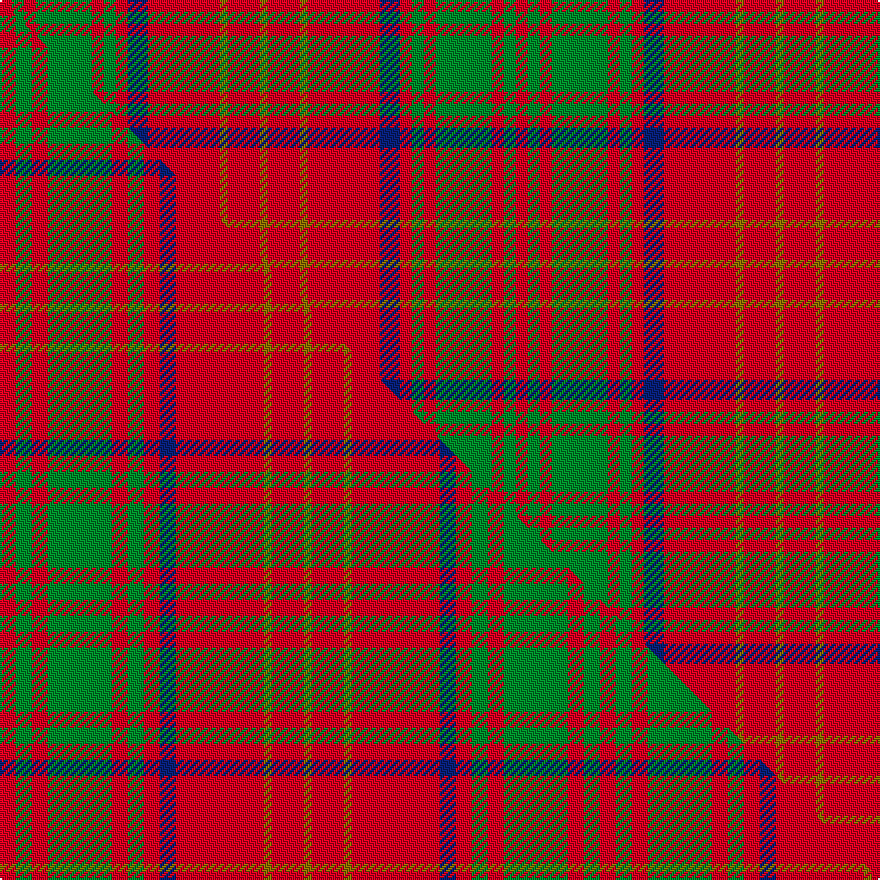

This is one **variant** — a specific cloth: this exact thread count and colourway, with its own
provenance below. It is one weaving of the [sett](/setts/r3g3r3g14r3g3r3db5r18y2r8y2/) (the scale-free proportion — the
same cloth at any scale or shade), whose colour order is pattern [GRGRBRGRGRGR](/stripes/grgrbrgrgrgr/).

Part of the [Burns](/tartans/b/bu/burns/) tartan — the named design grouping this sett with its other cloths.

Sourced from house-of-tartan.  It is a [12 stripe tartan](/stripes/stripes12/).

Original link [http://www.house-of-tartan.scotland.net/house/TartanViewjs.asp?colr=Def&tnam=1539](http://www.house-of-tartan.scotland.net/house/TartanViewjs.asp?colr=Def&tnam=1539)

## Provenance

Earliest known date: pre 2003 Modern family sett discovered by MacKinlay at Messrs Forsyth. Probably dates between 1930-50. There is also a Robert Burns check. (see under R...)

2 attestations — the source records this cloth was collapsed from (oldest owns this page)

<ul>
<li>pre 2003 — Burns Family Tartan (house-of-tartan, <a href="http://www.house-of-tartan.scotland.net/house/TartanViewjs.asp?colr=Def&tnam=1539">record</a>) </li>
<li>undated — Burns (weddslist, <a href="http://www.weddslist.com/cgi-bin/tartans/pg.pl?source=sts">record</a>) </li>
</ul>

Dataset <small>— provenance for this record, inherited from the source manifest</small>

<dl class="dataset-prov">
<dt>source</dt><dd><a href="/sources/house-of-tartan/">House of Tartan</a></dd>
<dt>data captured from</dt><dd><a href="https://github.com/thetartan/tartan-database/blob/master/data/house-of-tartan/data.csv">https://github.com/thetartan/tartan-database/blob/master/data/house-of-tartan/data.csv</a></dd>
<dt>data date</dt><dd>pre 2003 <small>(this record)</small></dd>
<dt>licence</dt><dd><a href="https://creativecommons.org/licenses/by-nc-nd/4.0/">CC BY-NC-ND 4.0</a></dd>
</dl>

Capture chain <small>— the hands this data passed through, oldest first; each capture carries its own licence</small>

<ol class="capture-chain">
<li><a href="http://www.house-of-tartan.scotland.net/">House of Tartan</a> <small>the weaver/retailer's database — the site is now offline; the URL is kept as the ultimate source's identity</small></li>
<li><a href="https://github.com/thetartan/tartan-database">thetartan/tartan-database</a> <small>2016-2017</small> · <a href="https://creativecommons.org/licenses/by-nc-nd/4.0/">CC BY-NC-ND 4.0</a> <small>Levko Kravets's frozen compilation — the capture we vendored, and where its CC licence text came from</small></li>
<li>this dictionary <small>captured 2026-06-10 · commit 5bf86c7566</small> <small>each re-capture is a git commit to data/sources</small></li>
</ol>

## Thread count
R/6 G6 R6 G28 R6 G6 R6 DB10 R36 Y4 R16 Y/4

One full sett is **258 threads**.

## Palette
<table><thead><tr><th>Colour</th><th>Shade</th><th>OKLCh</th></tr></thead><tbody><tr><td>DB</td><td><code style="background-color:#082077;">#082077</code> <small style="color:#888">#082077</small></td><td><small style="color:#888">oklch(30.0% 0.149 265.1)</small></td></tr><tr><td>G</td><td><code style="background-color:#008B2A;">#008B2A</code> <small style="color:#888">#008B2A</small></td><td><small style="color:#888">oklch(55.4% 0.170 145.9)</small></td></tr><tr><td>R</td><td><code style="background-color:#D60020;">#D60020</code> <small style="color:#888">#D60020</small></td><td><small style="color:#888">oklch(55.2% 0.224 25.5)</small></td></tr><tr><td>Y</td><td><code style="background-color:#8B6E00;">#8B6E00</code> <small style="color:#888">#8B6E00</small></td><td><small style="color:#888">oklch(55.1% 0.113 90.4)</small></td></tr></tbody></table>

# Sample pattern

## Compared to the master

This cloth is one sett of its design; the master sett (the exemplar the design is anchored on) is below for comparison.

Its **ΔTartan distance** from the master is **0.22** — the same measure the nearest-tartans table ranks by (0 is identical; a re-scale of the same cloth is near 0, a recolour or a different proportion further).

<figure class="master-compare" style="margin:0">

this sett
master sett ★

<figcaption style="color:#888;font-size:smaller">One weave of this sett against the <a href="/setts/r2g2r2g8r2g2r2db2r11y1r4y1/">master sett ★</a>, split on the diagonal: a shared proportion runs seamlessly across it with only the shades shifting; a different proportion breaks on it.</figcaption>
</figure>

## Nearest tartan variants

The nearest existing variants by ΔTartan distance, with this cloth at the top so the swatches line up against it.

ΔTartan

Threads

Variant

Sett

—

258

<a href="/variants/s12/r3g3r3g14r3g3r3db5r18y2r8y2~x2/">Burns Family Tartan</a>

<a href="/ttd/edit/#slug=r2g2r2g8r2g2r2db2r11y1r4y1~x4&amp;base=r3g3r3g14r3g3r3db5r18y2r8y2~x2" title="compare in the TTD">0.22</a>

300

<a href="/variants/s12/r2g2r2g8r2g2r2db2r11y1r4y1~x4/">Burns 1930</a>

<a href="/ttd/edit/#slug=r5t3r24g7db6r3g3r3g11r6db3r3t3~x2&amp;base=r3g3r3g14r3g3r3db5r18y2r8y2~x2" title="compare in the TTD">1.52</a>

304

<a href="/variants/s13/r5t3r24g7db6r3g3r3g11r6db3r3t3~x2/">Dabney Red (Personal)</a>

<a href="/ttd/edit/#slug=r9dp2r21y2r2dp8r2g2r2g17r2dp2r8~x2&amp;base=r3g3r3g14r3g3r3db5r18y2r8y2~x2" title="compare in the TTD">1.67</a>

282

<a href="/variants/s13/r9dp2r21y2r2dp8r2g2r2g17r2dp2r8~x2/">London Caledonian Games Association</a>

<a href="/ttd/edit/#slug=r9db2r21lb2r2db8r2g2r2g17r2db2r8~x2&amp;base=r3g3r3g14r3g3r3db5r18y2r8y2~x2" title="compare in the TTD">1.95</a>

282

<a href="/variants/s13/r9db2r21lb2r2db8r2g2r2g17r2db2r8~x2/">London Caledonian Commemorative Tartan</a>

<a href="/ttd/edit/#slug=r12t2w1t2r3g8r3t1~x4&amp;base=r3g3r3g14r3g3r3db5r18y2r8y2~x2" title="compare in the TTD">2.16</a>

204

<a href="/variants/s8/r12t2w1t2r3g8r3t1~x4/">Chisholm, The</a>

<a href="/ttd/edit/#slug=r12dr2w1dr2r3g8r3dr1~x2&amp;base=r3g3r3g14r3g3r3db5r18y2r8y2~x2" title="compare in the TTD">2.29</a>

102

<a href="/variants/s8/r12dr2w1dr2r3g8r3dr1~x2/">Chisholm</a>

<a href="/ttd/edit/#slug=r12dr2w1dr2r3g8r3dr1&amp;base=r3g3r3g14r3g3r3db5r18y2r8y2~x2" title="compare in the TTD">2.29</a>

51

<a href="/variants/s8/r12dr2w1dr2r3g8r3dr1/">Chisholm</a>

<a href="/ttd/edit/#slug=r8g2r2g6r1g6r2g2r8y1&amp;base=r3g3r3g14r3g3r3db5r18y2r8y2~x2" title="compare in the TTD">2.30</a>

67

<a href="/variants/s10/r8g2r2g6r1g6r2g2r8y1/">Bruce</a>

<a href="/ttd/edit/#slug=t10r2w2r16g6r1g2r1g3r6~x4&amp;base=r3g3r3g14r3g3r3db5r18y2r8y2~x2" title="compare in the TTD">2.30</a>

328

<a href="/variants/s10/t10r2w2r16g6r1g2r1g3r6~x4/">Harkness Dress (Name)</a>

<a href="/ttd/edit/#slug=r1w1r6db3r1g6r1g6r6db1r1w1~x2&amp;base=r3g3r3g14r3g3r3db5r18y2r8y2~x2" title="compare in the TTD">2.31</a>

132

<a href="/variants/s12/r1w1r6db3r1g6r1g6r6db1r1w1~x2/">MacQuarrie SM</a>

## Neighbour map

Every grey dot is one of 13621 variants placed by the first two principal components of the ΔTartan feature space (42% of its variance). Red is this tartan; blue dots are its nearest — click one to open its page.

<svg viewBox="0 0 640 380" role="img" style="max-width:100%;height:auto;border:1px solid #e0e0e0;border-radius:4px;display:block" xmlns="http://www.w3.org/2000/svg"><image href="/nn/cloud.v1.png" width="640" height="380"/><a href="/variants/s12/r2g2r2g8r2g2r2db2r11y1r4y1~x4/"><circle cx="353.8" cy="178.6" r="4" fill="#3465a4"><title>Burns 1930</title></circle></a><a href="/variants/s13/r5t3r24g7db6r3g3r3g11r6db3r3t3~x2/"><circle cx="294.7" cy="183.0" r="4" fill="#3465a4"><title>Dabney Red (Personal)</title></circle></a><a href="/variants/s13/r9dp2r21y2r2dp8r2g2r2g17r2dp2r8~x2/"><circle cx="341.4" cy="164.2" r="4" fill="#3465a4"><title>London Caledonian Games Association</title></circle></a><a href="/variants/s13/r9db2r21lb2r2db8r2g2r2g17r2db2r8~x2/"><circle cx="320.7" cy="159.5" r="4" fill="#3465a4"><title>London Caledonian Commemorative Tartan</title></circle></a><a href="/variants/s8/r12t2w1t2r3g8r3t1~x4/"><circle cx="336.9" cy="190.3" r="4" fill="#3465a4"><title>Chisholm, The</title></circle></a><a href="/variants/s8/r12dr2w1dr2r3g8r3dr1~x2/"><circle cx="332.3" cy="184.9" r="4" fill="#3465a4"><title>Chisholm</title></circle></a><a href="/variants/s8/r12dr2w1dr2r3g8r3dr1/"><circle cx="332.3" cy="184.9" r="4" fill="#3465a4"><title>Chisholm</title></circle></a><a href="/variants/s10/r8g2r2g6r1g6r2g2r8y1/"><circle cx="356.0" cy="232.8" r="4" fill="#3465a4"><title>Bruce</title></circle></a><a href="/variants/s10/t10r2w2r16g6r1g2r1g3r6~x4/"><circle cx="318.6" cy="170.3" r="4" fill="#3465a4"><title>Harkness Dress (Name)</title></circle></a><a href="/variants/s12/r1w1r6db3r1g6r1g6r6db1r1w1~x2/"><circle cx="226.4" cy="203.1" r="4" fill="#3465a4"><title>MacQuarrie SM</title></circle></a><circle cx="325.8" cy="186.8" r="5" fill="#c00000"/><text x="320" y="376" text-anchor="middle" font-size="11" fill="#999">ground</text><text x="11" y="190" text-anchor="middle" font-size="11" fill="#999" transform="rotate(-90 11 190)">complexity</text></svg>

ID: /variants/s12/r3g3r3g14r3g3r3db5r18y2r8y2~x2/
