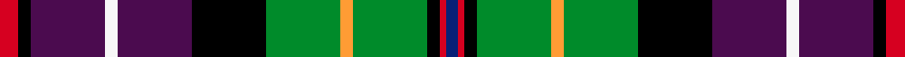

This page is one **sett** — a single exact thread-count. It belongs to the [tartan](/setts/r3k2dp12w2dp12k12g12lo2g12k2r1db2/)
(the same proportion at any scale), whose colour order is pattern [BRKGYGKBWBKR](/stripes/brkgygkbwbkr/).

Part of the [Rust](/tartans/rust/) tartan — the named design grouping this sett with its other cloths.

Sourced from register-of-tartans.  It is a [12 stripe tartan](/stripes/stripes12/).

Original link https://www.tartanregister.gov.uk/tartanDetails.aspx?ref=3620

2 attestations — the source records this cloth was collapsed from (oldest owns this page)

<ul>
<li>01/01/1981 — Rust (Personal) (register-of-tartans, <a href="https://www.tartanregister.gov.uk/tartanDetails.aspx?ref=3620">record</a>)  <em>Designed by Gordon Rust, then resident in Salalah, Sultinate of Oman, as a tartan for the Rust family. Registered with the Scottish Tartans Society. This tartan was woven by Peter MacDonald for a gentleman called Rust who lived in California, using azure blue rather than the royal blue of the original design.</em></li>
<li>1984 — Rust (Name) (tartans-authority, <a href="http://www.tartansauthority.com/tartan-ferret/display/555/">record</a>)  <em>A tartan for all of the name this was originally called Rust of Salalah since the designer - Gordon Rust - was, at the time, living in Salalah, Sultanate of Oman. It was woven by D C Dalgliesh in 1986 and then later by Peter MacDonald for someone named Rust from California for whom a kilt was made by Bob Martin. In that version a blue line was changed to azure. The design was said by Gordon Rust to be based on that of the common kilt. Correct thread count given by GR in August 2008. Woven samples of both versions in the STA archives.</em></li>
</ul>

## Register references

External register numbers recorded for this tartan.

- Scottish Register of Tartans: [3620](https://www.tartanregister.gov.uk/tartanDetails.aspx?ref=3620)
- Scottish Tartans Authority (ITI): 555
- Scottish Tartans World Register: 555

## Thread count
R/6 K4 DP24 W4 DP24 K24 G24 LO4 G24 K4 R2 DB/4

One full sett is **286 threads**.

## Palette
<table><thead><tr><th>Colour</th><th>Shade</th><th>OKLCh</th></tr></thead><tbody><tr><td>DB</td><td><code style="background-color:#082077;">#082077</code> <small style="color:#888">#082077</small></td><td><small style="color:#888">oklch(30.0% 0.149 265.1)</small></td></tr><tr><td>DP</td><td><code style="background-color:#4B0B4F;">#4B0B4F</code> <small style="color:#888">#4B0B4F</small></td><td><small style="color:#888">oklch(30.1% 0.125 325.4)</small></td></tr><tr><td>DY</td><td><code style="background-color:#FF9C34;">#FF9C34</code> <small style="color:#888">#FF9C34</small></td><td><small style="color:#888">oklch(77.9% 0.161 61.8)</small></td></tr><tr><td>G</td><td><code style="background-color:#008B2A;">#008B2A</code> <small style="color:#888">#008B2A</small></td><td><small style="color:#888">oklch(55.4% 0.170 145.9)</small></td></tr><tr><td>K</td><td><code style="background-color:#000000;">#000000</code> <small style="color:#888">#000000</small></td><td><small style="color:#888">oklch(0.0% 0.000 0.0)</small></td></tr><tr><td>LN</td><td><code style="background-color:#F7F7F7;">#F7F7F7</code> <small style="color:#888">#F7F7F7</small></td><td><small style="color:#888">oklch(97.6% 0.000 89.9)</small></td></tr><tr><td>R</td><td><code style="background-color:#D60020;">#D60020</code> <small style="color:#888">#D60020</small></td><td><small style="color:#888">oklch(55.2% 0.224 25.5)</small></td></tr></tbody></table>

# Sample pattern

## Nearest variants

The nearest existing variants by ΔTartan distance, with this cloth at the top so the swatches line up against it.

ΔTartan

Threads

Variant

Sett

—

286

<a href="/variants/s12/r3k2dp12w2dp12k12g12lo2g12k2r1db2~x2/">Rust (Personal)</a>

<a href="/ttd/edit/#slug=r3k2dp12w2dp12k12g12y2g12k2r1b2~x2&amp;base=r3k2dp12w2dp12k12g12lo2g12k2r1db2~x2" title="compare in the TTD">0.30</a>

286

<a href="/variants/s12/r3k2dp12w2dp12k12g12y2g12k2r1b2~x2/">Rust</a>

<a href="/ttd/edit/#slug=r3k2dp12w2dp12k12g12y2g12k2r1lb2~x2&amp;base=r3k2dp12w2dp12k12g12lo2g12k2r1db2~x2" title="compare in the TTD">0.30</a>

286

<a href="/variants/s12/r3k2dp12w2dp12k12g12y2g12k2r1lb2~x2/">Rust Personal Tartan</a>

<a href="/ttd/edit/#slug=dp27y2dp2k12g6o2g12k12db12r2db2~x2&amp;base=r3k2dp12w2dp12k12g12lo2g12k2r1db2~x2" title="compare in the TTD">2.40</a>

306

<a href="/variants/s11/dp27y2dp2k12g6o2g12k12db12r2db2~x2/">Boxell, Baron (Personal)</a>

<a href="/ttd/edit/#slug=dp27y2dp2k12g6o2g12k12db12r2db2~x2~dp1105325&amp;base=r3k2dp12w2dp12k12g12lo2g12k2r1db2~x2" title="compare in the TTD">2.40</a>

306

<a href="/variants/s11/dp27y2dp2k12g6o2g12k12db12r2db2~x2~dp1105325/">Boxell of West Niddry, Baron (Personal)</a>

<a href="/ttd/edit/#slug=dp22r3k22g22y2g22k22r3dp22w3~x2&amp;base=r3k2dp12w2dp12k12g12lo2g12k2r1db2~x2" title="compare in the TTD">2.41</a>

522

<a href="/variants/s10/dp22r3k22g22y2g22k22r3dp22w3~x2/">Unidentified Scarlett #7</a>

## Neighbour map

Every grey dot is one of 13620 variants placed by the first two principal components of the ΔTartan feature space (42% of its variance). Red is this tartan; blue dots are its nearest — click one to open its page.

<svg viewBox="0 0 640 380" role="img" style="max-width:100%;height:auto;border:1px solid #e0e0e0;border-radius:4px;display:block" xmlns="http://www.w3.org/2000/svg"><image href="/nn/cloud.v1.png" width="640" height="380"/><a href="/variants/s12/r3k2dp12w2dp12k12g12y2g12k2r1b2~x2/"><circle cx="71.8" cy="122.4" r="4" fill="#3465a4"><title>Rust</title></circle></a><a href="/variants/s12/r3k2dp12w2dp12k12g12y2g12k2r1lb2~x2/"><circle cx="70.5" cy="122.4" r="4" fill="#3465a4"><title>Rust Personal Tartan</title></circle></a><a href="/variants/s11/dp27y2dp2k12g6o2g12k12db12r2db2~x2/"><circle cx="94.3" cy="119.5" r="4" fill="#3465a4"><title>Boxell, Baron (Personal)</title></circle></a><a href="/variants/s11/dp27y2dp2k12g6o2g12k12db12r2db2~x2~dp1105325/"><circle cx="94.5" cy="119.4" r="4" fill="#3465a4"><title>Boxell of West Niddry, Baron (Personal)</title></circle></a><a href="/variants/s10/dp22r3k22g22y2g22k22r3dp22w3~x2/"><circle cx="80.6" cy="159.5" r="4" fill="#3465a4"><title>Unidentified Scarlett #7</title></circle></a><circle cx="69.8" cy="121.5" r="5" fill="#c00000"/><text x="320" y="376" text-anchor="middle" font-size="11" fill="#999">ground</text><text x="11" y="190" text-anchor="middle" font-size="11" fill="#999" transform="rotate(-90 11 190)">complexity</text></svg>

ID: /variants/s12/r3k2dp12w2dp12k12g12lo2g12k2r1db2~x2/
