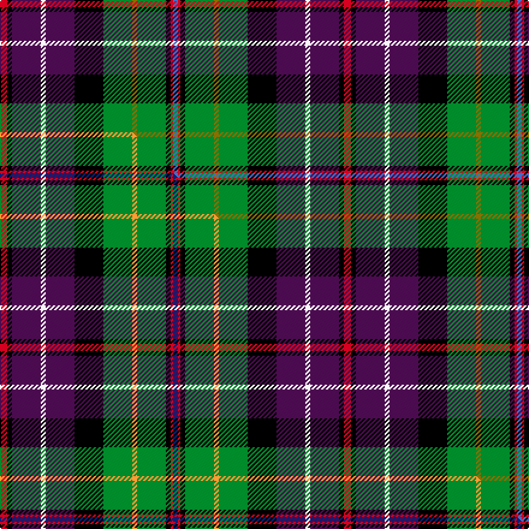

This is one **variant** — a specific cloth: this exact thread count and colourway, with its own
provenance below. It is one weaving of the [sett](/tartans/r/ru/rust/) (the scale-free proportion — the
same cloth at any scale or shade), whose colour order is pattern [BRKGGGKBWBKR](/stripes/brkgggkbwbkr/).

Part of the [Rust](/tartans/r/ru/rust/) tartan — the named design grouping this sett with its other cloths.

Sourced from weddslist.  It is a [12 stripe tartan](/stripes/stripes12/).

Original link [http://www.weddslist.com/cgi-bin/tartans/pg.pl?source=sts](http://www.weddslist.com/cgi-bin/tartans/pg.pl?source=sts)

Dataset <small>— provenance for this record, inherited from the source manifest</small>

<dl class="dataset-prov">
<dt>source</dt><dd><a href="/sources/weddslist/">Weddslist</a></dd>
<dt>data captured from</dt><dd><a href="https://github.com/thetartan/tartan-database/blob/master/data/weddslist/data.csv">https://github.com/thetartan/tartan-database/blob/master/data/weddslist/data.csv</a></dd>
<dt>data date</dt><dd>2016-11-17 <small>(dataset default)</small></dd>
<dt>licence</dt><dd><a href="https://creativecommons.org/licenses/by-nc-nd/4.0/">CC BY-NC-ND 4.0</a></dd>
</dl>

Capture chain <small>— the hands this data passed through, oldest first; each capture carries its own licence</small>

<ol class="capture-chain">
<li><a href="https://www.weddslist.com/tartans/">Weddslist</a> <small>the living privately compiled reference</small></li>
<li><a href="https://github.com/thetartan/tartan-database">thetartan/tartan-database</a> <small>2016-2017</small> · <a href="https://creativecommons.org/licenses/by-nc-nd/4.0/">CC BY-NC-ND 4.0</a> <small>Levko Kravets's frozen compilation — the capture we vendored, and where its CC licence text came from</small></li>
<li>this dictionary <small>captured 2026-06-10 · commit 5bf86c7566</small> <small>each re-capture is a git commit to data/sources</small></li>
</ol>

## Thread count
R/6 K4 DP24 W4 DP24 K24 G24 Y4 G24 K4 R2 B/4

One full sett is **286 threads**.

## Palette
<table><thead><tr><th>Colour</th><th>Shade</th><th>OKLCh</th></tr></thead><tbody><tr><td>B</td><td><code style="background-color:#466CC8;">#466CC8</code> <small style="color:#888">#466CC8</small></td><td><small style="color:#888">oklch(55.1% 0.149 265.0)</small></td></tr><tr><td>G</td><td><code style="background-color:#008B2A;">#008B2A</code> <small style="color:#888">#008B2A</small></td><td><small style="color:#888">oklch(55.4% 0.170 145.9)</small></td></tr><tr><td>K</td><td><code style="background-color:#000000;">#000000</code> <small style="color:#888">#000000</small></td><td><small style="color:#888">oklch(0.0% 0.000 0.0)</small></td></tr><tr><td>W</td><td><code style="background-color:#F7F7F7;">#F7F7F7</code> <small style="color:#888">#F7F7F7</small></td><td><small style="color:#888">oklch(97.6% 0.000 89.9)</small></td></tr><tr><td>DP</td><td><code style="background-color:#4B0B4F;">#4B0B4F</code> <small style="color:#888">#4B0B4F</small></td><td><small style="color:#888">oklch(30.1% 0.125 325.4)</small></td></tr><tr><td>R</td><td><code style="background-color:#D60020;">#D60020</code> <small style="color:#888">#D60020</small></td><td><small style="color:#888">oklch(55.2% 0.224 25.5)</small></td></tr><tr><td>Y</td><td><code style="background-color:#8B6E00;">#8B6E00</code> <small style="color:#888">#8B6E00</small></td><td><small style="color:#888">oklch(55.1% 0.113 90.4)</small></td></tr></tbody></table>

# Sample pattern

## Compared to the master

This cloth is one sett of its design; the master sett (the exemplar the design is anchored on) is below for comparison.

Its **ΔTartan distance** from the master is **0.31** — the same measure the nearest-tartans table ranks by (0 is identical; a re-scale of the same cloth is near 0, a recolour or a different proportion further).

<figure class="master-compare" style="margin:0">

this sett
master sett ★

<figcaption style="color:#888;font-size:smaller">One weave of this sett against the <a href="/setts/r3k2dp12w2dp12k12g12lo2g12k2r1db2/">master sett ★</a>, split on the diagonal: a shared proportion runs seamlessly across it with only the shades shifting; a different proportion breaks on it.</figcaption>
</figure>

## Nearest tartan variants

The nearest existing variants by ΔTartan distance, with this cloth at the top so the swatches line up against it.

ΔTartan

Threads

Variant

Sett

—

286

<a href="/variants/s12/r3k2dp12w2dp12k12g12y2g12k2r1b2~x2/">Rust</a>

<a href="/ttd/edit/#slug=r3k2dp12w2dp12k12g12y2g12k2r1lb2~x2&amp;base=r3k2dp12w2dp12k12g12y2g12k2r1b2~x2" title="compare in the TTD">0.02</a>

286

<a href="/variants/s12/r3k2dp12w2dp12k12g12y2g12k2r1lb2~x2/">Rust Personal Tartan</a>

<a href="/ttd/edit/#slug=r3k2dp12w2dp12k12g12lo2g12k2r1db2~x2&amp;base=r3k2dp12w2dp12k12g12y2g12k2r1b2~x2" title="compare in the TTD">0.31</a>

286

<a href="/variants/s12/r3k2dp12w2dp12k12g12lo2g12k2r1db2~x2/">Rust (Personal)</a>

<a href="/ttd/edit/#slug=r4dy12k12dy1n12y1k3w2k1t4~x2&amp;base=r3k2dp12w2dp12k12g12y2g12k2r1b2~x2" title="compare in the TTD">1.59</a>

192

<a href="/variants/s10/r4dy12k12dy1n12y1k3w2k1t4~x2/">Campbell Hunting</a>

<a href="/ttd/edit/#slug=r2k2o6k10w2k14db8g15w2g7r5g1lo2~x2&amp;base=r3k2dp12w2dp12k12g12y2g12k2r1b2~x2" title="compare in the TTD">1.78</a>

296

<a href="/variants/s13/r2k2o6k10w2k14db8g15w2g7r5g1lo2~x2/">Nashotah House</a>

<a href="/ttd/edit/#slug=r2k1o5k7w2k14db8g15w2g7r5g1lo2~x2&amp;base=r3k2dp12w2dp12k12g12y2g12k2r1b2~x2" title="compare in the TTD">1.86</a>

276

<a href="/variants/s13/r2k1o5k7w2k14db8g15w2g7r5g1lo2~x2/">Nashotah House (Commemorative)</a>

<a href="/ttd/edit/#slug=db4k1w2k3y1n12o1k12o12r4~x2&amp;base=r3k2dp12w2dp12k12g12y2g12k2r1b2~x2" title="compare in the TTD">1.99</a>

192

<a href="/variants/s10/db4k1w2k3y1n12o1k12o12r4~x2/">Campbell, hunting</a>

<a href="/ttd/edit/#slug=r5lb1db10w2k10g10k1y3~x4~lb8007237&amp;base=r3k2dp12w2dp12k12g12y2g12k2r1b2~x2" title="compare in the TTD">1.99</a>

304

<a href="/variants/s8/r5lb1db10w2k10g10k1y3~x4~lb8007237/">Culloden 1746 Artefact Tartan</a>

<a href="/ttd/edit/#slug=dy2k3r6db4k17w2g16k2g16dy2k15dbi16k2dbi2~x2~db2616276-dbi3514276&amp;base=r3k2dp12w2dp12k12g12y2g12k2r1b2~x2" title="compare in the TTD">2.19</a>

412

<a href="/variants/s14/dy2k3r6db4k17w2g16k2g16dy2k15dbi16k2dbi2~x2~db2616276-dbi3514276/">Allison (MacGregor-Hastie)</a>

<a href="/ttd/edit/#slug=dp22r3k22g22y2g22k22r3dp22w3~x2&amp;base=r3k2dp12w2dp12k12g12y2g12k2r1b2~x2" title="compare in the TTD">2.30</a>

522

<a href="/variants/s10/dp22r3k22g22y2g22k22r3dp22w3~x2/">Unidentified Scarlett #7</a>

<a href="/ttd/edit/#slug=db20lb6k8y2k4w4k4g13r7k4r3w2~x2&amp;base=r3k2dp12w2dp12k12g12y2g12k2r1b2~x2" title="compare in the TTD">2.34</a>

264

<a href="/variants/s12/db20lb6k8y2k4w4k4g13r7k4r3w2~x2/">Stuart/Stewart Black #3</a>

## Neighbour map

Every grey dot is one of 13662 variants placed by the first two principal components of the ΔTartan feature space (42% of its variance). Red is this tartan; blue dots are its nearest — click one to open its page. The map is a flat projection of a many-dimensional space — [how to read it](/posts/neighbourhood-maps/).

<svg viewBox="0 0 640 380" role="img" style="max-width:100%;height:auto;border:1px solid #e0e0e0;border-radius:4px;display:block" xmlns="http://www.w3.org/2000/svg"><image href="/nn/cloud.v1.png" width="640" height="380"/><a href="/variants/s12/r3k2dp12w2dp12k12g12y2g12k2r1lb2~x2/"><circle cx="70.3" cy="122.3" r="4" fill="#3465a4"><title>Rust Personal Tartan</title></circle></a><a href="/variants/s12/r3k2dp12w2dp12k12g12lo2g12k2r1db2~x2/"><circle cx="69.5" cy="121.4" r="4" fill="#3465a4"><title>Rust (Personal)</title></circle></a><a href="/variants/s10/r4dy12k12dy1n12y1k3w2k1t4~x2/"><circle cx="71.1" cy="124.8" r="4" fill="#3465a4"><title>Campbell Hunting</title></circle></a><a href="/variants/s13/r2k2o6k10w2k14db8g15w2g7r5g1lo2~x2/"><circle cx="54.2" cy="107.9" r="4" fill="#3465a4"><title>Nashotah House</title></circle></a><a href="/variants/s13/r2k1o5k7w2k14db8g15w2g7r5g1lo2~x2/"><circle cx="50.1" cy="105.2" r="4" fill="#3465a4"><title>Nashotah House (Commemorative)</title></circle></a><a href="/variants/s10/db4k1w2k3y1n12o1k12o12r4~x2/"><circle cx="63.1" cy="118.9" r="4" fill="#3465a4"><title>Campbell, hunting</title></circle></a><a href="/variants/s8/r5lb1db10w2k10g10k1y3~x4~lb8007237/"><circle cx="26.4" cy="128.7" r="4" fill="#3465a4"><title>Culloden 1746 Artefact Tartan</title></circle></a><a href="/variants/s14/dy2k3r6db4k17w2g16k2g16dy2k15dbi16k2dbi2~x2~db2616276-dbi3514276/"><circle cx="69.3" cy="123.1" r="4" fill="#3465a4"><title>Allison (MacGregor-Hastie)</title></circle></a><a href="/variants/s10/dp22r3k22g22y2g22k22r3dp22w3~x2/"><circle cx="80.3" cy="159.3" r="4" fill="#3465a4"><title>Unidentified Scarlett #7</title></circle></a><a href="/variants/s12/db20lb6k8y2k4w4k4g13r7k4r3w2~x2/"><circle cx="14.0" cy="127.0" r="4" fill="#3465a4"><title>Stuart/Stewart Black #3</title></circle></a><circle cx="71.5" cy="122.3" r="5" fill="#c00000"/><text x="320" y="376" text-anchor="middle" font-size="11" fill="#999">ground</text><text x="11" y="190" text-anchor="middle" font-size="11" fill="#999" transform="rotate(-90 11 190)">complexity</text></svg>

ID: /variants/s12/r3k2dp12w2dp12k12g12y2g12k2r1b2~x2/
