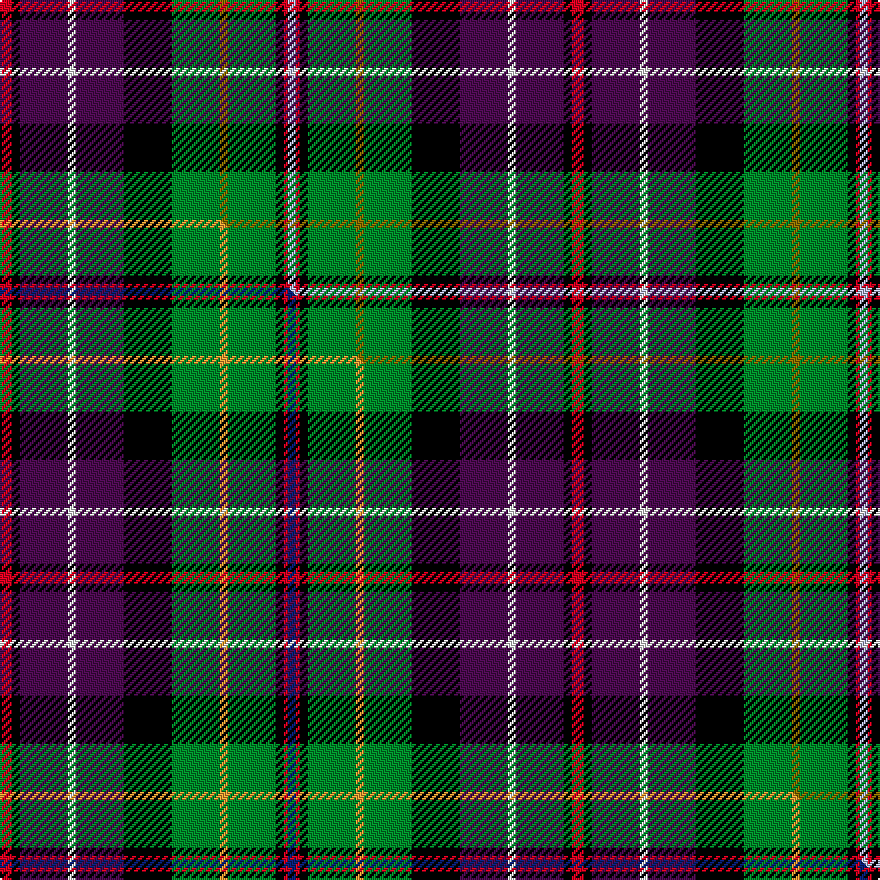

This page is one **sett** — a single exact thread-count. It belongs to the [tartan](/setts/r3k2dp12w2dp12k12g12y2g12k2r1lb2/)
(the same proportion at any scale), whose colour order is pattern [RKBWBKGGGKRW](/stripes/rkbwbkgggkrw/).

Part of the [Rust](/tartans/rust/) tartan — the named design grouping this sett with its other cloths.

Sourced from house-of-tartan.  It is a [12 stripe tartan](/stripes/stripes12/).

Original link http://www.house-of-tartan.scotland.net/house/TartanViewjs.asp?colr=Def&tnam=555

## Provenance

Earliest known date: Oman 1983 Amended sett from T.S.D

## Thread count
R/6 K4 DP24 W4 DP24 K24 G24 Y4 G24 K4 R2 LB/4

One full sett is **286 threads**.

## Palette
<table><thead><tr><th>Colour</th><th>Shade</th><th>OKLCh</th></tr></thead><tbody><tr><td>LB</td><td><code style="background-color:#B5BBDE;">#B5BBDE</code> <small style="color:#888">#B5BBDE</small></td><td><small style="color:#888">oklch(79.9% 0.050 277.6)</small></td></tr><tr><td>G</td><td><code style="background-color:#008B2A;">#008B2A</code> <small style="color:#888">#008B2A</small></td><td><small style="color:#888">oklch(55.4% 0.170 145.9)</small></td></tr><tr><td>K</td><td><code style="background-color:#000000;">#000000</code> <small style="color:#888">#000000</small></td><td><small style="color:#888">oklch(0.0% 0.000 0.0)</small></td></tr><tr><td>W</td><td><code style="background-color:#F7F7F7;">#F7F7F7</code> <small style="color:#888">#F7F7F7</small></td><td><small style="color:#888">oklch(97.6% 0.000 89.9)</small></td></tr><tr><td>DP</td><td><code style="background-color:#4B0B4F;">#4B0B4F</code> <small style="color:#888">#4B0B4F</small></td><td><small style="color:#888">oklch(30.1% 0.125 325.4)</small></td></tr><tr><td>R</td><td><code style="background-color:#D60020;">#D60020</code> <small style="color:#888">#D60020</small></td><td><small style="color:#888">oklch(55.2% 0.224 25.5)</small></td></tr><tr><td>Y</td><td><code style="background-color:#8B6E00;">#8B6E00</code> <small style="color:#888">#8B6E00</small></td><td><small style="color:#888">oklch(55.1% 0.113 90.4)</small></td></tr></tbody></table>

# Sample pattern

## Compared to the master

This cloth is one sett of its design; the master sett (the exemplar the design is anchored on) is below for comparison.

Its **ΔTartan distance** from the master is **0.10** — the same measure the nearest-tartans table ranks by (0 is identical; a re-scale of the same cloth is near 0, a recolour or a different proportion further).

<figure class="master-compare" style="margin:0">

this sett
master sett ★

<figcaption style="color:#888;font-size:smaller">One weave of this sett against the <a href="/setts/r3k2dp12w2dp12k12g12lo2g12k2r1db2/">master sett ★</a>, split on the diagonal: a shared proportion runs seamlessly across it with only the shades shifting; a different proportion breaks on it.</figcaption>
</figure>

## Nearest variants

The nearest existing variants by ΔTartan distance, with this cloth at the top so the swatches line up against it.

ΔTartan

Threads

Variant

Sett

—

286

<a href="/variants/s12/r3k2dp12w2dp12k12g12y2g12k2r1lb2~x2/">Rust Personal Tartan</a>

<a href="/ttd/edit/#slug=r3k2dp12w2dp12k12g12y2g12k2r1b2~x2&amp;base=r3k2dp12w2dp12k12g12y2g12k2r1lb2~x2" title="compare in the TTD">0.00</a>

286

<a href="/variants/s12/r3k2dp12w2dp12k12g12y2g12k2r1b2~x2/">Rust</a>

<a href="/ttd/edit/#slug=r3k2dp12w2dp12k12g12lo2g12k2r1db2~x2&amp;base=r3k2dp12w2dp12k12g12y2g12k2r1lb2~x2" title="compare in the TTD">0.30</a>

286

<a href="/variants/s12/r3k2dp12w2dp12k12g12lo2g12k2r1db2~x2/">Rust (Personal)</a>

<a href="/ttd/edit/#slug=dp22r3k22g22y2g22k22r3dp22w3~x2&amp;base=r3k2dp12w2dp12k12g12y2g12k2r1lb2~x2" title="compare in the TTD">2.12</a>

522

<a href="/variants/s10/dp22r3k22g22y2g22k22r3dp22w3~x2/">Unidentified Scarlett #7</a>

<a href="/ttd/edit/#slug=dp27y2dp2k12g6o2g12k12db12r2db2~x2&amp;base=r3k2dp12w2dp12k12g12y2g12k2r1lb2~x2" title="compare in the TTD">2.70</a>

306

<a href="/variants/s11/dp27y2dp2k12g6o2g12k12db12r2db2~x2/">Boxell, Baron (Personal)</a>

<a href="/ttd/edit/#slug=dp27y2dp2k12g6o2g12k12db12r2db2~x2~dp1105325&amp;base=r3k2dp12w2dp12k12g12y2g12k2r1lb2~x2" title="compare in the TTD">2.70</a>

306

<a href="/variants/s11/dp27y2dp2k12g6o2g12k12db12r2db2~x2~dp1105325/">Boxell of West Niddry, Baron (Personal)</a>

## Neighbour map

Every grey dot is one of 13620 variants placed by the first two principal components of the ΔTartan feature space (42% of its variance). Red is this tartan; blue dots are its nearest — click one to open its page.

<svg viewBox="0 0 640 380" role="img" style="max-width:100%;height:auto;border:1px solid #e0e0e0;border-radius:4px;display:block" xmlns="http://www.w3.org/2000/svg"><image href="/nn/cloud.v1.png" width="640" height="380"/><a href="/variants/s12/r3k2dp12w2dp12k12g12y2g12k2r1b2~x2/"><circle cx="71.8" cy="122.4" r="4" fill="#3465a4"><title>Rust</title></circle></a><a href="/variants/s12/r3k2dp12w2dp12k12g12lo2g12k2r1db2~x2/"><circle cx="69.8" cy="121.5" r="4" fill="#3465a4"><title>Rust (Personal)</title></circle></a><a href="/variants/s10/dp22r3k22g22y2g22k22r3dp22w3~x2/"><circle cx="80.6" cy="159.5" r="4" fill="#3465a4"><title>Unidentified Scarlett #7</title></circle></a><a href="/variants/s11/dp27y2dp2k12g6o2g12k12db12r2db2~x2/"><circle cx="94.3" cy="119.5" r="4" fill="#3465a4"><title>Boxell, Baron (Personal)</title></circle></a><a href="/variants/s11/dp27y2dp2k12g6o2g12k12db12r2db2~x2~dp1105325/"><circle cx="94.5" cy="119.4" r="4" fill="#3465a4"><title>Boxell of West Niddry, Baron (Personal)</title></circle></a><circle cx="70.5" cy="122.4" r="5" fill="#c00000"/><text x="320" y="376" text-anchor="middle" font-size="11" fill="#999">ground</text><text x="11" y="190" text-anchor="middle" font-size="11" fill="#999" transform="rotate(-90 11 190)">complexity</text></svg>

ID: /variants/s12/r3k2dp12w2dp12k12g12y2g12k2r1lb2~x2/
