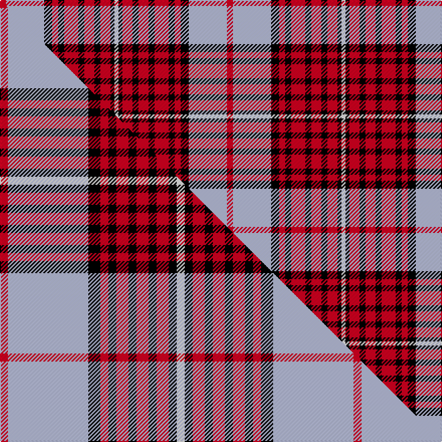

This is one **variant** — a specific cloth: this exact thread count and colourway, with its own
provenance below. It is one weaving of the [sett](/tartans/d/du/duchess-of-kent/) (the scale-free proportion — the
same cloth at any scale or shade), whose colour order is pattern [RWKRKRKRKRKW](/stripes/rwkrkrkrkrkw/).

Part of the [Duchess of Kent](/tartans/d/du/duchess-of-kent/) tartan — the named design grouping this sett with its other cloths.

Sourced from house-of-tartan.  It is a [12 stripe tartan](/stripes/stripes12/).

Original link [http://www.house-of-tartan.scotland.net/house/TartanViewjs.asp?colr=Def&tnam=1368](http://www.house-of-tartan.scotland.net/house/TartanViewjs.asp?colr=Def&tnam=1368)

## Provenance

Earliest known date: 1934 Found in sample books.

2 attestations — the source records this cloth was collapsed from (oldest owns this page)

<ul>
<li>1934 — Duchess of Kent Family Tartan (house-of-tartan, <a href="http://www.house-of-tartan.scotland.net/house/TartanViewjs.asp?colr=Def&tnam=1368">record</a>) </li>
<li>undated — Duchess of Kent (weddslist, <a href="http://www.weddslist.com/cgi-bin/tartans/pg.pl?source=sts">record</a>) </li>
</ul>

Dataset <small>— provenance for this record, inherited from the source manifest</small>

<dl class="dataset-prov">
<dt>source</dt><dd><a href="/sources/house-of-tartan/">House of Tartan</a></dd>
<dt>data captured from</dt><dd><a href="https://github.com/thetartan/tartan-database/blob/master/data/house-of-tartan/data.csv">https://github.com/thetartan/tartan-database/blob/master/data/house-of-tartan/data.csv</a></dd>
<dt>data date</dt><dd>1934 <small>(this record)</small></dd>
<dt>licence</dt><dd><a href="https://creativecommons.org/licenses/by-nc-nd/4.0/">CC BY-NC-ND 4.0</a></dd>
</dl>

Capture chain <small>— the hands this data passed through, oldest first; each capture carries its own licence</small>

<ol class="capture-chain">
<li><a href="http://www.house-of-tartan.scotland.net/">House of Tartan</a> <small>the weaver/retailer's database — the site is now offline; the URL is kept as the ultimate source's identity</small></li>
<li><a href="https://github.com/thetartan/tartan-database">thetartan/tartan-database</a> <small>2016-2017</small> · <a href="https://creativecommons.org/licenses/by-nc-nd/4.0/">CC BY-NC-ND 4.0</a> <small>Levko Kravets's frozen compilation — the capture we vendored, and where its CC licence text came from</small></li>
<li>this dictionary <small>captured 2026-06-10 · commit 5bf86c7566</small> <small>each re-capture is a git commit to data/sources</small></li>
</ol>

## Thread count
R/6 LB38 K8 R6 K6 R14 K6 R10 K6 R10 K4 W/4

One full sett is **226 threads**.

## Palette
<table><thead><tr><th>Colour</th><th>Shade</th><th>OKLCh</th></tr></thead><tbody><tr><td>LB</td><td><code style="background-color:#B5BBDE;">#B5BBDE</code> <small style="color:#888">#B5BBDE</small></td><td><small style="color:#888">oklch(79.9% 0.050 277.6)</small></td></tr><tr><td>K</td><td><code style="background-color:#000000;">#000000</code> <small style="color:#888">#000000</small></td><td><small style="color:#888">oklch(0.0% 0.000 0.0)</small></td></tr><tr><td>W</td><td><code style="background-color:#F7F7F7;">#F7F7F7</code> <small style="color:#888">#F7F7F7</small></td><td><small style="color:#888">oklch(97.6% 0.000 89.9)</small></td></tr><tr><td>R</td><td><code style="background-color:#D60020;">#D60020</code> <small style="color:#888">#D60020</small></td><td><small style="color:#888">oklch(55.2% 0.224 25.5)</small></td></tr></tbody></table>

# Sample pattern

## Compared to the master

This cloth is one sett of its design; the master sett (the exemplar the design is anchored on) is below for comparison.

Its **ΔTartan distance** from the master is **0.62** — the same measure the nearest-tartans table ranks by (0 is identical; a re-scale of the same cloth is near 0, a recolour or a different proportion further).

<figure class="master-compare" style="margin:0">

this sett
master sett ★

<figcaption style="color:#888;font-size:smaller">One weave of this sett against the <a href="/setts/r2lb20k3r2k2r3k2r3k2r3k2w2/">master sett ★</a>, split on the diagonal: a shared proportion runs seamlessly across it with only the shades shifting; a different proportion breaks on it.</figcaption>
</figure>

## Nearest tartan variants

The nearest existing variants by ΔTartan distance, with this cloth at the top so the swatches line up against it.

ΔTartan

Threads

Variant

Sett

—

226

<a href="/variants/s12/r3lb19k4r3k3r7k3r5k3r5k2w2~x2/">Duchess of Kent Family Tartan</a>

<a href="/ttd/edit/#slug=r2lb20k3r2k2r3k2r3k2r3k2w2~x4&amp;base=r3lb19k4r3k3r7k3r5k3r5k2w2~x2" title="compare in the TTD">0.62</a>

352

<a href="/variants/s12/r2lb20k3r2k2r3k2r3k2r3k2w2~x4/">Duchess of Kent</a>

<a href="/ttd/edit/#slug=w8k1r24k2r4k2r1k2r4k2db20k1w5~x2&amp;base=r3lb19k4r3k3r7k3r5k3r5k2w2~x2" title="compare in the TTD">2.01</a>

278

<a href="/variants/s13/w8k1r24k2r4k2r1k2r4k2db20k1w5~x2/">Danish</a>

<a href="/ttd/edit/#slug=k4w2k2w2k2w4k2w2k4r12w1~x4&amp;base=r3lb19k4r3k3r7k3r5k3r5k2w2~x2" title="compare in the TTD">2.35</a>

276

<a href="/variants/s11/k4w2k2w2k2w4k2w2k4r12w1~x4/">Napier Rose</a>

<a href="/ttd/edit/#slug=y4k2r7k15r3k3r3k7w28r7w6r2&amp;base=r3lb19k4r3k3r7k3r5k3r5k2w2~x2" title="compare in the TTD">2.46</a>

168

<a href="/variants/s12/y4k2r7k15r3k3r3k7w28r7w6r2/">Walker, dress</a>

<a href="/ttd/edit/#slug=n28k3r22k8w3k8r22k3n28k3~x2&amp;base=r3lb19k4r3k3r7k3r5k3r5k2w2~x2" title="compare in the TTD">2.58</a>

450

<a href="/variants/s10/n28k3r22k8w3k8r22k3n28k3~x2/">Henkel</a>

<a href="/ttd/edit/#slug=w8k9y9r21y6k6w4k6y6r49k22w4&amp;base=r3lb19k4r3k3r7k3r5k3r5k2w2~x2" title="compare in the TTD">2.63</a>

288

<a href="/variants/s12/w8k9y9r21y6k6w4k6y6r49k22w4/">Normandy (Fashion)</a>

<a href="/ttd/edit/#slug=k4o8m30k8o6k8o12w3~x2&amp;base=r3lb19k4r3k3r7k3r5k3r5k2w2~x2" title="compare in the TTD">2.65</a>

302

<a href="/variants/s8/k4o8m30k8o6k8o12w3~x2/">Believe - Corinna</a>

<a href="/ttd/edit/#slug=r23w2r3b4r3w2r5k11ri2w23k3~x2~r2109032-ri2406019&amp;base=r3lb19k4r3k3r7k3r5k3r5k2w2~x2" title="compare in the TTD">2.66</a>

272

<a href="/variants/s11/r23w2r3b4r3w2r5k11ri2w23k3~x2~r2109032-ri2406019/">MacKellar Dress Red Fashion Tartan</a>

<a href="/ttd/edit/#slug=lb1k1r10g10k5lb5r10k1lb1~x4&amp;base=r3lb19k4r3k3r7k3r5k3r5k2w2~x2" title="compare in the TTD">2.70</a>

344

<a href="/variants/s9/lb1k1r10g10k5lb5r10k1lb1~x4/">Graham Red</a>

<a href="/ttd/edit/#slug=dp4m3dp3m4dp4k9dp4k9w26m2w4m2~x2&amp;base=r3lb19k4r3k3r7k3r5k3r5k2w2~x2" title="compare in the TTD">2.78</a>

284

<a href="/variants/s12/dp4m3dp3m4dp4k9dp4k9w26m2w4m2~x2/">Ross Purple Dress Tartan</a>

## Neighbour map

Every grey dot is one of 13656 variants placed by the first two principal components of the ΔTartan feature space (42% of its variance). Red is this tartan; blue dots are its nearest — click one to open its page. The map is a flat projection of a many-dimensional space — [how to read it](/posts/neighbourhood-maps/).

<svg viewBox="0 0 640 380" role="img" style="max-width:100%;height:auto;border:1px solid #e0e0e0;border-radius:4px;display:block" xmlns="http://www.w3.org/2000/svg"><image href="/nn/cloud.v1.png" width="640" height="380"/><a href="/variants/s12/r2lb20k3r2k2r3k2r3k2r3k2w2~x4/"><circle cx="181.8" cy="121.5" r="4" fill="#3465a4"><title>Duchess of Kent</title></circle></a><a href="/variants/s13/w8k1r24k2r4k2r1k2r4k2db20k1w5~x2/"><circle cx="202.5" cy="87.5" r="4" fill="#3465a4"><title>Danish</title></circle></a><a href="/variants/s11/k4w2k2w2k2w4k2w2k4r12w1~x4/"><circle cx="165.3" cy="159.3" r="4" fill="#3465a4"><title>Napier Rose</title></circle></a><a href="/variants/s12/y4k2r7k15r3k3r3k7w28r7w6r2/"><circle cx="150.7" cy="127.1" r="4" fill="#3465a4"><title>Walker, dress</title></circle></a><a href="/variants/s10/n28k3r22k8w3k8r22k3n28k3~x2/"><circle cx="195.1" cy="171.6" r="4" fill="#3465a4"><title>Henkel</title></circle></a><a href="/variants/s12/w8k9y9r21y6k6w4k6y6r49k22w4/"><circle cx="191.5" cy="128.3" r="4" fill="#3465a4"><title>Normandy (Fashion)</title></circle></a><a href="/variants/s8/k4o8m30k8o6k8o12w3~x2/"><circle cx="165.2" cy="170.2" r="4" fill="#3465a4"><title>Believe - Corinna</title></circle></a><a href="/variants/s11/r23w2r3b4r3w2r5k11ri2w23k3~x2~r2109032-ri2406019/"><circle cx="156.7" cy="120.0" r="4" fill="#3465a4"><title>MacKellar Dress Red Fashion Tartan</title></circle></a><a href="/variants/s9/lb1k1r10g10k5lb5r10k1lb1~x4/"><circle cx="177.3" cy="170.0" r="4" fill="#3465a4"><title>Graham Red</title></circle></a><a href="/variants/s12/dp4m3dp3m4dp4k9dp4k9w26m2w4m2~x2/"><circle cx="153.7" cy="130.7" r="4" fill="#3465a4"><title>Ross Purple Dress Tartan</title></circle></a><circle cx="148.2" cy="147.0" r="5" fill="#c00000"/><text x="320" y="376" text-anchor="middle" font-size="11" fill="#999">ground</text><text x="11" y="190" text-anchor="middle" font-size="11" fill="#999" transform="rotate(-90 11 190)">complexity</text></svg>

ID: /variants/s12/r3lb19k4r3k3r7k3r5k3r5k2w2~x2/
