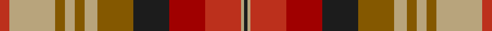

This page is one **sett** — a single exact thread-count. It belongs to the [tartan](/setts/r3ly14y3ly3y3ly4y11dt11ri11r11ly1dt1/)
(the same proportion at any scale), whose colour order is pattern [BYRRBGYGYGYR](/stripes/byrrbgygygyr/).

Sourced from tartans-authority.  It is a [12 stripe tartan](/stripes/stripes12/).

Original link http://www.tartansauthority.com/tartan-ferret/display/8275/

## Register references

External register numbers recorded for this tartan.

- Scottish Register of Tartans: [8275](https://www.tartanregister.gov.uk/tartanDetails?ref=8275)
- Scottish Tartans Authority (ITI): 8275

## Thread count
R/6 LG28 T6 LG6 T6 LG8 T22 K22 DR22 R22 LG2 K/2

One full sett is **296 threads**.

## Palette

Palette: <strong>Tartan Register</strong> <small style="color:#888">(2 of 5 colours)</small>
<table><thead><tr><th>Colour</th><th>Threads</th><th>Shade</th><th>Base</th><th>OKLCh</th></tr></thead><tbody><tr><td>R/</td><td style="text-align:right;font-variant-numeric:tabular-nums">6</td><td><code style="background-color:#BC301C;">#BC301C</code> <small style="color:#888">#BC301C</small></td><td>R <code style="background-color:#CC0000;">#CC0000</code></td><td><small style="color:#888">oklch(52.6% 0.180 31.3)</small></td></tr><tr><td>LG</td><td style="text-align:right;font-variant-numeric:tabular-nums">28</td><td><code style="background-color:#B8A47C;">#B8A47C</code> <small style="color:#888">#B8A47C</small></td><td>Y <code style="background-color:#F2BF00;">#F2BF00</code></td><td><small style="color:#888">oklch(72.6% 0.059 84.4)</small></td></tr><tr><td>T</td><td style="text-align:right;font-variant-numeric:tabular-nums">6</td><td><code style="background-color:#845800;">#845800</code> <small style="color:#888">#845800</small></td><td>G <code style="background-color:#006100;">#006100</code></td><td><small style="color:#888">oklch(49.6% 0.104 75.3)</small></td></tr><tr><td>LG</td><td style="text-align:right;font-variant-numeric:tabular-nums">6</td><td><code style="background-color:#B8A47C;">#B8A47C</code> <small style="color:#888">#B8A47C</small></td><td>Y <code style="background-color:#F2BF00;">#F2BF00</code></td><td><small style="color:#888">oklch(72.6% 0.059 84.4)</small></td></tr><tr><td>T</td><td style="text-align:right;font-variant-numeric:tabular-nums">6</td><td><code style="background-color:#845800;">#845800</code> <small style="color:#888">#845800</small></td><td>G <code style="background-color:#006100;">#006100</code></td><td><small style="color:#888">oklch(49.6% 0.104 75.3)</small></td></tr><tr><td>LG</td><td style="text-align:right;font-variant-numeric:tabular-nums">8</td><td><code style="background-color:#B8A47C;">#B8A47C</code> <small style="color:#888">#B8A47C</small></td><td>Y <code style="background-color:#F2BF00;">#F2BF00</code></td><td><small style="color:#888">oklch(72.6% 0.059 84.4)</small></td></tr><tr><td>T</td><td style="text-align:right;font-variant-numeric:tabular-nums">22</td><td><code style="background-color:#845800;">#845800</code> <small style="color:#888">#845800</small></td><td>G <code style="background-color:#006100;">#006100</code></td><td><small style="color:#888">oklch(49.6% 0.104 75.3)</small></td></tr><tr><td>K</td><td style="text-align:right;font-variant-numeric:tabular-nums">22</td><td><code style="background-color:#1C1C1C;">#1C1C1C</code> <small style="color:#888">#1C1C1C</small></td><td>B <code style="background-color:#2A418A;">#2A418A</code></td><td><small style="color:#888">oklch(22.6% 0.000 89.9)</small></td></tr><tr><td>DR</td><td style="text-align:right;font-variant-numeric:tabular-nums">22</td><td><code style="background-color:#A00000;">#A00000</code> <small style="color:#888">#A00000</small></td><td>R <code style="background-color:#CC0000;">#CC0000</code></td><td><small style="color:#888">oklch(44.3% 0.182 29.2)</small></td></tr><tr><td>R</td><td style="text-align:right;font-variant-numeric:tabular-nums">22</td><td><code style="background-color:#BC301C;">#BC301C</code> <small style="color:#888">#BC301C</small></td><td>R <code style="background-color:#CC0000;">#CC0000</code></td><td><small style="color:#888">oklch(52.6% 0.180 31.3)</small></td></tr><tr><td>LG</td><td style="text-align:right;font-variant-numeric:tabular-nums">2</td><td><code style="background-color:#B8A47C;">#B8A47C</code> <small style="color:#888">#B8A47C</small></td><td>Y <code style="background-color:#F2BF00;">#F2BF00</code></td><td><small style="color:#888">oklch(72.6% 0.059 84.4)</small></td></tr><tr><td>K/</td><td style="text-align:right;font-variant-numeric:tabular-nums">2</td><td><code style="background-color:#1C1C1C;">#1C1C1C</code> <small style="color:#888">#1C1C1C</small></td><td>B <code style="background-color:#2A418A;">#2A418A</code></td><td><small style="color:#888">oklch(22.6% 0.000 89.9)</small></td></tr></tbody></table>

## Nearest tartans

The nearest existing variants by ΔTartan distance, with this tartan at the top so the swatches line up against it.

ΔTartan

Tartan

Sett

—

<a href="/ttd/edit/#slug=r3ly14y3ly3y3ly4y11dt11ri11r11ly1dt1~x2">Bridge of Weir Leather Co. (Corp)</a> <a class="nn-out" href="/variants/s12/r3ly14y3ly3y3ly4y11dt11ri11r11ly1dt1~x2/" title="open its dictionary page">↗</a>

1.09

<a href="/ttd/edit/#slug=lo3r10dg4lo8do2lo8m11do16lo4dg4r10lo3~x2&amp;base=r3ly14y3ly3y3ly4y11dt11ri11r11ly1dt1~x2">Hallowfield Wood</a> <a class="nn-out" href="/variants/s12/lo3r10dg4lo8do2lo8m11do16lo4dg4r10lo3~x2/" title="open its dictionary page">↗</a>

1.15

<a href="/ttd/edit/#slug=o40k5y48k5r20k5t14k10w4r28t10&amp;base=r3ly14y3ly3y3ly4y11dt11ri11r11ly1dt1~x2">Kildare County, Crest Range</a> <a class="nn-out" href="/variants/s11/o40k5y48k5r20k5t14k10w4r28t10/" title="open its dictionary page">↗</a>

1.16

<a href="/ttd/edit/#slug=r13lr4r13g28lr3o26lr10o2dr2o2lr10r14lr4o4r4~x2&amp;base=r3ly14y3ly3y3ly4y11dt11ri11r11ly1dt1~x2">MacPherson 1</a> <a class="nn-out" href="/variants/s15/r13lr4r13g28lr3o26lr10o2dr2o2lr10r14lr4o4r4~x2/" title="open its dictionary page">↗</a>

1.17

<a href="/variants/s15/r13lr4r13dg28lr3dyi26lr10dyi2dy2dyi2lr10r14lr4dyi4r4~x2/">MacPherson #9</a>

1.31

<a href="/ttd/edit/#slug=dy3y2lo18k4r15k4dy6k4lo2y3~x2&amp;base=r3ly14y3ly3y3ly4y11dt11ri11r11ly1dt1~x2">Fitzsimmons Red (Name)</a> <a class="nn-out" href="/variants/s10/dy3y2lo18k4r15k4dy6k4lo2y3~x2/" title="open its dictionary page">↗</a>

1.32

<a href="/ttd/edit/#slug=lo40k5y48k5r20k5lr14k10w4r28lr10&amp;base=r3ly14y3ly3y3ly4y11dt11ri11r11ly1dt1~x2">Kildare County Crest (Fashion)</a> <a class="nn-out" href="/variants/s11/lo40k5y48k5r20k5lr14k10w4r28lr10/" title="open its dictionary page">↗</a>

1.59

<a href="/ttd/edit/#slug=db21dp21ly21o2r21lo21ly21db2r2dp2o21~x2&amp;base=r3ly14y3ly3y3ly4y11dt11ri11r11ly1dt1~x2">Watret (Artefact)</a> <a class="nn-out" href="/variants/s11/db21dp21ly21o2r21lo21ly21db2r2dp2o21~x2/" title="open its dictionary page">↗</a>

1.59

<a href="/ttd/edit/#slug=dy18ly4t10w2r20ly5r2w2dy6~x2&amp;base=r3ly14y3ly3y3ly4y11dt11ri11r11ly1dt1~x2">Satchidananda (Personal)</a> <a class="nn-out" href="/variants/s9/dy18ly4t10w2r20ly5r2w2dy6~x2/" title="open its dictionary page">↗</a>

1.61

<a href="/ttd/edit/#slug=t4dy27lo8k4lo8k4lo8r11ly3~x2&amp;base=r3ly14y3ly3y3ly4y11dt11ri11r11ly1dt1~x2">Brittany National Walking</a> <a class="nn-out" href="/variants/s9/t4dy27lo8k4lo8k4lo8r11ly3~x2/" title="open its dictionary page">↗</a>

1.63

<a href="/ttd/edit/#slug=lr2dy1r10o12dy10lr6r10dy1lr2~x2&amp;base=r3ly14y3ly3y3ly4y11dt11ri11r11ly1dt1~x2">Unidentified Sett</a> <a class="nn-out" href="/variants/s9/lr2dy1r10o12dy10lr6r10dy1lr2~x2/" title="open its dictionary page">↗</a>

## Neighbour map

Every grey dot is one of 14360 variants placed by the first two principal components of the ΔTartan feature space (44% of its variance). Red is this tartan; blue dots are its nearest — click one to open its page.

<svg viewBox="0 0 640 380" role="img" style="max-width:100%;height:auto;border:1px solid #e0e0e0;border-radius:4px;display:block" xmlns="http://www.w3.org/2000/svg"><image href="/nn/cloud.v1.png" width="640" height="380"/><a href="/variants/s12/lo3r10dg4lo8do2lo8m11do16lo4dg4r10lo3~x2/"><circle cx="110.3" cy="186.2" r="4" fill="#3465a4"><title>Hallowfield Wood</title></circle></a><a href="/variants/s11/o40k5y48k5r20k5t14k10w4r28t10/"><circle cx="108.9" cy="143.6" r="4" fill="#3465a4"><title>Kildare County, Crest Range</title></circle></a><a href="/variants/s15/r13lr4r13g28lr3o26lr10o2dr2o2lr10r14lr4o4r4~x2/"><circle cx="165.9" cy="141.0" r="4" fill="#3465a4"><title>MacPherson 1</title></circle></a><a href="/variants/s15/r13lr4r13dg28lr3dyi26lr10dyi2dy2dyi2lr10r14lr4dyi4r4~x2/"><circle cx="162.3" cy="141.3" r="4" fill="#3465a4"><title>MacPherson #9</title></circle></a><a href="/variants/s10/dy3y2lo18k4r15k4dy6k4lo2y3~x2/"><circle cx="156.2" cy="175.5" r="4" fill="#3465a4"><title>Fitzsimmons Red (Name)</title></circle></a><a href="/variants/s11/lo40k5y48k5r20k5lr14k10w4r28lr10/"><circle cx="96.3" cy="138.4" r="4" fill="#3465a4"><title>Kildare County Crest (Fashion)</title></circle></a><a href="/variants/s11/db21dp21ly21o2r21lo21ly21db2r2dp2o21~x2/"><circle cx="54.9" cy="143.5" r="4" fill="#3465a4"><title>Watret (Artefact)</title></circle></a><a href="/variants/s9/dy18ly4t10w2r20ly5r2w2dy6~x2/"><circle cx="151.5" cy="154.7" r="4" fill="#3465a4"><title>Satchidananda (Personal)</title></circle></a><a href="/variants/s9/t4dy27lo8k4lo8k4lo8r11ly3~x2/"><circle cx="152.1" cy="170.5" r="4" fill="#3465a4"><title>Brittany National Walking</title></circle></a><a href="/variants/s9/lr2dy1r10o12dy10lr6r10dy1lr2~x2/"><circle cx="214.2" cy="191.8" r="4" fill="#3465a4"><title>Unidentified Sett</title></circle></a><circle cx="135.6" cy="157.5" r="5" fill="#c00000"/></svg>

ID: /variants/s12/r3ly14y3ly3y3ly4y11dt11ri11r11ly1dt1~x2/
