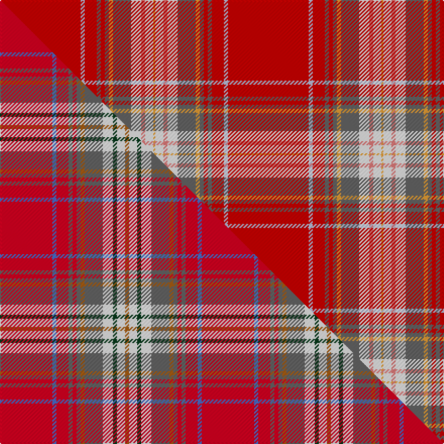

This is one **variant** — a specific cloth: this exact thread count and colourway, with its own
provenance below. It is one weaving of the [sett](/tartans/r/ra/rathmore-2/) (the scale-free proportion — the
same cloth at any scale or shade), whose colour order is pattern [RWRBRBYBWRWY](/stripes/rwrbrbybwrwy/).

Part of the [Rathmore](/tartans/r/ra/rathmore-2/) tartan — the named design grouping this sett with its other cloths.

Sourced from tartans-authority.  It is a [12 stripe tartan](/stripes/stripes12/).

Original link <code>http://www.tartansauthority.com/tartan-ferret/display/1518/</code> — retired · [Internet Archive copy](https://web.archive.org/web/*/http://www.tartansauthority.com/tartan-ferret/display/1518/*)

Dataset <small>— provenance for this record, inherited from the source manifest</small>

<dl class="dataset-prov">
<dt>source</dt><dd><a href="/sources/tartans-authority/">Scottish Tartans Authority</a></dd>
<dt>data captured from</dt><dd><a href="https://github.com/thetartan/tartan-database/blob/master/data/tartans-authority/data.csv">https://github.com/thetartan/tartan-database/blob/master/data/tartans-authority/data.csv</a></dd>
<dt>data date</dt><dd>pre 2002 <small>(this record)</small></dd>
<dt>licence</dt><dd><a href="https://creativecommons.org/licenses/by-nc-nd/4.0/">CC BY-NC-ND 4.0</a></dd>
</dl>

Capture chain <small>— the hands this data passed through, oldest first; each capture carries its own licence</small>

<ol class="capture-chain">
<li><a href="https://www.tartansauthority.com/">Scottish Tartans Authority</a> <small>the heritage body’s archive — its tartan-ferret record browser is retired; dead record links are shown unlinked, with an Internet Archive copy (ITI numbers are not SRT references)</small></li>
<li><a href="https://github.com/thetartan/tartan-database">thetartan/tartan-database</a> <small>2016-2017</small> · <a href="https://creativecommons.org/licenses/by-nc-nd/4.0/">CC BY-NC-ND 4.0</a> <small>Levko Kravets's frozen compilation — the capture we vendored, and where its CC licence text came from</small></li>
<li>this dictionary <small>captured 2026-06-10 · commit 5bf86c7566</small> <small>each re-capture is a git commit to data/sources</small></li>
</ol>

## Register references

External register numbers recorded for this tartan.

- Scottish Tartans Authority (ITI): 1518

## Thread count
R/80 LB4 R12 N4 R4 N4 LO4 N18 W10 Ri4 W8 LO/2

One full sett is **226 threads**.

## Palette
<table><thead><tr><th>Colour</th><th>Shade</th><th>OKLCh</th></tr></thead><tbody><tr><td>LO</td><td><code style="background-color:#FF9C34;">#FF9C34</code> <small style="color:#888">#FF9C34</small></td><td><small style="color:#888">oklch(77.9% 0.161 61.8)</small></td></tr><tr><td>W</td><td><code style="background-color:#F7F7F7;">#F7F7F7</code> <small style="color:#888">#F7F7F7</small></td><td><small style="color:#888">oklch(97.6% 0.000 89.9)</small></td></tr><tr><td>LB</td><td><code style="background-color:#B5BBDE;">#B5BBDE</code> <small style="color:#888">#B5BBDE</small></td><td><small style="color:#888">oklch(79.9% 0.050 277.6)</small></td></tr><tr><td>R</td><td><code style="background-color:#E87878;">#E87878</code> <small style="color:#888">#E87878</small></td><td><small style="color:#888">oklch(70.0% 0.139 21.2)</small></td></tr><tr><td>N</td><td><code style="background-color:#636363;">#636363</code> <small style="color:#888">#636363</small></td><td><small style="color:#888">oklch(50.0% 0.000 89.9)</small></td></tr><tr><td>R</td><td><code style="background-color:#C80000;">#C80000</code> <small style="color:#888">#C80000</small></td><td><small style="color:#888">oklch(52.3% 0.215 29.2)</small></td></tr></tbody></table>

# Sample pattern

## Compared to the master

This cloth is one sett of its design; the master sett (the exemplar the design is anchored on) is below for comparison.

Its **ΔTartan distance** from the master is **1.01** — the same measure the nearest-tartans table ranks by (0 is identical; a re-scale of the same cloth is near 0, a recolour or a different proportion further).

<figure class="master-compare" style="margin:0">

this sett
master sett ★

<figcaption style="color:#888;font-size:smaller">One weave of this sett against the <a href="/setts/r26b2r6n2r2n2o2n9w5dg2w4o2/">master sett ★</a>, split on the diagonal: a shared proportion runs seamlessly across it with only the shades shifting; a different proportion breaks on it.</figcaption>
</figure>

## Nearest tartan variants

The nearest existing variants by ΔTartan distance, with this cloth at the top so the swatches line up against it.

ΔTartan

Threads

Variant

Sett

—

226

<a href="/variants/s12/r40lb2r6n2r2n2lo2n9w5ri2w4lo1~x2~r2109032-ri2806019/">Rathmore (Fashion)</a>

<a href="/ttd/edit/#slug=r26b2r6n2r2n2o2n9w5dg2w4o2~x2&amp;base=r40lb2r6n2r2n2lo2n9w5ri2w4lo1~x2~r2109032-ri2806019" title="compare in the TTD">1.01</a>

200

<a href="/variants/s12/r26b2r6n2r2n2o2n9w5dg2w4o2~x2/">Rathmore</a>

<a href="/ttd/edit/#slug=r26lb2r6n2r2n2ly2n9w5ri2w4ly2~x2~r2109032-ri2406019&amp;base=r40lb2r6n2r2n2lo2n9w5ri2w4lo1~x2~r2109032-ri2806019" title="compare in the TTD">1.31</a>

200

<a href="/variants/s12/r26lb2r6n2r2n2ly2n9w5ri2w4ly2~x2~r2109032-ri2406019/">Rathmore Family Tartan</a>

<a href="/ttd/edit/#slug=r38y1db3w1g13r6db3lb3w1~x2&amp;base=r40lb2r6n2r2n2lo2n9w5ri2w4lo1~x2~r2109032-ri2806019" title="compare in the TTD">2.07</a>

198

<a href="/variants/s9/r38y1db3w1g13r6db3lb3w1~x2/">Drummond, Ancient</a>

<a href="/ttd/edit/#slug=r52db12n9y2n2g2n2dg11r7n2r3db2~x2~g2408144-dg1806142&amp;base=r40lb2r6n2r2n2lo2n9w5ri2w4lo1~x2~r2109032-ri2806019" title="compare in the TTD">2.34</a>

316

<a href="/variants/s12/r52db12n9y2n2g2n2dg11r7n2r3db2~x2~g2408144-dg1806142/">McPrato</a>

<a href="/ttd/edit/#slug=r36w1db3y1g16r8db3lb2w1&amp;base=r40lb2r6n2r2n2lo2n9w5ri2w4lo1~x2~r2109032-ri2806019" title="compare in the TTD">2.37</a>

105

<a href="/variants/s9/r36w1db3y1g16r8db3lb2w1/">Drummond of Perth</a>

<a href="/ttd/edit/#slug=r36w1db3y1g16r8db3lb2w1~x2&amp;base=r40lb2r6n2r2n2lo2n9w5ri2w4lo1~x2~r2109032-ri2806019" title="compare in the TTD">2.37</a>

210

<a href="/variants/s9/r36w1db3y1g16r8db3lb2w1~x2/">Drummond of Perth (Logan) Clan Tartan</a>

<a href="/ttd/edit/#slug=r36w1db3y1g16r8db3t2w1~x2&amp;base=r40lb2r6n2r2n2lo2n9w5ri2w4lo1~x2~r2109032-ri2806019" title="compare in the TTD">2.42</a>

210

<a href="/variants/s9/r36w1db3y1g16r8db3t2w1~x2/">Drummond of Perth (Clan)</a>

<a href="/ttd/edit/#slug=r46w1y3db1y3db1y3db1y3w1r46dp14r2w2g2dp14~x2&amp;base=r40lb2r6n2r2n2lo2n9w5ri2w4lo1~x2~r2109032-ri2806019" title="compare in the TTD">2.65</a>

452

<a href="/variants/s16/r46w1y3db1y3db1y3db1y3w1r46dp14r2w2g2dp14~x2/">Firenze ~ Florence</a>

<a href="/ttd/edit/#slug=r52y2r1y2lb8db4g18r11w2db5lb8~x2&amp;base=r40lb2r6n2r2n2lo2n9w5ri2w4lo1~x2~r2109032-ri2806019" title="compare in the TTD">2.68</a>

332

<a href="/variants/s11/r52y2r1y2lb8db4g18r11w2db5lb8~x2/">Doig (Personal)</a>

<a href="/ttd/edit/#slug=r72g3y2g26r14db6lb6w2&amp;base=r40lb2r6n2r2n2lo2n9w5ri2w4lo1~x2~r2109032-ri2806019" title="compare in the TTD">2.69</a>

188

<a href="/variants/s8/r72g3y2g26r14db6lb6w2/">Stewart of Fingask - 1745 (Clan?)</a>

## Neighbour map

Every grey dot is one of 13656 variants placed by the first two principal components of the ΔTartan feature space (42% of its variance). Red is this tartan; blue dots are its nearest — click one to open its page. The map is a flat projection of a many-dimensional space — [how to read it](/posts/neighbourhood-maps/).

<svg viewBox="0 0 640 380" role="img" style="max-width:100%;height:auto;border:1px solid #e0e0e0;border-radius:4px;display:block" xmlns="http://www.w3.org/2000/svg"><image href="/nn/cloud.v1.png" width="640" height="380"/><a href="/variants/s12/r26b2r6n2r2n2o2n9w5dg2w4o2~x2/"><circle cx="277.9" cy="115.7" r="4" fill="#3465a4"><title>Rathmore</title></circle></a><a href="/variants/s12/r26lb2r6n2r2n2ly2n9w5ri2w4ly2~x2~r2109032-ri2406019/"><circle cx="281.0" cy="119.3" r="4" fill="#3465a4"><title>Rathmore Family Tartan</title></circle></a><a href="/variants/s9/r38y1db3w1g13r6db3lb3w1~x2/"><circle cx="393.3" cy="72.7" r="4" fill="#3465a4"><title>Drummond, Ancient</title></circle></a><a href="/variants/s12/r52db12n9y2n2g2n2dg11r7n2r3db2~x2~g2408144-dg1806142/"><circle cx="366.5" cy="83.1" r="4" fill="#3465a4"><title>McPrato</title></circle></a><a href="/variants/s9/r36w1db3y1g16r8db3lb2w1/"><circle cx="378.3" cy="79.6" r="4" fill="#3465a4"><title>Drummond of Perth</title></circle></a><a href="/variants/s9/r36w1db3y1g16r8db3lb2w1~x2/"><circle cx="378.3" cy="79.6" r="4" fill="#3465a4"><title>Drummond of Perth (Logan) Clan Tartan</title></circle></a><a href="/variants/s9/r36w1db3y1g16r8db3t2w1~x2/"><circle cx="380.5" cy="80.6" r="4" fill="#3465a4"><title>Drummond of Perth (Clan)</title></circle></a><a href="/variants/s16/r46w1y3db1y3db1y3db1y3w1r46dp14r2w2g2dp14~x2/"><circle cx="438.5" cy="41.5" r="4" fill="#3465a4"><title>Firenze ~ Florence</title></circle></a><a href="/variants/s11/r52y2r1y2lb8db4g18r11w2db5lb8~x2/"><circle cx="340.9" cy="62.1" r="4" fill="#3465a4"><title>Doig (Personal)</title></circle></a><a href="/variants/s8/r72g3y2g26r14db6lb6w2/"><circle cx="417.3" cy="87.3" r="4" fill="#3465a4"><title>Stewart of Fingask - 1745 (Clan?)</title></circle></a><circle cx="399.0" cy="58.3" r="5" fill="#c00000"/><text x="320" y="376" text-anchor="middle" font-size="11" fill="#999">ground</text><text x="11" y="190" text-anchor="middle" font-size="11" fill="#999" transform="rotate(-90 11 190)">complexity</text></svg>

ID: /variants/s12/r40lb2r6n2r2n2lo2n9w5ri2w4lo1~x2~r2109032-ri2806019/
