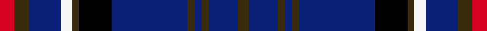

This is one **variant** — a specific cloth: this exact thread count and colourway, with its own
provenance below. It is one weaving of the [sett](/tartans/r/ru/ruxton-dress/) (the scale-free proportion — the
same cloth at any scale or shade), whose colour order is pattern [GBGBGBKGWBGR](/stripes/gbgbgbkgwbgr/).

Part of the [Ruxton Dress](/tartans/r/ru/ruxton-dress/) tartan — the named design grouping this sett with its other cloths.

Sourced from register-of-tartans.  It is a [12 stripe tartan](/stripes/stripes12/).

Original link [https://www.tartanregister.gov.uk/tartanDetails.aspx?ref=3626](https://www.tartanregister.gov.uk/tartanDetails.aspx?ref=3626)

2 attestations — the source records this cloth was collapsed from (oldest owns this page)

<ul>
<li>01/01/1997 — Ruxton Dress (register-of-tartans, <a href="https://www.tartanregister.gov.uk/tartanDetails.aspx?ref=3626">record</a>)  <em>Not Specified</em></li>
<li>pre 2002 — Ruxton Dress (Name) (tartans-authority, <a href="https://web.archive.org/web/*/http://www.tartansauthority.com/tartan-ferret/display/2380/*">record</a>)  <em>This tartan was presenting on the Internet amongst 4 other designs by Paul Ruxton from California. This design was adopted as the hunting tartan from the original 4 by Ian Ruxton. Can be worn by anyone with the name.</em></li>
</ul>

Dataset <small>— provenance for this record, inherited from the source manifest</small>

<dl class="dataset-prov">
<dt>source</dt><dd><a href="/sources/register-of-tartans/">Scottish Register of Tartans</a></dd>
<dt>data captured from</dt><dd><a href="https://github.com/thetartan/tartan-database/blob/master/data/register-of-tartans/data.csv">https://github.com/thetartan/tartan-database/blob/master/data/register-of-tartans/data.csv</a></dd>
<dt>data date</dt><dd>1997 <small>(this record)</small></dd>
<dt>licence</dt><dd><a href="https://www.tartanregister.gov.uk/copyright">Crown copyright</a></dd>
</dl>

Capture chain <small>— the hands this data passed through, oldest first; each capture carries its own licence</small>

<ol class="capture-chain">
<li><a href="https://www.tartanregister.gov.uk/">Scottish Register of Tartans</a> · <a href="https://www.tartanregister.gov.uk/copyright">Crown copyright</a> <small>the living register — still published by National Records of Scotland</small></li>
<li><a href="https://github.com/thetartan/tartan-database">thetartan/tartan-database</a> <small>2016-2017</small> · <a href="https://creativecommons.org/licenses/by-nc-nd/4.0/">CC BY-NC-ND 4.0</a> <small>Levko Kravets's frozen compilation — the capture we vendored, and where its CC licence text came from</small></li>
<li>this dictionary <small>captured 2026-06-10 · commit 5bf86c7566</small> <small>each re-capture is a git commit to data/sources</small></li>
</ol>

## Register references

External register numbers recorded for this tartan.

- Scottish Register of Tartans: [3626](https://www.tartanregister.gov.uk/tartanDetails.aspx?ref=3626)
- Scottish Tartans Authority (ITI): 2380
- Scottish Tartans World Register: 2380

## Thread count
R/8 DY8 DB18 W6 DY4 K18 DB42 DY4 DB4 DY4 DB16 DY/6

One full sett is **262 threads**.

## Palette
<table><thead><tr><th>Colour</th><th>Shade</th><th>OKLCh</th></tr></thead><tbody><tr><td>DB</td><td><code style="background-color:#082077;">#082077</code> <small style="color:#888">#082077</small></td><td><small style="color:#888">oklch(30.0% 0.149 265.1)</small></td></tr><tr><td>K</td><td><code style="background-color:#000000;">#000000</code> <small style="color:#888">#000000</small></td><td><small style="color:#888">oklch(0.0% 0.000 0.0)</small></td></tr><tr><td>R</td><td><code style="background-color:#D60020;">#D60020</code> <small style="color:#888">#D60020</small></td><td><small style="color:#888">oklch(55.2% 0.224 25.5)</small></td></tr><tr><td>W</td><td><code style="background-color:#F7F7F7;">#F7F7F7</code> <small style="color:#888">#F7F7F7</small></td><td><small style="color:#888">oklch(97.6% 0.000 89.9)</small></td></tr><tr><td>DY</td><td><code style="background-color:#3A2B0D;">#3A2B0D</code> <small style="color:#888">#3A2B0D</small></td><td><small style="color:#888">oklch(30.0% 0.049 82.0)</small></td></tr></tbody></table>

# Sample pattern

## Nearest tartan variants

The nearest existing variants by ΔTartan distance, with this cloth at the top so the swatches line up against it.

ΔTartan

Threads

Variant

Sett

—

262

<a href="/variants/s12/r4dy4db9w3dy2k9db21dy2db2dy2db8dy3~x2/">Ruxton Dress</a>

<a href="/ttd/edit/#slug=dr4y4db9w3y2k9db21y2db2y2db8y3~x2&amp;base=r4dy4db9w3dy2k9db21dy2db2dy2db8dy3~x2" title="compare in the TTD">0.12</a>

262

<a href="/variants/s12/dr4y4db9w3y2k9db21y2db2y2db8y3~x2/">Ruxton, dress</a>

<a href="/ttd/edit/#slug=y2db3r2db19k7db6k22db6k7db19r2db3w2~x2&amp;base=r4dy4db9w3dy2k9db21dy2db2dy2db8dy3~x2" title="compare in the TTD">1.88</a>

392

<a href="/variants/s13/y2db3r2db19k7db6k22db6k7db19r2db3w2~x2/">MacIver of Strome (Personal)</a>

<a href="/ttd/edit/#slug=k5lb2b10lb2k5db15k2db15k5db10lb1y2~x2~b2105244-db1406275&amp;base=r4dy4db9w3dy2k9db21dy2db2dy2db8dy3~x2" title="compare in the TTD">1.93</a>

282

<a href="/variants/s12/k5lb2t10lb2k5db15k2db15k5db10lb1y2~x2~t2105244-db1406275/">Goodwin, Robert Richard (Personal)</a>

<a href="/ttd/edit/#slug=k7db2k6db18r3db18k4b2db2b2w2b4k4~x2&amp;base=r4dy4db9w3dy2k9db21dy2db2dy2db8dy3~x2" title="compare in the TTD">1.93</a>

274

<a href="/variants/s13/k7db2k6db18r3db18k4b2db2b2w2b4k4~x2/">Pride of Norway (Fashion)</a>

<a href="/ttd/edit/#slug=y2db10k2r5k2db19k2db19g17k2y2~x2&amp;base=r4dy4db9w3dy2k9db21dy2db2dy2db8dy3~x2" title="compare in the TTD">1.94</a>

320

<a href="/variants/s11/y2db10k2r5k2db19k2db19g17k2y2~x2/">Montreat</a>

<a href="/ttd/edit/#slug=lb4k1db14k8db6dr2db6dr3db6dr2db6k2lo2~x2&amp;base=r4dy4db9w3dy2k9db21dy2db2dy2db8dy3~x2" title="compare in the TTD">2.14</a>

236

<a href="/variants/s13/lb4k1db14k8db6dr2db6dr3db6dr2db6k2lo2~x2/">Aberdale (Fashion)</a>

<a href="/ttd/edit/#slug=k8w2k2db2k6db18r3db18k6db2k7~x2&amp;base=r4dy4db9w3dy2k9db21dy2db2dy2db8dy3~x2" title="compare in the TTD">2.15</a>

266

<a href="/variants/s11/k8w2k2db2k6db18r3db18k6db2k7~x2/">Pride of Norway</a>

<a href="/ttd/edit/#slug=lb6db10dp4db12dg19dp4dg8k20db50lb4&amp;base=r4dy4db9w3dy2k9db21dy2db2dy2db8dy3~x2" title="compare in the TTD">2.21</a>

264

<a href="/variants/s10/lb6db10dp4db12dg19dp4dg8k20db50lb4/">Spirit of Alva</a>

<a href="/ttd/edit/#slug=db20g3dy3db3r7g6db3k12db3k3db24w3~x2&amp;base=r4dy4db9w3dy2k9db21dy2db2dy2db8dy3~x2" title="compare in the TTD">2.32</a>

314

<a href="/variants/s12/db20g3dy3db3r7g6db3k12db3k3db24w3~x2/">Bhoyrub Clan/Family Tartan</a>

<a href="/ttd/edit/#slug=dg4w1b4dr4k2b12k2b12k2dr4k4b4~x2&amp;base=r4dy4db9w3dy2k9db21dy2db2dy2db8dy3~x2" title="compare in the TTD">2.35</a>

204

<a href="/variants/s12/dg4w1b4dr4k2b12k2b12k2dr4k4b4~x2/">Otago Peninsula</a>

## Neighbour map

Every grey dot is one of 13656 variants placed by the first two principal components of the ΔTartan feature space (42% of its variance). Red is this tartan; blue dots are its nearest — click one to open its page. The map is a flat projection of a many-dimensional space — [how to read it](/posts/neighbourhood-maps/).

<svg viewBox="0 0 640 380" role="img" style="max-width:100%;height:auto;border:1px solid #e0e0e0;border-radius:4px;display:block" xmlns="http://www.w3.org/2000/svg"><image href="/nn/cloud.v1.png" width="640" height="380"/><a href="/variants/s12/dr4y4db9w3y2k9db21y2db2y2db8y3~x2/"><circle cx="250.0" cy="146.4" r="4" fill="#3465a4"><title>Ruxton, dress</title></circle></a><a href="/variants/s13/y2db3r2db19k7db6k22db6k7db19r2db3w2~x2/"><circle cx="269.1" cy="143.9" r="4" fill="#3465a4"><title>MacIver of Strome (Personal)</title></circle></a><a href="/variants/s12/k5lb2t10lb2k5db15k2db15k5db10lb1y2~x2~t2105244-db1406275/"><circle cx="237.1" cy="146.7" r="4" fill="#3465a4"><title>Goodwin, Robert Richard (Personal)</title></circle></a><a href="/variants/s13/k7db2k6db18r3db18k4b2db2b2w2b4k4~x2/"><circle cx="224.3" cy="141.0" r="4" fill="#3465a4"><title>Pride of Norway (Fashion)</title></circle></a><a href="/variants/s11/y2db10k2r5k2db19k2db19g17k2y2~x2/"><circle cx="256.6" cy="152.3" r="4" fill="#3465a4"><title>Montreat</title></circle></a><a href="/variants/s13/lb4k1db14k8db6dr2db6dr3db6dr2db6k2lo2~x2/"><circle cx="272.2" cy="152.4" r="4" fill="#3465a4"><title>Aberdale (Fashion)</title></circle></a><a href="/variants/s11/k8w2k2db2k6db18r3db18k6db2k7~x2/"><circle cx="230.3" cy="141.8" r="4" fill="#3465a4"><title>Pride of Norway</title></circle></a><a href="/variants/s10/lb6db10dp4db12dg19dp4dg8k20db50lb4/"><circle cx="257.7" cy="155.0" r="4" fill="#3465a4"><title>Spirit of Alva</title></circle></a><a href="/variants/s12/db20g3dy3db3r7g6db3k12db3k3db24w3~x2/"><circle cx="225.8" cy="140.9" r="4" fill="#3465a4"><title>Bhoyrub Clan/Family Tartan</title></circle></a><a href="/variants/s12/dg4w1b4dr4k2b12k2b12k2dr4k4b4~x2/"><circle cx="239.6" cy="154.1" r="4" fill="#3465a4"><title>Otago Peninsula</title></circle></a><circle cx="263.9" cy="150.1" r="5" fill="#c00000"/><text x="320" y="376" text-anchor="middle" font-size="11" fill="#999">ground</text><text x="11" y="190" text-anchor="middle" font-size="11" fill="#999" transform="rotate(-90 11 190)">complexity</text></svg>

ID: /variants/s12/r4dy4db9w3dy2k9db21dy2db2dy2db8dy3~x2/
