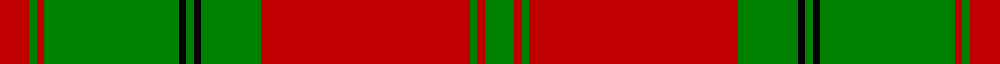

This is one **variant** — a specific cloth: this exact thread count and colourway, with its own
provenance below. It is one weaving of the [sett](/tartans/d/dr/drummond-10/) (the scale-free proportion — the
same cloth at any scale or shade), whose colour order is pattern [GRGRGKGKGRGR](/stripes/grgrgkgkgrgr/).

Part of the [Drummond](/tartans/d/dr/drummond-10/) tartan — the named design grouping this sett with its other cloths.

Sourced from register-of-tartans.  It is a [12 stripe tartan](/stripes/stripes12/).

Original link [https://www.tartanregister.gov.uk/tartanDetails.aspx?ref=982](https://www.tartanregister.gov.uk/tartanDetails.aspx?ref=982)

5 attestations — the source records this cloth was collapsed from (oldest owns this page)

<ul>
<li>undated — Drummond #3 (register-of-tartans, <a href="https://www.tartanregister.gov.uk/tartanDetails.aspx?ref=982">record</a>)  <em>The design comes from the Vestiarium Scoticum (1842). The authors, the Sobieski Stuart brothers, enjoyed a popular following among the Scottish gentry in the early Victorian era, and in the spirit of the times, added mystery, romance and some spurious historical documentation to the subject of tartan. Of the better known tartans, the book offers some minor variation, but in other cases it provides the only recorded version of many tartans in use today.</em></li>
<li>undated — Drummond VS (weddslist, <a href="http://www.weddslist.com/cgi-bin/tartans/pg.pl?source=rb">record</a>) </li>
<li>undated — Drummond (weddslist, <a href="http://www.weddslist.com/cgi-bin/tartans/pg.pl?source=sts">record</a>) </li>
<li>undated — Drummond VS (weddslist, <a href="http://www.weddslist.com/cgi-bin/tartans/pg.pl?source=tinsel">record</a>) </li>
<li>undated — Drummond VS (weddslist, <a href="http://www.weddslist.com/cgi-bin/tartans/pg.pl?source=x">record</a>) </li>
</ul>

Dataset <small>— provenance for this record, inherited from the source manifest</small>

<dl class="dataset-prov">
<dt>source</dt><dd><a href="/sources/register-of-tartans/">Scottish Register of Tartans</a></dd>
<dt>data captured from</dt><dd><a href="https://github.com/thetartan/tartan-database/blob/master/data/register-of-tartans/data.csv">https://github.com/thetartan/tartan-database/blob/master/data/register-of-tartans/data.csv</a></dd>
<dt>data date</dt><dd>2017-01-06 <small>(dataset default)</small></dd>
<dt>licence</dt><dd><a href="https://www.tartanregister.gov.uk/copyright">Crown copyright</a></dd>
</dl>

Capture chain <small>— the hands this data passed through, oldest first; each capture carries its own licence</small>

<ol class="capture-chain">
<li><a href="https://www.tartanregister.gov.uk/">Scottish Register of Tartans</a> · <a href="https://www.tartanregister.gov.uk/copyright">Crown copyright</a> <small>the living register — still published by National Records of Scotland</small></li>
<li><a href="https://github.com/thetartan/tartan-database">thetartan/tartan-database</a> <small>2016-2017</small> · <a href="https://creativecommons.org/licenses/by-nc-nd/4.0/">CC BY-NC-ND 4.0</a> <small>Levko Kravets's frozen compilation — the capture we vendored, and where its CC licence text came from</small></li>
<li>this dictionary <small>captured 2026-06-10 · commit 5bf86c7566</small> <small>each re-capture is a git commit to data/sources</small></li>
</ol>

## Register references

External register numbers recorded for this tartan.

- Scottish Register of Tartans: [982](https://www.tartanregister.gov.uk/tartanDetails.aspx?ref=982)
- Scottish Tartans World Register: 897

## Thread count
R/8 G2 R2 G36 K2 G2 K2 G16 R56 G2 R2 G/8

One full sett is **260 threads**.

## Palette
<table><thead><tr><th>Colour</th><th>Shade</th><th>OKLCh</th></tr></thead><tbody><tr><td>G</td><td><code style="background-color:#008B2A;">#008B2A</code> <small style="color:#888">#008B2A</small></td><td><small style="color:#888">oklch(55.4% 0.170 145.9)</small></td></tr><tr><td>K</td><td><code style="background-color:#000000;">#000000</code> <small style="color:#888">#000000</small></td><td><small style="color:#888">oklch(0.0% 0.000 0.0)</small></td></tr><tr><td>R</td><td><code style="background-color:#D60020;">#D60020</code> <small style="color:#888">#D60020</small></td><td><small style="color:#888">oklch(55.2% 0.224 25.5)</small></td></tr></tbody></table>

# Sample pattern

## Nearest tartan variants

The nearest existing variants by ΔTartan distance, with this cloth at the top so the swatches line up against it.

ΔTartan

Threads

Variant

Sett

—

260

<a href="/variants/s12/r4g1r1g18k1g1k1g8r28g1r1g4~x2/">Drummond #3</a>

<a href="/ttd/edit/#slug=r24g2r2g40r25g2r2g2r2g20~x2&amp;base=r4g1r1g18k1g1k1g8r28g1r1g4~x2" title="compare in the TTD">2.32</a>

396

<a href="/variants/s10/r24g2r2g40r25g2r2g2r2g20~x2/">Donachie</a>

<a href="/ttd/edit/#slug=r36g18r4g6k1lr2k1g2~x2&amp;base=r4g1r1g18k1g1k1g8r28g1r1g4~x2" title="compare in the TTD">2.37</a>

204

<a href="/variants/s8/r36g18r4g6k1lr2k1g2~x2/">Strang (Personal)</a>

<a href="/ttd/edit/#slug=g4r3k1r28g14r4g4w3g4r4g4w3~x2~w4000000&amp;base=r4g1r1g18k1g1k1g8r28g1r1g4~x2" title="compare in the TTD">2.90</a>

290

<a href="/variants/s12/g4r3k1r28g14r4g4w3g4r4g4w3~x2~w4000000/">Scott</a>

<a href="/ttd/edit/#slug=g18r3g2r2db6r2g2r24g1r2g6~x2&amp;base=r4g1r1g18k1g1k1g8r28g1r1g4~x2" title="compare in the TTD">3.04</a>

224

<a href="/variants/s11/g18r3g2r2db6r2g2r24g1r2g6~x2/">MacDonell of Glengarry #4</a>

<a href="/ttd/edit/#slug=r4g4w3g4r4g14r28k1r3g4~x2&amp;base=r4g1r1g18k1g1k1g8r28g1r1g4~x2" title="compare in the TTD">3.12</a>

260

<a href="/variants/s10/r4g4w3g4r4g14r28k1r3g4~x2/">Scott - 1842 (Clan)</a>

<a href="/ttd/edit/#slug=r60db2r2g63r2db2r2db20r2db2r54g2r2g40&amp;base=r4g1r1g18k1g1k1g8r28g1r1g4~x2" title="compare in the TTD">3.13</a>

410

<a href="/variants/s14/r60db2r2g63r2db2r2db20r2db2r54g2r2g40/">Bruce - 1819 (Old)</a>

<a href="/ttd/edit/#slug=r2w1g1r16g7r1w1g1w1r1g7w2r1g2~x2&amp;base=r4g1r1g18k1g1k1g8r28g1r1g4~x2" title="compare in the TTD">3.19</a>

168

<a href="/variants/s14/r2w1g1r16g7r1w1g1w1r1g7w2r1g2~x2/">Mordente (Personal)</a>

<a href="/ttd/edit/#slug=r2w1g1r16g7r1w1g1w1r1g7w2r1g2~x4&amp;base=r4g1r1g18k1g1k1g8r28g1r1g4~x2" title="compare in the TTD">3.19</a>

336

<a href="/variants/s14/r2w1g1r16g7r1w1g1w1r1g7w2r1g2~x4/">Mordente (Personal)</a>

<a href="/ttd/edit/#slug=k2r2k2r24g31k1g2y2~x2&amp;base=r4g1r1g18k1g1k1g8r28g1r1g4~x2" title="compare in the TTD">3.20</a>

256

<a href="/variants/s8/k2r2k2r24g31k1g2y2~x2/">Gleneil</a>

<a href="/ttd/edit/#slug=r1w1g1r16g7r1w1g1w1r1g7w2r1g1~x2&amp;base=r4g1r1g18k1g1k1g8r28g1r1g4~x2" title="compare in the TTD">3.21</a>

164

<a href="/variants/s14/r1w1g1r16g7r1w1g1w1r1g7w2r1g1~x2/">Mordente Family Tartan</a>

## Neighbour map

Every grey dot is one of 13657 variants placed by the first two principal components of the ΔTartan feature space (42% of its variance). Red is this tartan; blue dots are its nearest — click one to open its page. The map is a flat projection of a many-dimensional space — [how to read it](/posts/neighbourhood-maps/).

<svg viewBox="0 0 640 380" role="img" style="max-width:100%;height:auto;border:1px solid #e0e0e0;border-radius:4px;display:block" xmlns="http://www.w3.org/2000/svg"><image href="/nn/cloud.v1.png" width="640" height="380"/><a href="/variants/s10/r24g2r2g40r25g2r2g2r2g20~x2/"><circle cx="421.9" cy="182.6" r="4" fill="#3465a4"><title>Donachie</title></circle></a><a href="/variants/s8/r36g18r4g6k1lr2k1g2~x2/"><circle cx="322.2" cy="86.0" r="4" fill="#3465a4"><title>Strang (Personal)</title></circle></a><a href="/variants/s12/g4r3k1r28g14r4g4w3g4r4g4w3~x2~w4000000/"><circle cx="307.5" cy="106.0" r="4" fill="#3465a4"><title>Scott</title></circle></a><a href="/variants/s11/g18r3g2r2db6r2g2r24g1r2g6~x2/"><circle cx="352.9" cy="147.8" r="4" fill="#3465a4"><title>MacDonell of Glengarry #4</title></circle></a><a href="/variants/s10/r4g4w3g4r4g14r28k1r3g4~x2/"><circle cx="350.6" cy="114.2" r="4" fill="#3465a4"><title>Scott - 1842 (Clan)</title></circle></a><a href="/variants/s14/r60db2r2g63r2db2r2db20r2db2r54g2r2g40/"><circle cx="357.0" cy="120.5" r="4" fill="#3465a4"><title>Bruce - 1819 (Old)</title></circle></a><a href="/variants/s14/r2w1g1r16g7r1w1g1w1r1g7w2r1g2~x2/"><circle cx="317.8" cy="141.7" r="4" fill="#3465a4"><title>Mordente (Personal)</title></circle></a><a href="/variants/s14/r2w1g1r16g7r1w1g1w1r1g7w2r1g2~x4/"><circle cx="317.8" cy="141.7" r="4" fill="#3465a4"><title>Mordente (Personal)</title></circle></a><a href="/variants/s8/k2r2k2r24g31k1g2y2~x2/"><circle cx="315.3" cy="106.9" r="4" fill="#3465a4"><title>Gleneil</title></circle></a><a href="/variants/s14/r1w1g1r16g7r1w1g1w1r1g7w2r1g1~x2/"><circle cx="318.8" cy="137.2" r="4" fill="#3465a4"><title>Mordente Family Tartan</title></circle></a><circle cx="361.9" cy="110.5" r="5" fill="#c00000"/><text x="320" y="376" text-anchor="middle" font-size="11" fill="#999">ground</text><text x="11" y="190" text-anchor="middle" font-size="11" fill="#999" transform="rotate(-90 11 190)">complexity</text></svg>

ID: /variants/s12/r4g1r1g18k1g1k1g8r28g1r1g4~x2/
