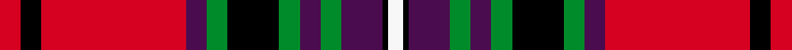

This page is one **sett** — a single exact thread-count. It belongs to the [tartan](/setts/r4k4r28dp4g4k10g4dp4g4dp8k1w3/)
(the same proportion at any scale), whose colour order is pattern [RKRBGKGBGBKW](/stripes/rkrbgkgbgbkw/).

Part of the [Kelly of Sleat](/tartans/kelly-of-sleat/) tartan — the named design grouping this sett with its other cloths.

Sourced from register-of-tartans.  It is a [12 stripe tartan](/stripes/stripes12/).

Original link https://www.tartanregister.gov.uk/tartanDetails.aspx?ref=5251

## Register references

External register numbers recorded for this tartan.

- Scottish Register of Tartans: [5251](https://www.tartanregister.gov.uk/tartanDetails.aspx?ref=5251)
- Scottish Tartans Authority (ITI): 3845

## Thread count
R/8 K8 R56 DP8 G8 K20 G8 DP8 G8 DP16 K2 W/6

One full sett is **298 threads**.

## Palette
<table><thead><tr><th>Colour</th><th>Shade</th><th>OKLCh</th></tr></thead><tbody><tr><td>G</td><td><code style="background-color:#008B2A;">#008B2A</code> <small style="color:#888">#008B2A</small></td><td><small style="color:#888">oklch(55.4% 0.170 145.9)</small></td></tr><tr><td>K</td><td><code style="background-color:#000000;">#000000</code> <small style="color:#888">#000000</small></td><td><small style="color:#888">oklch(0.0% 0.000 0.0)</small></td></tr><tr><td>LN</td><td><code style="background-color:#F7F7F7;">#F7F7F7</code> <small style="color:#888">#F7F7F7</small></td><td><small style="color:#888">oklch(97.6% 0.000 89.9)</small></td></tr><tr><td>P</td><td><code style="background-color:#4B0B4F;">#4B0B4F</code> <small style="color:#888">#4B0B4F</small></td><td><small style="color:#888">oklch(30.1% 0.125 325.4)</small></td></tr><tr><td>R</td><td><code style="background-color:#D60020;">#D60020</code> <small style="color:#888">#D60020</small></td><td><small style="color:#888">oklch(55.2% 0.224 25.5)</small></td></tr></tbody></table>

# Sample pattern

ID: /variants/s12/r4k4r28dp4g4k10g4dp4g4dp8k1w3~x2/
