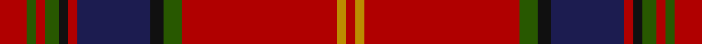

This page is one **sett** — a single exact thread-count. It belongs to the [tartan](/setts/r6dg2r2dg3k2r2db16k3dg4r34lo2r2/)
(the same proportion at any scale), whose colour order is pattern [RGRGKRBKGRYR](/stripes/rgrgkrbkgryr/).

Sourced from register-of-tartans.  It is a [12 stripe tartan](/stripes/stripes12/).

Original link https://www.tartanregister.gov.uk/tartanDetails.aspx?ref=2941

2 attestations — the source records this cloth was collapsed from (oldest owns this page)

<ul>
<li>01/09/2005 — Methodist Church (register-of-tartans, <a href="https://www.tartanregister.gov.uk/tartanDetails.aspx?ref=2941">record</a>)</li>
<li>2005 September — Methodist Church (Corporate) (tartans-authority, <a href="http://www.tartansauthority.com/tartan-ferret/display/6794/">record</a>)</li>
</ul>

## Register references

External register numbers recorded for this tartan.

- Scottish Register of Tartans: [2941](https://www.tartanregister.gov.uk/tartanDetails.aspx?ref=2941)
- Scottish Tartans Authority (ITI): 6794

## Thread count
DR/12 G4 DR4 G6 K4 DR4 DB32 K6 G8 DR68 DY4 DR/4

One full sett is **296 threads**.

## Palette

Palette: <strong>Tartan Register</strong> <small style="color:#888">(4 of 5 colours)</small>
<table><thead><tr><th>Colour</th><th>Threads</th><th>Shade</th><th>Base</th><th>OKLCh</th></tr></thead><tbody><tr><td>DR/</td><td style="text-align:right;font-variant-numeric:tabular-nums">12</td><td><code style="background-color:#B00000;">#B00000</code> <small style="color:#888">#B00000</small></td><td>R <code style="background-color:#CC0000;">#CC0000</code></td><td><small style="color:#888">oklch(47.5% 0.195 29.2)</small></td></tr><tr><td>G</td><td style="text-align:right;font-variant-numeric:tabular-nums">4</td><td><code style="background-color:#285800;">#285800</code> <small style="color:#888">#285800</small></td><td>G <code style="background-color:#006100;">#006100</code></td><td><small style="color:#888">oklch(41.0% 0.122 135.8)</small></td></tr><tr><td>DR</td><td style="text-align:right;font-variant-numeric:tabular-nums">4</td><td><code style="background-color:#B00000;">#B00000</code> <small style="color:#888">#B00000</small></td><td>R <code style="background-color:#CC0000;">#CC0000</code></td><td><small style="color:#888">oklch(47.5% 0.195 29.2)</small></td></tr><tr><td>G</td><td style="text-align:right;font-variant-numeric:tabular-nums">6</td><td><code style="background-color:#285800;">#285800</code> <small style="color:#888">#285800</small></td><td>G <code style="background-color:#006100;">#006100</code></td><td><small style="color:#888">oklch(41.0% 0.122 135.8)</small></td></tr><tr><td>K</td><td style="text-align:right;font-variant-numeric:tabular-nums">4</td><td><code style="background-color:#101010;">#101010</code> <small style="color:#888">#101010</small></td><td>K <code style="background-color:#000000;">#000000</code></td><td><small style="color:#888">oklch(17.3% 0.000 89.9)</small></td></tr><tr><td>DR</td><td style="text-align:right;font-variant-numeric:tabular-nums">4</td><td><code style="background-color:#B00000;">#B00000</code> <small style="color:#888">#B00000</small></td><td>R <code style="background-color:#CC0000;">#CC0000</code></td><td><small style="color:#888">oklch(47.5% 0.195 29.2)</small></td></tr><tr><td>DB</td><td style="text-align:right;font-variant-numeric:tabular-nums">32</td><td><code style="background-color:#1C1C50;">#1C1C50</code> <small style="color:#888">#1C1C50</small></td><td>B <code style="background-color:#2A418A;">#2A418A</code></td><td><small style="color:#888">oklch(26.2% 0.093 277.9)</small></td></tr><tr><td>K</td><td style="text-align:right;font-variant-numeric:tabular-nums">6</td><td><code style="background-color:#101010;">#101010</code> <small style="color:#888">#101010</small></td><td>K <code style="background-color:#000000;">#000000</code></td><td><small style="color:#888">oklch(17.3% 0.000 89.9)</small></td></tr><tr><td>G</td><td style="text-align:right;font-variant-numeric:tabular-nums">8</td><td><code style="background-color:#285800;">#285800</code> <small style="color:#888">#285800</small></td><td>G <code style="background-color:#006100;">#006100</code></td><td><small style="color:#888">oklch(41.0% 0.122 135.8)</small></td></tr><tr><td>DR</td><td style="text-align:right;font-variant-numeric:tabular-nums">68</td><td><code style="background-color:#B00000;">#B00000</code> <small style="color:#888">#B00000</small></td><td>R <code style="background-color:#CC0000;">#CC0000</code></td><td><small style="color:#888">oklch(47.5% 0.195 29.2)</small></td></tr><tr><td>DY</td><td style="text-align:right;font-variant-numeric:tabular-nums">4</td><td><code style="background-color:#BC8C00;">#BC8C00</code> <small style="color:#888">#BC8C00</small></td><td>Y <code style="background-color:#F2BF00;">#F2BF00</code></td><td><small style="color:#888">oklch(66.8% 0.137 84.1)</small></td></tr><tr><td>DR/</td><td style="text-align:right;font-variant-numeric:tabular-nums">4</td><td><code style="background-color:#B00000;">#B00000</code> <small style="color:#888">#B00000</small></td><td>R <code style="background-color:#CC0000;">#CC0000</code></td><td><small style="color:#888">oklch(47.5% 0.195 29.2)</small></td></tr></tbody></table>

## Nearest tartans

The nearest existing variants by ΔTartan distance, with this tartan at the top so the swatches line up against it.

ΔTartan

Tartan

Sett

—

<a href="/ttd/edit/#slug=r6dg2r2dg3k2r2db16k3dg4r34lo2r2~x2">Methodist Church</a> <a class="nn-out" href="/variants/s12/r6dg2r2dg3k2r2db16k3dg4r34lo2r2~x2/" title="open its dictionary page">↗</a>

1.01

<a href="/ttd/edit/#slug=r24ly1db1r3dg16r3db1ly1r3db6r3ly1db1r16dg2dr2dg2~x2&amp;base=r6dg2r2dg3k2r2db16k3dg4r34lo2r2~x2">Munro</a> <a class="nn-out" href="/variants/s17/r24ly1db1r3dg16r3db1ly1r3db6r3ly1db1r16dg2dr2dg2~x2/" title="open its dictionary page">↗</a>

1.05

<a href="/ttd/edit/#slug=r6lr1r24db6dg2k1dg2k1dg12r1~x2&amp;base=r6dg2r2dg3k2r2db16k3dg4r34lo2r2~x2">Chisholm VS</a> <a class="nn-out" href="/variants/s10/r6lr1r24db6dg2k1dg2k1dg12r1~x2/" title="open its dictionary page">↗</a>

1.05

<a href="/ttd/edit/#slug=r6lr1r24db6dg2k1dg2k1dg12r1&amp;base=r6dg2r2dg3k2r2db16k3dg4r34lo2r2~x2">Chisholm VS</a> <a class="nn-out" href="/variants/s10/r6lr1r24db6dg2k1dg2k1dg12r1/" title="open its dictionary page">↗</a>

1.08

<a href="/ttd/edit/#slug=dy21m2w1ly3m2dy5m21ly1ly1ly1m1dy8~x2&amp;base=r6dg2r2dg3k2r2db16k3dg4r34lo2r2~x2">Glendronach Corporate Tartan</a> <a class="nn-out" href="/variants/s12/dy21m2w1ly3m2dy5m21ly1ly1ly1m1dy8~x2/" title="open its dictionary page">↗</a>

1.10

<a href="/ttd/edit/#slug=r6ly1r24g6db2k1db2k1db12r1~x2&amp;base=r6dg2r2dg3k2r2db16k3dg4r34lo2r2~x2">MacEdward</a> <a class="nn-out" href="/variants/s10/r6ly1r24g6db2k1db2k1db12r1~x2/" title="open its dictionary page">↗</a>

1.13

<a href="/ttd/edit/#slug=dr50o6dy7dg2dy2ly2dy2o14dr8dy2dr9dg3~x2&amp;base=r6dg2r2dg3k2r2db16k3dg4r34lo2r2~x2">Tyrone Irish County Tartan</a> <a class="nn-out" href="/variants/s12/dr50o6dy7dg2dy2ly2dy2o14dr8dy2dr9dg3~x2/" title="open its dictionary page">↗</a>

1.19

<a href="/ttd/edit/#slug=ri42db3ri6lo2ri2lb2ri2g14r8ri2r3lb2~x2&amp;base=r6dg2r2dg3k2r2db16k3dg4r34lo2r2~x2">Wcwm 1286-9</a> <a class="nn-out" href="/variants/s12/ri42db3ri6lo2ri2lb2ri2g14r8ri2r3lb2~x2/" title="open its dictionary page">↗</a>

1.19

<a href="/ttd/edit/#slug=r23g3ly1g3r2db18r2w1g3r2db2r23~x2&amp;base=r6dg2r2dg3k2r2db16k3dg4r34lo2r2~x2">Mair (Personal)</a> <a class="nn-out" href="/variants/s12/r23g3ly1g3r2db18r2w1g3r2db2r23~x2/" title="open its dictionary page">↗</a>

1.21

<a href="/ttd/edit/#slug=r68o5k9y3k3lb3k3dg20r9k3r5lb4&amp;base=r6dg2r2dg3k2r2db16k3dg4r34lo2r2~x2">British Caledonian Airways #4</a> <a class="nn-out" href="/variants/s12/r68o5k9y3k3lb3k3dg20r9k3r5lb4/" title="open its dictionary page">↗</a>

1.21

<a href="/ttd/edit/#slug=dg2r2db1r24b1db6r3dg12r4db1~x2&amp;base=r6dg2r2dg3k2r2db16k3dg4r34lo2r2~x2">MacDonell of Keppoch</a> <a class="nn-out" href="/variants/s10/dg2r2db1r24b1db6r3dg12r4db1~x2/" title="open its dictionary page">↗</a>

## Neighbour map

Every grey dot is one of 14360 variants placed by the first two principal components of the ΔTartan feature space (44% of its variance). Red is this tartan; blue dots are its nearest — click one to open its page.

<svg viewBox="0 0 640 380" role="img" style="max-width:100%;height:auto;border:1px solid #e0e0e0;border-radius:4px;display:block" xmlns="http://www.w3.org/2000/svg"><image href="/nn/cloud.v1.png" width="640" height="380"/><a href="/variants/s17/r24ly1db1r3dg16r3db1ly1r3db6r3ly1db1r16dg2dr2dg2~x2/"><circle cx="380.1" cy="93.4" r="4" fill="#3465a4"><title>Munro</title></circle></a><a href="/variants/s10/r6lr1r24db6dg2k1dg2k1dg12r1~x2/"><circle cx="349.1" cy="116.1" r="4" fill="#3465a4"><title>Chisholm VS</title></circle></a><a href="/variants/s10/r6lr1r24db6dg2k1dg2k1dg12r1/"><circle cx="349.1" cy="116.1" r="4" fill="#3465a4"><title>Chisholm VS</title></circle></a><a href="/variants/s12/dy21m2w1ly3m2dy5m21ly1ly1ly1m1dy8~x2/"><circle cx="353.0" cy="117.3" r="4" fill="#3465a4"><title>Glendronach Corporate Tartan</title></circle></a><a href="/variants/s10/r6ly1r24g6db2k1db2k1db12r1~x2/"><circle cx="342.6" cy="106.9" r="4" fill="#3465a4"><title>MacEdward</title></circle></a><a href="/variants/s12/dr50o6dy7dg2dy2ly2dy2o14dr8dy2dr9dg3~x2/"><circle cx="423.8" cy="114.2" r="4" fill="#3465a4"><title>Tyrone Irish County Tartan</title></circle></a><a href="/variants/s12/ri42db3ri6lo2ri2lb2ri2g14r8ri2r3lb2~x2/"><circle cx="388.4" cy="91.9" r="4" fill="#3465a4"><title>Wcwm 1286-9</title></circle></a><a href="/variants/s12/r23g3ly1g3r2db18r2w1g3r2db2r23~x2/"><circle cx="388.9" cy="102.5" r="4" fill="#3465a4"><title>Mair (Personal)</title></circle></a><a href="/variants/s12/r68o5k9y3k3lb3k3dg20r9k3r5lb4/"><circle cx="380.2" cy="87.8" r="4" fill="#3465a4"><title>British Caledonian Airways #4</title></circle></a><a href="/variants/s10/dg2r2db1r24b1db6r3dg12r4db1~x2/"><circle cx="397.3" cy="136.4" r="4" fill="#3465a4"><title>MacDonell of Keppoch</title></circle></a><circle cx="368.2" cy="114.1" r="5" fill="#c00000"/></svg>

ID: /variants/s12/r6dg2r2dg3k2r2db16k3dg4r34lo2r2~x2/
