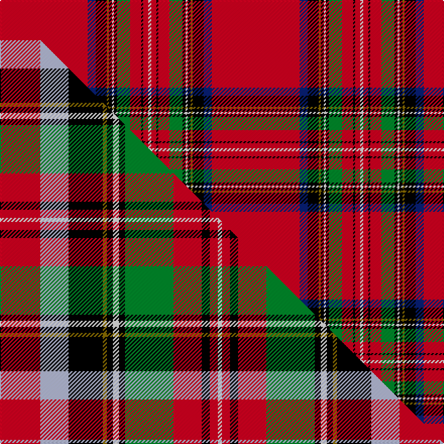

This page is one **sett** — a single exact thread-count. It belongs to the [tartan](/setts/r87db8k11y2k3w2k3g13r11k2r5w3/)
(the same proportion at any scale), whose colour order is pattern [RBKGKWKGRKRW](/stripes/rbkgkwkgrkrw/).

Part of the [Royal Stewart](/tartans/royal-stewart/) tartan — the named design grouping this sett with its other cloths.

Sourced from register-of-tartans.  It is a [12 stripe tartan](/stripes/stripes12/).

Original link https://www.tartanregister.gov.uk/tartanDetails.aspx?ref=3957

2 attestations — the source records this cloth was collapsed from (oldest owns this page)

<ul>
<li>01/01/1819 — Stewart/Stuart, Royal (register-of-tartans, <a href="https://www.tartanregister.gov.uk/tartanDetails.aspx?ref=3957">record</a>)  <em>A plaid from the Hepburn Collection. Said to be very faded. This is a very large sett and has been divided by four to show here which explains the odd-numbered thread counts. The blue bordering the red bocks is often shown as azure. The best known of all Scottish tartans, the Royal Stewart is the tartan of the Royal House of Stewart and the personal tartan of the reigning monarch. Theoretically it cannot be used or worn without the express permission of HM The Queen. In pratice however, this is the most popular tartan ever woven and can be seen on a huge range of products. The genie is well and truly out of the bottle so the theory rather evaporates.</em></li>
<li>undated — Royal Stewart (weddslist, <a href="http://www.weddslist.com/cgi-bin/tartans/pg.pl?source=sts">record</a>) </li>
</ul>

## Register references

External register numbers recorded for this tartan.

- Scottish Register of Tartans: [3957](https://www.tartanregister.gov.uk/tartanDetails.aspx?ref=3957)
- Scottish Tartans Authority (ITI): 1375
- Scottish Tartans World Register: 1375

## Thread count
R/87 DB8 K11 Y2 K3 W2 K3 G13 R11 K2 R5 W/3

One full sett is **210 threads**.

## Palette
<table><thead><tr><th>Colour</th><th>Shade</th><th>OKLCh</th></tr></thead><tbody><tr><td>DB</td><td><code style="background-color:#082077;">#082077</code> <small style="color:#888">#082077</small></td><td><small style="color:#888">oklch(30.0% 0.149 265.1)</small></td></tr><tr><td>G</td><td><code style="background-color:#008B2A;">#008B2A</code> <small style="color:#888">#008B2A</small></td><td><small style="color:#888">oklch(55.4% 0.170 145.9)</small></td></tr><tr><td>K</td><td><code style="background-color:#000000;">#000000</code> <small style="color:#888">#000000</small></td><td><small style="color:#888">oklch(0.0% 0.000 0.0)</small></td></tr><tr><td>W</td><td><code style="background-color:#F7F7F7;">#F7F7F7</code> <small style="color:#888">#F7F7F7</small></td><td><small style="color:#888">oklch(97.6% 0.000 89.9)</small></td></tr><tr><td>R</td><td><code style="background-color:#D60020;">#D60020</code> <small style="color:#888">#D60020</small></td><td><small style="color:#888">oklch(55.2% 0.224 25.5)</small></td></tr><tr><td>Y</td><td><code style="background-color:#8B6E00;">#8B6E00</code> <small style="color:#888">#8B6E00</small></td><td><small style="color:#888">oklch(55.1% 0.113 90.4)</small></td></tr></tbody></table>

# Sample pattern

## Compared to the master

This cloth is one sett of its design; the master sett (the exemplar the design is anchored on) is below for comparison.

Its **ΔTartan distance** from the master is **4.95** — the same measure the nearest-tartans table ranks by (0 is identical; a re-scale of the same cloth is near 0, a recolour or a different proportion further).

<figure class="master-compare" style="margin:0">

this sett
master sett ★

<figcaption style="color:#888;font-size:smaller">One weave of this sett against the <a href="/setts/r20lb14k17y2k3w3k3g24r14k4r4w2/">master sett ★</a>, split on the diagonal: a shared proportion runs seamlessly across it with only the shades shifting; a different proportion breaks on it.</figcaption>
</figure>

## Nearest variants

The nearest existing variants by ΔTartan distance, with this cloth at the top so the swatches line up against it.

ΔTartan

Threads

Variant

Sett

—

210

<a href="/variants/s12/r87db8k11y2k3w2k3g13r11k2r5w3/">Stewart/Stuart, Royal</a>

<a href="/ttd/edit/#slug=r36db4k6y1k1w1k1g8r4k1r2w1&amp;base=r87db8k11y2k3w2k3g13r11k2r5w3" title="compare in the TTD">0.23</a>

95

<a href="/variants/s12/r36db4k6y1k1w1k1g8r4k1r2w1/">Stewart Royal</a>

<a href="/ttd/edit/#slug=r36db4k6y1k1w1k1g8r4k1r2w1~x2&amp;base=r87db8k11y2k3w2k3g13r11k2r5w3" title="compare in the TTD">0.23</a>

190

<a href="/variants/s12/r36db4k6y1k1w1k1g8r4k1r2w1~x2/">Stewart Royal</a>

<a href="/ttd/edit/#slug=r134lb10k14y2k3w3k3dg21r11k3r4w2&amp;base=r87db8k11y2k3w2k3g13r11k2r5w3" title="compare in the TTD">0.35</a>

284

<a href="/variants/s12/r134lb10k14y2k3w3k3dg21r11k3r4w2/">Royal Stewart - 1819</a>

<a href="/ttd/edit/#slug=r66db2k11y4k2w4k11g2r8k2r8w2&amp;base=r87db8k11y2k3w2k3g13r11k2r5w3" title="compare in the TTD">0.43</a>

176

<a href="/variants/s12/r66db2k11y4k2w4k11g2r8k2r8w2/">TIlted Kilt</a>

<a href="/ttd/edit/#slug=r66db2k11ly4k2w4k11g2r8k2r8w2&amp;base=r87db8k11y2k3w2k3g13r11k2r5w3" title="compare in the TTD">0.43</a>

176

<a href="/variants/s12/r66db2k11ly4k2w4k11g2r8k2r8w2/">Tilted Kilt (Corporate)</a>

<a href="/ttd/edit/#slug=r44db3k6ly2k2ly2k10r5k2r3w2~x2&amp;base=r87db8k11y2k3w2k3g13r11k2r5w3" title="compare in the TTD">1.09</a>

232

<a href="/variants/s11/r44db3k6ly2k2ly2k10r5k2r3w2~x2/">Heritage Plaid</a>

<a href="/ttd/edit/#slug=r68n5k9y3k3lb3k3dg20r9k3r5lb4&amp;base=r87db8k11y2k3w2k3g13r11k2r5w3" title="compare in the TTD">1.35</a>

198

<a href="/variants/s12/r68n5k9y3k3lb3k3dg20r9k3r5lb4/">British Caledonian Airways #4</a>

<a href="/ttd/edit/#slug=r44lb3k22r5k2r3w2~x2&amp;base=r87db8k11y2k3w2k3g13r11k2r5w3" title="compare in the TTD">1.39</a>

232

<a href="/variants/s7/r44lb3k22r5k2r3w2~x2/">Hilton Champion Corporate Golf Tartan</a>

<a href="/ttd/edit/#slug=r44db3k6o2k2o2k10r5k2r3w2~x2&amp;base=r87db8k11y2k3w2k3g13r11k2r5w3" title="compare in the TTD">1.39</a>

232

<a href="/variants/s11/r44db3k6o2k2o2k10r5k2r3w2~x2/">Hilton Plaid</a>

<a href="/ttd/edit/#slug=r36g8y1k6lb4k1lb1k1lb4r11w1k1r1~x2&amp;base=r87db8k11y2k3w2k3g13r11k2r5w3" title="compare in the TTD">2.07</a>

230

<a href="/variants/s13/r36g8y1k6lb4k1lb1k1lb4r11w1k1r1~x2/">MacKintosh/MacPherson</a>

## Neighbour map

Every grey dot is one of 13620 variants placed by the first two principal components of the ΔTartan feature space (42% of its variance). Red is this tartan; blue dots are its nearest — click one to open its page.

<svg viewBox="0 0 640 380" role="img" style="max-width:100%;height:auto;border:1px solid #e0e0e0;border-radius:4px;display:block" xmlns="http://www.w3.org/2000/svg"><image href="/nn/cloud.v1.png" width="640" height="380"/><a href="/variants/s12/r36db4k6y1k1w1k1g8r4k1r2w1/"><circle cx="331.8" cy="24.5" r="4" fill="#3465a4"><title>Stewart Royal</title></circle></a><a href="/variants/s12/r36db4k6y1k1w1k1g8r4k1r2w1~x2/"><circle cx="331.8" cy="24.5" r="4" fill="#3465a4"><title>Stewart Royal</title></circle></a><a href="/variants/s12/r134lb10k14y2k3w3k3dg21r11k3r4w2/"><circle cx="411.8" cy="14.0" r="4" fill="#3465a4"><title>Royal Stewart - 1819</title></circle></a><a href="/variants/s12/r66db2k11y4k2w4k11g2r8k2r8w2/"><circle cx="352.6" cy="23.3" r="4" fill="#3465a4"><title>TIlted Kilt</title></circle></a><a href="/variants/s12/r66db2k11ly4k2w4k11g2r8k2r8w2/"><circle cx="350.4" cy="22.7" r="4" fill="#3465a4"><title>Tilted Kilt (Corporate)</title></circle></a><a href="/variants/s11/r44db3k6ly2k2ly2k10r5k2r3w2~x2/"><circle cx="334.3" cy="57.6" r="4" fill="#3465a4"><title>Heritage Plaid</title></circle></a><a href="/variants/s12/r68n5k9y3k3lb3k3dg20r9k3r5lb4/"><circle cx="301.7" cy="50.1" r="4" fill="#3465a4"><title>British Caledonian Airways #4</title></circle></a><a href="/variants/s7/r44lb3k22r5k2r3w2~x2/"><circle cx="329.1" cy="54.4" r="4" fill="#3465a4"><title>Hilton Champion Corporate Golf Tartan</title></circle></a><a href="/variants/s11/r44db3k6o2k2o2k10r5k2r3w2~x2/"><circle cx="338.7" cy="58.4" r="4" fill="#3465a4"><title>Hilton Plaid</title></circle></a><a href="/variants/s13/r36g8y1k6lb4k1lb1k1lb4r11w1k1r1~x2/"><circle cx="324.6" cy="28.1" r="4" fill="#3465a4"><title>MacKintosh/MacPherson</title></circle></a><circle cx="379.1" cy="14.0" r="5" fill="#c00000"/><text x="320" y="376" text-anchor="middle" font-size="11" fill="#999">ground</text><text x="11" y="190" text-anchor="middle" font-size="11" fill="#999" transform="rotate(-90 11 190)">complexity</text></svg>

ID: /variants/s12/r87db8k11y2k3w2k3g13r11k2r5w3/
