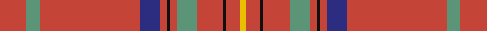

This page is one **sett** — a single exact thread-count. It belongs to the [tartan](/setts/r8g4r30db6r2k1r2g6r8k1r4ly2/)
(the same proportion at any scale), whose colour order is pattern [RGRBRKRGRKRY](/stripes/rgrbrkrgrkry/).

Sourced from tartans-authority.  It is a [12 stripe tartan](/stripes/stripes12/).

Original link http://www.tartansauthority.com/tartan-ferret/display/10171/

## Register references

External register numbers recorded for this tartan.

- Scottish Register of Tartans: [10171](https://www.tartanregister.gov.uk/tartanDetails?ref=10171)
- Scottish Tartans Authority (ITI): 10171

## Thread count
R/16 LG8 R60 DB12 R4 K2 R4 LG12 R16 K2 R8 Y/4

One full sett is **276 threads**.

## Palette

Palette: <strong>Tartan Register</strong> <small style="color:#888">(4 of 6 colours)</small>
<table><thead><tr><th>Colour</th><th>Threads</th><th>Shade</th><th>Base</th><th>OKLCh</th></tr></thead><tbody><tr><td>R/</td><td style="text-align:right;font-variant-numeric:tabular-nums">16</td><td><code style="background-color:#C44438;">#C44438</code> <small style="color:#888">#C44438</small></td><td>R <code style="background-color:#CC0000;">#CC0000</code></td><td><small style="color:#888">oklch(56.4% 0.166 28.7)</small></td></tr><tr><td>LG</td><td style="text-align:right;font-variant-numeric:tabular-nums">8</td><td><code style="background-color:#5C9478;">#5C9478</code> <small style="color:#888">#5C9478</small></td><td>G <code style="background-color:#006100;">#006100</code></td><td><small style="color:#888">oklch(61.9% 0.073 161.5)</small></td></tr><tr><td>R</td><td style="text-align:right;font-variant-numeric:tabular-nums">60</td><td><code style="background-color:#C44438;">#C44438</code> <small style="color:#888">#C44438</small></td><td>R <code style="background-color:#CC0000;">#CC0000</code></td><td><small style="color:#888">oklch(56.4% 0.166 28.7)</small></td></tr><tr><td>DB</td><td style="text-align:right;font-variant-numeric:tabular-nums">12</td><td><code style="background-color:#2C2C80;">#2C2C80</code> <small style="color:#888">#2C2C80</small></td><td>B <code style="background-color:#2A418A;">#2A418A</code></td><td><small style="color:#888">oklch(35.0% 0.138 276.6)</small></td></tr><tr><td>R</td><td style="text-align:right;font-variant-numeric:tabular-nums">4</td><td><code style="background-color:#C44438;">#C44438</code> <small style="color:#888">#C44438</small></td><td>R <code style="background-color:#CC0000;">#CC0000</code></td><td><small style="color:#888">oklch(56.4% 0.166 28.7)</small></td></tr><tr><td>K</td><td style="text-align:right;font-variant-numeric:tabular-nums">2</td><td><code style="background-color:#101010;">#101010</code> <small style="color:#888">#101010</small></td><td>K <code style="background-color:#000000;">#000000</code></td><td><small style="color:#888">oklch(17.3% 0.000 89.9)</small></td></tr><tr><td>R</td><td style="text-align:right;font-variant-numeric:tabular-nums">4</td><td><code style="background-color:#C44438;">#C44438</code> <small style="color:#888">#C44438</small></td><td>R <code style="background-color:#CC0000;">#CC0000</code></td><td><small style="color:#888">oklch(56.4% 0.166 28.7)</small></td></tr><tr><td>LG</td><td style="text-align:right;font-variant-numeric:tabular-nums">12</td><td><code style="background-color:#5C9478;">#5C9478</code> <small style="color:#888">#5C9478</small></td><td>G <code style="background-color:#006100;">#006100</code></td><td><small style="color:#888">oklch(61.9% 0.073 161.5)</small></td></tr><tr><td>R</td><td style="text-align:right;font-variant-numeric:tabular-nums">16</td><td><code style="background-color:#C44438;">#C44438</code> <small style="color:#888">#C44438</small></td><td>R <code style="background-color:#CC0000;">#CC0000</code></td><td><small style="color:#888">oklch(56.4% 0.166 28.7)</small></td></tr><tr><td>K</td><td style="text-align:right;font-variant-numeric:tabular-nums">2</td><td><code style="background-color:#101010;">#101010</code> <small style="color:#888">#101010</small></td><td>K <code style="background-color:#000000;">#000000</code></td><td><small style="color:#888">oklch(17.3% 0.000 89.9)</small></td></tr><tr><td>R</td><td style="text-align:right;font-variant-numeric:tabular-nums">8</td><td><code style="background-color:#C44438;">#C44438</code> <small style="color:#888">#C44438</small></td><td>R <code style="background-color:#CC0000;">#CC0000</code></td><td><small style="color:#888">oklch(56.4% 0.166 28.7)</small></td></tr><tr><td>Y/</td><td style="text-align:right;font-variant-numeric:tabular-nums">4</td><td><code style="background-color:#E8C000;">#E8C000</code> <small style="color:#888">#E8C000</small></td><td>Y <code style="background-color:#F2BF00;">#F2BF00</code></td><td><small style="color:#888">oklch(81.9% 0.168 93.7)</small></td></tr></tbody></table>

## Nearest tartans

The nearest existing variants by ΔTartan distance, with this tartan at the top so the swatches line up against it.

ΔTartan

Tartan

Sett

—

<a href="/ttd/edit/#slug=r8g4r30db6r2k1r2g6r8k1r4ly2~x2">Highland Queen (Corporate)</a> <a class="nn-out" href="/variants/s12/r8g4r30db6r2k1r2g6r8k1r4ly2~x2/" title="open its dictionary page">↗</a>

1.38

<a href="/ttd/edit/#slug=o24lb2o7lb3k2n4k2lb1o4lb1~x2&amp;base=r8g4r30db6r2k1r2g6r8k1r4ly2~x2">Vemma (Corporate) XXXXXXXXX</a> <a class="nn-out" href="/variants/s10/o24lb2o7lb3k2n4k2lb1o4lb1~x2/" title="open its dictionary page">↗</a>

1.47

<a href="/ttd/edit/#slug=r68db26r5ly3r5g3r13o3~x2&amp;base=r8g4r30db6r2k1r2g6r8k1r4ly2~x2">De Nardi (Personal)</a> <a class="nn-out" href="/variants/s8/r68db26r5ly3r5g3r13o3~x2/" title="open its dictionary page">↗</a>

1.49

<a href="/ttd/edit/#slug=r8lg4r30lr6r2k1r2lg6r8k1r4ly2~x2&amp;base=r8g4r30db6r2k1r2g6r8k1r4ly2~x2">Highland Queen</a> <a class="nn-out" href="/variants/s12/r8lg4r30lr6r2k1r2lg6r8k1r4ly2~x2/" title="open its dictionary page">↗</a>

1.58

<a href="/ttd/edit/#slug=r23k1g9r3db1lr1r1~x4&amp;base=r8g4r30db6r2k1r2g6r8k1r4ly2~x2">Perthshire Clayquhat District Tartan</a> <a class="nn-out" href="/variants/s7/r23k1g9r3db1lr1r1~x4/" title="open its dictionary page">↗</a>

1.58

<a href="/variants/s10/r25dt5o2r12oi1w1~x2/">Fernie (Personal)</a>

1.59

<a href="/ttd/edit/#slug=r48g6r6g12ly3g2k3g2ly3g12r6g6r48k3~x2&amp;base=r8g4r30db6r2k1r2g6r8k1r4ly2~x2">Oakhall</a> <a class="nn-out" href="/variants/s14/r48g6r6g12ly3g2k3g2ly3g12r6g6r48k3~x2/" title="open its dictionary page">↗</a>

1.61

<a href="/ttd/edit/#slug=r64db16r1db1r12g16r8db2r2k1~x2&amp;base=r8g4r30db6r2k1r2g6r8k1r4ly2~x2">Moffat (1950)</a> <a class="nn-out" href="/variants/s10/r64db16r1db1r12g16r8db2r2k1~x2/" title="open its dictionary page">↗</a>

1.61

<a href="/ttd/edit/#slug=r96g24r10g12k1w4k1g12r10g24r48~x2&amp;base=r8g4r30db6r2k1r2g6r8k1r4ly2~x2">MacGregor</a> <a class="nn-out" href="/variants/s11/r96g24r10g12k1w4k1g12r10g24r48~x2/" title="open its dictionary page">↗</a>

1.63

<a href="/ttd/edit/#slug=r11lo3r11lo3k11lr2r51lr2k11lo3r11lo3r11g3~x2&amp;base=r8g4r30db6r2k1r2g6r8k1r4ly2~x2">Hackston (Green stripe) or Halkerston</a> <a class="nn-out" href="/variants/s14/r11lo3r11lo3k11lr2r51lr2k11lo3r11lo3r11g3~x2/" title="open its dictionary page">↗</a>

1.65

<a href="/ttd/edit/#slug=r24b14lo2b3k2b6r38lo1lr2~x2&amp;base=r8g4r30db6r2k1r2g6r8k1r4ly2~x2">Uddingston Rugby Club Centenary (Cor</a> <a class="nn-out" href="/variants/s9/r24b14lo2b3k2b6r38lo1lr2~x2/" title="open its dictionary page">↗</a>

## Neighbour map

Every grey dot is one of 14360 variants placed by the first two principal components of the ΔTartan feature space (44% of its variance). Red is this tartan; blue dots are its nearest — click one to open its page.

<svg viewBox="0 0 640 380" role="img" style="max-width:100%;height:auto;border:1px solid #e0e0e0;border-radius:4px;display:block" xmlns="http://www.w3.org/2000/svg"><image href="/nn/cloud.v1.png" width="640" height="380"/><a href="/variants/s10/o24lb2o7lb3k2n4k2lb1o4lb1~x2/"><circle cx="468.0" cy="125.3" r="4" fill="#3465a4"><title>Vemma (Corporate) XXXXXXXXX</title></circle></a><a href="/variants/s8/r68db26r5ly3r5g3r13o3~x2/"><circle cx="488.3" cy="118.1" r="4" fill="#3465a4"><title>De Nardi (Personal)</title></circle></a><a href="/variants/s12/r8lg4r30lr6r2k1r2lg6r8k1r4ly2~x2/"><circle cx="462.4" cy="84.7" r="4" fill="#3465a4"><title>Highland Queen</title></circle></a><a href="/variants/s7/r23k1g9r3db1lr1r1~x4/"><circle cx="463.2" cy="121.0" r="4" fill="#3465a4"><title>Perthshire Clayquhat District Tartan</title></circle></a><a href="/variants/s10/r25dt5o2r12oi1w1~x2/"><circle cx="507.9" cy="139.4" r="4" fill="#3465a4"><title>Fernie (Personal)</title></circle></a><a href="/variants/s14/r48g6r6g12ly3g2k3g2ly3g12r6g6r48k3~x2/"><circle cx="468.3" cy="124.6" r="4" fill="#3465a4"><title>Oakhall</title></circle></a><a href="/variants/s10/r64db16r1db1r12g16r8db2r2k1~x2/"><circle cx="523.0" cy="91.9" r="4" fill="#3465a4"><title>Moffat (1950)</title></circle></a><a href="/variants/s11/r96g24r10g12k1w4k1g12r10g24r48~x2/"><circle cx="497.8" cy="103.1" r="4" fill="#3465a4"><title>MacGregor</title></circle></a><a href="/variants/s14/r11lo3r11lo3k11lr2r51lr2k11lo3r11lo3r11g3~x2/"><circle cx="438.4" cy="87.1" r="4" fill="#3465a4"><title>Hackston (Green stripe) or Halkerston</title></circle></a><a href="/variants/s9/r24b14lo2b3k2b6r38lo1lr2~x2/"><circle cx="474.6" cy="121.1" r="4" fill="#3465a4"><title>Uddingston Rugby Club Centenary (Cor</title></circle></a><circle cx="493.0" cy="106.6" r="5" fill="#c00000"/></svg>

ID: /variants/s12/r8g4r30db6r2k1r2g6r8k1r4ly2~x2/
