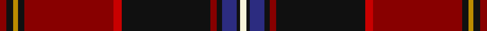

This page is one **sett** — a single exact thread-count. It belongs to the [tartan](/setts/ri4k4lo3k4ri54r5k54ri4k3db9k2w4/)
(the same proportion at any scale), whose colour order is pattern [RKYKRRKRKBKW](/stripes/rkykrrkrkbkw/).

Sourced from register-of-tartans.  It is a [12 stripe tartan](/stripes/stripes12/).

Original link https://www.tartanregister.gov.uk/tartanDetails.aspx?ref=1334

## Provenance

Earliest known date: December 2006 Designed by William C. (Rocky) Roeger III of usakilts.com to honor German Americans and their contributions to American History. It is a private fashion tartan designed for ANYONE to wear, regardless of clan affiliation or nationality. The colors chosen in this tartan represent the flags of both countries, America and Germany. Woven sample.

3 attestations — the source records this cloth was collapsed from (oldest owns this page)

<ul>
<li>01/12/2006 — German American (register-of-tartans, <a href="https://www.tartanregister.gov.uk/tartanDetails.aspx?ref=1334">record</a>)</li>
<li>December 2006 — German American (Fashion) (tartans-authority, <a href="http://www.tartansauthority.com/tartan-ferret/display/7017/">record</a>)</li>
<li>undated — German American (Fashion) American Fashion Tartan (house-of-tartan, <a href="http://www.house-of-tartan.scotland.net/house/TartanViewjs.asp?colr=Def&tnam=7017">record</a>)</li>
</ul>

## Register references

External register numbers recorded for this tartan.

- Scottish Register of Tartans: [1334](https://www.tartanregister.gov.uk/tartanDetails.aspx?ref=1334)
- Scottish Tartans Authority (ITI): 7017

## Thread count
DR/4 K4 DY3 K4 DR54 R5 K54 DR4 K3 DB9 K2 LY/4

One full sett is **292 threads**.

## Palette

Palette: <strong>Tartan Register</strong> <small style="color:#888">(5 of 6 colours)</small>
<table><thead><tr><th>Colour</th><th>Threads</th><th>Shade</th><th>Base</th><th>OKLCh</th></tr></thead><tbody><tr><td>DR/</td><td style="text-align:right;font-variant-numeric:tabular-nums">4</td><td><code style="background-color:#880000;">#880000</code> <small style="color:#888">#880000</small></td><td>R <code style="background-color:#CC0000;">#CC0000</code></td><td><small style="color:#888">oklch(39.4% 0.162 29.2)</small></td></tr><tr><td>K</td><td style="text-align:right;font-variant-numeric:tabular-nums">4</td><td><code style="background-color:#101010;">#101010</code> <small style="color:#888">#101010</small></td><td>K <code style="background-color:#000000;">#000000</code></td><td><small style="color:#888">oklch(17.3% 0.000 89.9)</small></td></tr><tr><td>DY</td><td style="text-align:right;font-variant-numeric:tabular-nums">3</td><td><code style="background-color:#BC8C00;">#BC8C00</code> <small style="color:#888">#BC8C00</small></td><td>Y <code style="background-color:#F2BF00;">#F2BF00</code></td><td><small style="color:#888">oklch(66.8% 0.137 84.1)</small></td></tr><tr><td>K</td><td style="text-align:right;font-variant-numeric:tabular-nums">4</td><td><code style="background-color:#101010;">#101010</code> <small style="color:#888">#101010</small></td><td>K <code style="background-color:#000000;">#000000</code></td><td><small style="color:#888">oklch(17.3% 0.000 89.9)</small></td></tr><tr><td>DR</td><td style="text-align:right;font-variant-numeric:tabular-nums">54</td><td><code style="background-color:#880000;">#880000</code> <small style="color:#888">#880000</small></td><td>R <code style="background-color:#CC0000;">#CC0000</code></td><td><small style="color:#888">oklch(39.4% 0.162 29.2)</small></td></tr><tr><td>R</td><td style="text-align:right;font-variant-numeric:tabular-nums">5</td><td><code style="background-color:#C80000;">#C80000</code> <small style="color:#888">#C80000</small></td><td>R <code style="background-color:#CC0000;">#CC0000</code></td><td><small style="color:#888">oklch(52.3% 0.215 29.2)</small></td></tr><tr><td>K</td><td style="text-align:right;font-variant-numeric:tabular-nums">54</td><td><code style="background-color:#101010;">#101010</code> <small style="color:#888">#101010</small></td><td>K <code style="background-color:#000000;">#000000</code></td><td><small style="color:#888">oklch(17.3% 0.000 89.9)</small></td></tr><tr><td>DR</td><td style="text-align:right;font-variant-numeric:tabular-nums">4</td><td><code style="background-color:#880000;">#880000</code> <small style="color:#888">#880000</small></td><td>R <code style="background-color:#CC0000;">#CC0000</code></td><td><small style="color:#888">oklch(39.4% 0.162 29.2)</small></td></tr><tr><td>K</td><td style="text-align:right;font-variant-numeric:tabular-nums">3</td><td><code style="background-color:#101010;">#101010</code> <small style="color:#888">#101010</small></td><td>K <code style="background-color:#000000;">#000000</code></td><td><small style="color:#888">oklch(17.3% 0.000 89.9)</small></td></tr><tr><td>DB</td><td style="text-align:right;font-variant-numeric:tabular-nums">9</td><td><code style="background-color:#2C2C80;">#2C2C80</code> <small style="color:#888">#2C2C80</small></td><td>B <code style="background-color:#2A418A;">#2A418A</code></td><td><small style="color:#888">oklch(35.0% 0.138 276.6)</small></td></tr><tr><td>K</td><td style="text-align:right;font-variant-numeric:tabular-nums">2</td><td><code style="background-color:#101010;">#101010</code> <small style="color:#888">#101010</small></td><td>K <code style="background-color:#000000;">#000000</code></td><td><small style="color:#888">oklch(17.3% 0.000 89.9)</small></td></tr><tr><td>LY/</td><td style="text-align:right;font-variant-numeric:tabular-nums">4</td><td><code style="background-color:#F8F4D8;">#F8F4D8</code> <small style="color:#888">#F8F4D8</small></td><td>W <code style="background-color:#F7F7F7;">#F7F7F7</code></td><td><small style="color:#888">oklch(96.3% 0.037 100.4)</small></td></tr></tbody></table>

## Nearest tartans

The nearest existing variants by ΔTartan distance, with this tartan at the top so the swatches line up against it.

ΔTartan

Tartan

Sett

—

<a href="/ttd/edit/#slug=ri4k4lo3k4ri54r5k54ri4k3db9k2w4">German American</a> <a class="nn-out" href="/variants/s12/ri4k4lo3k4ri54r5k54ri4k3db9k2w4/" title="open its dictionary page">↗</a>

1.08

<a href="/ttd/edit/#slug=do90y8k10y3k4dg4k3ri16k14r6k28&amp;base=ri4k4lo3k4ri54r5k54ri4k3db9k2w4">Father’s Pride, The</a> <a class="nn-out" href="/variants/s11/do90y8k10y3k4dg4k3ri16k14r6k28/" title="open its dictionary page">↗</a>

1.20

<a href="/ttd/edit/#slug=k4o30ly3o3k6dg36ly1dg2r2dg2g2~x4&amp;base=ri4k4lo3k4ri54r5k54ri4k3db9k2w4">Chelsea</a> <a class="nn-out" href="/variants/s11/k4o30ly3o3k6dg36ly1dg2r2dg2g2~x4/" title="open its dictionary page">↗</a>

1.20

<a href="/ttd/edit/#slug=r32db2k8lo1k2lb2k2g18r10k2r2lb2~x4&amp;base=ri4k4lo3k4ri54r5k54ri4k3db9k2w4">Stewart - Pr Ch Ed - Pendleton</a> <a class="nn-out" href="/variants/s12/r32db2k8lo1k2lb2k2g18r10k2r2lb2~x4/" title="open its dictionary page">↗</a>

1.22

<a href="/ttd/edit/#slug=r4w1ri36dt4k1dt3k10w1dt4w1k8w1~x2&amp;base=ri4k4lo3k4ri54r5k54ri4k3db9k2w4">YMCA (Corporate)</a> <a class="nn-out" href="/variants/s12/r4w1ri36dt4k1dt3k10w1dt4w1k8w1~x2/" title="open its dictionary page">↗</a>

1.24

<a href="/ttd/edit/#slug=ly2dg4dt1r3dt3dg3g1r32dt14w3ly2~x2&amp;base=ri4k4lo3k4ri54r5k54ri4k3db9k2w4">Banause-Zunft zu Olte</a> <a class="nn-out" href="/variants/s11/ly2dg4dt1r3dt3dg3g1r32dt14w3ly2~x2/" title="open its dictionary page">↗</a>

1.24

<a href="/variants/s10/k5ki5k2r47k18w2k5dg9ki7w3~x2/">Rikaco Holiday</a>

1.27

<a href="/ttd/edit/#slug=r4w1ri36db4k1db3k10w1db4w1k8w1~x2&amp;base=ri4k4lo3k4ri54r5k54ri4k3db9k2w4">YMCA</a> <a class="nn-out" href="/variants/s12/r4w1ri36db4k1db3k10w1db4w1k8w1~x2/" title="open its dictionary page">↗</a>

1.29

<a href="/ttd/edit/#slug=r4k2r3k35g7k2lo2k35ri6k8ri65k4ri4&amp;base=ri4k4lo3k4ri54r5k54ri4k3db9k2w4">Firefighters' Memorial</a> <a class="nn-out" href="/variants/s13/r4k2r3k35g7k2lo2k35ri6k8ri65k4ri4/" title="open its dictionary page">↗</a>

1.30

<a href="/variants/s14/dp3lo2r19ri4dpi6k36dpi2lo3~x2/">Hyland Evening (Personal)</a>

1.33

<a href="/ttd/edit/#slug=dg15r25dg4k2ly1dt1ly1k2dg4dt12w1~x2&amp;base=ri4k4lo3k4ri54r5k54ri4k3db9k2w4">Livingstone (Australia) Dress</a> <a class="nn-out" href="/variants/s11/dg15r25dg4k2ly1dt1ly1k2dg4dt12w1~x2/" title="open its dictionary page">↗</a>

## Neighbour map

Every grey dot is one of 14360 variants placed by the first two principal components of the ΔTartan feature space (44% of its variance). Red is this tartan; blue dots are its nearest — click one to open its page.

<svg viewBox="0 0 640 380" role="img" style="max-width:100%;height:auto;border:1px solid #e0e0e0;border-radius:4px;display:block" xmlns="http://www.w3.org/2000/svg"><image href="/nn/cloud.v1.png" width="640" height="380"/><a href="/variants/s11/do90y8k10y3k4dg4k3ri16k14r6k28/"><circle cx="291.8" cy="85.5" r="4" fill="#3465a4"><title>Father’s Pride, The</title></circle></a><a href="/variants/s11/k4o30ly3o3k6dg36ly1dg2r2dg2g2~x4/"><circle cx="292.3" cy="82.3" r="4" fill="#3465a4"><title>Chelsea</title></circle></a><a href="/variants/s12/r32db2k8lo1k2lb2k2g18r10k2r2lb2~x4/"><circle cx="318.8" cy="82.7" r="4" fill="#3465a4"><title>Stewart - Pr Ch Ed - Pendleton</title></circle></a><a href="/variants/s12/r4w1ri36dt4k1dt3k10w1dt4w1k8w1~x2/"><circle cx="315.4" cy="74.7" r="4" fill="#3465a4"><title>YMCA (Corporate)</title></circle></a><a href="/variants/s11/ly2dg4dt1r3dt3dg3g1r32dt14w3ly2~x2/"><circle cx="309.0" cy="73.3" r="4" fill="#3465a4"><title>Banause-Zunft zu Olte</title></circle></a><a href="/variants/s10/k5ki5k2r47k18w2k5dg9ki7w3~x2/"><circle cx="278.0" cy="115.9" r="4" fill="#3465a4"><title>Rikaco Holiday</title></circle></a><a href="/variants/s12/r4w1ri36db4k1db3k10w1db4w1k8w1~x2/"><circle cx="313.8" cy="72.7" r="4" fill="#3465a4"><title>YMCA</title></circle></a><a href="/variants/s13/r4k2r3k35g7k2lo2k35ri6k8ri65k4ri4/"><circle cx="367.4" cy="105.3" r="4" fill="#3465a4"><title>Firefighters' Memorial</title></circle></a><a href="/variants/s14/dp3lo2r19ri4dpi6k36dpi2lo3~x2/"><circle cx="255.9" cy="95.6" r="4" fill="#3465a4"><title>Hyland Evening (Personal)</title></circle></a><a href="/variants/s11/dg15r25dg4k2ly1dt1ly1k2dg4dt12w1~x2/"><circle cx="221.8" cy="96.8" r="4" fill="#3465a4"><title>Livingstone (Australia) Dress</title></circle></a><circle cx="301.3" cy="81.4" r="5" fill="#c00000"/></svg>

ID: /variants/s12/ri4k4lo3k4ri54r5k54ri4k3db9k2w4/
