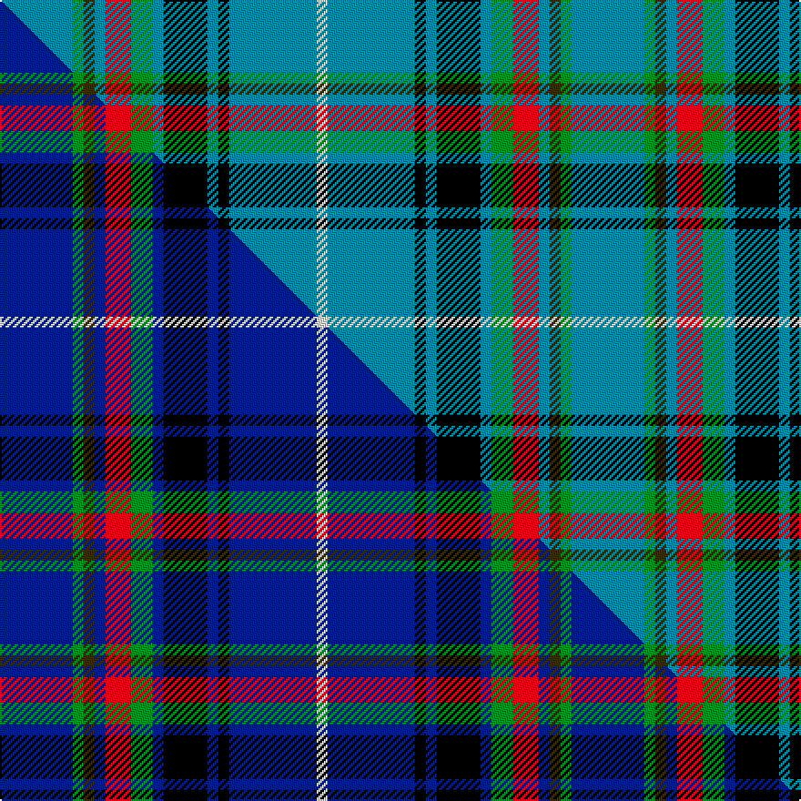

This is one **variant** — a specific cloth: this exact thread count and colourway, with its own
provenance below. It is one weaving of the [sett](/tartans/b/bh/bhoyrub/) (the scale-free proportion — the
same cloth at any scale or shade), whose colour order is pattern [BGGBRGBKBKBW](/stripes/bggbrgbkbkbw/).

Part of the [Bhoyrub](/tartans/b/bh/bhoyrub/) tartan — the named design grouping this sett with its other cloths.

Sourced from tartans-authority.  It is a [12 stripe tartan](/stripes/stripes12/).

Original link <code>http://www.tartansauthority.com/tartan-ferret/display/6953/</code> — retired · [Internet Archive copy](https://web.archive.org/web/*/http://www.tartansauthority.com/tartan-ferret/display/6953/*)

Dataset <small>— provenance for this record, inherited from the source manifest</small>

<dl class="dataset-prov">
<dt>source</dt><dd><a href="/sources/tartans-authority/">Scottish Tartans Authority</a></dd>
<dt>data captured from</dt><dd><a href="https://github.com/thetartan/tartan-database/blob/master/data/tartans-authority/data.csv">https://github.com/thetartan/tartan-database/blob/master/data/tartans-authority/data.csv</a></dd>
<dt>data date</dt><dd>2006 July <small>(this record)</small></dd>
<dt>licence</dt><dd><a href="https://creativecommons.org/licenses/by-nc-nd/4.0/">CC BY-NC-ND 4.0</a></dd>
</dl>

Capture chain <small>— the hands this data passed through, oldest first; each capture carries its own licence</small>

<ol class="capture-chain">
<li><a href="https://www.tartansauthority.com/">Scottish Tartans Authority</a> <small>the heritage body’s archive — its tartan-ferret record browser is retired; dead record links are shown unlinked, with an Internet Archive copy (ITI numbers are not SRT references)</small></li>
<li><a href="https://github.com/thetartan/tartan-database">thetartan/tartan-database</a> <small>2016-2017</small> · <a href="https://creativecommons.org/licenses/by-nc-nd/4.0/">CC BY-NC-ND 4.0</a> <small>Levko Kravets's frozen compilation — the capture we vendored, and where its CC licence text came from</small></li>
<li>this dictionary <small>captured 2026-06-10 · commit 5bf86c7566</small> <small>each re-capture is a git commit to data/sources</small></li>
</ol>

## Register references

External register numbers recorded for this tartan.

- Scottish Tartans Authority (ITI): 6953

## Thread count
T/40 G6 DY6 T6 R14 G12 T6 K24 T6 K6 T48 W/6

One full sett is **314 threads**.

## Palette
<table><thead><tr><th>Colour</th><th>Shade</th><th>OKLCh</th></tr></thead><tbody><tr><td>T</td><td><code style="background-color:#00879F;">#00879F</code> <small style="color:#888">#00879F</small></td><td><small style="color:#888">oklch(57.4% 0.102 216.1)</small></td></tr><tr><td>G</td><td><code style="background-color:#008B2A;">#008B2A</code> <small style="color:#888">#008B2A</small></td><td><small style="color:#888">oklch(55.4% 0.170 145.9)</small></td></tr><tr><td>K</td><td><code style="background-color:#000000;">#000000</code> <small style="color:#888">#000000</small></td><td><small style="color:#888">oklch(0.0% 0.000 0.0)</small></td></tr><tr><td>W</td><td><code style="background-color:#F7F7F7;">#F7F7F7</code> <small style="color:#888">#F7F7F7</small></td><td><small style="color:#888">oklch(97.6% 0.000 89.9)</small></td></tr><tr><td>R</td><td><code style="background-color:#D60020;">#D60020</code> <small style="color:#888">#D60020</small></td><td><small style="color:#888">oklch(55.2% 0.224 25.5)</small></td></tr><tr><td>DY</td><td><code style="background-color:#3A2B0D;">#3A2B0D</code> <small style="color:#888">#3A2B0D</small></td><td><small style="color:#888">oklch(30.0% 0.049 82.0)</small></td></tr></tbody></table>

# Sample pattern

## Compared to the master

This cloth is one sett of its design; the master sett (the exemplar the design is anchored on) is below for comparison.

Its **ΔTartan distance** from the master is **0.21** — the same measure the nearest-tartans table ranks by (0 is identical; a re-scale of the same cloth is near 0, a recolour or a different proportion further).

<figure class="master-compare" style="margin:0">

this sett
master sett ★

<figcaption style="color:#888;font-size:smaller">One weave of this sett against the <a href="/setts/db20g3dy3db3r7g6db3k12db3k3db24w3/">master sett ★</a>, split on the diagonal: a shared proportion runs seamlessly across it with only the shades shifting; a different proportion breaks on it.</figcaption>
</figure>

## Nearest tartan variants

The nearest existing variants by ΔTartan distance, with this cloth at the top so the swatches line up against it.

ΔTartan

Threads

Variant

Sett

—

314

<a href="/variants/s12/t20g3dy3t3r7g6t3k12t3k3t24w3~x2/">Bhoyrub (Personal)</a>

<a href="/ttd/edit/#slug=db20g3dy3db3r7g6db3k12db3k3db24w3~x2&amp;base=t20g3dy3t3r7g6t3k12t3k3t24w3~x2" title="compare in the TTD">0.21</a>

314

<a href="/variants/s12/db20g3dy3db3r7g6db3k12db3k3db24w3~x2/">Bhoyrub Clan/Family Tartan</a>

<a href="/ttd/edit/#slug=t15k3t19w3t5y5r3y5lb3y5k3~x2&amp;base=t20g3dy3t3r7g6t3k12t3k3t24w3~x2" title="compare in the TTD">2.25</a>

240

<a href="/variants/s11/t15k3t19w3t5y5r3y5lb3y5k3~x2/">Gouranga (Corporate)</a>

<a href="/ttd/edit/#slug=t49lb11ly7k16w5t20lb10k6ti5~x2~lb80-ti5912243&amp;base=t20g3dy3t3r7g6t3k12t3k3t24w3~x2" title="compare in the TTD">2.27</a>

408

<a href="/variants/s9/t49lb11ly7k16w5t20lb10k6ti5~x2~lb80-ti5912243/">State Seal of Louisiana (Fashion)</a>

<a href="/ttd/edit/#slug=g10w2g10k3db12r3db12g15w2db3k2g3y3~x2&amp;base=t20g3dy3t3r7g6t3k12t3k3t24w3~x2" title="compare in the TTD">2.79</a>

294

<a href="/variants/s13/g10w2g10k3db12r3db12g15w2db3k2g3y3~x2/">Greylock Corporate Tartan</a>

<a href="/ttd/edit/#slug=y3g3r2g16k2db24k2g16r2g3lb3~x2&amp;base=t20g3dy3t3r7g6t3k12t3k3t24w3~x2" title="compare in the TTD">2.85</a>

292

<a href="/variants/s11/y3g3r2g16k2db24k2g16r2g3lb3~x2/">Loch Tay</a>

<a href="/ttd/edit/#slug=ly3g3dr2g16k2db24k2g16dr2g3lb3~x2&amp;base=t20g3dy3t3r7g6t3k12t3k3t24w3~x2" title="compare in the TTD">2.85</a>

292

<a href="/variants/s11/ly3g3dr2g16k2db24k2g16dr2g3lb3~x2/">Loch Tay (District)</a>

<a href="/ttd/edit/#slug=t34g10t5r2k8dy2w3dy2k8r2t5g10t28k3~x2&amp;base=t20g3dy3t3r7g6t3k12t3k3t24w3~x2" title="compare in the TTD">2.91</a>

414

<a href="/variants/s14/t34g10t5r2k8dy2w3dy2k8r2t5g10t28k3~x2/">Lambert Dress (Personal)</a>

<a href="/ttd/edit/#slug=dg4dr1dg12k1ly4k1dg3t5w2~x2&amp;base=t20g3dy3t3r7g6t3k12t3k3t24w3~x2" title="compare in the TTD">2.93</a>

120

<a href="/variants/s9/dg4dr1dg12k1ly4k1dg3t5w2~x2/">Lees-McRae College</a>

<a href="/ttd/edit/#slug=t25k3t3k3g6k3g6k3g6k3t3k3t25r3t3y3t3r3~x2&amp;base=t20g3dy3t3r7g6t3k12t3k3t24w3~x2" title="compare in the TTD">2.98</a>

372

<a href="/variants/s18/t25k3t3k3g6k3g6k3g6k3t3k3t25r3t3y3t3r3~x2/">Borders Health Board</a>

<a href="/ttd/edit/#slug=r3t22r3t3k14t14lb3t3w2~x2&amp;base=t20g3dy3t3r7g6t3k12t3k3t24w3~x2" title="compare in the TTD">2.99</a>

258

<a href="/variants/s9/r3t22r3t3k14t14lb3t3w2~x2/">Fitzgerald (Family)</a>

## Neighbour map

Every grey dot is one of 13662 variants placed by the first two principal components of the ΔTartan feature space (42% of its variance). Red is this tartan; blue dots are its nearest — click one to open its page. The map is a flat projection of a many-dimensional space — [how to read it](/posts/neighbourhood-maps/).

<svg viewBox="0 0 640 380" role="img" style="max-width:100%;height:auto;border:1px solid #e0e0e0;border-radius:4px;display:block" xmlns="http://www.w3.org/2000/svg"><image href="/nn/cloud.v1.png" width="640" height="380"/><a href="/variants/s12/db20g3dy3db3r7g6db3k12db3k3db24w3~x2/"><circle cx="225.8" cy="141.0" r="4" fill="#3465a4"><title>Bhoyrub Clan/Family Tartan</title></circle></a><a href="/variants/s11/t15k3t19w3t5y5r3y5lb3y5k3~x2/"><circle cx="214.5" cy="172.4" r="4" fill="#3465a4"><title>Gouranga (Corporate)</title></circle></a><a href="/variants/s9/t49lb11ly7k16w5t20lb10k6ti5~x2~lb80-ti5912243/"><circle cx="188.7" cy="149.7" r="4" fill="#3465a4"><title>State Seal of Louisiana (Fashion)</title></circle></a><a href="/variants/s13/g10w2g10k3db12r3db12g15w2db3k2g3y3~x2/"><circle cx="149.6" cy="162.8" r="4" fill="#3465a4"><title>Greylock Corporate Tartan</title></circle></a><a href="/variants/s11/y3g3r2g16k2db24k2g16r2g3lb3~x2/"><circle cx="210.3" cy="128.3" r="4" fill="#3465a4"><title>Loch Tay</title></circle></a><a href="/variants/s11/ly3g3dr2g16k2db24k2g16dr2g3lb3~x2/"><circle cx="207.5" cy="128.5" r="4" fill="#3465a4"><title>Loch Tay (District)</title></circle></a><a href="/variants/s14/t34g10t5r2k8dy2w3dy2k8r2t5g10t28k3~x2/"><circle cx="247.5" cy="99.4" r="4" fill="#3465a4"><title>Lambert Dress (Personal)</title></circle></a><a href="/variants/s9/dg4dr1dg12k1ly4k1dg3t5w2~x2/"><circle cx="220.2" cy="142.3" r="4" fill="#3465a4"><title>Lees-McRae College</title></circle></a><a href="/variants/s18/t25k3t3k3g6k3g6k3g6k3t3k3t25r3t3y3t3r3~x2/"><circle cx="238.0" cy="127.8" r="4" fill="#3465a4"><title>Borders Health Board</title></circle></a><a href="/variants/s9/r3t22r3t3k14t14lb3t3w2~x2/"><circle cx="269.6" cy="152.6" r="4" fill="#3465a4"><title>Fitzgerald (Family)</title></circle></a><circle cx="214.5" cy="143.7" r="5" fill="#c00000"/><text x="320" y="376" text-anchor="middle" font-size="11" fill="#999">ground</text><text x="11" y="190" text-anchor="middle" font-size="11" fill="#999" transform="rotate(-90 11 190)">complexity</text></svg>

ID: /variants/s12/t20g3dy3t3r7g6t3k12t3k3t24w3~x2/
