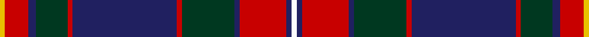

This page is one **sett** — a single exact thread-count. It belongs to the [tartan](/setts/w2db2r18db2dg20r2db40r2dg12db3r9ly2/)
(the same proportion at any scale), whose colour order is pattern [WBRBGRBRGBRY](/stripes/wbrbgrbrgbry/).

Part of the [Kormylo](/tartans/kormylo/) tartan — the named design grouping this sett with its other cloths.

Sourced from tartans-authority.  It is a [12 stripe tartan](/stripes/stripes12/).

Original link http://www.tartansauthority.com/tartan-ferret/display/6314/

## Register references

External register numbers recorded for this tartan.

- Scottish Tartans Authority (ITI): 6314

## Thread count
Y/4 R18 DB6 DG24 R4 DB80 R4 DG40 DB4 R36 DB4 W/4

One full sett is **448 threads**.

## Palette

Palette: <strong>Tartan Register</strong>
<table><thead><tr><th>Colour</th><th>Threads</th><th>Shade</th><th>Base</th><th>OKLCh</th></tr></thead><tbody><tr><td>Y/</td><td style="text-align:right;font-variant-numeric:tabular-nums">4</td><td><code style="background-color:#E8C000;">#E8C000</code> <small style="color:#888">#E8C000</small></td><td>Y <code style="background-color:#F2BF00;">#F2BF00</code></td><td><small style="color:#888">oklch(81.9% 0.168 93.7)</small></td></tr><tr><td>R</td><td style="text-align:right;font-variant-numeric:tabular-nums">18</td><td><code style="background-color:#C80000;">#C80000</code> <small style="color:#888">#C80000</small></td><td>R <code style="background-color:#CC0000;">#CC0000</code></td><td><small style="color:#888">oklch(52.3% 0.215 29.2)</small></td></tr><tr><td>DB</td><td style="text-align:right;font-variant-numeric:tabular-nums">6</td><td><code style="background-color:#202060;">#202060</code> <small style="color:#888">#202060</small></td><td>B <code style="background-color:#2A418A;">#2A418A</code></td><td><small style="color:#888">oklch(28.9% 0.111 276.9)</small></td></tr><tr><td>DG</td><td style="text-align:right;font-variant-numeric:tabular-nums">24</td><td><code style="background-color:#003820;">#003820</code> <small style="color:#888">#003820</small></td><td>G <code style="background-color:#006100;">#006100</code></td><td><small style="color:#888">oklch(30.0% 0.070 158.3)</small></td></tr><tr><td>R</td><td style="text-align:right;font-variant-numeric:tabular-nums">4</td><td><code style="background-color:#C80000;">#C80000</code> <small style="color:#888">#C80000</small></td><td>R <code style="background-color:#CC0000;">#CC0000</code></td><td><small style="color:#888">oklch(52.3% 0.215 29.2)</small></td></tr><tr><td>DB</td><td style="text-align:right;font-variant-numeric:tabular-nums">80</td><td><code style="background-color:#202060;">#202060</code> <small style="color:#888">#202060</small></td><td>B <code style="background-color:#2A418A;">#2A418A</code></td><td><small style="color:#888">oklch(28.9% 0.111 276.9)</small></td></tr><tr><td>R</td><td style="text-align:right;font-variant-numeric:tabular-nums">4</td><td><code style="background-color:#C80000;">#C80000</code> <small style="color:#888">#C80000</small></td><td>R <code style="background-color:#CC0000;">#CC0000</code></td><td><small style="color:#888">oklch(52.3% 0.215 29.2)</small></td></tr><tr><td>DG</td><td style="text-align:right;font-variant-numeric:tabular-nums">40</td><td><code style="background-color:#003820;">#003820</code> <small style="color:#888">#003820</small></td><td>G <code style="background-color:#006100;">#006100</code></td><td><small style="color:#888">oklch(30.0% 0.070 158.3)</small></td></tr><tr><td>DB</td><td style="text-align:right;font-variant-numeric:tabular-nums">4</td><td><code style="background-color:#202060;">#202060</code> <small style="color:#888">#202060</small></td><td>B <code style="background-color:#2A418A;">#2A418A</code></td><td><small style="color:#888">oklch(28.9% 0.111 276.9)</small></td></tr><tr><td>R</td><td style="text-align:right;font-variant-numeric:tabular-nums">36</td><td><code style="background-color:#C80000;">#C80000</code> <small style="color:#888">#C80000</small></td><td>R <code style="background-color:#CC0000;">#CC0000</code></td><td><small style="color:#888">oklch(52.3% 0.215 29.2)</small></td></tr><tr><td>DB</td><td style="text-align:right;font-variant-numeric:tabular-nums">4</td><td><code style="background-color:#202060;">#202060</code> <small style="color:#888">#202060</small></td><td>B <code style="background-color:#2A418A;">#2A418A</code></td><td><small style="color:#888">oklch(28.9% 0.111 276.9)</small></td></tr><tr><td>W/</td><td style="text-align:right;font-variant-numeric:tabular-nums">4</td><td><code style="background-color:#FCFCFC;">#FCFCFC</code> <small style="color:#888">#FCFCFC</small></td><td>W <code style="background-color:#F7F7F7;">#F7F7F7</code></td><td><small style="color:#888">oklch(99.1% 0.000 89.9)</small></td></tr></tbody></table>

## Compared to the master

This cloth is one sett of its design; the master sett (the exemplar the design is anchored on) is below for comparison.

<figure style="margin:0"><figcaption style="color:#888;font-size:smaller">this sett</figcaption></figure>
<figure style="margin:0"><figcaption style="color:#888;font-size:smaller"><a href="/setts/r9db3dg12r2db40r2dg20db2r18db2w2db2r18db2dg20r2db40r2dg12db3r9ly2/">master sett →</a></figcaption></figure>

## Nearest tartans

The nearest existing variants by ΔTartan distance, with this tartan at the top so the swatches line up against it.

ΔTartan

Tartan

Sett

—

<a href="/ttd/edit/#slug=w2db2r18db2dg20r2db40r2dg12db3r9ly2~x2">Kormylo (Personal)</a> <a class="nn-out" href="/variants/s12/w2db2r18db2dg20r2db40r2dg12db3r9ly2~x2/" title="open its dictionary page">↗</a>

0.79

<a href="/ttd/edit/#slug=dbi4r4db44w6db5dy4db3dy8db3dy16dbi4r22w4&amp;base=w2db2r18db2dg20r2db40r2dg12db3r9ly2~x2">Largs District Tartan</a> <a class="nn-out" href="/variants/s13/dbi4r4db44w6db5dy4db3dy8db3dy16dbi4r22w4/" title="open its dictionary page">↗</a>

0.79

<a href="/ttd/edit/#slug=r4k1db8k1lo3k2db4lo6db4w3k2db20k4r21k1lo3~x2&amp;base=w2db2r18db2dg20r2db40r2dg12db3r9ly2~x2">Westmeath County Crest (Fashion)</a> <a class="nn-out" href="/variants/s16/r4k1db8k1lo3k2db4lo6db4w3k2db20k4r21k1lo3~x2/" title="open its dictionary page">↗</a>

0.81

<a href="/ttd/edit/#slug=r4k2r24ly2k12db3k2db2k2db12w1db1w3~x2&amp;base=w2db2r18db2dg20r2db40r2dg12db3r9ly2~x2">Baron of Greencastle Dress #2 (Personal)</a> <a class="nn-out" href="/variants/s13/r4k2r24ly2k12db3k2db2k2db12w1db1w3~x2/" title="open its dictionary page">↗</a>

0.97

<a href="/ttd/edit/#slug=r16db2r2db2r2db16dg16ly1r16db16r2lr2~x2&amp;base=w2db2r18db2dg20r2db40r2dg12db3r9ly2~x2">Army Medical Services</a> <a class="nn-out" href="/variants/s12/r16db2r2db2r2db16dg16ly1r16db16r2lr2~x2/" title="open its dictionary page">↗</a>

0.97

<a href="/ttd/edit/#slug=oi48k10db12k2oi3k2db12k10o10k2ly3~x2&amp;base=w2db2r18db2dg20r2db40r2dg12db3r9ly2~x2">Brooks Brothers (Corporate)</a> <a class="nn-out" href="/variants/s11/oi48k10db12k2oi3k2db12k10o10k2ly3~x2/" title="open its dictionary page">↗</a>

0.98

<a href="/ttd/edit/#slug=r1db1r8lb1k2db16k2lb1g8db1g1~x4&amp;base=w2db2r18db2dg20r2db40r2dg12db3r9ly2~x2">MacMichael</a> <a class="nn-out" href="/variants/s11/r1db1r8lb1k2db16k2lb1g8db1g1~x4/" title="open its dictionary page">↗</a>

1.01

<a href="/ttd/edit/#slug=k5r1w2r1k26r3lo1dt10w1r3w1dt10w1r3~x2&amp;base=w2db2r18db2dg20r2db40r2dg12db3r9ly2~x2">El Dorado Hills Firefighters Pipes and Drums</a> <a class="nn-out" href="/variants/s14/k5r1w2r1k26r3lo1dt10w1r3w1dt10w1r3~x2/" title="open its dictionary page">↗</a>

1.09

<a href="/ttd/edit/#slug=db49k2g2k2g2k10r38db5r4k4lr10~x2&amp;base=w2db2r18db2dg20r2db40r2dg12db3r9ly2~x2">Porsche Bank Austria</a> <a class="nn-out" href="/variants/s11/db49k2g2k2g2k10r38db5r4k4lr10~x2/" title="open its dictionary page">↗</a>

1.10

<a href="/ttd/edit/#slug=g28k1g1k6w1k6dp1k1dp4r3dp14~x4&amp;base=w2db2r18db2dg20r2db40r2dg12db3r9ly2~x2">New Hampshire</a> <a class="nn-out" href="/variants/s11/g28k1g1k6w1k6dp1k1dp4r3dp14~x4/" title="open its dictionary page">↗</a>

1.11

<a href="/ttd/edit/#slug=w4dt38g6dr2g6dr36lo2dr3~x2&amp;base=w2db2r18db2dg20r2db40r2dg12db3r9ly2~x2">Scotland 2000</a> <a class="nn-out" href="/variants/s8/w4dt38g6dr2g6dr36lo2dr3~x2/" title="open its dictionary page">↗</a>

## Neighbour map

Every grey dot is one of 14360 variants placed by the first two principal components of the ΔTartan feature space (44% of its variance). Red is this tartan; blue dots are its nearest — click one to open its page.

<svg viewBox="0 0 640 380" role="img" style="max-width:100%;height:auto;border:1px solid #e0e0e0;border-radius:4px;display:block" xmlns="http://www.w3.org/2000/svg"><image href="/nn/cloud.v1.png" width="640" height="380"/><a href="/variants/s13/dbi4r4db44w6db5dy4db3dy8db3dy16dbi4r22w4/"><circle cx="232.5" cy="131.8" r="4" fill="#3465a4"><title>Largs District Tartan</title></circle></a><a href="/variants/s16/r4k1db8k1lo3k2db4lo6db4w3k2db20k4r21k1lo3~x2/"><circle cx="223.5" cy="106.6" r="4" fill="#3465a4"><title>Westmeath County Crest (Fashion)</title></circle></a><a href="/variants/s13/r4k2r24ly2k12db3k2db2k2db12w1db1w3~x2/"><circle cx="230.7" cy="99.0" r="4" fill="#3465a4"><title>Baron of Greencastle Dress #2 (Personal)</title></circle></a><a href="/variants/s12/r16db2r2db2r2db16dg16ly1r16db16r2lr2~x2/"><circle cx="229.2" cy="147.4" r="4" fill="#3465a4"><title>Army Medical Services</title></circle></a><a href="/variants/s11/oi48k10db12k2oi3k2db12k10o10k2ly3~x2/"><circle cx="258.9" cy="113.0" r="4" fill="#3465a4"><title>Brooks Brothers (Corporate)</title></circle></a><a href="/variants/s11/r1db1r8lb1k2db16k2lb1g8db1g1~x4/"><circle cx="232.6" cy="133.6" r="4" fill="#3465a4"><title>MacMichael</title></circle></a><a href="/variants/s14/k5r1w2r1k26r3lo1dt10w1r3w1dt10w1r3~x2/"><circle cx="270.8" cy="91.0" r="4" fill="#3465a4"><title>El Dorado Hills Firefighters Pipes and Drums</title></circle></a><a href="/variants/s11/db49k2g2k2g2k10r38db5r4k4lr10~x2/"><circle cx="256.0" cy="95.6" r="4" fill="#3465a4"><title>Porsche Bank Austria</title></circle></a><a href="/variants/s11/g28k1g1k6w1k6dp1k1dp4r3dp14~x4/"><circle cx="274.5" cy="106.9" r="4" fill="#3465a4"><title>New Hampshire</title></circle></a><a href="/variants/s8/w4dt38g6dr2g6dr36lo2dr3~x2/"><circle cx="274.2" cy="147.9" r="4" fill="#3465a4"><title>Scotland 2000</title></circle></a><circle cx="248.8" cy="120.7" r="5" fill="#c00000"/></svg>

ID: /variants/s12/w2db2r18db2dg20r2db40r2dg12db3r9ly2~x2/
