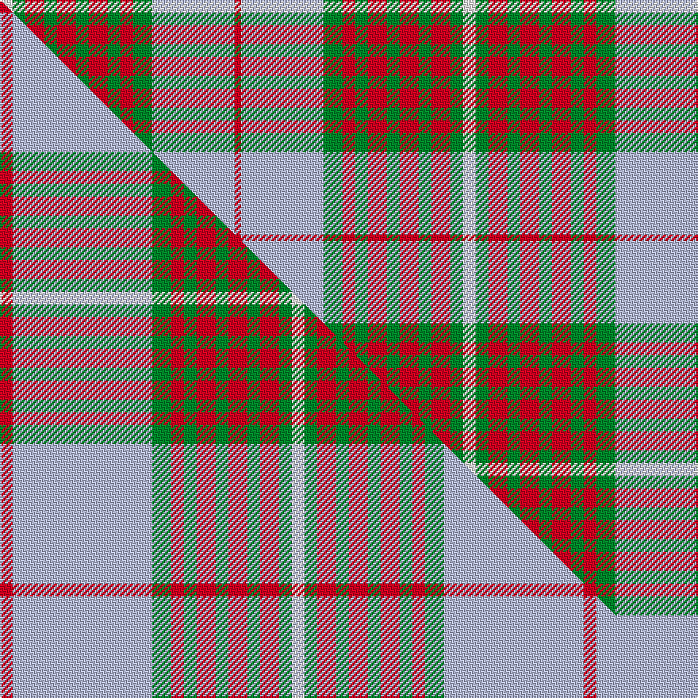

This is one **variant** — a specific cloth: this exact thread count and colourway, with its own
provenance below. It is one weaving of the [sett](/setts/w2g2r3g2r3g2r3g2r2g3lb13r1/) (the scale-free proportion — the
same cloth at any scale or shade), whose colour order is pattern [RWGRGRGRGRGW](/stripes/rwgrgrgrgrgw/).

Part of the [Princess Marina](/tartans/princess-marina/) tartan — the named design grouping this sett with its other cloths.

Sourced from tartans-authority.  It is a [12 stripe tartan](/stripes/stripes12/).

Original link [https://www.tartanregister.gov.uk/tartanDetails.aspx?ref=6036](https://www.tartanregister.gov.uk/tartanDetails.aspx?ref=6036)

Dataset <small>— provenance for this record, inherited from the source manifest</small>

<dl class="dataset-prov">
<dt>source</dt><dd><a href="/sources/tartans-authority/">Scottish Tartans Authority</a></dd>
<dt>data captured from</dt><dd><a href="https://github.com/thetartan/tartan-database/blob/master/data/tartans-authority/data.csv">https://github.com/thetartan/tartan-database/blob/master/data/tartans-authority/data.csv</a></dd>
<dt>data date</dt><dd>1930s <small>(this record)</small></dd>
<dt>licence</dt><dd><a href="https://creativecommons.org/licenses/by-nc-nd/4.0/">CC BY-NC-ND 4.0</a></dd>
</dl>

Capture chain <small>— the hands this data passed through, oldest first; each capture carries its own licence</small>

<ol class="capture-chain">
<li><a href="https://www.tartansauthority.com/">Scottish Tartans Authority</a> <small>the heritage body's archive — its tartan-ferret record browser is retired (links repaired to the SRT, above)</small></li>
<li><a href="https://github.com/thetartan/tartan-database">thetartan/tartan-database</a> <small>2016-2017</small> · <a href="https://creativecommons.org/licenses/by-nc-nd/4.0/">CC BY-NC-ND 4.0</a> <small>Levko Kravets's frozen compilation — the capture we vendored, and where its CC licence text came from</small></li>
<li>this dictionary <small>captured 2026-06-10 · commit 5bf86c7566</small> <small>each re-capture is a git commit to data/sources</small></li>
</ol>

## Register references

External register numbers recorded for this tartan.

- Scottish Tartans Authority (ITI): 6036

## Thread count
W/8 G8 R12 G8 R12 G8 R12 G8 R8 G12 LB52 R/4

One full sett is **292 threads**.

## Palette
<table><thead><tr><th>Colour</th><th>Shade</th><th>OKLCh</th></tr></thead><tbody><tr><td>G</td><td><code style="background-color:#008B2A;">#008B2A</code> <small style="color:#888">#008B2A</small></td><td><small style="color:#888">oklch(55.4% 0.170 145.9)</small></td></tr><tr><td>LB</td><td><code style="background-color:#B5BBDE;">#B5BBDE</code> <small style="color:#888">#B5BBDE</small></td><td><small style="color:#888">oklch(79.9% 0.050 277.6)</small></td></tr><tr><td>R</td><td><code style="background-color:#D60020;">#D60020</code> <small style="color:#888">#D60020</small></td><td><small style="color:#888">oklch(55.2% 0.224 25.5)</small></td></tr><tr><td>W</td><td><code style="background-color:#F7F7F7;">#F7F7F7</code> <small style="color:#888">#F7F7F7</small></td><td><small style="color:#888">oklch(97.6% 0.000 89.9)</small></td></tr></tbody></table>

# Sample pattern

## Compared to the master

This cloth is one sett of its design; the master sett (the exemplar the design is anchored on) is below for comparison.

Its **ΔTartan distance** from the master is **0.63** — the same measure the nearest-tartans table ranks by (0 is identical; a re-scale of the same cloth is near 0, a recolour or a different proportion further).

<figure class="master-compare" style="margin:0">

this sett
master sett ★

<figcaption style="color:#888;font-size:smaller">One weave of this sett against the <a href="/setts/r2lb22g3r2g2r3g2r3g2r3g2w2/">master sett ★</a>, split on the diagonal: a shared proportion runs seamlessly across it with only the shades shifting; a different proportion breaks on it.</figcaption>
</figure>

## Nearest tartan variants

The nearest existing variants by ΔTartan distance, with this cloth at the top so the swatches line up against it.

ΔTartan

Threads

Variant

Sett

—

292

<a href="/variants/s12/w2g2r3g2r3g2r3g2r2g3lb13r1~x4/">Princess Marina (Fashion)</a>

<a href="/ttd/edit/#slug=r2lb22g3r2g2r3g2r3g2r3g2w2~x4&amp;base=w2g2r3g2r3g2r3g2r2g3lb13r1~x4" title="compare in the TTD">0.63</a>

368

<a href="/variants/s12/r2lb22g3r2g2r3g2r3g2r3g2w2~x4/">Princess Marina #2</a>

<a href="/ttd/edit/#slug=g12w1r1w4r1w1r8y2r1~x4&amp;base=w2g2r3g2r3g2r3g2r2g3lb13r1~x4" title="compare in the TTD">2.58</a>

196

<a href="/variants/s9/g12w1r1w4r1w1r8y2r1~x4/">Karibu</a>

<a href="/ttd/edit/#slug=w3g2r8w14t3r3g20r3t20r3t3w14r8g2w3~x2&amp;base=w2g2r3g2r3g2r3g2r2g3lb13r1~x4" title="compare in the TTD">2.62</a>

424

<a href="/variants/s15/w3g2r8w14t3r3g20r3t20r3t3w14r8g2w3~x2/">Robertson dress Hunting</a>

<a href="/ttd/edit/#slug=db3o14g2o2g2o3g6w18db3o2db2o2~x2&amp;base=w2g2r3g2r3g2r3g2r2g3lb13r1~x4" title="compare in the TTD">2.69</a>

226

<a href="/variants/s12/db3o14g2o2g2o3g6w18db3o2db2o2~x2/">Raibert, Check</a>

<a href="/ttd/edit/#slug=o35w4o3y7o3w4o7do15n4w36n5~x2&amp;base=w2g2r3g2r3g2r3g2r2g3lb13r1~x4" title="compare in the TTD">2.69</a>

412

<a href="/variants/s11/o35w4o3y7o3w4o7do15n4w36n5~x2/">MacKellar, dress</a>

<a href="/ttd/edit/#slug=do2w20r2w2do3w3y3r8y26w2~x2&amp;base=w2g2r3g2r3g2r3g2r2g3lb13r1~x4" title="compare in the TTD">2.73</a>

276

<a href="/variants/s10/do2w20r2w2do3w3y3r8y26w2~x2/">Liama, The</a>

<a href="/ttd/edit/#slug=g12w1r1w4r1w1r8dy2r1~x4&amp;base=w2g2r3g2r3g2r3g2r2g3lb13r1~x4" title="compare in the TTD">2.76</a>

196

<a href="/variants/s9/g12w1r1w4r1w1r8dy2r1~x4/">Karibu (Corporate)</a>

<a href="/ttd/edit/#slug=o4w2o2w3o20db6lb3db2lb2db2lb16r3~x2&amp;base=w2g2r3g2r3g2r3g2r2g3lb13r1~x4" title="compare in the TTD">2.89</a>

246

<a href="/variants/s12/o4w2o2w3o20db6lb3db2lb2db2lb16r3~x2/">Callum, Scotch House</a>

<a href="/ttd/edit/#slug=g6y5w1g2w1g5w1g2w1r15db2w1~x2&amp;base=w2g2r3g2r3g2r3g2r2g3lb13r1~x4" title="compare in the TTD">2.91</a>

154

<a href="/variants/s12/g6y5w1g2w1g5w1g2w1r15db2w1~x2/">Dunblane District Tartan</a>

<a href="/ttd/edit/#slug=w1db4o8r4w1r4w1r4g16db2w1~x2&amp;base=w2g2r3g2r3g2r3g2r2g3lb13r1~x4" title="compare in the TTD">3.02</a>

180

<a href="/variants/s11/w1db4o8r4w1r4w1r4g16db2w1~x2/">Stuart / Stewart, Riding Cloak</a>

## Neighbour map

Every grey dot is one of 13621 variants placed by the first two principal components of the ΔTartan feature space (42% of its variance). Red is this tartan; blue dots are its nearest — click one to open its page.

<svg viewBox="0 0 640 380" role="img" style="max-width:100%;height:auto;border:1px solid #e0e0e0;border-radius:4px;display:block" xmlns="http://www.w3.org/2000/svg"><image href="/nn/cloud.v1.png" width="640" height="380"/><a href="/variants/s12/r2lb22g3r2g2r3g2r3g2r3g2w2~x4/"><circle cx="279.5" cy="153.7" r="4" fill="#3465a4"><title>Princess Marina #2</title></circle></a><a href="/variants/s9/g12w1r1w4r1w1r8y2r1~x4/"><circle cx="226.3" cy="172.7" r="4" fill="#3465a4"><title>Karibu</title></circle></a><a href="/variants/s15/w3g2r8w14t3r3g20r3t20r3t3w14r8g2w3~x2/"><circle cx="145.0" cy="178.9" r="4" fill="#3465a4"><title>Robertson dress Hunting</title></circle></a><a href="/variants/s12/db3o14g2o2g2o3g6w18db3o2db2o2~x2/"><circle cx="183.1" cy="171.6" r="4" fill="#3465a4"><title>Raibert, Check</title></circle></a><a href="/variants/s11/o35w4o3y7o3w4o7do15n4w36n5~x2/"><circle cx="191.3" cy="149.4" r="4" fill="#3465a4"><title>MacKellar, dress</title></circle></a><a href="/variants/s10/do2w20r2w2do3w3y3r8y26w2~x2/"><circle cx="236.1" cy="158.2" r="4" fill="#3465a4"><title>Liama, The</title></circle></a><a href="/variants/s9/g12w1r1w4r1w1r8dy2r1~x4/"><circle cx="218.0" cy="169.7" r="4" fill="#3465a4"><title>Karibu (Corporate)</title></circle></a><a href="/variants/s12/o4w2o2w3o20db6lb3db2lb2db2lb16r3~x2/"><circle cx="198.0" cy="155.0" r="4" fill="#3465a4"><title>Callum, Scotch House</title></circle></a><a href="/variants/s12/g6y5w1g2w1g5w1g2w1r15db2w1~x2/"><circle cx="204.7" cy="144.7" r="4" fill="#3465a4"><title>Dunblane District Tartan</title></circle></a><a href="/variants/s11/w1db4o8r4w1r4w1r4g16db2w1~x2/"><circle cx="177.7" cy="147.4" r="4" fill="#3465a4"><title>Stuart / Stewart, Riding Cloak</title></circle></a><circle cx="212.7" cy="174.1" r="5" fill="#c00000"/><text x="320" y="376" text-anchor="middle" font-size="11" fill="#999">ground</text><text x="11" y="190" text-anchor="middle" font-size="11" fill="#999" transform="rotate(-90 11 190)">complexity</text></svg>

ID: /variants/s12/w2g2r3g2r3g2r3g2r2g3lb13r1~x4/
