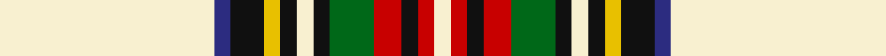

This page is one **sett** — a single exact thread-count. It belongs to the [tartan](/setts/w39db3k6ly3k3w3k3g8r5k3r3w3/)
(the same proportion at any scale), whose colour order is pattern [WBKYKWKGRKRW](/stripes/wbkykwkgrkrw/).

Part of the [Stewart Dress](/tartans/stewart-dress/) tartan — the named design grouping this sett with its other cloths.

Sourced from tartans-authority.  It is a [12 stripe tartan](/stripes/stripes12/).

Original link http://www.tartansauthority.com/tartan-ferret/display/1765/

## Also known as

This cloth is also recorded under:

- Stewart Dress Artifact
- Stewart Dress, Grey #1
- Stewart dress
- Stewart dress, Blue

2 attestations — the source records this cloth was collapsed from (oldest owns this page)

<ul>
<li>circa 1750 — Stewart Dress (Clan) (tartans-authority, <a href="http://www.tartansauthority.com/tartan-ferret/display/1765/">record</a>)</li>
<li>undated — Stewart dress (weddslist, <a href="http://www.weddslist.com/cgi-bin/tartans/pg.pl?source=sts">record</a>)</li>
</ul>

## Register references

External register numbers recorded for this tartan.

- Scottish Tartans Authority (ITI): 1765

## Thread count
LY/78 DB6 K12 Y6 K6 LY6 K6 G16 R10 K6 R6 LY/6

One full sett is **244 threads**.

## Palette

Palette: <strong>Tartan Register</strong> <small style="color:#888">(5 of 6 colours)</small>
<table><thead><tr><th>Colour</th><th>Threads</th><th>Shade</th><th>Base</th><th>OKLCh</th></tr></thead><tbody><tr><td>LY/</td><td style="text-align:right;font-variant-numeric:tabular-nums">78</td><td><code style="background-color:#F8F0D0;">#F8F0D0</code> <small style="color:#888">#F8F0D0</small></td><td>W <code style="background-color:#F7F7F7;">#F7F7F7</code></td><td><small style="color:#888">oklch(95.3% 0.043 95.5)</small></td></tr><tr><td>DB</td><td style="text-align:right;font-variant-numeric:tabular-nums">6</td><td><code style="background-color:#2C2C80;">#2C2C80</code> <small style="color:#888">#2C2C80</small></td><td>B <code style="background-color:#2A418A;">#2A418A</code></td><td><small style="color:#888">oklch(35.0% 0.138 276.6)</small></td></tr><tr><td>K</td><td style="text-align:right;font-variant-numeric:tabular-nums">12</td><td><code style="background-color:#101010;">#101010</code> <small style="color:#888">#101010</small></td><td>K <code style="background-color:#000000;">#000000</code></td><td><small style="color:#888">oklch(17.3% 0.000 89.9)</small></td></tr><tr><td>Y</td><td style="text-align:right;font-variant-numeric:tabular-nums">6</td><td><code style="background-color:#E8C000;">#E8C000</code> <small style="color:#888">#E8C000</small></td><td>Y <code style="background-color:#F2BF00;">#F2BF00</code></td><td><small style="color:#888">oklch(81.9% 0.168 93.7)</small></td></tr><tr><td>K</td><td style="text-align:right;font-variant-numeric:tabular-nums">6</td><td><code style="background-color:#101010;">#101010</code> <small style="color:#888">#101010</small></td><td>K <code style="background-color:#000000;">#000000</code></td><td><small style="color:#888">oklch(17.3% 0.000 89.9)</small></td></tr><tr><td>LY</td><td style="text-align:right;font-variant-numeric:tabular-nums">6</td><td><code style="background-color:#F8F0D0;">#F8F0D0</code> <small style="color:#888">#F8F0D0</small></td><td>W <code style="background-color:#F7F7F7;">#F7F7F7</code></td><td><small style="color:#888">oklch(95.3% 0.043 95.5)</small></td></tr><tr><td>K</td><td style="text-align:right;font-variant-numeric:tabular-nums">6</td><td><code style="background-color:#101010;">#101010</code> <small style="color:#888">#101010</small></td><td>K <code style="background-color:#000000;">#000000</code></td><td><small style="color:#888">oklch(17.3% 0.000 89.9)</small></td></tr><tr><td>G</td><td style="text-align:right;font-variant-numeric:tabular-nums">16</td><td><code style="background-color:#006818;">#006818</code> <small style="color:#888">#006818</small></td><td>G <code style="background-color:#006100;">#006100</code></td><td><small style="color:#888">oklch(45.0% 0.142 145.0)</small></td></tr><tr><td>R</td><td style="text-align:right;font-variant-numeric:tabular-nums">10</td><td><code style="background-color:#C80000;">#C80000</code> <small style="color:#888">#C80000</small></td><td>R <code style="background-color:#CC0000;">#CC0000</code></td><td><small style="color:#888">oklch(52.3% 0.215 29.2)</small></td></tr><tr><td>K</td><td style="text-align:right;font-variant-numeric:tabular-nums">6</td><td><code style="background-color:#101010;">#101010</code> <small style="color:#888">#101010</small></td><td>K <code style="background-color:#000000;">#000000</code></td><td><small style="color:#888">oklch(17.3% 0.000 89.9)</small></td></tr><tr><td>R</td><td style="text-align:right;font-variant-numeric:tabular-nums">6</td><td><code style="background-color:#C80000;">#C80000</code> <small style="color:#888">#C80000</small></td><td>R <code style="background-color:#CC0000;">#CC0000</code></td><td><small style="color:#888">oklch(52.3% 0.215 29.2)</small></td></tr><tr><td>LY/</td><td style="text-align:right;font-variant-numeric:tabular-nums">6</td><td><code style="background-color:#F8F0D0;">#F8F0D0</code> <small style="color:#888">#F8F0D0</small></td><td>W <code style="background-color:#F7F7F7;">#F7F7F7</code></td><td><small style="color:#888">oklch(95.3% 0.043 95.5)</small></td></tr></tbody></table>

## Compared to the master

This cloth is one sett of its design; the master sett (the exemplar the design is anchored on) is below for comparison.

<figure style="margin:0"><figcaption style="color:#888;font-size:smaller">this sett</figcaption></figure>
<figure style="margin:0"><figcaption style="color:#888;font-size:smaller"><a href="/setts/lr36db4k6ly1k1lr1k1dg8r4k1r2lr1/">master sett →</a></figcaption></figure>

## Nearest tartans

The nearest existing variants by ΔTartan distance, with this tartan at the top so the swatches line up against it.

ΔTartan

Tartan

Sett

—

<a href="/ttd/edit/#slug=w39db3k6ly3k3w3k3g8r5k3r3w3~x2">Stewart Dress (Clan)</a> <a class="nn-out" href="/variants/s12/w39db3k6ly3k3w3k3g8r5k3r3w3~x2/" title="open its dictionary page">↗</a>

0.58

<a href="/ttd/edit/#slug=w39db3k6ly3k3w3k3dg8r5k3r3w3~x2&amp;base=w39db3k6ly3k3w3k3g8r5k3r3w3~x2">Stuart/Stewart Dress</a> <a class="nn-out" href="/variants/s12/w39db3k6ly3k3w3k3dg8r5k3r3w3~x2/" title="open its dictionary page">↗</a>

0.77

<a href="/ttd/edit/#slug=w31db4k6ly2k2w2k2dg7r4k2r2w2~x2&amp;base=w39db3k6ly3k3w3k3g8r5k3r3w3~x2">Stuart/Stewart Dress Royal</a> <a class="nn-out" href="/variants/s12/w31db4k6ly2k2w2k2dg7r4k2r2w2~x2/" title="open its dictionary page">↗</a>

0.80

<a href="/ttd/edit/#slug=w31db4k6ly2k2w2k2g7r4k2r2w2~x2&amp;base=w39db3k6ly3k3w3k3g8r5k3r3w3~x2">Stewart dress</a> <a class="nn-out" href="/variants/s12/w31db4k6ly2k2w2k2g7r4k2r2w2~x2/" title="open its dictionary page">↗</a>

0.92

<a href="/ttd/edit/#slug=w15db2k3ly1k1w1k1g3r4k1r1w1~x2&amp;base=w39db3k6ly3k3w3k3g8r5k3r3w3~x2">Stewart Dress MINI Tartan</a> <a class="nn-out" href="/variants/s12/w15db2k3ly1k1w1k1g3r4k1r1w1~x2/" title="open its dictionary page">↗</a>

1.11

<a href="/ttd/edit/#slug=w3lo30dg3db3r3lo3db8g3lo3db3w3~x2&amp;base=w39db3k6ly3k3w3k3g8r5k3r3w3~x2">Rosemount Course, Blairgowrie Golf Club</a> <a class="nn-out" href="/variants/s11/w3lo30dg3db3r3lo3db8g3lo3db3w3~x2/" title="open its dictionary page">↗</a>

1.12

<a href="/ttd/edit/#slug=w38k10do2k3w2k3y8o3k2o3w2~x2&amp;base=w39db3k6ly3k3w3k3g8r5k3r3w3~x2">Glenmore Green</a> <a class="nn-out" href="/variants/s11/w38k10do2k3w2k3y8o3k2o3w2~x2/" title="open its dictionary page">↗</a>

1.24

<a href="/ttd/edit/#slug=w42db6w10k3w3k3w3g15r9w3r4k4~x2&amp;base=w39db3k6ly3k3w3k3g8r5k3r3w3~x2">Braveheart - Warrior (dress) Universal Tartan</a> <a class="nn-out" href="/variants/s12/w42db6w10k3w3k3w3g15r9w3r4k4~x2/" title="open its dictionary page">↗</a>

1.24

<a href="/ttd/edit/#slug=r2w24t3w3k6ly1k1w1k1g8r4k1r2w1~x2&amp;base=w39db3k6ly3k3w3k3g8r5k3r3w3~x2">Stewart Victoria</a> <a class="nn-out" href="/variants/s14/r2w24t3w3k6ly1k1w1k1g8r4k1r2w1~x2/" title="open its dictionary page">↗</a>

1.24

<a href="/ttd/edit/#slug=w41db6w10k3w3k3w3g15r9w3r4k4~x2&amp;base=w39db3k6ly3k3w3k3g8r5k3r3w3~x2">Braveheart Warrior (Dress)</a> <a class="nn-out" href="/variants/s12/w41db6w10k3w3k3w3g15r9w3r4k4~x2/" title="open its dictionary page">↗</a>

1.26

<a href="/ttd/edit/#slug=r2w24t3w3k6ly1k1w1k1dg8r4k1r2w1~x2&amp;base=w39db3k6ly3k3w3k3g8r5k3r3w3~x2">Stuart/Stewart Victoria</a> <a class="nn-out" href="/variants/s14/r2w24t3w3k6ly1k1w1k1dg8r4k1r2w1~x2/" title="open its dictionary page">↗</a>

## Neighbour map

Every grey dot is one of 14360 variants placed by the first two principal components of the ΔTartan feature space (44% of its variance). Red is this tartan; blue dots are its nearest — click one to open its page.

<svg viewBox="0 0 640 380" role="img" style="max-width:100%;height:auto;border:1px solid #e0e0e0;border-radius:4px;display:block" xmlns="http://www.w3.org/2000/svg"><image href="/nn/cloud.v1.png" width="640" height="380"/><a href="/variants/s12/w39db3k6ly3k3w3k3dg8r5k3r3w3~x2/"><circle cx="227.0" cy="69.6" r="4" fill="#3465a4"><title>Stuart/Stewart Dress</title></circle></a><a href="/variants/s12/w31db4k6ly2k2w2k2dg7r4k2r2w2~x2/"><circle cx="220.6" cy="64.3" r="4" fill="#3465a4"><title>Stuart/Stewart Dress Royal</title></circle></a><a href="/variants/s12/w31db4k6ly2k2w2k2g7r4k2r2w2~x2/"><circle cx="214.6" cy="63.4" r="4" fill="#3465a4"><title>Stewart dress</title></circle></a><a href="/variants/s12/w15db2k3ly1k1w1k1g3r4k1r1w1~x2/"><circle cx="199.1" cy="68.4" r="4" fill="#3465a4"><title>Stewart Dress MINI Tartan</title></circle></a><a href="/variants/s11/w3lo30dg3db3r3lo3db8g3lo3db3w3~x2/"><circle cx="229.1" cy="95.9" r="4" fill="#3465a4"><title>Rosemount Course, Blairgowrie Golf Club</title></circle></a><a href="/variants/s11/w38k10do2k3w2k3y8o3k2o3w2~x2/"><circle cx="265.8" cy="73.9" r="4" fill="#3465a4"><title>Glenmore Green</title></circle></a><a href="/variants/s12/w42db6w10k3w3k3w3g15r9w3r4k4~x2/"><circle cx="251.0" cy="89.2" r="4" fill="#3465a4"><title>Braveheart - Warrior (dress) Universal Tartan</title></circle></a><a href="/variants/s14/r2w24t3w3k6ly1k1w1k1g8r4k1r2w1~x2/"><circle cx="211.1" cy="41.3" r="4" fill="#3465a4"><title>Stewart Victoria</title></circle></a><a href="/variants/s12/w41db6w10k3w3k3w3g15r9w3r4k4~x2/"><circle cx="245.7" cy="90.5" r="4" fill="#3465a4"><title>Braveheart Warrior (Dress)</title></circle></a><a href="/variants/s14/r2w24t3w3k6ly1k1w1k1dg8r4k1r2w1~x2/"><circle cx="217.6" cy="42.5" r="4" fill="#3465a4"><title>Stuart/Stewart Victoria</title></circle></a><circle cx="223.0" cy="66.3" r="5" fill="#c00000"/></svg>

ID: /variants/s12/w39db3k6ly3k3w3k3g8r5k3r3w3~x2/
