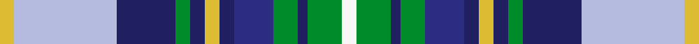

This page is one **sett** — a single exact thread-count. It belongs to the [tartan](/setts/w3g7db2g5dbi8db3ly3db3g3db12lb21ly3/)
(the same proportion at any scale), whose colour order is pattern [WGBGBBYBGBWY](/stripes/wgbgbbybgbwy/).

Sourced from tartans-authority.  It is a [12 stripe tartan](/stripes/stripes12/).

Original link http://www.tartansauthority.com/tartan-ferret/display/11266/

## Register references

External register numbers recorded for this tartan.

- Scottish Register of Tartans: [11266](https://www.tartanregister.gov.uk/tartanDetails?ref=11266)
- Scottish Tartans Authority (ITI): 11266

## Thread count
LY/6 LB42 DB24 G6 DB6 LY6 DB6 DBi16 G10 DB4 G14 W/6

One full sett is **280 threads**.

## Palette
<table><thead><tr><th>Colour</th><th>Shade</th><th>OKLCh</th></tr></thead><tbody><tr><td>B</td><td><code style="background-color:#B5BBDE;">#B5BBDE</code> <small style="color:#888">#B5BBDE</small></td><td><small style="color:#888">oklch(79.9% 0.050 277.6)</small></td></tr><tr><td>DB</td><td><code style="background-color:#2C2C80;">#2C2C80</code> <small style="color:#888">#2C2C80</small></td><td><small style="color:#888">oklch(35.0% 0.138 276.6)</small></td></tr><tr><td>DBa</td><td><code style="background-color:#202060;">#202060</code> <small style="color:#888">#202060</small></td><td><small style="color:#888">oklch(28.9% 0.111 276.9)</small></td></tr><tr><td>G</td><td><code style="background-color:#008B2A;">#008B2A</code> <small style="color:#888">#008B2A</small></td><td><small style="color:#888">oklch(55.4% 0.170 145.9)</small></td></tr><tr><td>W</td><td><code style="background-color:#F7F7F7;">#F7F7F7</code> <small style="color:#888">#F7F7F7</small></td><td><small style="color:#888">oklch(97.6% 0.000 89.9)</small></td></tr><tr><td>Y</td><td><code style="background-color:#DCBC32;">#DCBC32</code> <small style="color:#888">#DCBC32</small></td><td><small style="color:#888">oklch(80.0% 0.150 95.2)</small></td></tr></tbody></table>

# Sample pattern

## Nearest variants

The nearest existing variants by ΔTartan distance, with this cloth at the top so the swatches line up against it.

ΔTartan

Threads

Variant

Sett

—

280

<a href="/variants/s12/w3g7db2g5dbi8db3ly3db3g3db12lb21ly3~x2~db1204274-dbi1406275/">Holroyd, John (Personal</a>

<a href="/ttd/edit/#slug=y3lb21db12g3db3y3db3gi8g5db2g7w3~x2~db1003265-gi1902194&amp;base=w3g7db2g5dbi8db3ly3db3g3db12lb21ly3~x2~db1204274-dbi1406275" title="compare in the TTD">0.00</a>

280

<a href="/variants/s12/y3lb21db12g3db3y3db3gi8g5db2g7w3~x2~db1003265-gi1902194/">Holroyd, John (Personal)</a>

## Neighbour map

Every grey dot is one of 13620 variants placed by the first two principal components of the ΔTartan feature space (42% of its variance). Red is this tartan; blue dots are its nearest — click one to open its page.

<svg viewBox="0 0 640 380" role="img" style="max-width:100%;height:auto;border:1px solid #e0e0e0;border-radius:4px;display:block" xmlns="http://www.w3.org/2000/svg"><image href="/nn/cloud.v1.png" width="640" height="380"/><a href="/variants/s12/y3lb21db12g3db3y3db3gi8g5db2g7w3~x2~db1003265-gi1902194/"><circle cx="119.3" cy="174.9" r="4" fill="#3465a4"><title>Holroyd, John (Personal)</title></circle></a><circle cx="115.8" cy="173.7" r="5" fill="#c00000"/><text x="320" y="376" text-anchor="middle" font-size="11" fill="#999">ground</text><text x="11" y="190" text-anchor="middle" font-size="11" fill="#999" transform="rotate(-90 11 190)">complexity</text></svg>

ID: /variants/s12/w3g7db2g5dbi8db3ly3db3g3db12lb21ly3~x2~db1204274-dbi1406275/
